# Nana's Cookbook

*A family recipe collection lovingly digitized from handwritten recipe cards, clipped cookbook pages, and treasured notes passed down through generations.*

> **About this collection:** These recipes were transcribed from photographs of two boxes of handwritten recipe cards belonging to Nana (Janet Spilker) and her family. Box 1 spans images IMG_9104 through IMG_9479, and Box 2 spans IMG_9480 through IMG_9558. Text marked with **[uncertain]** indicates words that were difficult to read due to handwriting, stains, or wear on the original cards. Some recipes reference the back of a card ("over") that may not have been fully captured. Where duplicate recipe cards existed, the most complete version has been kept with alternate image numbers noted.

---

## Table of Contents

### Appetizers & Dips
- [Bake Brie](#bake-brie)
- [Black Bean Dip](#black-bean-dip)
- [Blue Cheese Dip](#blue-cheese-dip)
- [Cheese Ball (Ranch/Onion)](#cheese-ball-ranchonion)
- [Cheese Fondue](#cheese-fondue)
- [Cheese Logs](#cheese-logs)
- [Clint's Best Dip Ever](#clints-best-dip-ever)
- [Country Cheese Ball](#country-cheese-ball)
- [Cranberry Jalapeno Cream Cheese Appetizer](#cranberry-jalapeno-cream-cheese-appetizer)
- [Dill Dip](#dill-dip)
- [Fruit Dip](#fruit-dip)
- [Fruit Dips](#fruit-dips)
- [Guacamole](#guacamole)
- [Guacamole Salad Dressing / Chip Dip](#guacamole-salad-dressing--chip-dip)
- [Holiday Cheese Ball](#holiday-cheese-ball)
- [Mango Salsa](#mango-salsa)
- [Potstickers](#potstickers)
- [Salsa Ranchero](#salsa-ranchero)
- [Shrimp Dip](#shrimp-dip)
- [Spinach & Artichoke Dip](#spinach--artichoke-dip)
- [Spinach Dip](#spinach-dip)

### Breads & Rolls
- [Amy's Whole Wheat Bread](#amys-whole-wheat-bread)
- [Baked Pumpkin Donuts](#baked-pumpkin-donuts)
- [Banana Bread — Mom's](#banana-bread--moms)
- [Bran Muffins (Joyce)](#bran-muffins-joyce)
- [Buttermilk Scones](#buttermilk-scones)
- [Corn Bread or Muffins](#corn-bread-or-muffins)
- [Date Bran Muffins](#date-bran-muffins)
- [Dill Onion Bread](#dill-onion-bread)
- [Dilly Bread](#dilly-bread)
- [Foundation Sweet Yeast Roll](#foundation-sweet-yeast-roll)
- [Holiday Pumpkin Bread](#holiday-pumpkin-bread)
- [Orange Rolls](#orange-rolls)
- [Pear Bread](#pear-bread)
- [Wheat Cinnamon Rolls](#wheat-cinnamon-rolls)
- [Whole Wheat Bread (Mother)](#whole-wheat-bread-mother)
- [Whole Wheat Bread (Kathy)](#whole-wheat-bread-kathy)
- [Zucchini Bread (Nickel Ad)](#zucchini-bread-nickel-ad)
- [Zucchini Bread — Mom's](#zucchini-bread--moms)
- [Zucchini Bread (Typed)](#zucchini-bread-typed)

### Breakfast & Brunch
- [Belgian Waffles](#belgian-waffles)
- [Brunch Sausage & Egg Casserole](#brunch-sausage--egg-casserole)
- [Crustless Quiche](#crustless-quiche)
- [German Pancakes](#german-pancakes)
- [Granola Crunch](#granola-crunch)
- [Good Granola](#good-granola)
- [Hot Cider Syrup](#hot-cider-syrup)
- [Kallee Syrup](#kallee-syrup)
- [Kathy's Combination Granola](#kathys-combination-granola)
- [Pumpkin Pancakes](#pumpkin-pancakes)
- [Slow Cooker Steel Cut Oats](#slow-cooker-steel-cut-oats)
- [Whole Wheat Pancakes](#whole-wheat-pancakes)

### Soups & Stews
- [Brattan's Boston Clam Chowder](#brattans-boston-clam-chowder)
- [Cauliflower Soup](#cauliflower-soup)
- [Cheesy Broccoli Soup](#cheesy-broccoli-soup)
- [Chili](#chili)
- [Chili's Chicken Enchilada Soup](#chilis-chicken-enchilada-soup)
- [Clam Chowder (Marsha)](#clam-chowder-marsha)
- [Cream of Zucchini Soup, Andelin Style](#cream-of-zucchini-soup-andelin-style)
- [Creamy Tomato Soup](#creamy-tomato-soup)
- [Delicious Chicken Chowder](#delicious-chicken-chowder)
- [Fire-Roasted Tomato Soup](#fire-roasted-tomato-soup)
- [French Onion Soup](#french-onion-soup)
- [Green Pea Soup](#green-pea-soup)
- [Market Street Clam Chowder](#market-street-clam-chowder)
- [Minestrone Soup](#minestrone-soup)
- [Potato Soup](#potato-soup)
- [Taco Soup](#taco-soup)
- [Wendy's Chili](#wendys-chili)
- [Zucchini Soup](#zucchini-soup)

### Salads & Sides
- [Amy's Salad Dressing](#amys-salad-dressing)
- [Asparagus Casserole](#asparagus-casserole)
- [Baked Onions With Cheese](#baked-onions-with-cheese)
- [Barbeque Ranch Chicken Salad](#barbeque-ranch-chicken-salad)
- [Broccoli Salad](#broccoli-salad)
- [Buttermilk Dressing](#buttermilk-dressing)
- [Cafe Rio Dressing](#cafe-rio-dressing)
- [Candied Pecans](#candied-pecans)
- [Chicken Pasta Salad](#chicken-pasta-salad)
- [Chicken Salad](#chicken-salad)
- [Chicken Salad — Janet](#chicken-salad--janet)
- [Chinese Chicken Salad](#chinese-chicken-salad)
- [Claire's Chicken Salad](#claires-chicken-salad)
- [Delicious Crunch-Top Salad](#delicious-crunch-top-salad)
- [Dixie Salad](#dixie-salad)
- [Don's Pecans](#dons-pecans)
- [Elizabeth Adams Cabbage Salad](#elizabeth-adams-cabbage-salad)
- [Gable House Salad Dressing](#gable-house-salad-dressing)
- [German Red Cabbage](#german-red-cabbage)
- [Grandma Daybell's Turkey Dressing](#grandma-daybells-turkey-dressing)
- [Greek Rice Pilaf](#greek-rice-pilaf)
- [Ike's Pinto Beans](#ikes-pinto-beans)
- [Joyce Salad](#joyce-salad)
- [Kathy's Craisin Salad](#kathys-craisin-salad)
- [Kathy's Orange Spinach Salad](#kathys-orange-spinach-salad)
- [Kathy's Pasta Salad](#kathys-pasta-salad)
- [Lime Cilantro Rice](#lime-cilantro-rice)
- [Mae's String Beans](#maes-string-beans)
- [Mare's Funeral Potatoes](#mares-funeral-potatoes)
- [Mare's Veggie Pasta Salad](#mares-veggie-pasta-salad)
- [Nane's Pasta Salad](#nanes-pasta-salad)
- [Pasta Fruity Salad](#pasta-fruity-salad)
- [Potato Casserole (Janna)](#potato-casserole-janna)
- [Potato Casserole (Fatfree)](#potato-casserole-fatfree)
- [Potato Salad](#potato-salad)
- [Potato Topper](#potato-topper)
- [Pretzel-topped Sweet Potato Casserole](#pretzel-topped-sweet-potato-casserole)
- [R.S. Salad Dressing / Party Dip](#rs-salad-dressing--party-dip)
- [Red Cabbage](#red-cabbage)
- [Rice Pilaf](#rice-pilaf)
- [Rice Pilaf (Kathy Morgan)](#rice-pilaf-kathy-morgan)
- [Salade Oriental](#salade-oriental)
- [Scalloped Potatoes](#scalloped-potatoes)
- [Scalloped Potatoes (Simple)](#scalloped-potatoes-simple)
- [Set Fruit Salad](#set-fruit-salad)
- [Spinach Salad (Elizabeth)](#spinach-salad-elizabeth)
- [Yam & Apple Casserole](#yam--apple-casserole)

### Main Dishes
- [Amy's Pizza](#amys-pizza)
- [Baked Halibut](#baked-halibut)
- [Barbecued Halibut with Baby Vegetables](#barbecued-halibut-with-baby-vegetables)
- [Black and Blue Ahi Tuna](#black-and-blue-ahi-tuna)
- [Brisket](#brisket)
- [Brown Tenderloin](#brown-tenderloin)
- [Cafe Rio Pork](#cafe-rio-pork)
- [Caprese Chicken](#caprese-chicken)
- [Carla's Chicken Enchiladas](#carlas-chicken-enchiladas)
- [Carla's Zucchini Casserole](#carlas-zucchini-casserole)
- [Cheeseburger Loaf](#cheeseburger-loaf)
- [Chicken and Broccoli](#chicken-and-broccoli)
- [Chicken Breasts Parmesan](#chicken-breasts-parmesan)
- [Chicken-Broccoli Casserole](#chicken-broccoli-casserole)
- [Chicken Casserole](#chicken-casserole)
- [Chicken Enchilada](#chicken-enchilada)
- [Chicken Noodle Bake](#chicken-noodle-bake)
- [Chile Relleno Casserole](#chile-relleno-casserole)
- [Enchilada Casserole](#enchilada-casserole)
- [Enchilada's (Mave's)](#enchiladas-maves)
- [Festive Cranberry Chicken](#festive-cranberry-chicken)
- [Good & Easy Pizza](#good--easy-pizza)
- [Green Chili Verde](#green-chili-verde)
- [Ham Loaf](#ham-loaf)
- [Ham Rolls](#ham-rolls)
- [Hamburger All-In-One Meal](#hamburger-all-in-one-meal)
- [Heather's Chicken Enchiladas](#heathers-chicken-enchiladas)
- [How to Cook Shrimp](#how-to-cook-shrimp)
- [Individual Pizzas](#individual-pizzas)
- [Lake Chicken](#lake-chicken)
- [Lasagna](#lasagna)
- [Lasagne](#lasagne)
- [Lumpia](#lumpia)
- [Mace's Italian Chicken Breast](#maces-italian-chicken-breast)
- [Mexican Casserole](#mexican-casserole)
- [Orange Honey Garlic Chicken](#orange-honey-garlic-chicken)
- [Panko Shrimp Tacos](#panko-shrimp-tacos)
- [Paul's Roasted Turkey](#pauls-roasted-turkey)
- [Pepper Seared Ahi Tuna with Wasabi Plum Glaze](#pepper-seared-ahi-tuna-with-wasabi-plum-glaze)
- [Poached Halibut](#poached-halibut)
- [Razzpotle Wraps](#razzpotle-wraps)
- [Sausage-Rice Casserole](#sausage-rice-casserole)
- [Seafood Brochettes](#seafood-brochettes)
- [Slow Cook Ham](#slow-cook-ham)
- [Stroganoff](#stroganoff)
- [Stuffed Zucchini Casserole](#stuffed-zucchini-casserole)
- [Sweet & Sour Spareribs](#sweet--sour-spareribs)
- [Taco Hamburger Casserole](#taco-hamburger-casserole)
- [Tempura — Fish & Vegetables](#tempura--fish--vegetables)
- [Tuna Casserole](#tuna-casserole)
- [Turkey/Chicken Marinate](#turkeychicken-marinate)
- [Wiener Schnitzel](#wiener-schnitzel)

### Sauces & Condiments
- [Alfredo Sauce (Amy P.)](#alfredo-sauce-amy-p)
- [BBQ Sauce](#bbq-sauce)
- [Brittany's Alfredo Sauce](#brittanys-alfredo-sauce)
- [Butterscotch Sauce](#butterscotch-sauce)
- [Cafe Rio — Tomatillo Mild Sauce](#cafe-rio--tomatillo-mild-sauce)
- [Caramel Sauce (Mare's)](#caramel-sauce-mares)
- [Cherry Sauce](#cherry-sauce)
- [Chicken Wings Brine](#chicken-wings-brine)
- [Chocolate Sauce (Stovetop)](#chocolate-sauce-stovetop)
- [Chocolate Sauce (with Cocoa)](#chocolate-sauce-with-cocoa)
- [Lemon Sauce](#lemon-sauce)
- [Marinade (Soy-Pineapple)](#marinade-soy-pineapple)

### Desserts — Cakes
- [Amy's Carrot Cake](#amys-carrot-cake)
- [Apple Chip Cake](#apple-chip-cake)
- [Cafe Rio Tres Leches](#cafe-rio-tres-leches)
- [Carrot Cake (Mae F.)](#carrot-cake-mae-f)
- [Chocolate Cream Cake](#chocolate-cream-cake)
- [German's Sweet Chocolate Cake](#germans-sweet-chocolate-cake)
- [Jan's Oatmeal Cake](#jans-oatmeal-cake)
- [Kathy's Carrot Cake](#kathys-carrot-cake)
- [Nacogdoches Cake / Texas Sheet Cake](#nacogdoches-cake--texas-sheet-cake)
- [Oatmeal Spice Cake](#oatmeal-spice-cake)
- [Pineapple Cream Cake](#pineapple-cream-cake)
- [Pumpkin Cake Roll](#pumpkin-cake-roll)
- [Sour Cream Chocolate Cake](#sour-cream-chocolate-cake)
- [Strawberry Cake](#strawberry-cake)
- [Strawberry & Pineapple Sheet Cake](#strawberry--pineapple-sheet-cake)
- [Sweetheart Cake](#sweetheart-cake)

### Desserts — Cookies
- [Best Chocolate Chip Bars](#best-chocolate-chip-bars)
- [Brownies](#brownies)
- [Butterscotch Brownies](#butterscotch-brownies)
- [Caramel Brownies](#caramel-brownies)
- [Chocolate Bars (Janet Spilker)](#chocolate-bars-janet-spilker)
- [Chocolate Chip Squares](#chocolate-chip-squares)
- [Coconut Bar Cookies](#coconut-bar-cookies)
- [Gingersnaps](#gingersnaps)
- [Kathy's Pumpkin Chocolate Chip Bars](#kathys-pumpkin-chocolate-chip-bars)
- [Leibkuchen Cookies](#leibkuchen-cookies)
- [Lemon Squares](#lemon-squares)
- [Mint Brownies](#mint-brownies)
- [Mint Cookies](#mint-cookies)
- [Mom's Sugar Cookies](#moms-sugar-cookies)
- [Mrs. Fields Chocolate Chip Cookies](#mrs-fields-chocolate-chip-cookies)
- [No-Bake Cookies](#no-bake-cookies)
- [Oatmeal Brownies](#oatmeal-brownies)
- [Pumpkin Cookies (Joyce's)](#pumpkin-cookies-joyces)
- [Short Bread Cookies](#short-bread-cookies)
- [Soft Molasses Cookies](#soft-molasses-cookies)
- [Thumbprint Cookies](#thumbprint-cookies)
- [Vanishing Oatmeal Raisin Cookies](#vanishing-oatmeal-raisin-cookies)

### Desserts — Candy & Sweets
- [Butterscotch Crunchies](#butterscotch-crunchies)
- [Candy Cereal Clusters](#candy-cereal-clusters)
- [Caramels (Leslie T.)](#caramels-leslie-t)
- [Cereal Treat (Leslie)](#cereal-treat-leslie)
- [Chocolate Peanut-Butter Balls](#chocolate-peanut-butter-balls)
- [Cracker Jack](#cracker-jack)
- [Cracker Jacks (Oven Method)](#cracker-jacks-oven-method)
- [English Toffee](#english-toffee)
- [Fudge Krispies](#fudge-krispies)
- [Grandpa's Caramel Corn](#grandpas-caramel-corn)
- [Honey Popcorn](#honey-popcorn)
- [Kathy's Party Snack](#kathys-party-snack)
- [Chex Mix](#chex-mix)
- [Microwave Peanut Brittle](#microwave-peanut-brittle)
- [Mother's Caramels](#mothers-caramels)
- [Mother's Molasses Caramels](#mothers-molasses-caramels)
- [Peanut Brittle (Joyce)](#peanut-brittle-joyce)
- [Peanut Clusters](#peanut-clusters)
- [Protein Bars](#protein-bars)
- [Rice Krispies Treats](#rice-krispies-treats)
- [Scotch-a-roo](#scotch-a-roo)
- [Sees Fudge](#sees-fudge)
- [Special K Treat](#special-k-treat)

### Desserts — Frostings & Icings
- [Amy's Frosting (Wedding Cake)](#amys-frosting-wedding-cake)
- [Broiled Icing](#broiled-icing)
- [Brown Butter Frosting](#brown-butter-frosting)
- [Caramel Frosting](#caramel-frosting)
- [Chocolate Frosting](#chocolate-frosting)
- [Coconut Pecan Frosting](#coconut-pecan-frosting)
- [Cream Cheese Frosting](#cream-cheese-frosting)
- [Decorator's Cement](#decorators-cement)
- [Mother's Boiled Coconut Frosting](#mothers-boiled-coconut-frosting)

### Desserts — Frozen & Fruit
- [Anita's Raspberry Ice Cream](#anitas-raspberry-ice-cream)
- [Blueberry Cream Pie](#blueberry-cream-pie)
- [Blueberry Dessert (Amy P.)](#blueberry-dessert-amy-p)
- [Blueberry Dessert (Mom's)](#blueberry-dessert-moms)
- [Cheese Cake (Marz)](#cheese-cake-marz)
- [Chocolate Delight](#chocolate-delight)
- [Chocolate Peppermint Dessert](#chocolate-peppermint-dessert)
- [Classic Creme Brulee](#classic-creme-brulee)
- [Cottage Pudding](#cottage-pudding)
- [Delicious Cherry Dessert](#delicious-cherry-dessert)
- [Ding Dong Dell Ice Cream Sandwiches](#ding-dong-dell-ice-cream-sandwiches)
- [Frostie Strawberry Squares](#frostie-strawberry-squares)
- [Frozen Pineapple Frappe](#frozen-pineapple-frappe)
- [Fruit Ice Cream](#fruit-ice-cream)
- [Gable House Cheese Cake](#gable-house-cheese-cake)
- [Homemade Pineapple Ice Cream](#homemade-pineapple-ice-cream)
- [Ice Cream Dessert — Mom](#ice-cream-dessert--mom)
- [Kathy's Burnt Almond Ice Cream Pie](#kathys-burnt-almond-ice-cream-pie)
- [Kathy's Crunchy Ice Cream Freeze](#kathys-crunchy-ice-cream-freeze)
- [Mare's Apple Crisp](#mares-apple-crisp)
- [Nautica's Cheesecake](#nauticas-cheesecake)
- [Next Best Thing to Robert Redford](#next-best-thing-to-robert-redford)
- [Peach Cobbler](#peach-cobbler)
- [Peach Ice Cream (Joyce)](#peach-ice-cream-joyce)
- [Pineapple Ice Cream (Jane Spilker)](#pineapple-ice-cream-jane-spilker)
- [Pumpkin Dessert](#pumpkin-dessert)
- [Raspberry Dessert (Kathy)](#raspberry-dessert-kathy)
- [Raspberry or Strawberry Ice Cream](#raspberry-or-strawberry-ice-cream)
- [Rhubarb Crisp](#rhubarb-crisp)
- [Rootbeer Ice Cream](#rootbeer-ice-cream)
- [Schaum Torte](#schaum-torte)
- [Trifle](#trifle)
- [Vanilla Ice Cream](#vanilla-ice-cream)

### Desserts — Pies
- [Apple Pie](#apple-pie)
- [Basic Recipe for Cream Pie Filling](#basic-recipe-for-cream-pie-filling)
- [Busy Day Lemon Cheesecake](#busy-day-lemon-cheesecake)
- [French Silk Pie](#french-silk-pie)
- [German Chocolate Pie](#german-chocolate-pie)
- [Graham Cracker Crust](#graham-cracker-crust)
- [Key Lime Pie](#key-lime-pie)
- [Pecan Pie (Version 1)](#pecan-pie-version-1)
- [Pecan Pie (Marrianne Tower)](#pecan-pie-marrianne-tower)
- [Pie Crust — Cousin Becky](#pie-crust--cousin-becky)
- [Raspberry Pie](#raspberry-pie)
- [Sweet Cherry Pie](#sweet-cherry-pie)

### Drinks
- [Egg Nog](#egg-nog)
- [Limelight Banana Crush](#limelight-banana-crush)
- [Nicole's Smoothie](#nicoles-smoothie)
- [Protein Drink (Vanilla)](#protein-drink-vanilla)
- [Punch — Joyce](#punch--joyce)
- [Slush](#slush)

### Canning & Preserving
- [Chili Sauce](#chili-sauce)
- [Chili Sauce — Grandma Spilker](#chili-sauce--grandma-spilker)
- [Chili Sauce (Clark's Grandma)](#chili-sauce-clarks-grandma)
- [Dill Pickles](#dill-pickles)
- [Dills (Barbara D.)](#dills-barbara-d)
- [Green Tomato Hot Sauce (Marie's)](#green-tomato-hot-sauce-maries)
- [Janet's Salsa for Canning](#janets-salsa-for-canning)
- [Mare's Salsa](#mares-salsa)
- [Mustard Pickles (Flora Clinger)](#mustard-pickles-flora-clinger)
- [Peach Jam](#peach-jam)
- [Pear Butter](#pear-butter)
- [Sweet Pickles](#sweet-pickles)

### Miscellaneous
- [Deer Jerky](#deer-jerky)
- [Fresh Shrimp (Boiled)](#fresh-shrimp-boiled)
- [Meat Batter](#meat-batter)
- [Play Dough](#play-dough)
- [Zac's Corn Cake](#zacs-corn-cake)

---

## Appetizers & Dips

---

### Bake Brie
*Source: Amy Poulton (IMG_9119)*

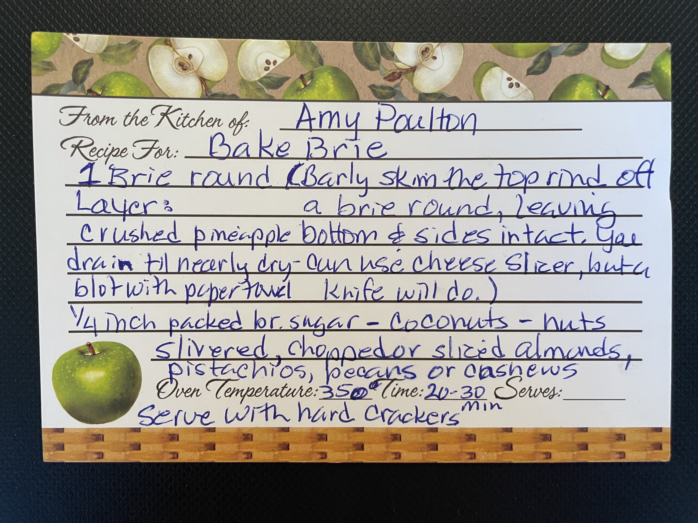

**Ingredients:**
- 1 Brie round (barely skim the top rind off, leaving bottom & sides intact)
- Crushed pineapple, drained til nearly dry **[uncertain]**
- 1/4 inch packed brown sugar
- Coconut
- Nuts — slivered, chopped, or sliced almonds, pistachios, pecans, or cashews

**Instructions:**
Layer pineapple, brown sugar, coconut, and nuts on top of Brie. Bake at 350° for 20–30 min. Serve with hard crackers.

---

### Black Bean Dip
*Source: IMG_9117*

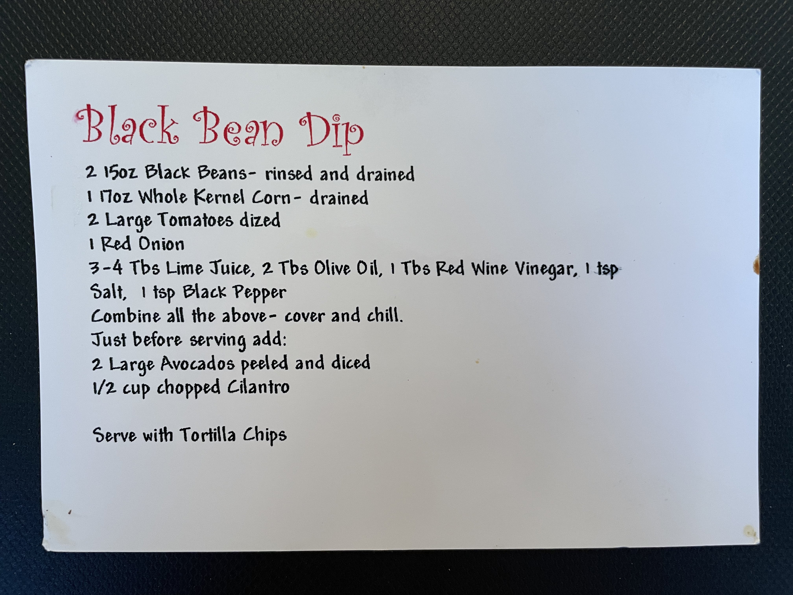

**Ingredients:**
- 2 (15 oz.) cans black beans, rinsed and drained
- 1 (17 oz.) can whole kernel corn, drained
- 2 large tomatoes, diced
- 1 red onion
- 3–4 Tbs. lime juice, 2 Tbs. olive oil, 1 Tbs. red wine vinegar, 1 tsp. salt, 1 tsp. black pepper

**Instructions:**
Combine all the above, cover and chill. Just before serving add: 2 large avocados (peeled and diced), 1/2 cup chopped cilantro. Serve with tortilla chips. *Use lime corn chips.*

---

### Blue Cheese Dip
*Source: IMG_9383*

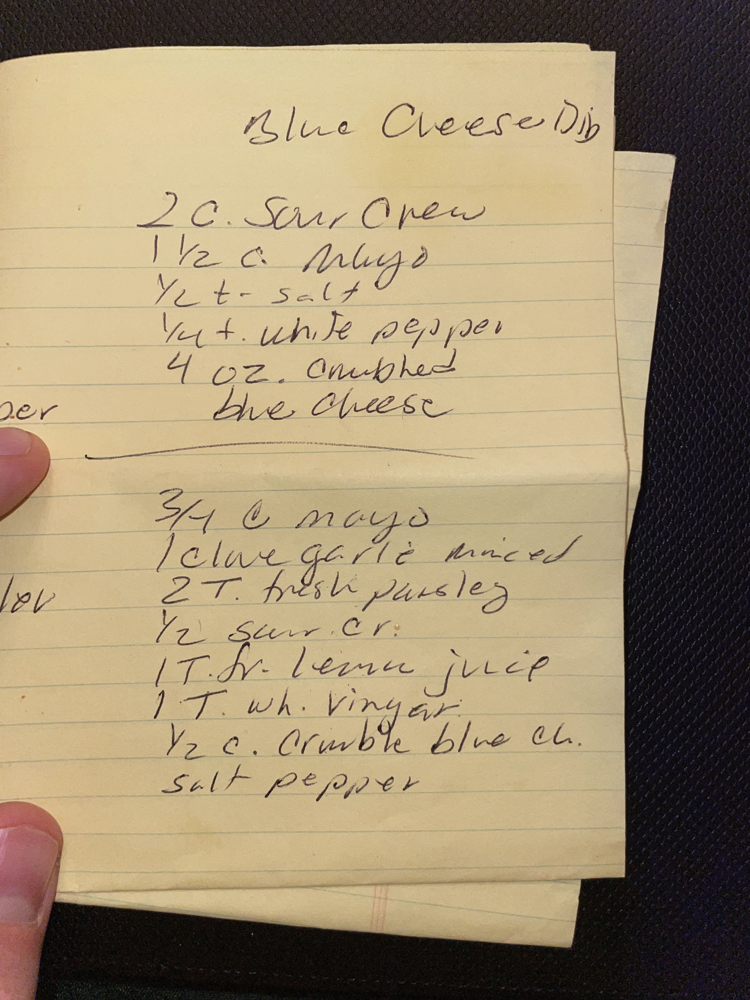

**Version 1:**
- 2 c. sour cream, 1 1/2 c. mayo, 1/4 t. salt, 1/4 t. white pepper, 4 oz. crumbled blue cheese

**Version 2:**
- 3/4 c. mayo, 1 clove garlic minced, 2 T. fresh parsley, 1/2 c. sour cream, 1 T. lemon juice **[uncertain]**, 1 T. white vinegar, 1/2 c. crumbled blue cheese, salt & pepper

---

### Cheese Ball (Ranch/Onion)
*Source: Brittany Spilker (IMG_9116)*

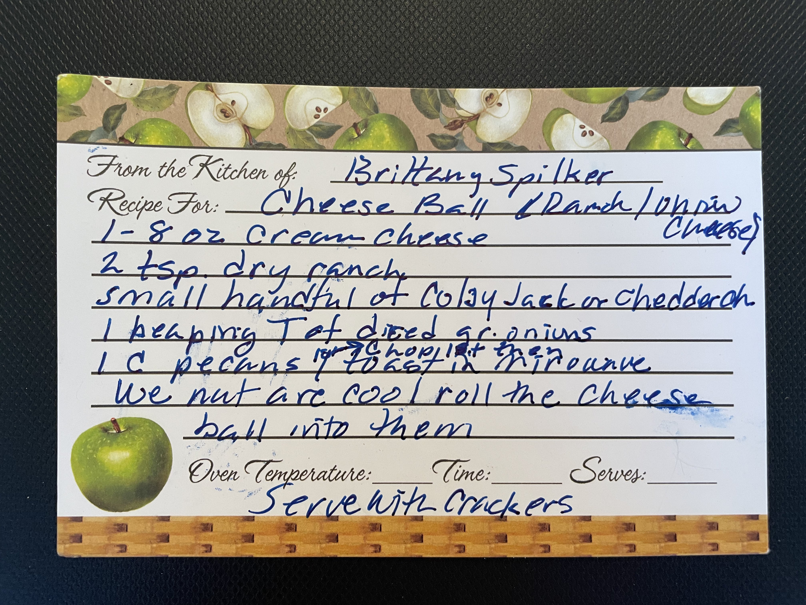

**Ingredients:**
- 1 (8 oz.) cream cheese
- 2 tsp. dry ranch
- Small handful of Colby Jack or Cheddar cheese **[uncertain]**
- 1 heaping T. of diced green onions
- 1 c. pecans, chopped & toasted in microwave

**Instructions:**
When nuts are cool, roll the cheese ball into them. Serve with crackers.

---

### Cheese Fondue
*Source: IMG_9256 / IMG_9257*

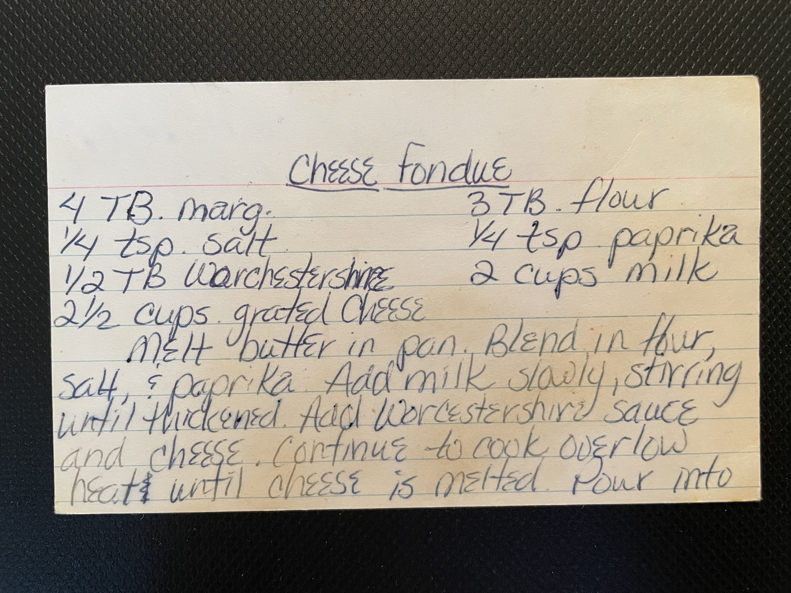

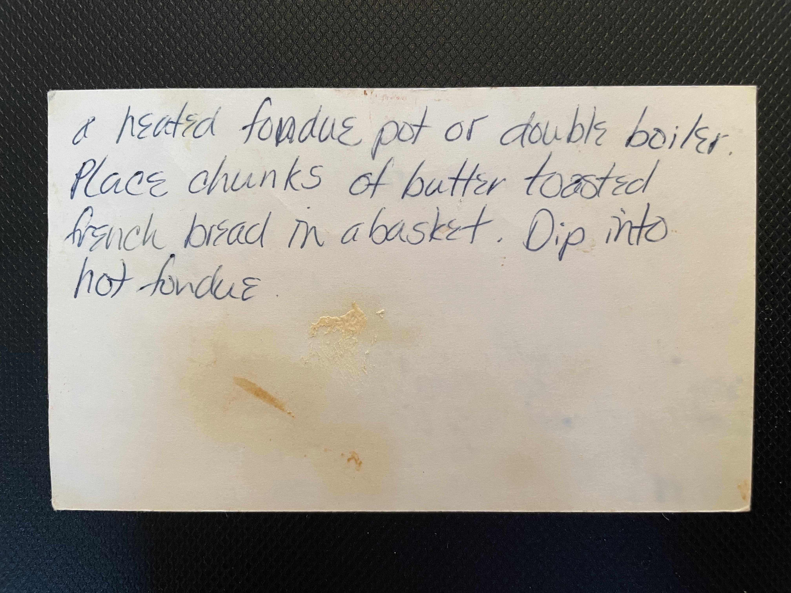

**Ingredients:**
- 4 T. margarine
- 3 T. flour
- 1/4 tsp. salt
- 1/4 tsp. paprika
- 1/2 T. Worcestershire sauce
- 2 cups milk
- 2 1/2 cups grated cheese

**Instructions:**
Melt butter in pan. Blend in flour, salt, and paprika. Add milk slowly, stirring until thickened. Add Worcestershire sauce and cheese. Continue to cook over low heat until cheese is melted. Pour into a heated fondue pot or double boiler. Place chunks of butter-toasted French bread in a basket. Dip into hot fondue.

---

### Cheese Logs
*Source: IMG_9109*

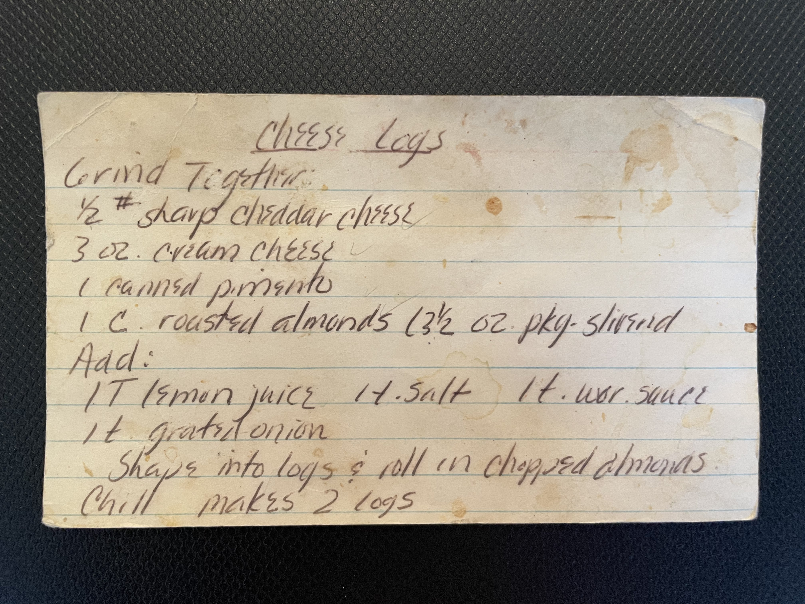

**Ingredients:**
- 1/2 lb. sharp cheddar cheese (ground)
- 3 oz. cream cheese (ground)
- 1 canned pimiento **[uncertain]** (ground)
- 1 c. roasted almonds (3 1/2 oz. pkg. slivered, ground)
- 1 T. lemon juice
- 1 t. salt
- 1 t. Worcestershire sauce
- 1 t. grated onion

**Instructions:**
Shape into logs and roll in chopped almonds. Chill. Makes 2 logs.

---

### Clint's Best Dip Ever
*Source: IMG_9115*

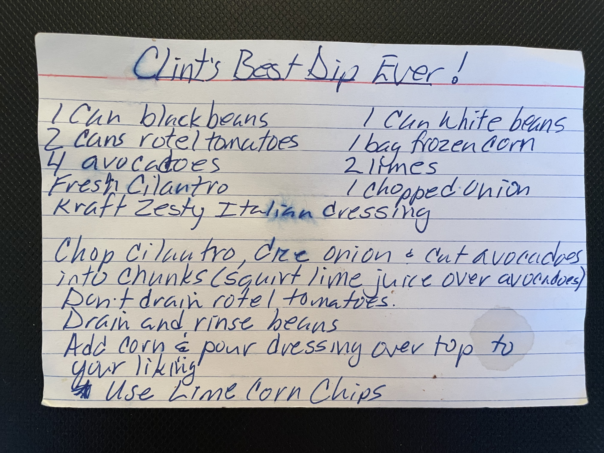

**Ingredients:**
- 1 can black beans, 1 can white beans (drained and rinsed)
- 2 cans Rotel tomatoes (don't drain)
- 1 bag frozen corn
- 4 avocados, 2 limes
- Fresh cilantro, 1 chopped onion
- Kraft Zesty Italian dressing

**Instructions:**
Chop cilantro, dice onion, cut avocados into chunks (squirt lime juice over avocados). Add corn, pour dressing over top to your liking. Use lime corn chips.

---

### Country Cheese Ball
*Source: Terri El Jones **[uncertain]** (IMG_9111)*

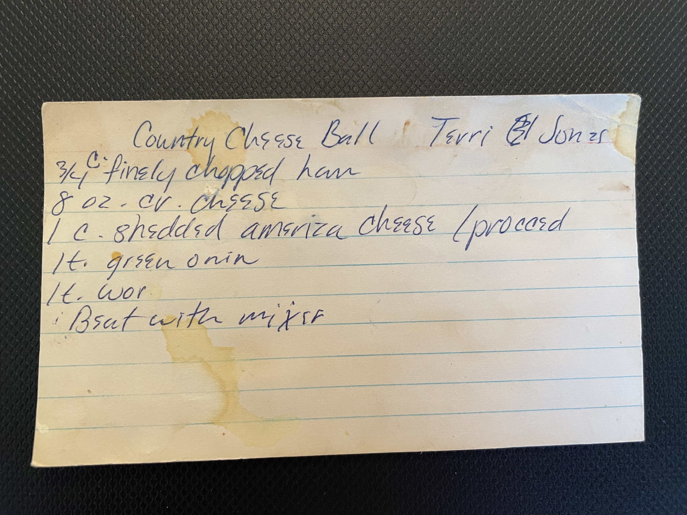

**Ingredients:**
- 3/4 c. finely chopped ham **[uncertain]**
- 8 oz. cream cheese
- 1 c. shredded American cheese (processed)
- 1 t. green onion
- 1 t. Worcestershire sauce

**Instructions:**
Beat with mixer.

---

### Cranberry Jalapeno Cream Cheese Appetizer
*Source: Brittany Spilker (IMG_9553; also IMG_9113)*

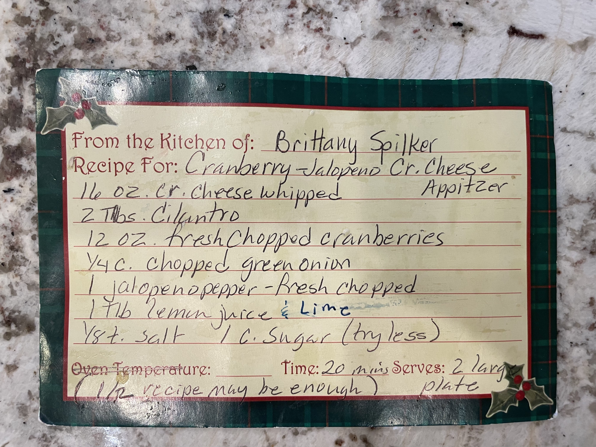

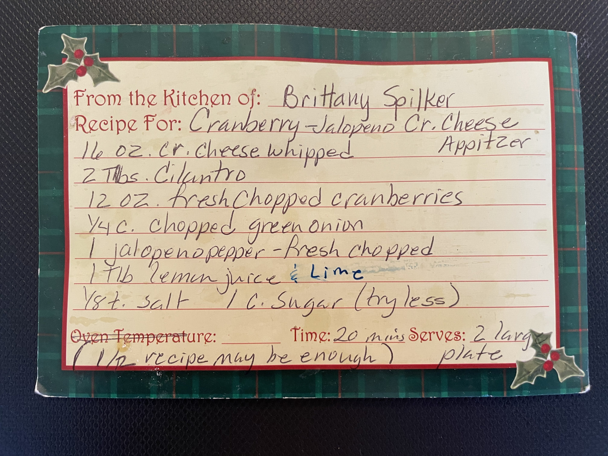

**Ingredients:**
- 16 oz. cream cheese, whipped
- 2 Tbs. cilantro
- 12 oz. fresh chopped cranberries
- 1/4 c. chopped green onion
- 1 jalapeno pepper, fresh chopped
- 1 Tbl. lemon juice & lime
- 1/8 t. salt
- 1 c. sugar (try less)

**Instructions:**
Mix and let set 20 minutes. Serve. (1/2 recipe may be enough.)

---

### Dill Dip
*Source: Connie Neilson **[uncertain]** (IMG_9105)*

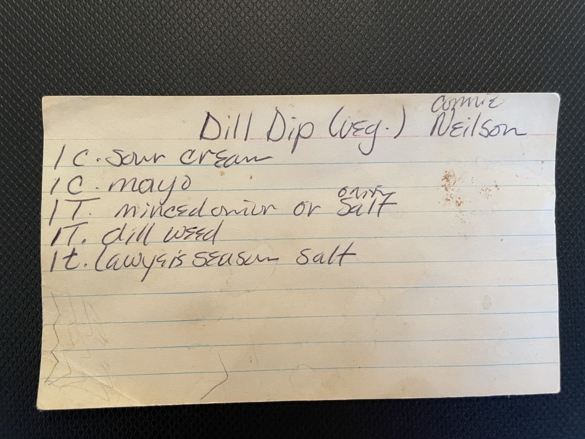

**Ingredients:**
- 1 c. sour cream
- 1 c. mayo
- 1 T. minced onion **[uncertain]**
- 1 T. dill weed
- 1 t. Lawry's seasoned salt

---

### Fruit Dip
*Source: Bortner & Bortner (IMG_9268)*

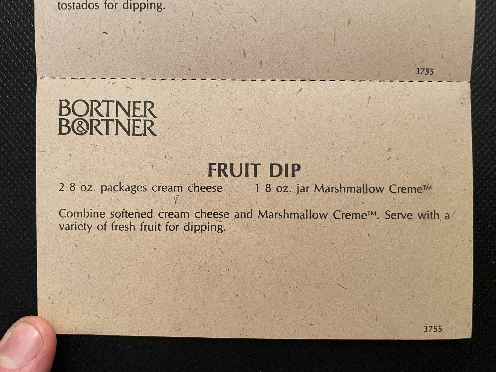

**Ingredients:**
- 2 (8 oz.) packages cream cheese
- 1 (8 oz.) jar Marshmallow Creme

**Instructions:**
Combine softened cream cheese and Marshmallow Creme. Serve with a variety of fresh fruit for dipping.

---

### Fruit Dips
*Source: IMG_9110*

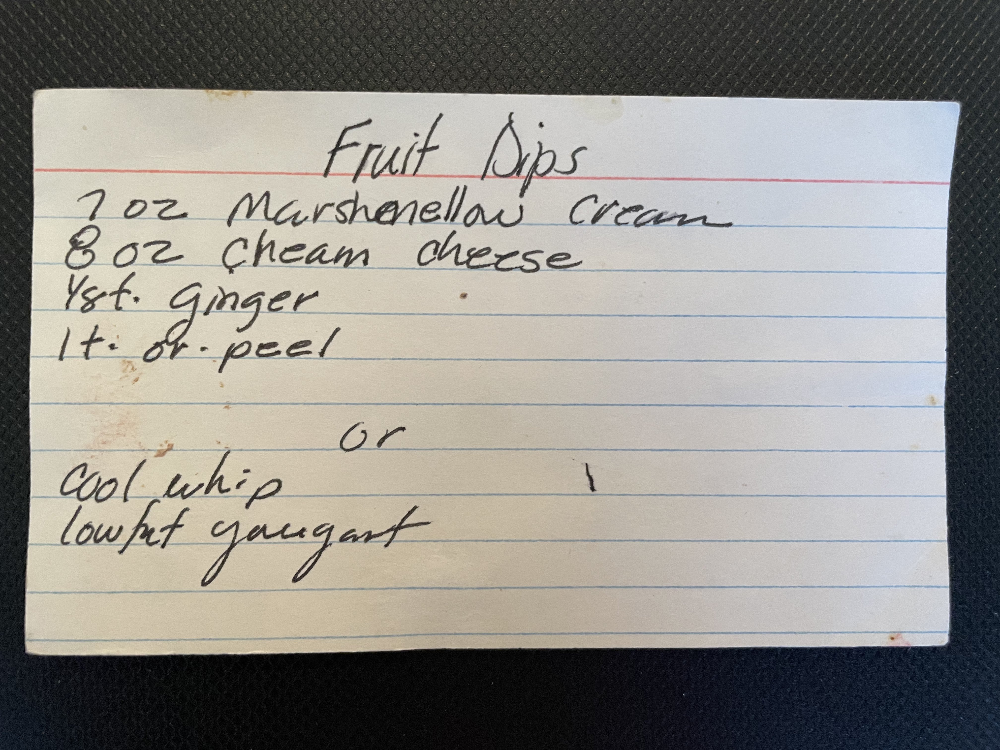

**Version 1:** 7 oz. marshmallow cream, 8 oz. cream cheese, 1/2 t. ginger **[uncertain]**, 1 t. orange peel.

**Version 2:** Cool Whip and lowfat yogurt **[uncertain]**.

---

### Guacamole
*Source: Bortner & Bortner (IMG_9266)*

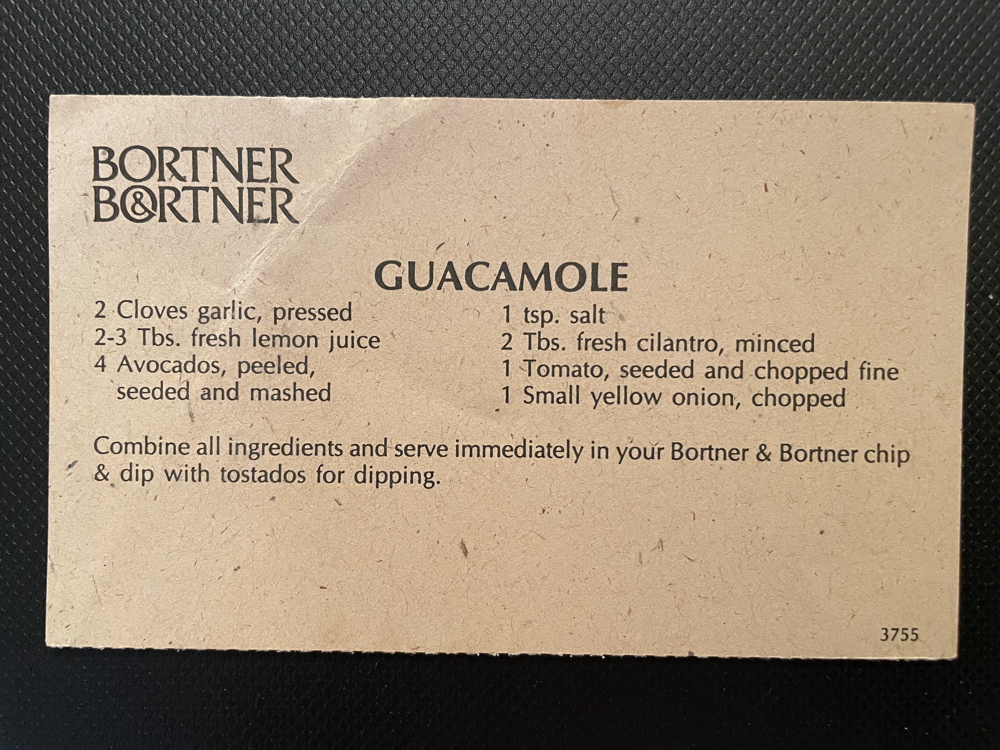

**Ingredients:**
- 2 cloves garlic, pressed
- 2–3 Tbs. fresh lemon juice
- 4 avocados, peeled, seeded and mashed
- 1 tsp. salt
- 2 Tbs. fresh cilantro, minced
- 1 tomato, seeded and chopped fine
- 1 small yellow onion, chopped

**Instructions:**
Combine all ingredients and serve immediately with tostados for dipping.

---

### Guacamole Salad Dressing / Chip Dip
*Source: IMG_9107*

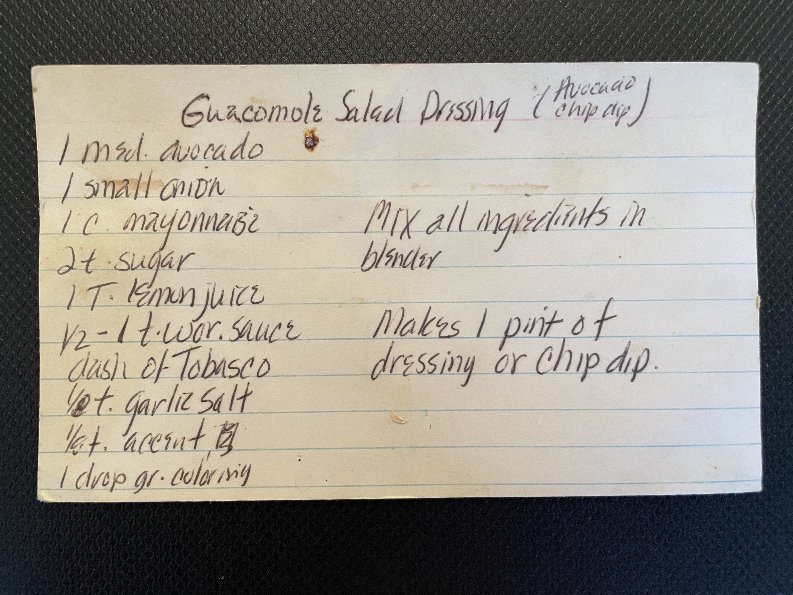

**Ingredients:**
- 1 med. avocado
- 1 small onion
- 1 c. mayonnaise
- 2 t. sugar
- 1 T. lemon juice
- 1/2–1 t. Worcestershire sauce
- Dash of Tabasco
- 1/4 t. garlic salt
- 1/4 t. Accent **[uncertain]**
- 1 drop green coloring

**Instructions:**
Mix all ingredients in blender. Makes 1 pint of dressing or chip dip.

---

### Holiday Cheese Ball
*Source: Mum's (IMG_9108)*

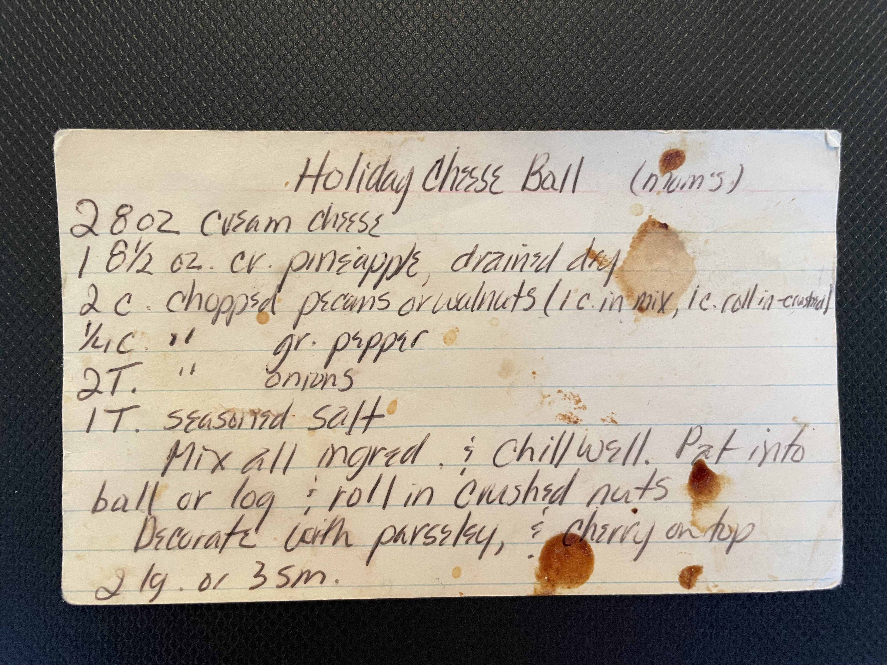

**Ingredients:**
- 2 (8 oz.) cream cheese
- 1 (8 1/2 oz.) can crushed pineapple, drained dry
- 2 c. chopped pecans or walnuts (1 c. in mix, 1 c. to roll in) **[uncertain]**
- 1/4 c. chopped green pepper
- 2 T. chopped onions
- 1 T. seasoned salt

**Instructions:**
Mix all ingredients and chill well. Pat into ball or log; roll in crushed nuts. Decorate with parsley and cherry on top. Makes 2 large or 3 small.

---

### Mango Salsa
*Source: Kathy's (IMG_9106)*

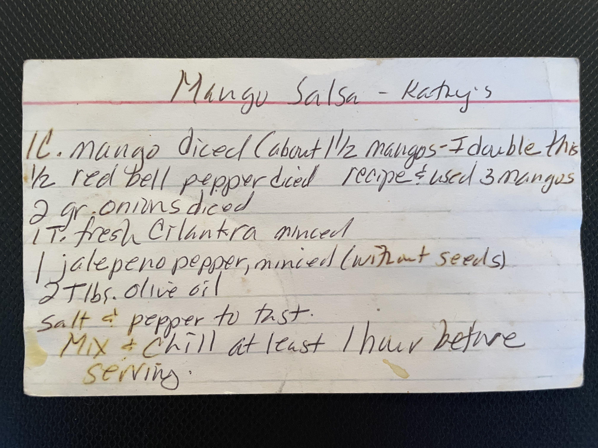

**Ingredients:**
- 1 c. mango diced (about 1 1/2 mangos)
- 1/2 red bell pepper diced
- 2 green onions diced
- 1 T. fresh cilantro minced
- 1 jalapeno pepper, minced (without seeds)
- 2 Tbs. olive oil
- Salt & pepper to taste

**Instructions:**
Mix and chill at least 1 hour before serving.

---

### Potstickers
*Source: Amy P. (IMG_9269 / IMG_9270)*

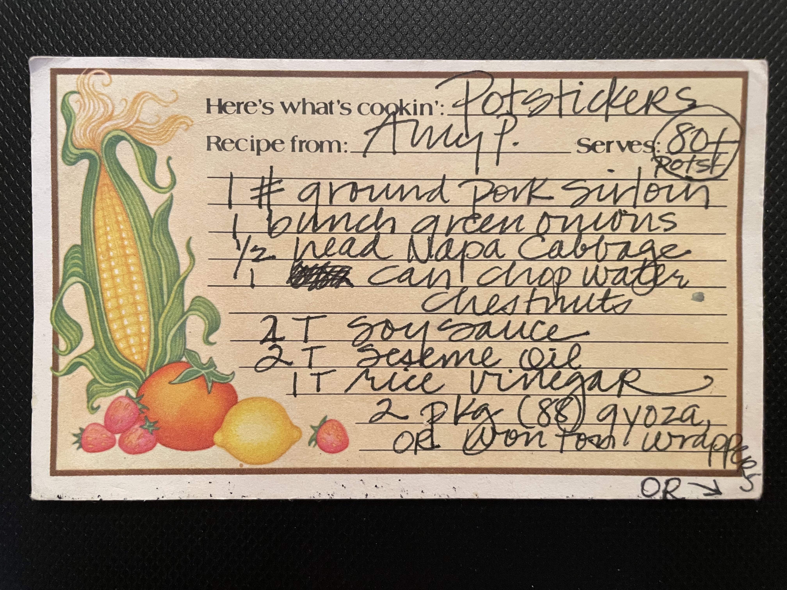

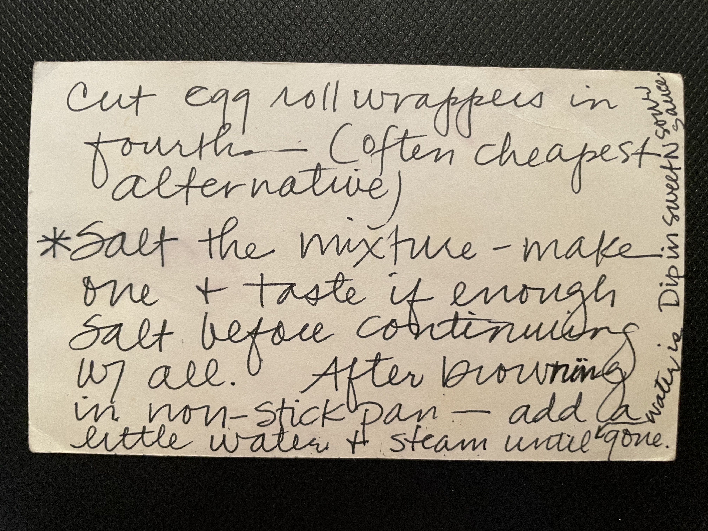

**Ingredients:**
- 1 lb. ground pork sirloin **[uncertain]**
- 1 bunch green onions
- 1/2 head Napa cabbage
- 1 can chopped water chestnuts
- 2 T. soy sauce
- 2 T. sesame oil
- 1 T. rice vinegar
- 2 pkg. gyoza or won ton wrappers

**Instructions:**
Salt the mixture. Make one, taste to check salt before continuing. After browning in non-stick pan, add a little water and steam until gone. Dip in sweet & sour sauce. Can also cut egg roll wrappers in fourths.

---

### Salsa Ranchero
*Source: Bortner & Bortner (IMG_9267)*

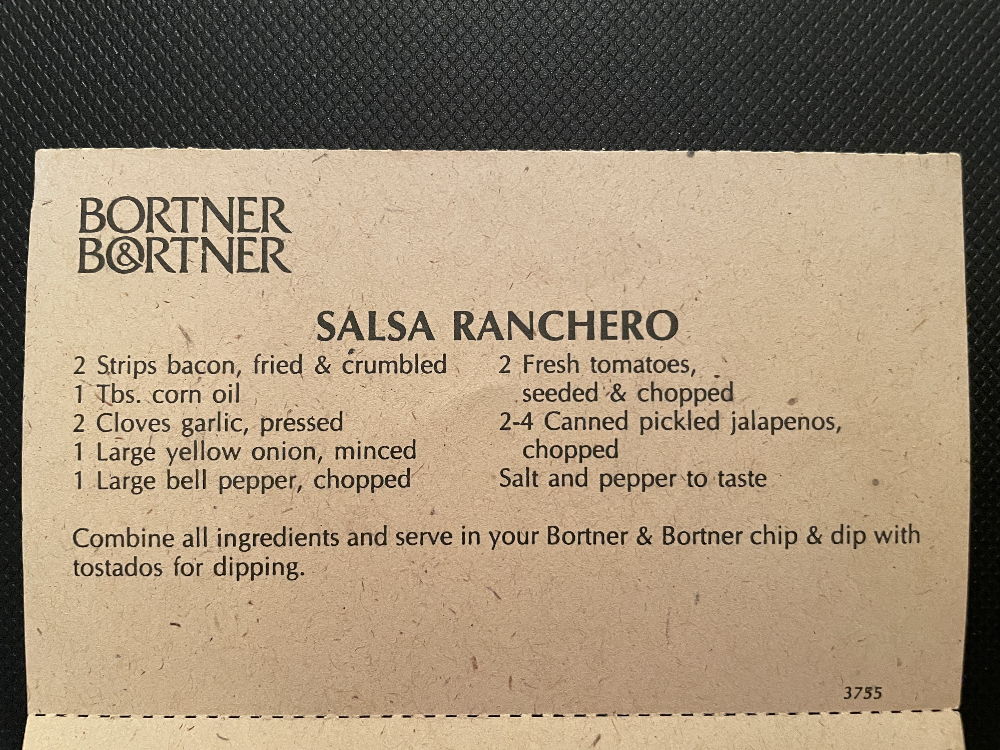

**Ingredients:**
- 2 strips bacon, fried & crumbled
- 1 Tbs. corn oil
- 2 cloves garlic, pressed
- 1 large yellow onion, minced
- 1 large bell pepper, chopped
- 2 fresh tomatoes, seeded & chopped
- 2–4 canned pickled jalapenos, chopped
- Salt and pepper to taste

**Instructions:**
Combine all ingredients and serve with tostados for dipping.

---

### Shrimp Dip
*Source: IMG_9112*

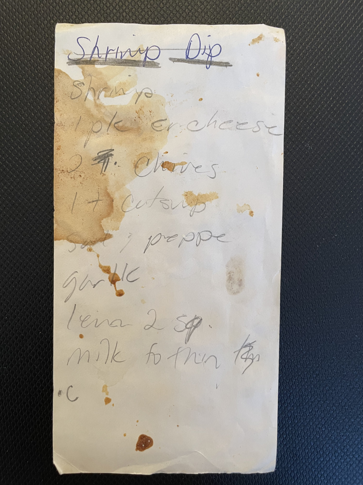

**Ingredients:**
- Shrimp
- 1 pkg. cream cheese
- 2 T. chives **[uncertain]**
- 1 t. catsup **[uncertain]**
- Salt & pepper **[uncertain]**
- Garlic
- Milk to thin it **[uncertain]**

*Note: This card is heavily stained and several items are partially obscured.*

---

### Spinach & Artichoke Dip
*Source: Kathy's Super Bowl (IMG_9118)*

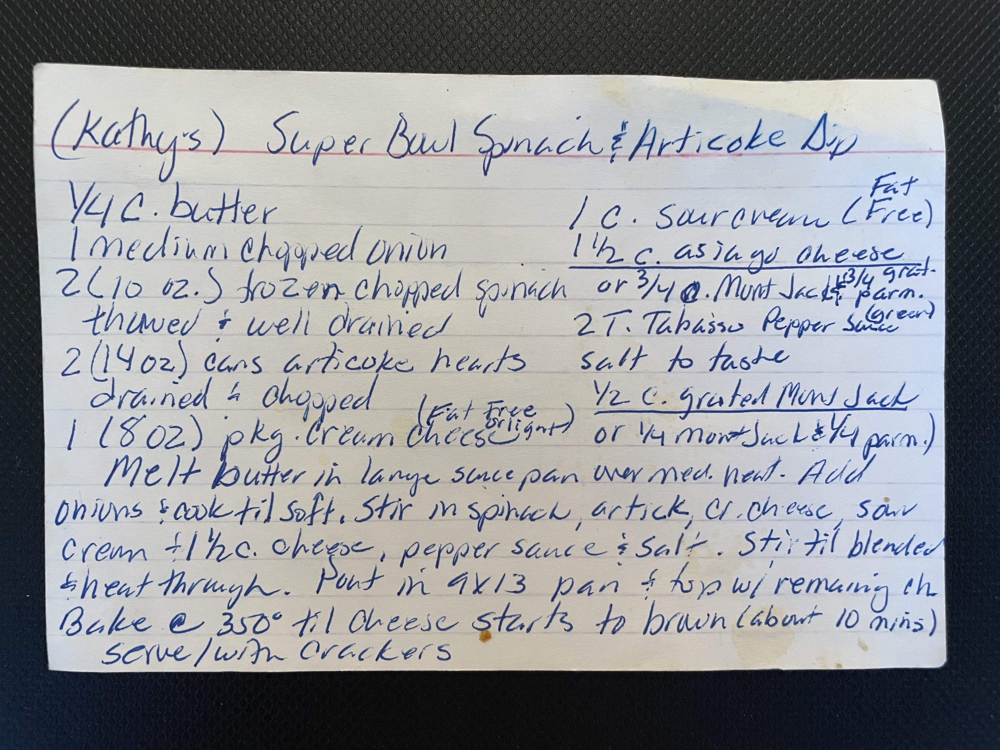

**Ingredients:**
- 1/4 c. butter
- 1 medium chopped onion
- 2 (10 oz.) frozen chopped spinach, thawed & well drained
- 2 (14 oz.) cans artichoke hearts, drained & chopped
- 1 (8 oz.) pkg. cream cheese (fat free or light)
- 1 c. sour cream (fat free)
- 1 1/2 c. Asiago cheese (or 3/4 c. Monterey Jack & 3/4 c. Parmesan)
- 2 T. Tabasco pepper sauce **[uncertain]** (or to taste)
- Salt to taste
- 1/2 c. grated Monterey Jack (or 1/4 Jack & 1/4 Parmesan)

**Instructions:**
Melt butter in large saucepan over med. heat. Add onions and cook til soft. Stir in spinach, artichokes, cream cheese, sour cream, and 1/2 c. cheese, pepper sauce, and salt. Stir til blended and heat through. Pour in 9x13 pan and top with remaining cheese. Bake at 350° til cheese starts to brown (about 10 mins). Serve with crackers.

---

### Spinach Dip
*Source: IMG_9480 (also IMG_9114)*

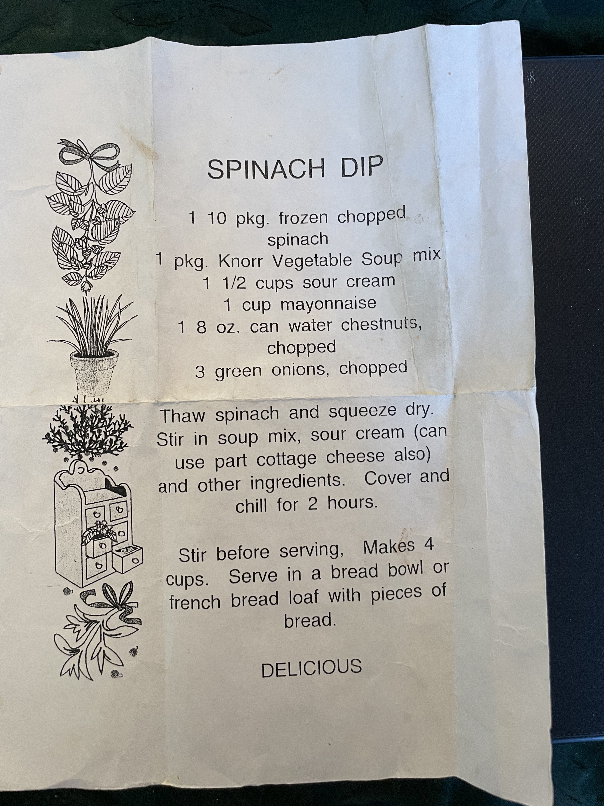

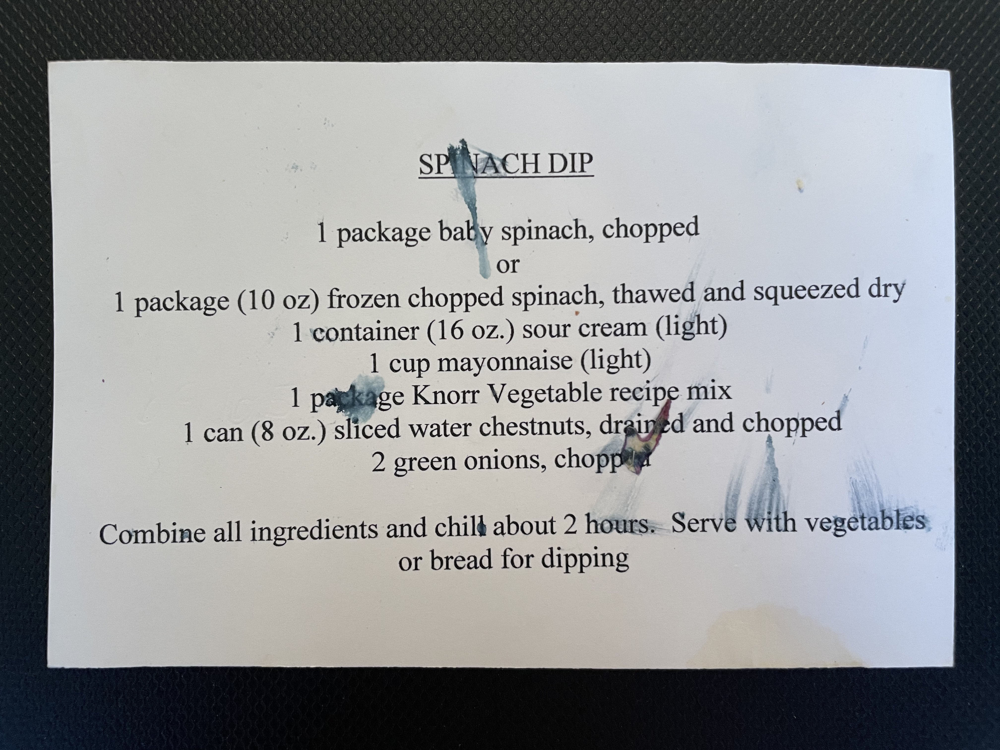

**Ingredients:**
- 1 (10 oz.) pkg. frozen chopped spinach
- 1 pkg. Knorr Vegetable Soup mix
- 1 1/2 cups sour cream
- 1 cup mayonnaise
- 1 (8 oz.) can water chestnuts, chopped
- 3 green onions, chopped

**Instructions:**
Thaw spinach and squeeze dry. Stir in soup mix, sour cream (can use part cottage cheese also) and other ingredients. Cover and chill for 2 hours. Stir before serving. Makes 4 cups. Serve in a bread bowl or french bread loaf with pieces of bread. DELICIOUS!

---

## Breads & Rolls

---

### Amy's Whole Wheat Bread
*Source: IMG_9141*

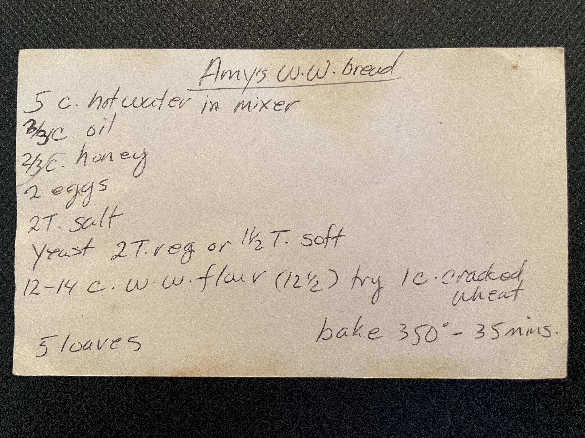

**Ingredients:**
- 5 c. hot water in mixer
- 2/3 c. oil
- 2/3 c. honey
- 2 eggs
- 2 T. salt
- 2 T. yeast (regular, or 1 1/2 T. instant) **[uncertain]**
- 12–14 c. whole wheat flour (try 1 c. cracked wheat)

**Instructions:**
Makes 5 loaves. Bake 350° for 35 mins.

---

### Baked Pumpkin Donuts
*Source: Brittany Hatch (IMG_9155)*

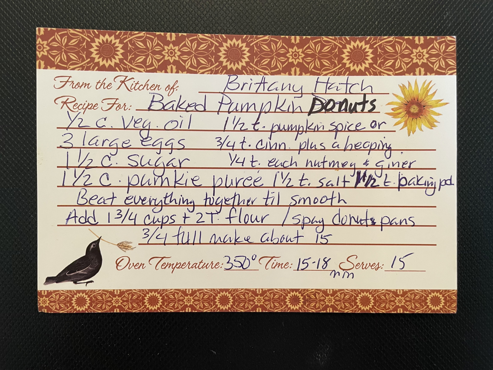

**Ingredients:**
- 1/2 c. vegetable oil
- 3 large eggs
- 1 1/2 c. sugar
- 1 1/2 c. pumpkin puree
- 1 1/2 t. pumpkin spice (or 3/4 t. cinnamon plus 1/4 t. each nutmeg & ginger)
- 1 1/2 t. salt
- 1 1/2 t. baking powder
- 1 3/4 cups + 2 T. flour

**Instructions:**
Beat everything together til smooth. Spray donut pans, fill 3/4 full. Bake at 350° for 15–18 min. Makes about 15.

---

### Banana Bread — Mom's
*Source: IMG_9128 / IMG_9129*

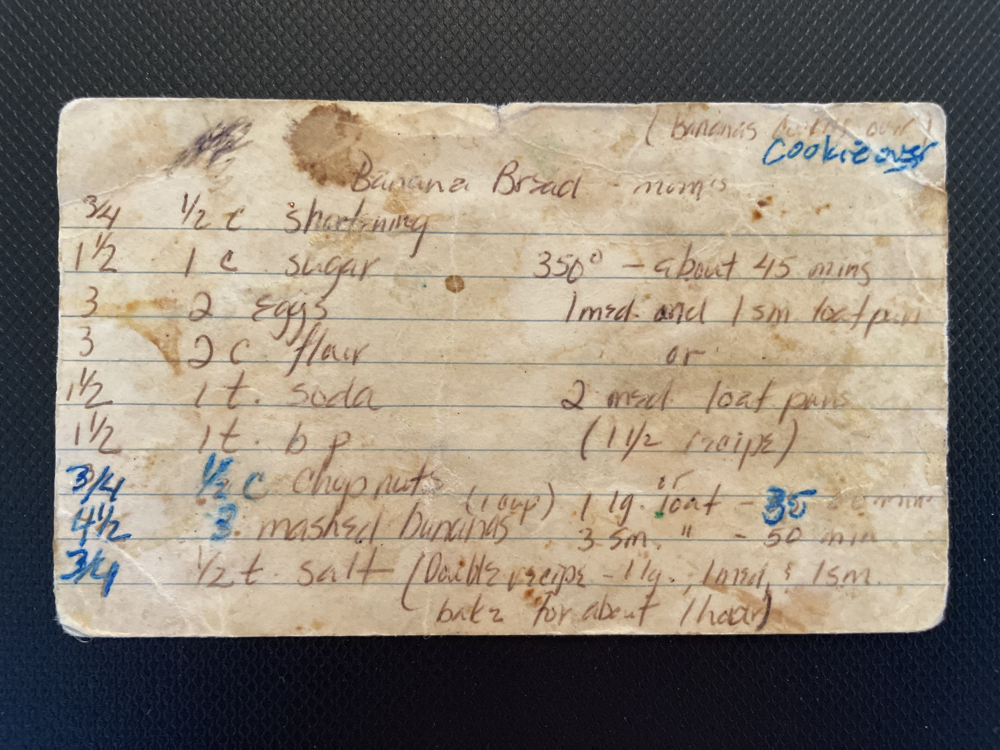

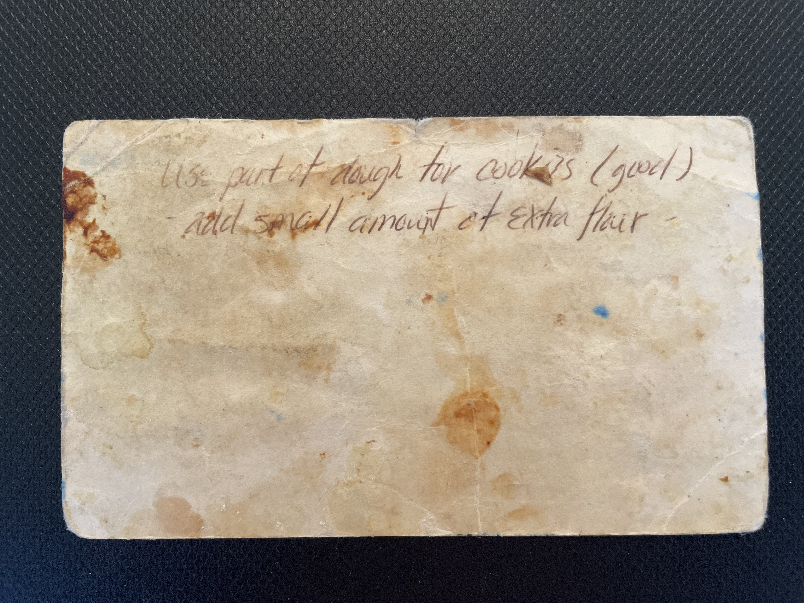

**Ingredients:**
- 1/2 c. shortening
- 1 c. sugar
- 2 eggs
- 2 c. flour
- 1 t. soda
- 1 t. baking powder
- 1/2 c. chopped nuts
- 3 mashed bananas
- 1/2 t. salt

**Instructions:**
Bake at 350° for about 45 mins. 1 med and 1 sm loaf pan, or 2 med loaf pans. Can use part of dough for cookies (add small amount of extra flour).

---

### Bran Muffins (Joyce)
*Source: IMG_9150 (also partial views IMG_9152/IMG_9153)*

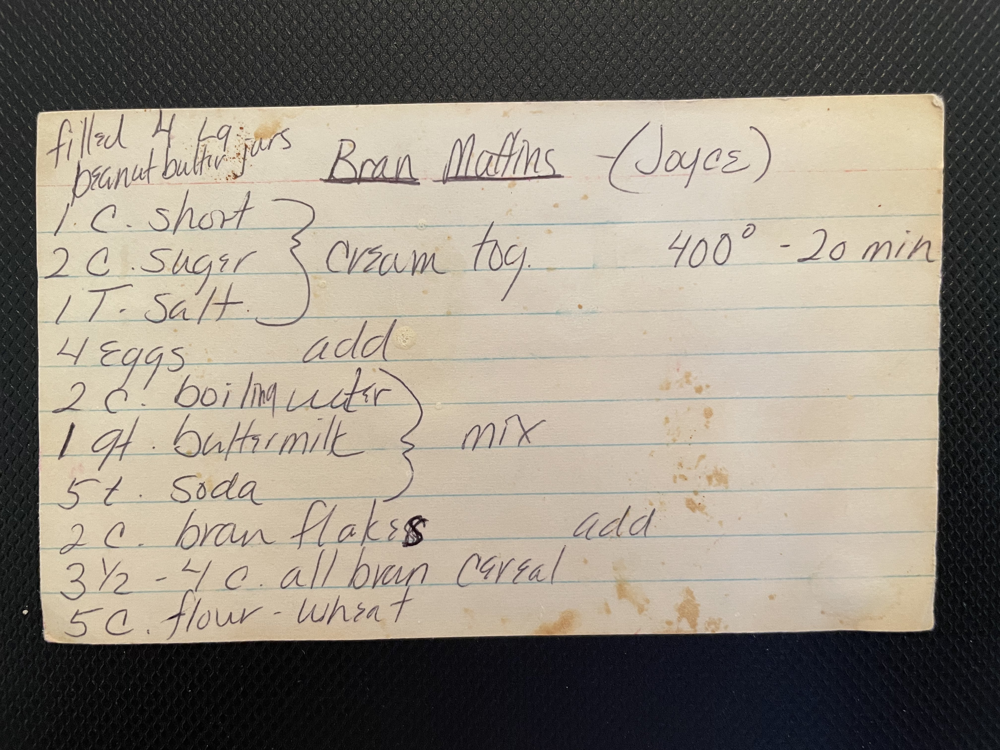

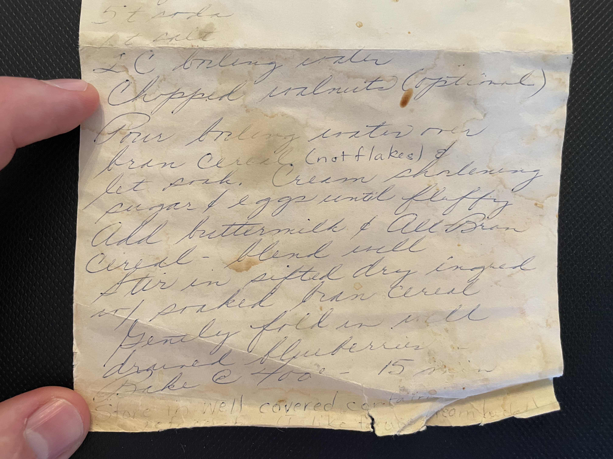

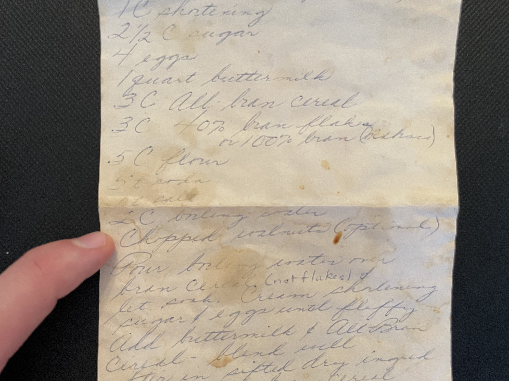

**Ingredients:**
- 1 c. shortening
- 2 c. sugar
- 1 T. salt
- 4 eggs
- 2 c. boiling water
- 1 qt. buttermilk
- 5 t. soda
- 2 c. bran flakes
- 3 1/2–4 c. all bran cereal
- 5 c. flour (wheat)

**Instructions:**
Cream shortening, sugar, and salt. Add eggs. Mix buttermilk and soda. Add bran flakes and cereal, then flour. Bake at 400° for 20 min.

---

### Buttermilk Scones
*Source: IMG_9484*

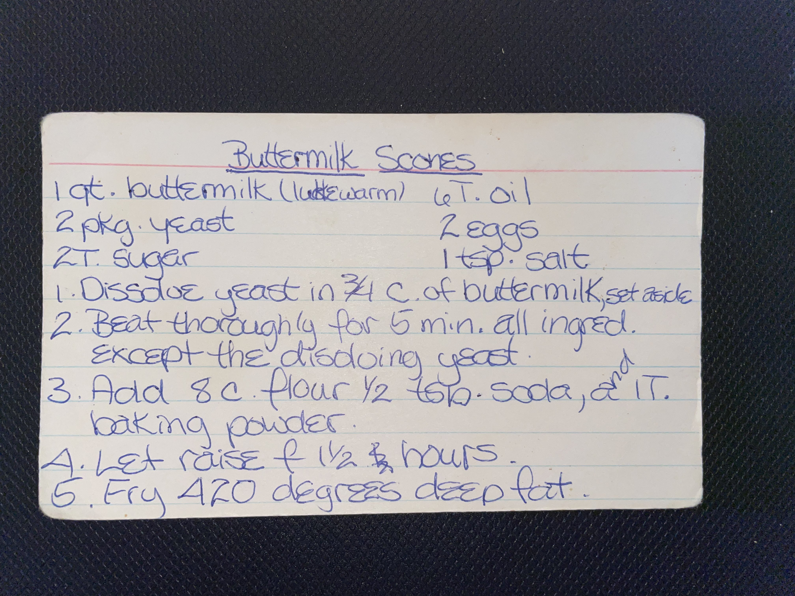

**Ingredients:**
- 1 qt. buttermilk (lukewarm)
- 6 T. oil
- 2 pkg. yeast
- 2 eggs
- 2 T. sugar
- 1 tsp. salt
- 8 c. flour
- 1/2 tsp. soda
- 1 T. baking powder **[uncertain]**

**Instructions:**
1. Dissolve yeast in 3/4 c. of buttermilk, set aside.
2. Beat thoroughly for 5 min. all ingredients except the dissolving yeast.
3. Add flour, soda, and baking powder.
4. Let rise 1 1/2 to 2 hours **[uncertain]**.
5. Fry at 420 degrees in deep fat.

---

### Corn Bread or Muffins
*Source: IMG_9147*

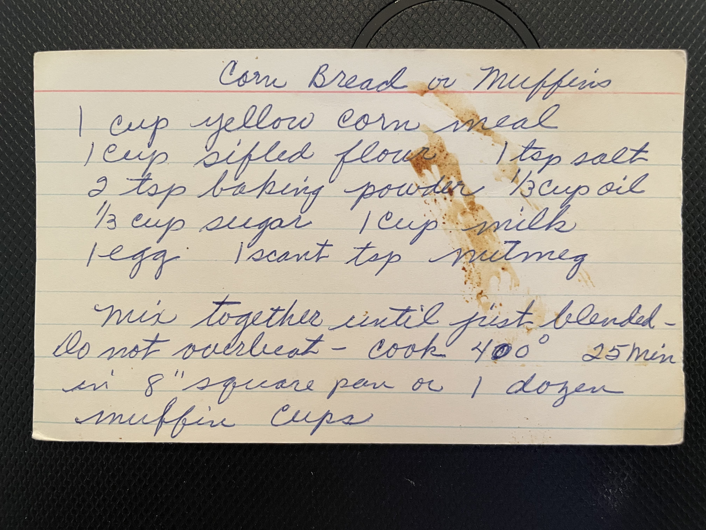

**Ingredients:**
- 1 cup yellow corn meal
- 1 cup sifted flour
- 1 tsp. salt
- 2 tsp. baking powder
- 1/3 cup oil
- 1/3 cup sugar
- 1 cup milk
- 1 egg
- 1 scant tsp. nutmeg

**Instructions:**
Mix together until just blended. Do not overbeat. Cook at 400° for 25 min in 8" square pan or 1 dozen muffin cups.

---

### Date Bran Muffins
*Source: Susan Bracken (IMG_9148 / IMG_9149)*

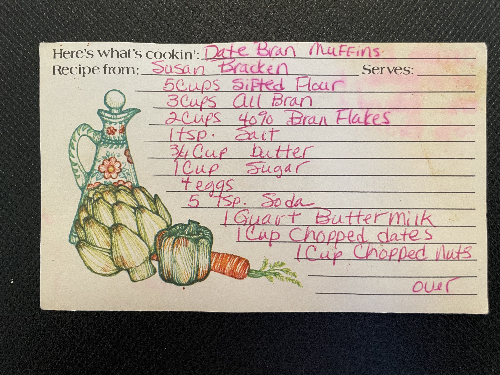

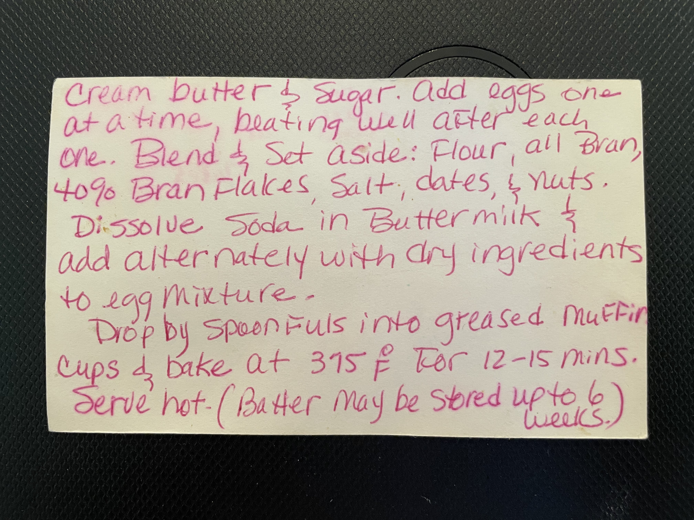

**Ingredients:**
- 5 cups sifted flour
- 3 cups All Bran
- 2 cups 40% Bran Flakes
- 1 tsp. salt
- 3/4 cup butter
- 1 cup sugar
- 4 eggs
- 5 tsp. soda
- 1 quart buttermilk
- 1 cup chopped dates
- 1 cup chopped nuts

**Instructions:**
Cream butter & sugar. Add eggs one at a time, beating well after each. Set aside: flour, All Bran, 40% Bran Flakes, salt, dates, & nuts. Dissolve soda in buttermilk & add alternately with dry ingredients to egg mixture. Drop by spoonfuls into greased muffin cups & bake at 375°F for 12–15 mins. Serve hot. (Batter may be stored up to 6 weeks.)

---

### Dill Onion Bread
*Source: Amy (IMG_9138)*

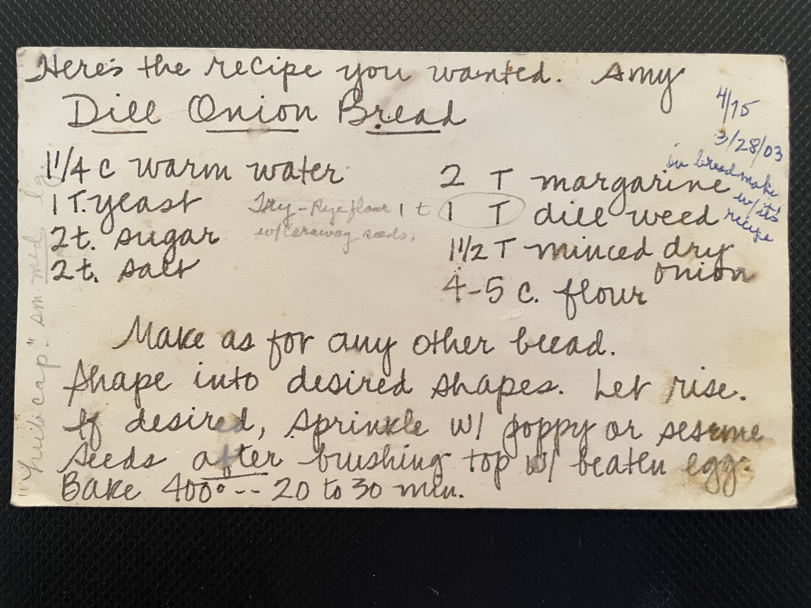

**Ingredients:**
- 1 1/4 c. warm water
- 1 T. yeast
- 2 t. sugar
- 2 t. salt
- 2 T. margarine
- 1 T. dill weed
- 1 1/2 T. minced dry onion
- 4–5 c. flour

**Instructions:**
Make as for any other bread. Shape into desired shapes. Let rise. If desired, sprinkle with poppy or sesame seeds after brushing top with beaten egg. Bake 400° for 20–30 min.

---

### Dilly Bread
*Source: IMG_9482 / IMG_9483*

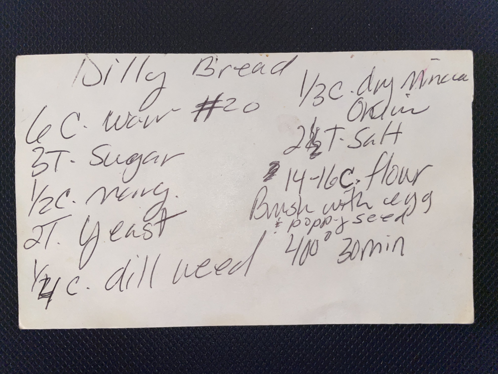

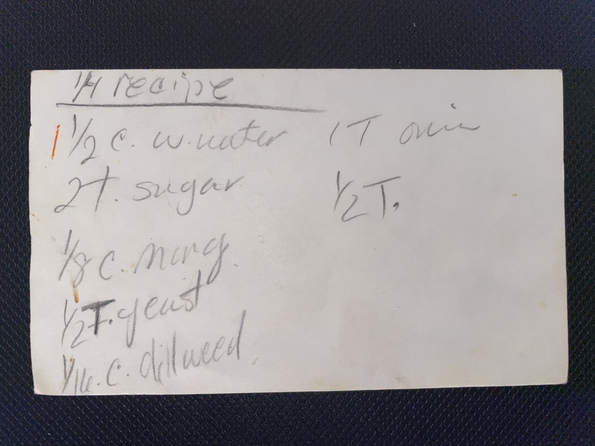

**Full Batch:**
- 6 c. warm water **[uncertain — "#20" may refer to water temperature]**
- 3 T. sugar
- 1/2 c. margarine
- 2 T. yeast
- 1/4 c. dill weed
- 1/3 c. dry minced onion
- 2 1/2 T. salt
- 14–16 c. flour

**Instructions:**
Mix ingredients. Brush with egg & poppy seeds. Bake at 400° for 30 min.

**1/4 Recipe:**
- 1 1/2 c. warm water, 2 T. sugar, 1/8 c. margarine, 1/2 T. yeast, 1/16 c. dillweed **[uncertain]**, 1 T. onion, 1/2 T. salt **[uncertain]**

---

### Foundation Sweet Yeast Roll
*Source: IMG_9126*

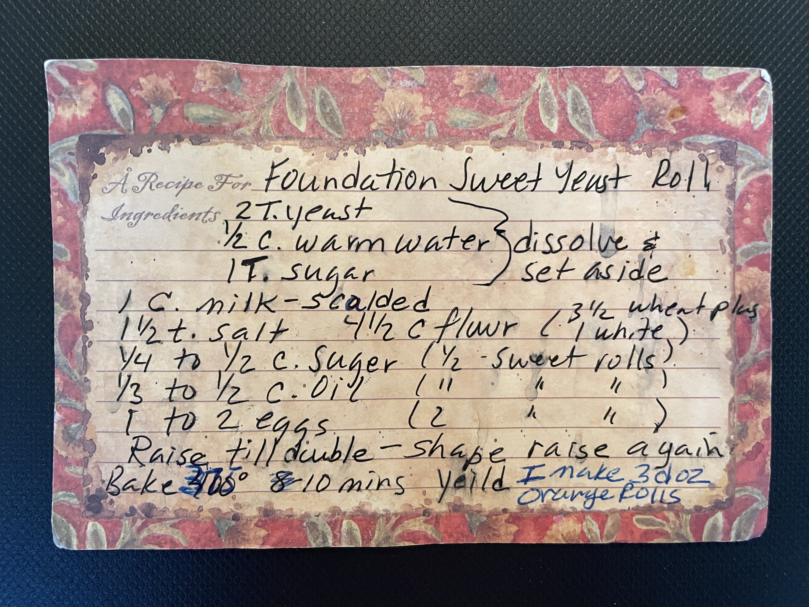

**Ingredients:**
- 2 T. yeast
- 1/2 c. warm water, 1 T. sugar (dissolve & set aside)
- 1 c. milk, scalded
- 1 1/2 t. salt
- 4 1/2 c. flour (1 white, 3 1/2 wheat plus)
- 1/4 to 1/2 c. sugar (1/2 for sweet rolls)
- 1/3 to 1/2 c. oil
- 1 to 2 eggs (2 for sweet rolls)

**Instructions:**
Raise till double, shape, raise again. Bake 375° for 8–10 mins.

---

### Holiday Pumpkin Bread
*Source: Kathy (IMG_9145 / IMG_9146)*

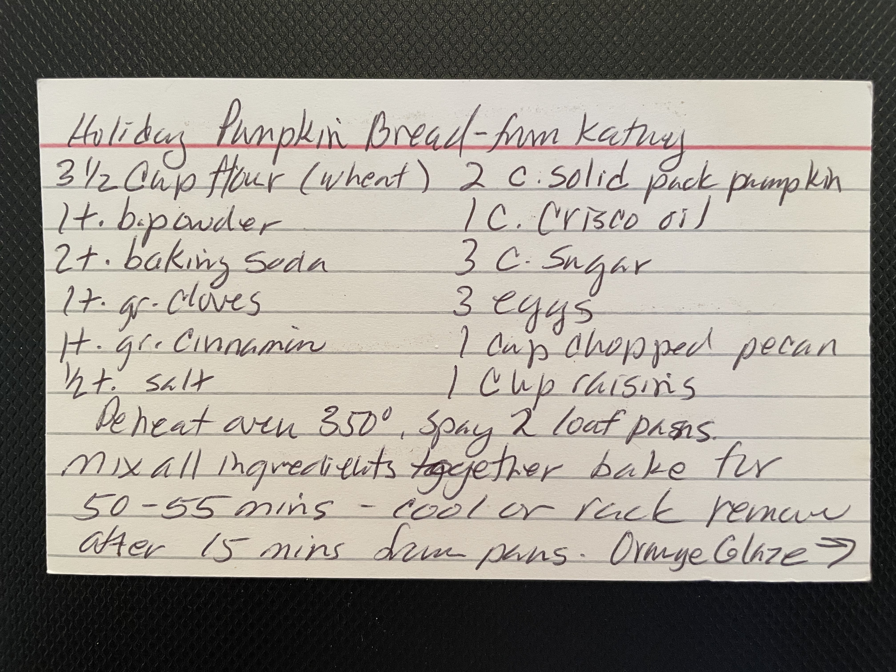

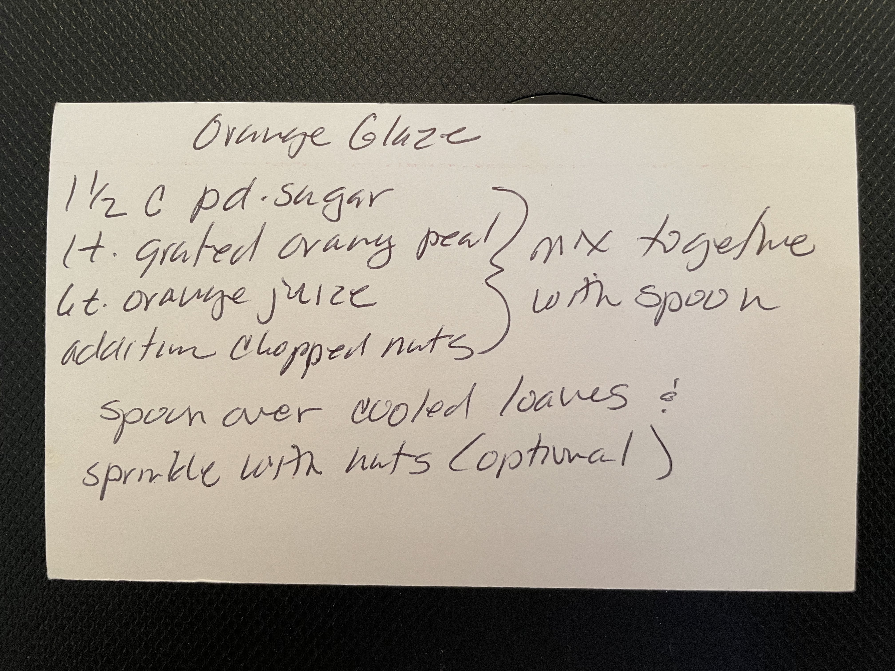

**Ingredients:**
- 3 1/2 cup flour (wheat)
- 1 t. baking powder
- 2 t. baking soda
- 1 t. ground cloves
- 1 t. ground cinnamon **[uncertain]**
- 1/2 t. salt
- 2 c. solid pack pumpkin
- 1 c. Crisco oil
- 3 c. sugar
- 3 eggs **[uncertain]**
- 1 cup chopped pecans
- 1 cup raisins

**Instructions:**
Preheat oven 350°. Spray 2 loaf pans. Mix all ingredients together, bake for 50–55 mins. Cool on rack, remove after 15 mins.

**Orange Glaze:** 1 1/2 c. powdered sugar, 1 t. grated orange peel, 1 t. orange juice **[uncertain]**, chopped nuts. Mix and spoon over cooled loaves.

---

### Orange Rolls
*Source: IMG_9127 — Makes 3 dozen*

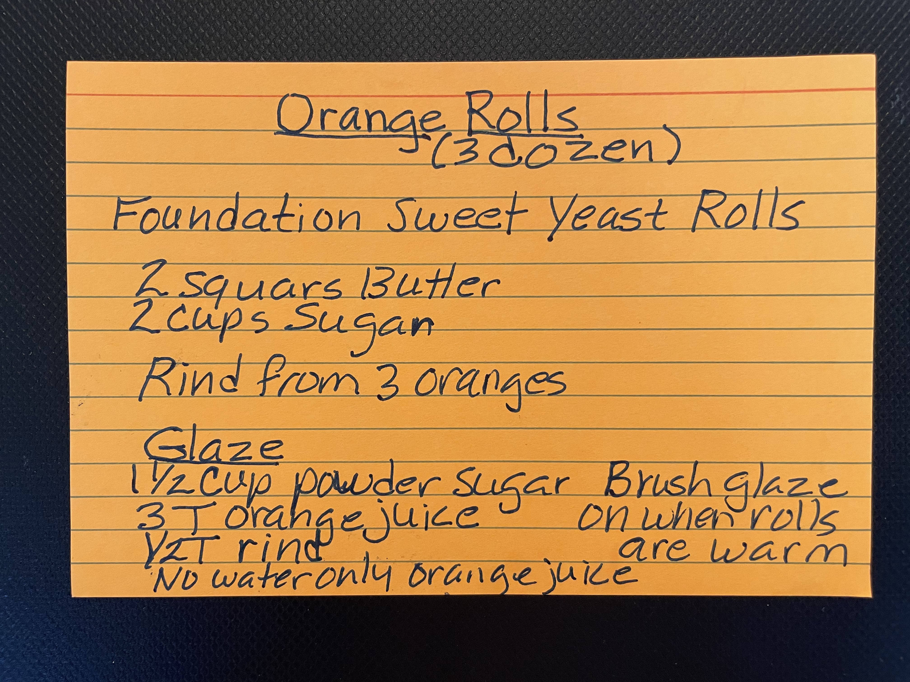

**Ingredients (uses Foundation Sweet Yeast Rolls dough):**
- 2 squares butter
- 2 cups sugar
- Rind from 3 oranges

**Glaze:** 1 1/2 cup powdered sugar, 3 T. orange juice, 1/2 T. rind. No water, only orange juice. Brush glaze on when rolls are warm.

---

### Pear Bread
*Source: Kathy Morgan (IMG_9136)*

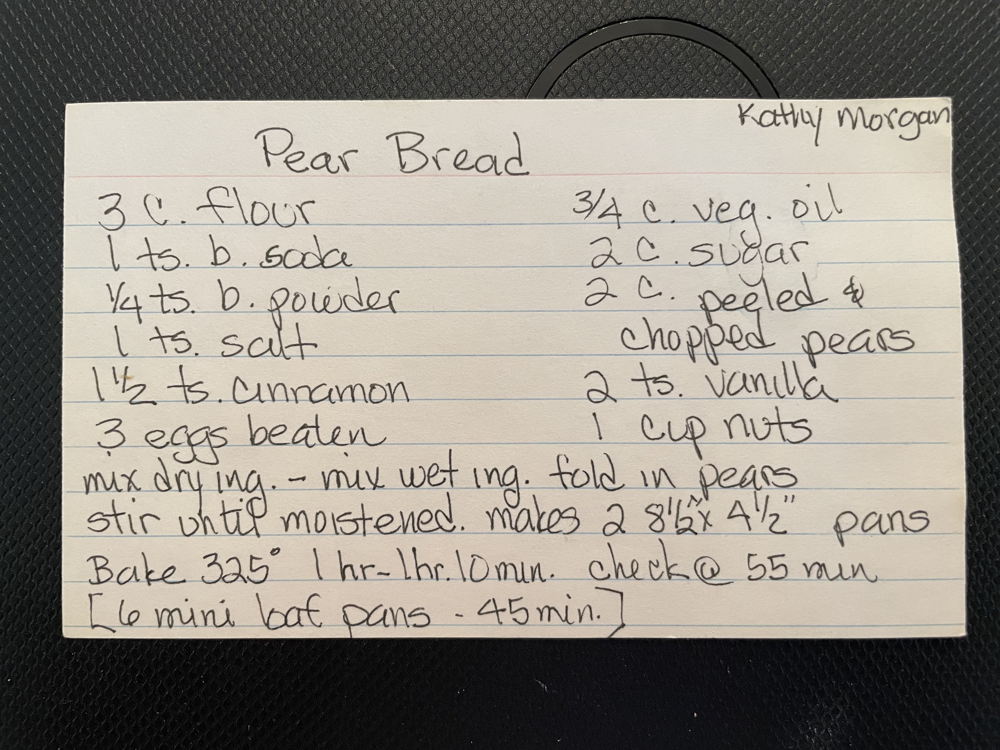

**Ingredients:**
- 3 c. flour
- 1 t. baking soda
- 1/4 t. baking powder
- 1 t. salt
- 1 1/2 t. cinnamon
- 3 eggs beaten
- 3/4 c. vegetable oil
- 2 c. sugar
- 2 c. peeled & chopped pears
- 2 t. vanilla
- 1 cup nuts

**Instructions:**
Mix dry ingredients, mix wet ingredients, fold in pears. Stir until moistened. Makes 2 (8 1/2" x 4 1/2") pans. Bake 325° for 1 hr.–1 hr. 10 min. (6 mini loaf pans — 45 min.)

---

### Wheat Cinnamon Rolls
*Source: IMG_9154*

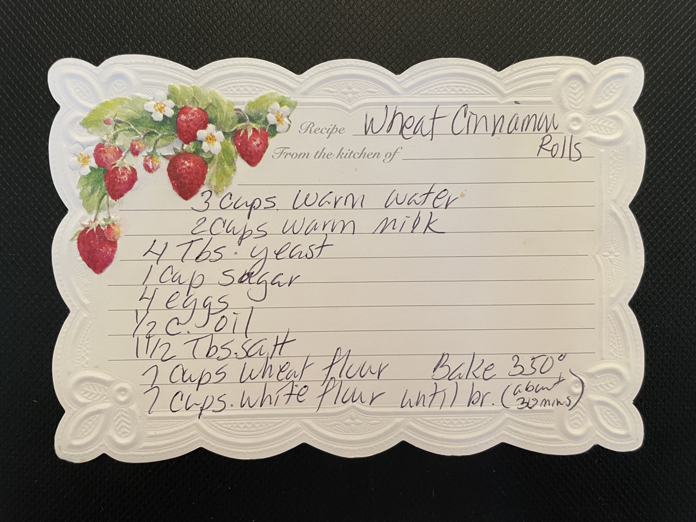

**Ingredients:**
- 3 cups warm water
- 2 cups warm milk
- 4 Tbs. yeast
- 1 cup sugar
- 4 eggs
- 1/2 c. oil
- 1 1/2 Tbs. salt
- 2 cups wheat flour
- 7 cups white flour

**Instructions:**
Bake 350° until brown (about 20 mins) **[uncertain]**.

---

### Whole Wheat Bread (Mother)
*Source: IMG_9139 / IMG_9140*

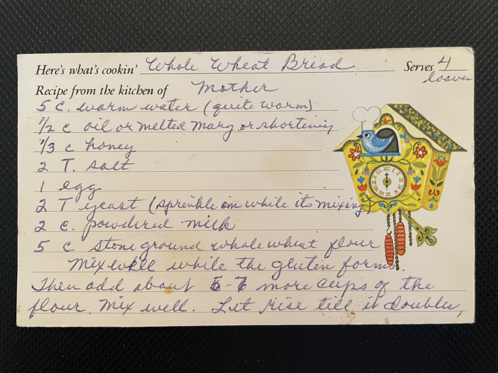

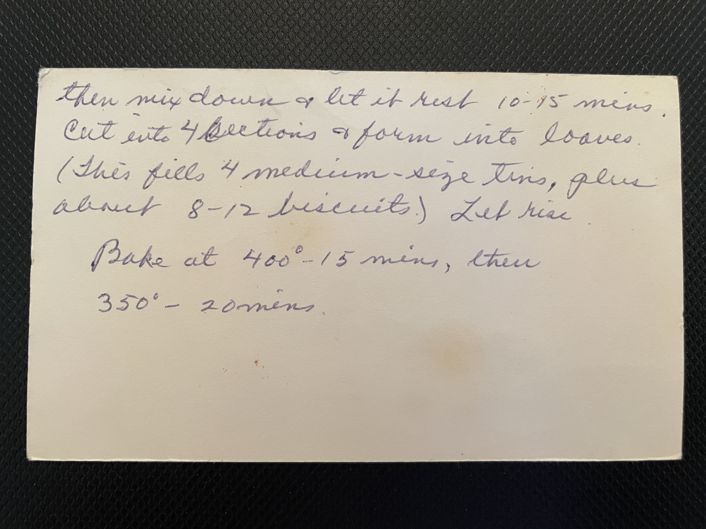

**Ingredients:**
- 5 c. warm water (quite warm)
- 1/2 c. oil or melted margarine or shortening **[uncertain]**
- 1/3 c. honey
- 2 T. salt
- 1 egg
- 2 T. yeast
- 2 c. powdered milk
- 5 c. stone ground whole wheat flour
- 6–8 more cups flour

**Instructions:**
Mix well while the gluten forms. Then add remaining flour. Let rise til it doubles. Mix down & let rest 10–15 mins. Cut into 4 sections & form into loaves. Let rise. Bake at 400° for 15 mins, then 350° for 20 mins. Makes 4 loaves.

---

### Whole Wheat Bread (Kathy)
*Source: IMG_9134 / IMG_9135*

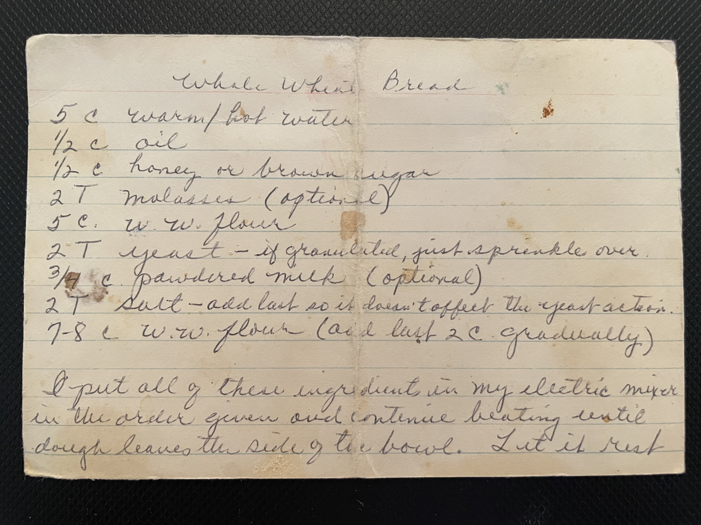

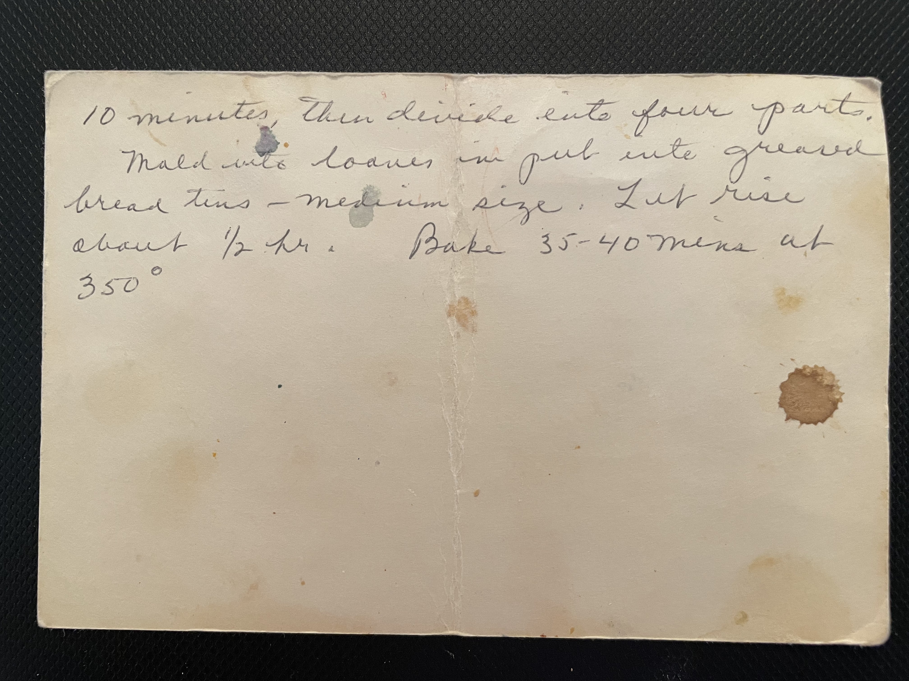

**Ingredients:**
- 5 c. warm/hot water
- 1/2 c. oil
- 1/2 c. honey or brown sugar
- 2 T. molasses (optional)
- 5 c. whole wheat flour
- 2 T. yeast
- 3/4 c. powdered milk (optional) **[uncertain]**
- 2 T. salt (add last)
- 7–8 c. whole wheat flour (add last 2 c. gradually)

**Instructions:**
Beat until dough leaves the side of the bowl. Let rest 10 minutes. Divide into four parts, mold into loaves, put into greased bread tins. Let rise about 1/2 hr. Bake 35–40 mins at 350°.

---

### Zucchini Bread (Nickel Ad)
*Source: IMG_9144*

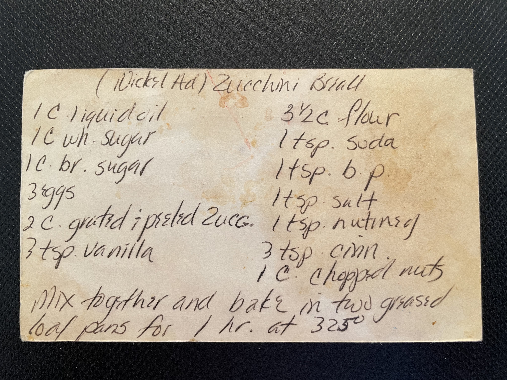

**Ingredients:**
- 1 c. liquid oil, 1 c. white sugar, 1 c. brown sugar, 3 eggs, 2 c. grated & peeled zucchini, 3 tsp. vanilla, 3 1/2 c. flour, 1 tsp. soda, 1 tsp. baking powder, 1 tsp. salt, 1 tsp. nutmeg, 3 tsp. cinnamon, 1 c. chopped nuts

**Instructions:**
Mix together and bake in two greased loaf pans for 1 hr. at 325°.

---

### Zucchini Bread — Mom's
*Source: IMG_9143*

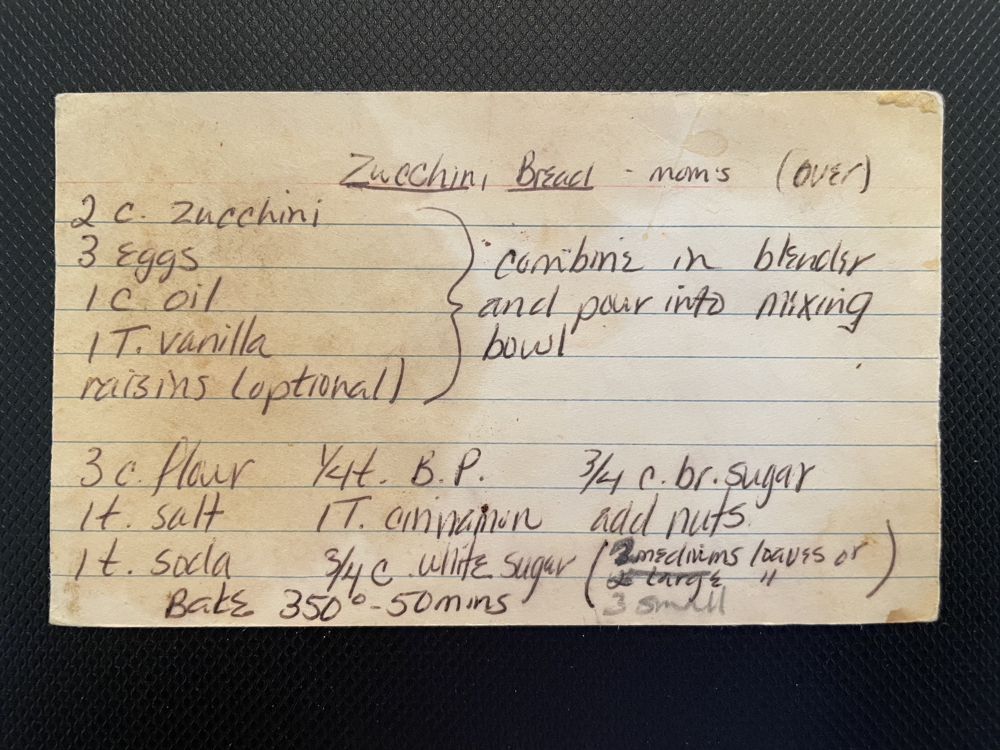

**Ingredients:**
- 2 c. zucchini, 3 eggs, 1 c. oil, 1 T. vanilla, raisins (optional)
- 3 c. flour, 1 t. salt, 1 t. soda, 1/4 t. baking powder, 1 T. cinnamon, 3/4 c. brown sugar, 3/4 c. white sugar, nuts

**Instructions:**
Combine wet ingredients in blender and pour into mixing bowl. Add dry ingredients. Bake 350° for 50 mins. (2 medium loaves or 1 large, 3 small.)

---

### Zucchini Bread (Typed)
*Source: IMG_9142*

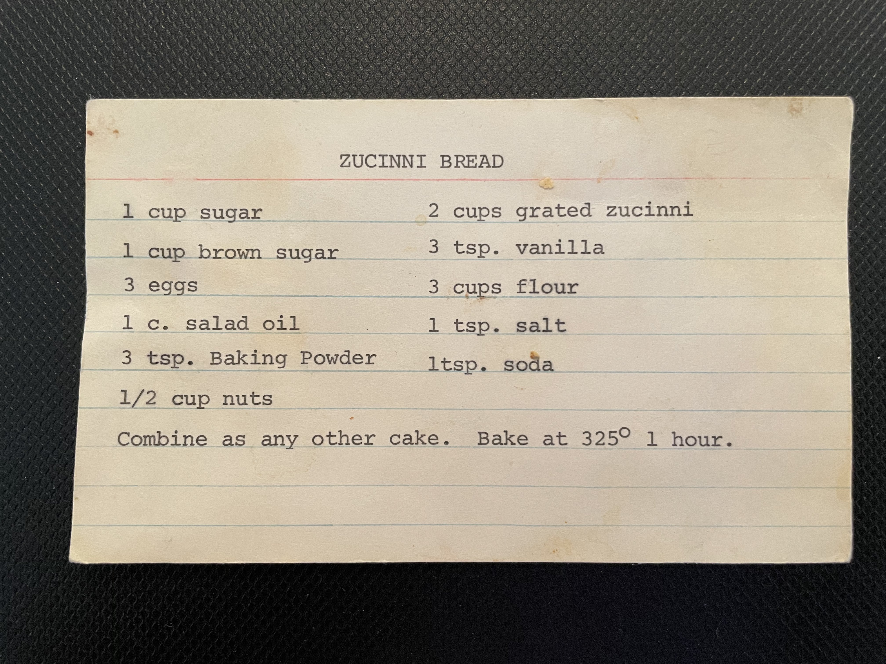

**Ingredients:**
- 1 cup sugar, 1 cup brown sugar, 3 eggs, 1 c. salad oil, 2 cups grated zucchini, 3 tsp. vanilla, 3 cups flour, 1 tsp. salt, 3 tsp. baking powder, 1 tsp. soda, 1/2 cup nuts

**Instructions:**
Combine as any other cake. Bake at 325° for 1 hour.

---

## Breakfast & Brunch

---

### Belgian Waffles
*Source: IMG_9446*

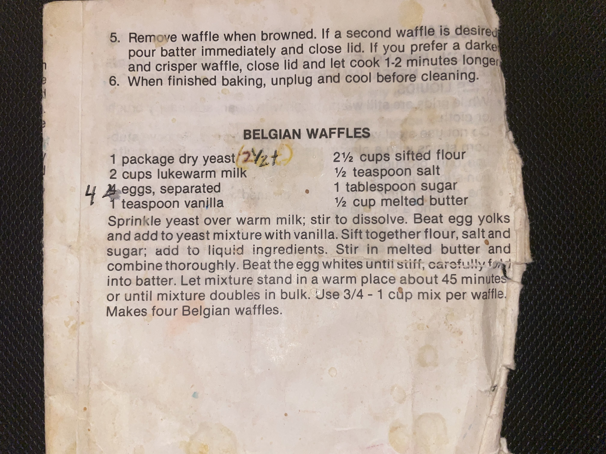

**Ingredients:**
- 1 package dry yeast (2 1/2 t.)
- 2 cups lukewarm milk
- 3–4 eggs, separated **[uncertain]**
- 1 teaspoon vanilla
- 2 1/2 cups sifted flour
- 1/2 teaspoon salt
- 1 tablespoon sugar
- 1/2 cup melted butter

**Instructions:**
Sprinkle yeast over warm milk; stir to dissolve. Beat egg yolks and add to yeast mixture with vanilla. Sift together flour, salt and sugar; add to liquid ingredients. Stir in melted butter and combine thoroughly. Beat the egg whites until stiff, carefully fold into batter. Let mixture stand in a warm place about 45 minutes or until mixture doubles in bulk. Use 3/4–1 cup mix per waffle. Makes four Belgian waffles.

---

### Brunch Sausage & Egg Casserole
*Source: IMG_9258*

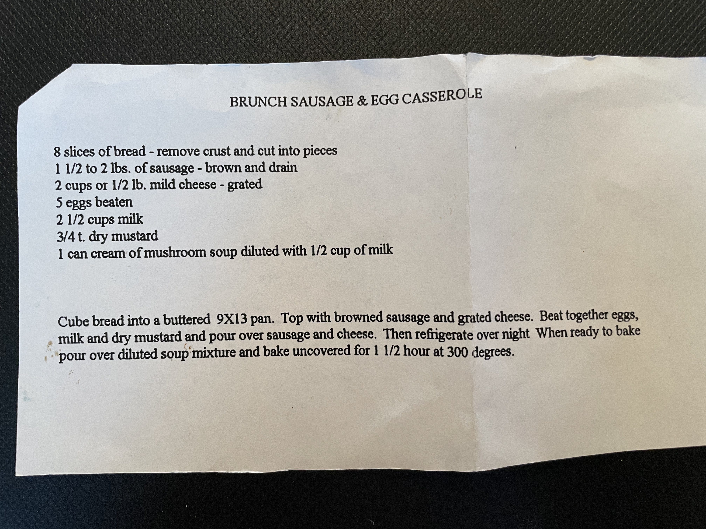

**Ingredients:**
- 8 slices of bread (remove crust, cut into pieces)
- 1 1/2 to 2 lbs. sausage (brown and drain)
- 2 cups or 1/2 lb. mild cheese, grated
- 5 eggs beaten
- 2 1/2 cups milk
- 3/4 t. dry mustard
- 1 can cream of mushroom soup diluted with 1/2 cup milk

**Instructions:**
Cube bread into a buttered 9x13 pan. Top with browned sausage and grated cheese. Beat together eggs, milk, and dry mustard and pour over sausage and cheese. Refrigerate overnight. When ready to bake, pour diluted soup mixture over and bake uncovered for 1 1/2 hours at 300°.

---

### Crustless Quiche
*Source: Aunt Kathy / Carla (IMG_9254 / IMG_9255)*

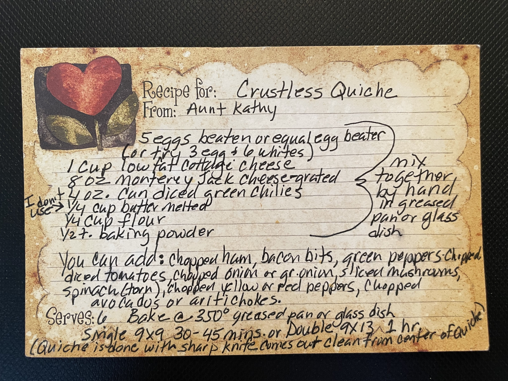

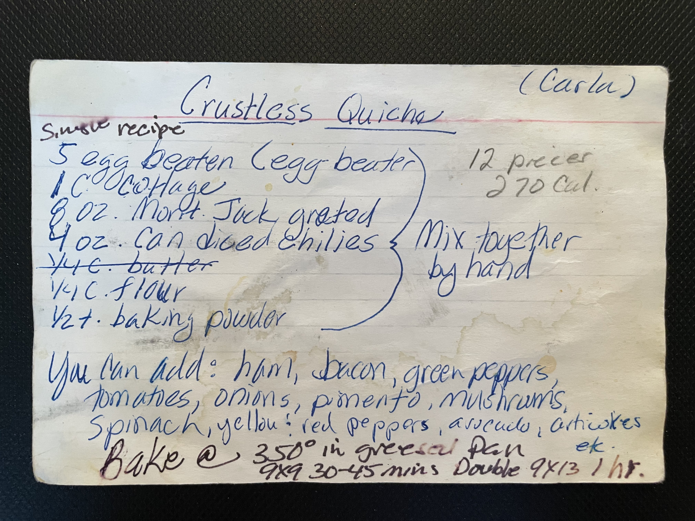

**Ingredients:**
- 5 eggs beaten (or equal egg beaters, or 3 eggs + 6 whites)
- 1 cup low fat cottage cheese
- 8 oz. Monterey Jack cheese, grated
- 1 (4 oz.) can diced green chilies
- 1/4 cup butter, melted
- 1/4 cup flour
- 1/2 t. baking powder

**Optional add-ins:** Chopped ham, bacon bits, green peppers, diced tomatoes, chopped onion, sliced mushrooms, spinach, chopped peppers, chopped avocados or artichokes.

**Instructions:**
Mix together by hand in greased pan or glass dish. Single 9x9: bake at 350° for 30–45 mins. Double 9x13: bake for 1 hr. Done when knife comes out clean from center.

---

### German Pancakes
*Source: Kathy (IMG_9130)*

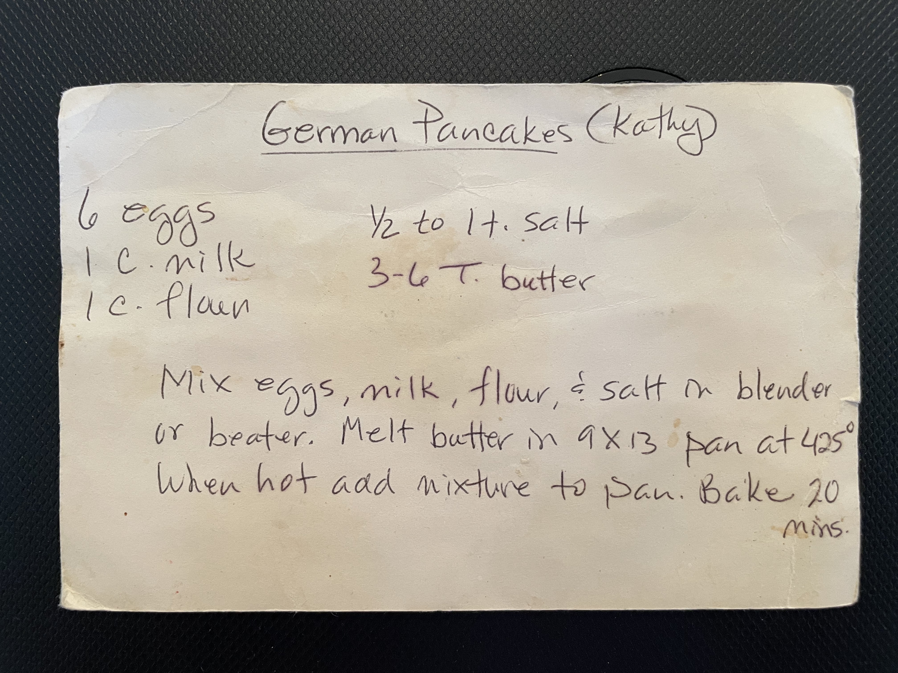

**Ingredients:**
- 6 eggs
- 1 c. milk
- 1 c. flour
- 1/2 to 1 t. salt
- 3–6 T. butter

**Instructions:**
Mix eggs, milk, flour, and salt in blender or beater. Melt butter in 9x13 pan at 425°. When hot, add mixture to pan. Bake 20 mins.

---

### Granola Crunch
*Source: IMG_9536 / IMG_9537 — Yield: 9 1/2 cups*

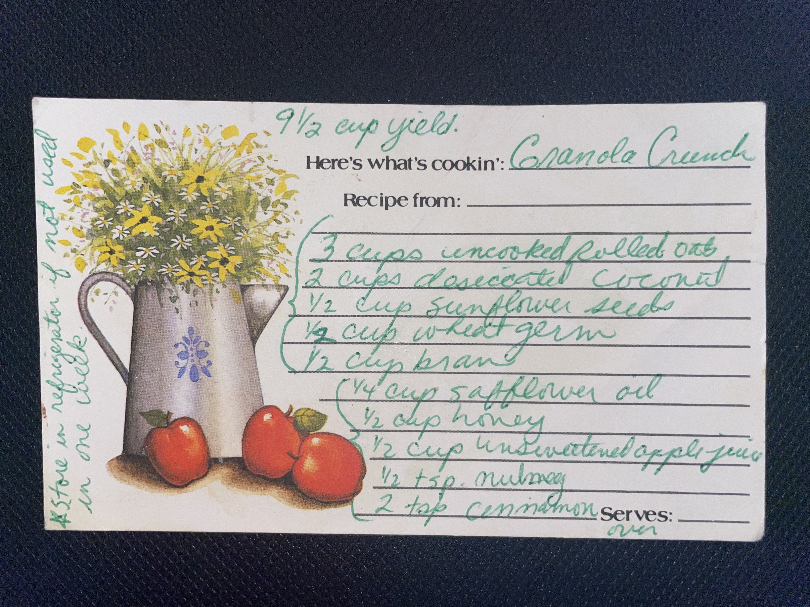

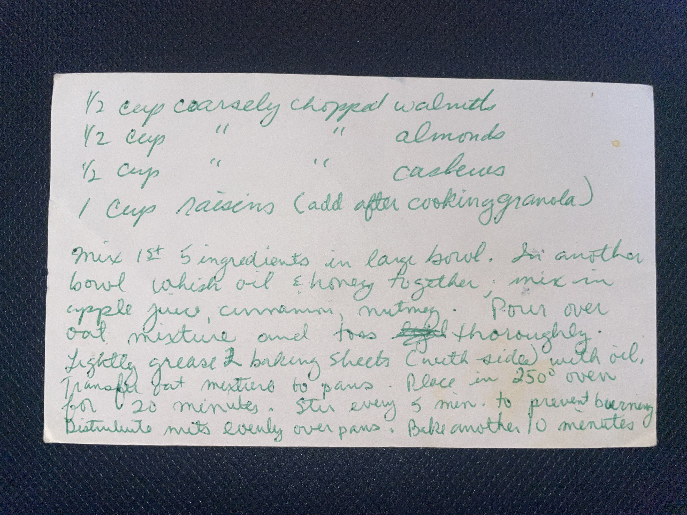

**Ingredients:**
- 3 cups uncooked rolled oats
- 2 cups desiccated coconut **[uncertain]**
- 1/2 cup sunflower seeds
- 1/2 cup wheat germ
- 1/2 cup bran
- 1/4 cup safflower oil
- 1/2 cup honey
- 1/2 cup unsweetened apple juice
- 1/2 tsp. nutmeg
- 2 tsp. cinnamon
- 1/2 cup coarsely chopped walnuts
- 1/2 cup coarsely chopped almonds **[uncertain]**
- 1/2 cup coarsely chopped cashews **[uncertain]**
- 1 cup raisins (add after cooking granola)

**Instructions:**
Mix first 5 ingredients in large bowl. In another bowl whisk oil & honey together; mix in apple juice, cinnamon, nutmeg. Pour over oat mixture and toss thoroughly. Lightly grease 2 baking sheets with oil. Transfer oat mixture to pans. Place in 250° oven for 20 minutes. Stir every 5 min. to prevent burning. Distribute nuts evenly over pans. Bake another 10 minutes. Store in refrigerator or freezer in airtight container.

---

### Good Granola
*Source: Maxie's **[uncertain]** 1991 (IMG_9476)*

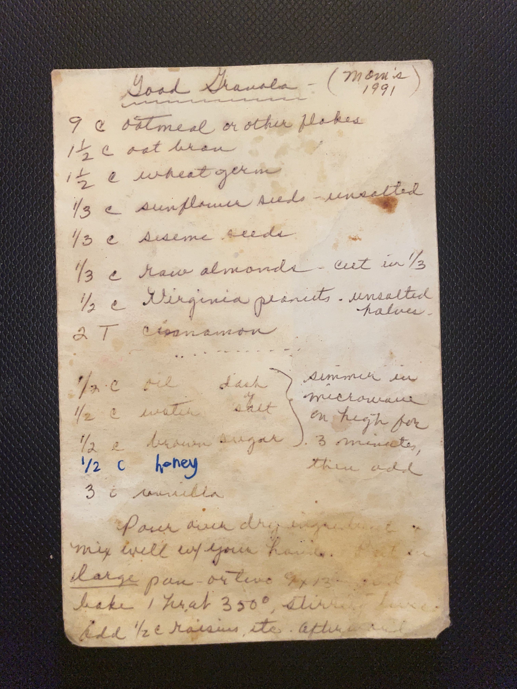

**Dry Ingredients:**
- 9 c. oatmeal, 1 1/2 c. oat bran, 1 1/2 c. wheat germ, 1/3 c. sunflower seeds, 1/3 c. sesame seeds, 1/3 c. raw almonds (cut in thirds), 1/3 c. Virginia peanuts, 2 T. cinnamon

**Wet Ingredients:**
- 1/2 c. oil, dash salt, 1/2 c. water, 1/2 c. brown sugar, 1/2 c. honey (simmer in microwave on high for 3 min.), 3 t. vanilla

**Instructions:**
Pour over dry ingredients, mix well with your hands. Spread in large pan(s). Bake 1 hour at 350°, stirring occasionally. Add 1/2 c. raisins after baking.

---

### Hot Cider Syrup
*Source: IMG_9132*

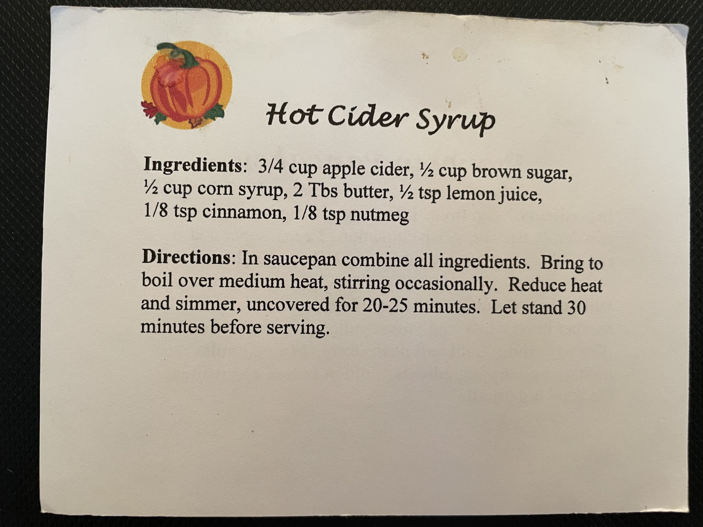

**Ingredients:**
- 3/4 cup apple cider, 1/2 cup brown sugar, 1/2 cup corn syrup, 2 Tbs. butter, 1/2 tsp. lemon juice, 1/8 tsp. cinnamon, 1/8 tsp. nutmeg

**Instructions:**
In saucepan combine all ingredients. Bring to boil over medium heat, stirring occasionally. Reduce heat and simmer uncovered for 20–25 minutes. Let stand 30 minutes before serving.

---

### Kallee Syrup
*Source: IMG_9556 (also IMG_9448)*

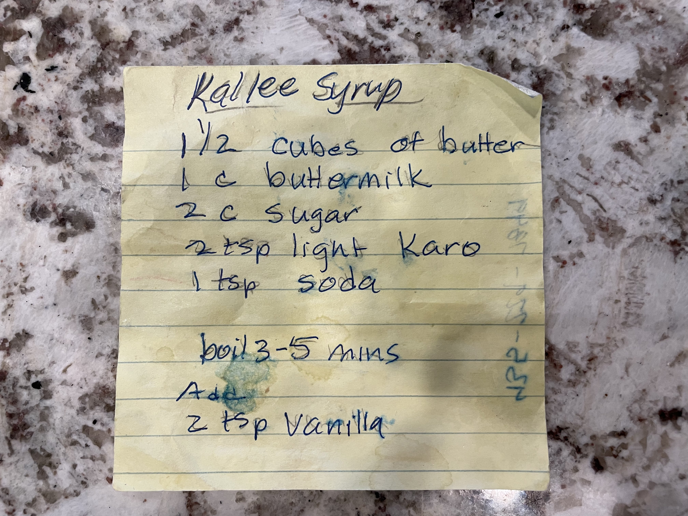

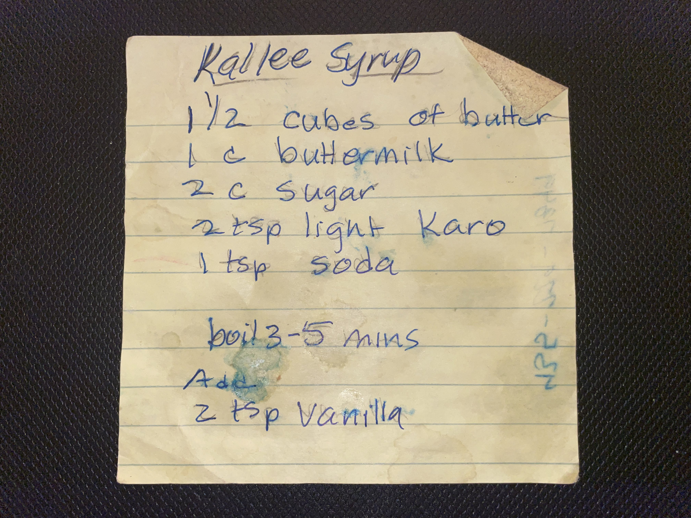

**Ingredients:**
- 1 1/2 cubes of butter
- 1 c. buttermilk
- 2 c. sugar
- 2 tsp. light Karo
- 1 tsp. soda

**Instructions:**
Boil 3–5 mins. Add 2 tsp. vanilla.

---

### Kathy's Combination Granola
*Source: IMG_9471*

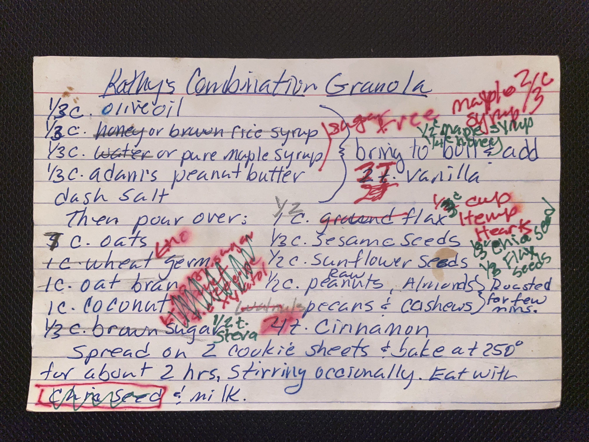

**Wet Ingredients:**
- 1/3 c. olive oil, 1/3 c. honey or brown rice syrup, 1/3 c. water or pure maple syrup, 1/3 c. Adam's peanut butter, dash salt — bring to boil & add 2 T. vanilla

**Dry Ingredients:**
- 3 c. oats, 1 c. wheat germ **[uncertain]**, 1 c. oat bran **[uncertain]**, 1 c. coconut, 1/2 c. brown sugar **[uncertain]**, 1/2 c. ground flax, 1/2 c. sesame seeds, 1/2 c. sunflower seeds, 1/2 c. peanuts/almonds/pecans/cashews, 4 t. cinnamon

**Instructions:**
Pour wet over dry. Spread on 2 cookie sheets & bake at 250° for about 2 hrs, stirring occasionally.

*Note: Card has multiple annotations in different inks suggesting variations — 1 cup Hemp Hearts, 1/2 c. chia/flax seeds, etc.*

---

### Pumpkin Pancakes
*Source: IMG_9131*

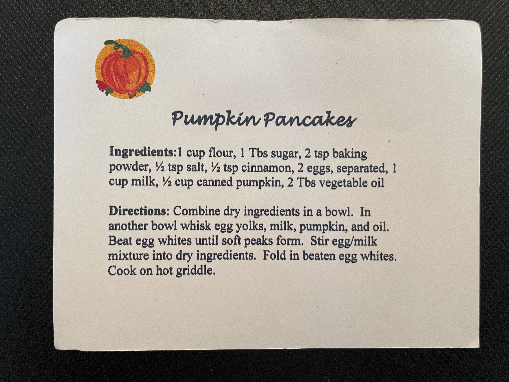

**Ingredients:**
- 1 cup flour, 1 Tbs. sugar, 2 tsp. baking powder, 1/2 tsp. salt, 1/2 tsp. cinnamon, 2 eggs (separated), 1 cup milk, 1/2 cup canned pumpkin, 2 Tbs. vegetable oil

**Instructions:**
Combine dry ingredients in a bowl. In another bowl whisk egg yolks, milk, pumpkin, and oil. Beat egg whites until soft peaks form. Stir egg/milk mixture into dry ingredients. Fold in beaten egg whites. Cook on hot griddle.

---

### Slow Cooker Steel Cut Oats
*Source: IMG_9133*

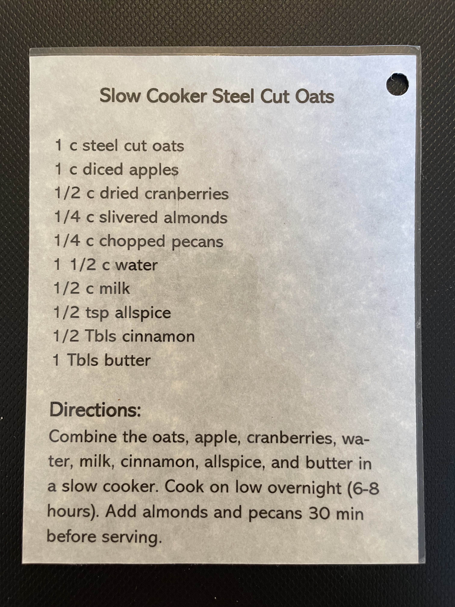

**Ingredients:**
- 1 c. steel cut oats, 1 c. diced apples, 1/2 c. dried cranberries, 1/4 c. slivered almonds, 1/4 c. chopped pecans, 1 1/2 c. water, 1/2 c. milk, 1/2 tsp. allspice, 1/2 Tbs. cinnamon, 1 Tbs. butter

**Instructions:**
Combine oats, apple, cranberries, water, milk, cinnamon, allspice, and butter in a slow cooker. Cook on low overnight (6–8 hours). Add almonds and pecans 30 min before serving.

---

### Whole Wheat Pancakes
*Source: IMG_9137 — Osterizer method*

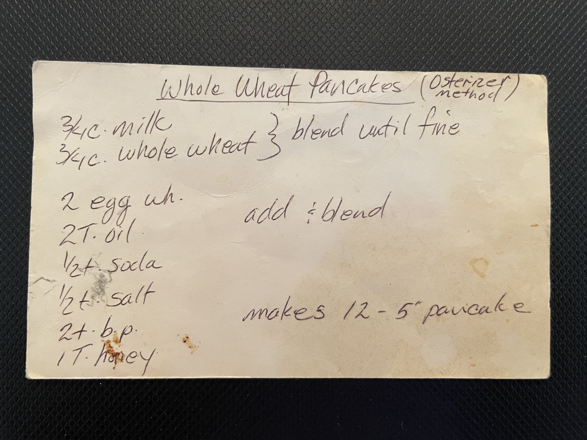

**Ingredients:**
- 3/4 c. milk, 3/4 c. whole wheat — blend until fine
- 2 egg whites, 2 T. oil, 1/2 t. soda, 1/2 t. salt, 2 t. baking powder, 1 T. honey — add & blend

**Instructions:**
Makes 12 five-inch pancakes **[uncertain]**.

---

## Soups & Stews

---

### Brattan's Boston Clam Chowder
*Source: IMG_9460 / IMG_9461 — Serves 8*

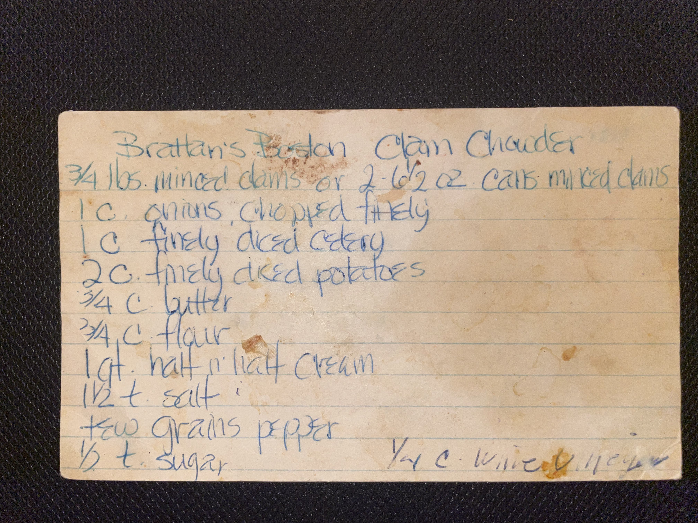

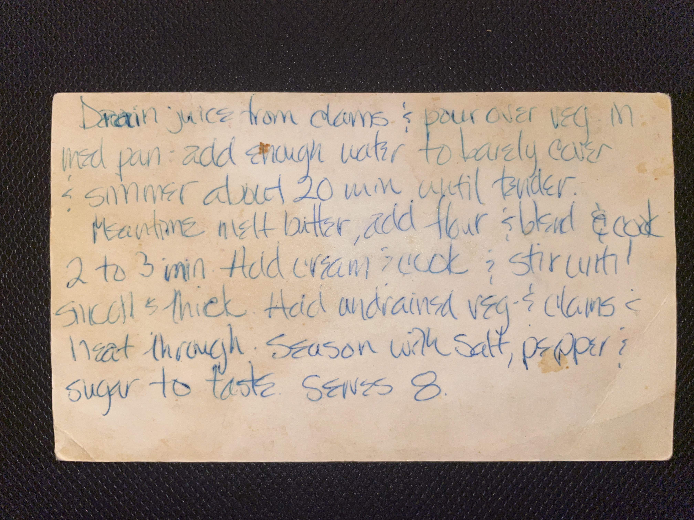

**Ingredients:**
- 3/4 lbs. minced clams (or 2 cans), 1 c. onions (finely chopped), 1 c. finely diced celery, 2 c. finely diced potatoes, 3/4 c. butter, 3/4 c. flour, 1 qt. half & half cream, 1 1/2 t. salt, few grains pepper, 1/3 t. sugar, 1/4 c. wine vinegar **[uncertain]**

**Instructions:**
Drain juice from clams & pour over vegetables in med. pan. Add enough water to barely cover & simmer about 20 min. until tender. Melt butter, add flour & blend & cook 2–3 min. Add cream & cook & stir until smooth & thick. Add undrained vegetables & clams & heat through. Season to taste.

---

### Cauliflower Soup
*Source: Carla (IMG_9533 / IMG_9534) — Serves 8*

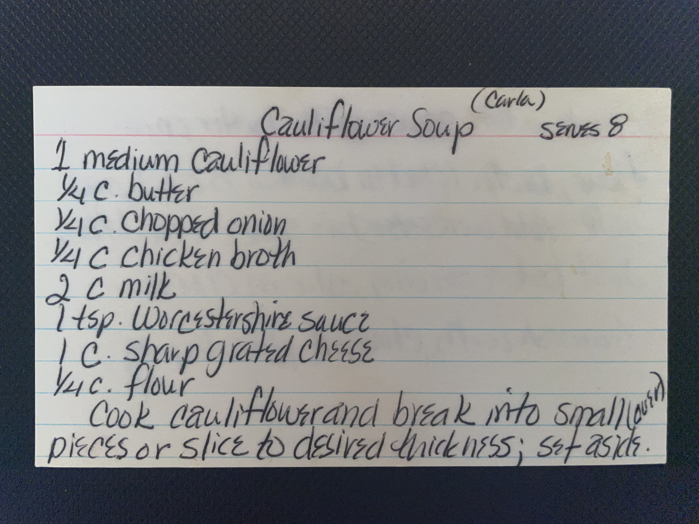

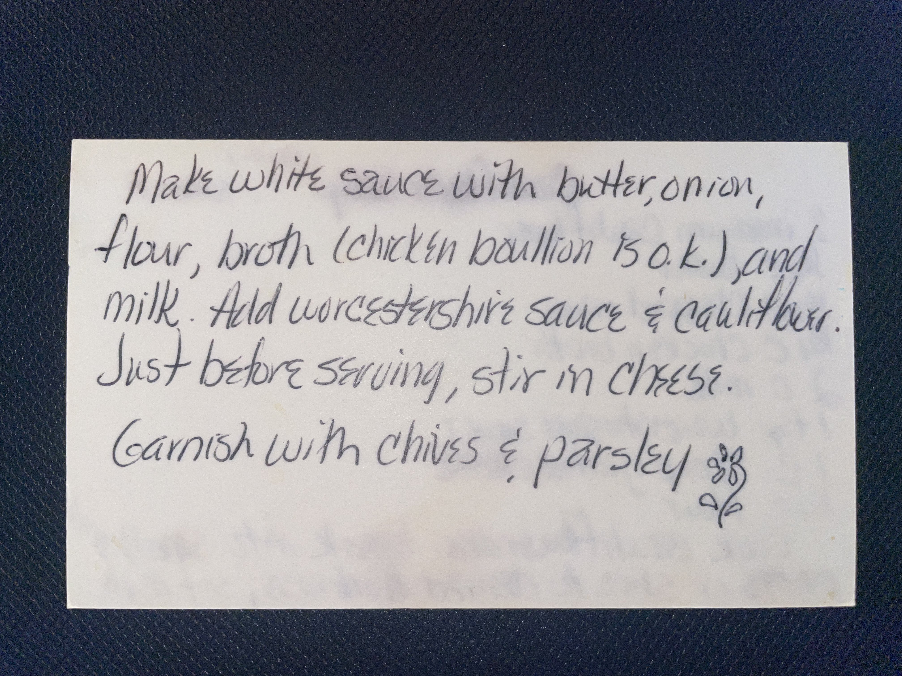

**Ingredients:**
- 1 medium cauliflower
- 1/4 c. butter
- 1/4 c. chopped onion
- 1/4 c. chicken broth **[uncertain — could be "4 c."]**
- 2 c. milk
- 1 tsp. Worcestershire sauce
- 1 c. sharp grated cheese
- 1/4 c. flour

**Instructions:**
Cook cauliflower and break into small pieces; set aside. Make white sauce with butter, onion, flour, broth, and milk. Add Worcestershire sauce & cauliflower. Just before serving, stir in cheese. Garnish with chives & parsley.

---

### Cheesy Broccoli Soup
*Source: IMG_9440*

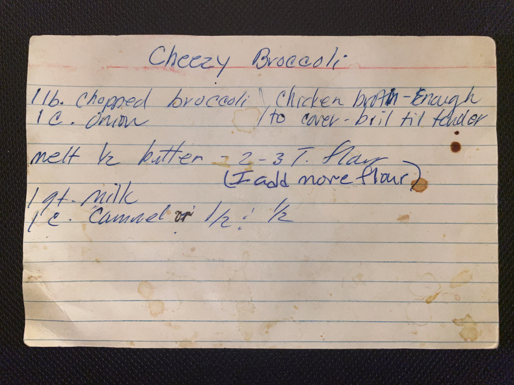

**Ingredients:**
- 1 lb. chopped broccoli
- 1 c. onion
- Chicken broth (enough to cover) — boil til tender
- 1/2 c. butter, 2–3 T. flour (make roux)
- 1 qt. milk
- 1 c. canned milk or half & half **[uncertain]**

---

### Chili
*Source: IMG_9199 — Serves 10*

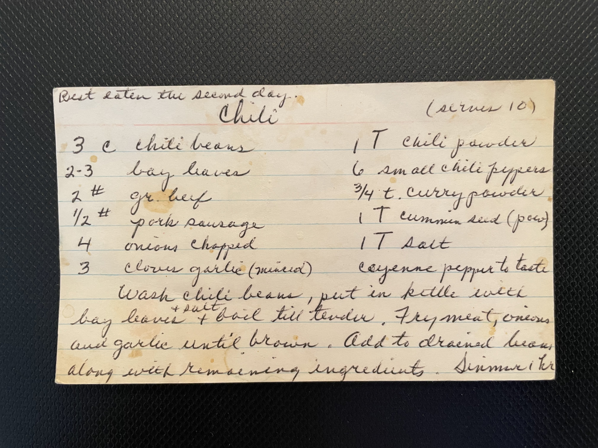

*Best eaten the second day.*

**Ingredients:**
- 3 c. chili beans, 1 T. chili powder, 2–3 bay leaves, 6 small chili peppers, 2 lbs. ground beef, 3/4 t. curry powder, 1/2 lb. pork sausage, 1 T. cumin seed (powdered) **[uncertain]**, 4 onions chopped, 1 T. salt, 3 cloves garlic minced, cayenne pepper to taste

**Instructions:**
Wash chili beans, put in kettle with bay leaves & boil till tender. Fry meat, onions and garlic until brown. Add to drained beans along with remaining ingredients. Simmer 1 hr.

---

### Chili's Chicken Enchilada Soup
*Source: IMG_9467 — 12 servings*

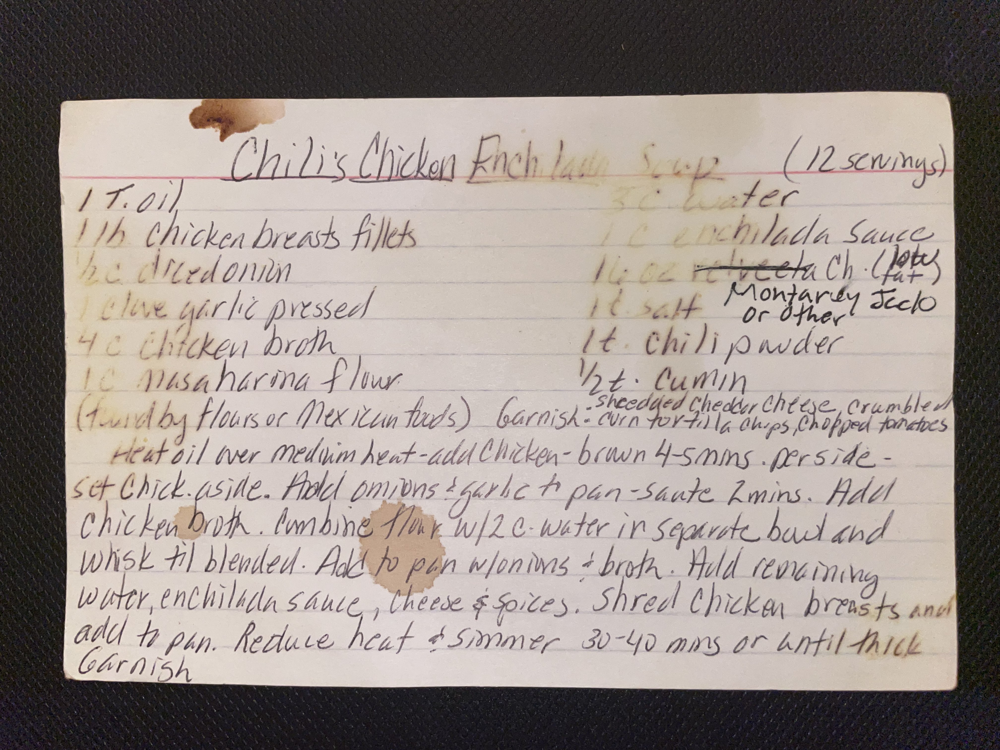

**Ingredients:**
- 1 T. oil, 1 lb. chicken breasts, 1/2 c. diced onion, 1 clove garlic, 4 c. chicken broth, 1 c. masa harina flour, 2 c. water **[uncertain]**, 1/2 c. enchilada sauce, 16 oz. Velveeta cheese, 1 t. salt, 1 t. chili powder, 1/2 t. cumin

**Instructions:**
Heat oil, brown chicken 4–5 mins per side, set aside. Saute onions & garlic 2 mins. Add broth. Combine flour with water, whisk til blended, add to pan. Add remaining water, enchilada sauce, cheese & spices. Shred chicken and add. Reduce heat & simmer 30–40 mins or until thick. Garnish with cheddar cheese, crumbled corn tortilla chips, chopped tomatoes.

---

### Clam Chowder (Marsha)
*Source: IMG_9441*

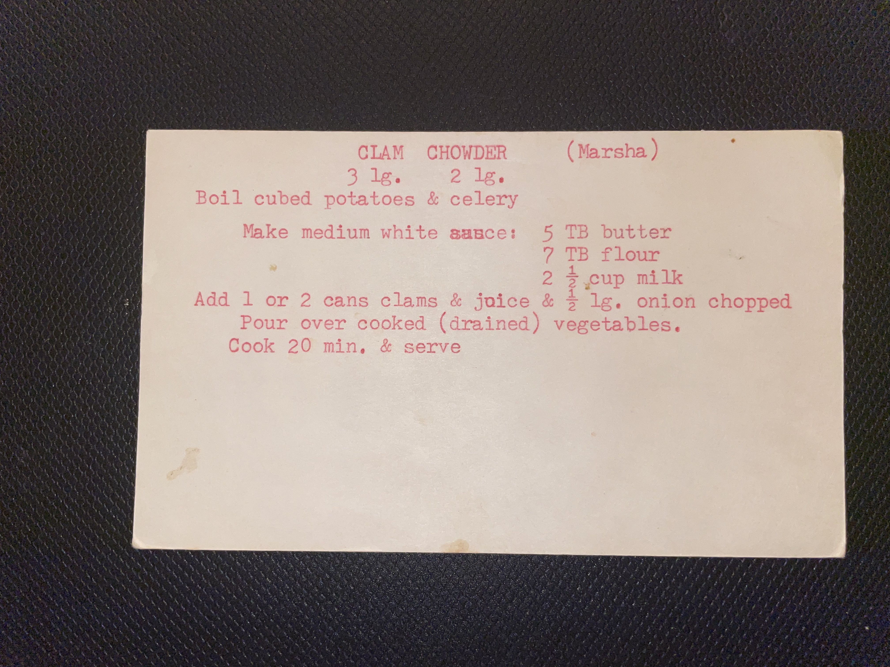

**Ingredients:**
- 3 large potatoes, 2 large celery stalks (boil cubed)
- White sauce: 5 T. butter, 7 T. flour, 2 1/2 cups milk
- 1–2 cans clams & juice, 1/2 large onion chopped

**Instructions:**
Make white sauce. Add clams, juice, and onion. Pour over cooked (drained) vegetables. Cook 20 min. and serve.

---

### Cream of Zucchini Soup, Andelin Style
*Source: IMG_9455 — Serves 6–8*

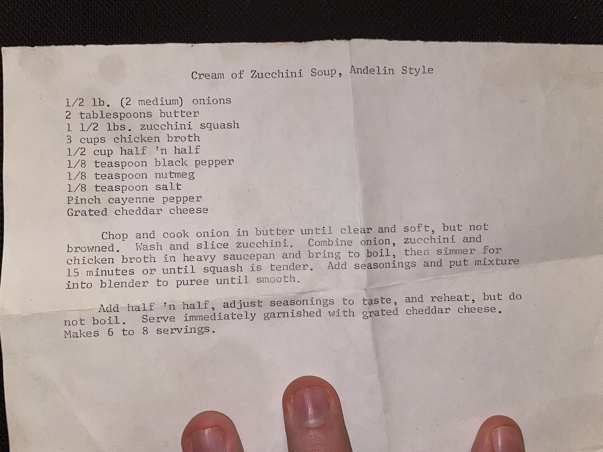

**Ingredients:**
- 1/2 lb. (2 medium) onions, 2 T. butter, 1 1/2 lbs. zucchini, 3 cups chicken broth, 1/2 cup half & half, 1/8 tsp. each: black pepper, nutmeg, salt, pinch cayenne pepper, grated cheddar cheese

**Instructions:**
Chop and cook onion in butter until clear and soft. Combine onion, sliced zucchini, and chicken broth; bring to boil, then simmer 15 minutes. Add seasonings and puree in blender until smooth. Add half & half, reheat (do not boil). Garnish with grated cheddar cheese.

---

### Creamy Tomato Soup
*Source: IMG_9545 (cookbook page 96) — Serves 4–6, Vegetarian*

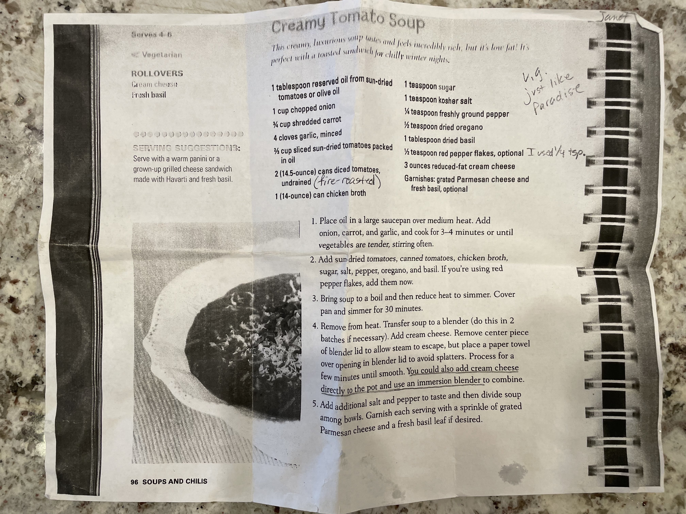

**Ingredients:**
- 1 tablespoon reserved oil from sun-dried tomatoes or olive oil
- 1 cup chopped onion, 1/2 cup shredded carrot, 4 cloves garlic minced
- 1/2 cup sliced sun-dried tomatoes packed in oil
- 1 (14.5-ounce) can diced fire-roasted tomatoes, undrained
- 1 (14-ounce) can chicken broth
- 1 teaspoon sugar, 1 teaspoon kosher salt, 1/2 teaspoon black pepper, 1/2 teaspoon dried oregano, 1 tablespoon dried basil
- 1 teaspoon red pepper flakes *(handwritten note: "1 not 1/4 tsp.")*
- 3 ounces reduced-fat cream cheese

**Instructions:**
1. Saute onion, carrot, and garlic in oil for 3–4 minutes.
2. Add tomatoes, broth, and seasonings. Bring to boil, simmer 30 minutes.
3. Transfer to blender with cream cheese, process until smooth. *(Or use immersion blender — underlined in original.)*
4. Add salt and pepper to taste. Garnish with Parmesan and fresh basil.

*Serve with a warm panini or grown-up grilled cheese made with Havarti and fresh basil.*

---

### Delicious Chicken Chowder
*Source: IMG_9462 / IMG_9463*

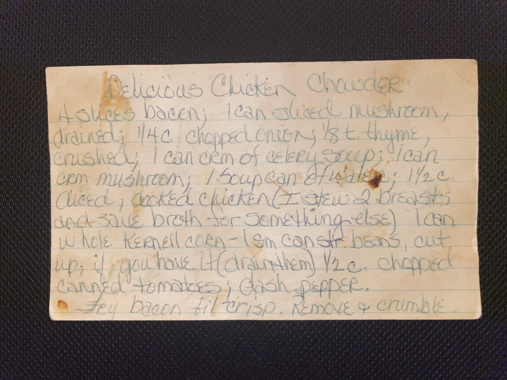

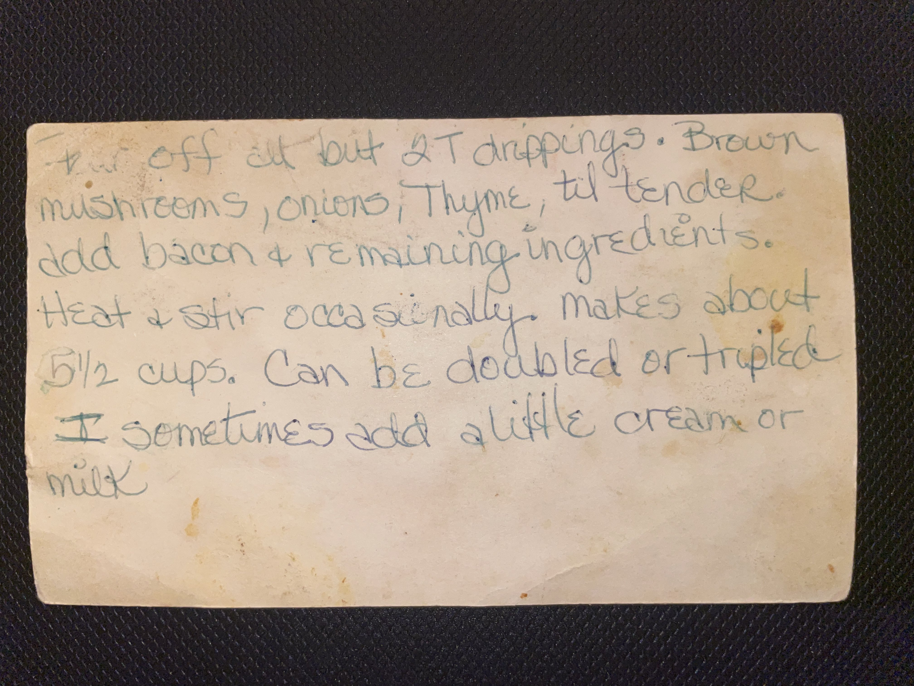

**Ingredients:**
- 4 slices bacon, 1 can sliced mushrooms (drained), 1/4 c. chopped onion, 1/8 t. thyme, 1 can cream of celery soup, 1 can cream of mushroom soup, 1 soup can of milk **[uncertain]**, 1 1/2 c. diced cooked chicken, 1 can whole kernel corn, 1 sm. can green beans (drained), 1/2 c. chopped canned tomatoes, dash pepper

**Instructions:**
Fry bacon til crisp, remove & crumble. Pour off all but 2 T. drippings. Brown mushrooms, onions, thyme til tender. Add bacon & remaining ingredients. Heat & stir occasionally. Makes about 5 1/2 cups.

---

### Fire-Roasted Tomato Soup
*Source: IMG_9469 — Serves 6–8*

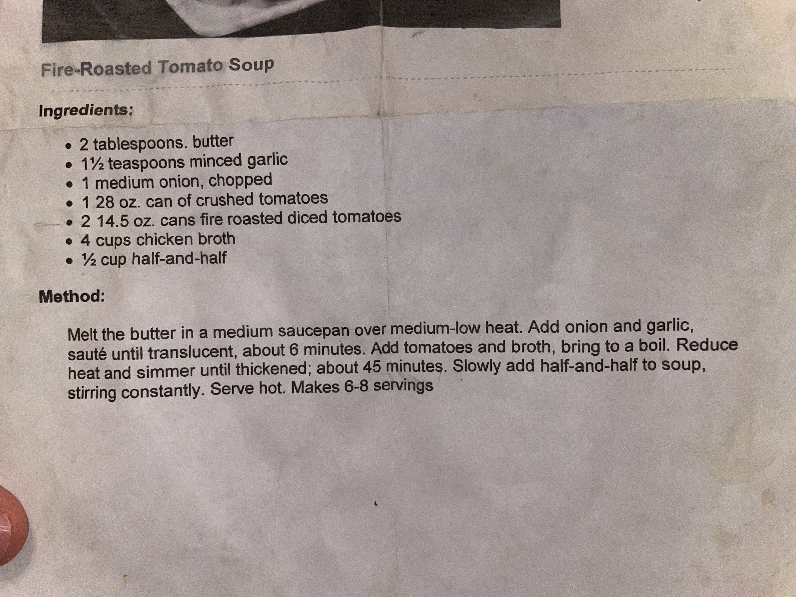

**Ingredients:**
- 2 T. butter, 1 1/2 tsp. minced garlic, 1 medium onion chopped, 1 (28 oz.) can crushed tomatoes, 2 (14.5 oz.) cans fire roasted diced tomatoes, 4 cups chicken broth, 1/2 cup half-and-half

**Instructions:**
Melt butter, saute onion and garlic until translucent (about 6 minutes). Add tomatoes and broth, bring to a boil. Reduce heat and simmer until thickened (about 45 minutes). Slowly add half-and-half, stirring constantly.

---

### French Onion Soup
*Source: Kathy (IMG_9456 / IMG_9457) — 4 servings*

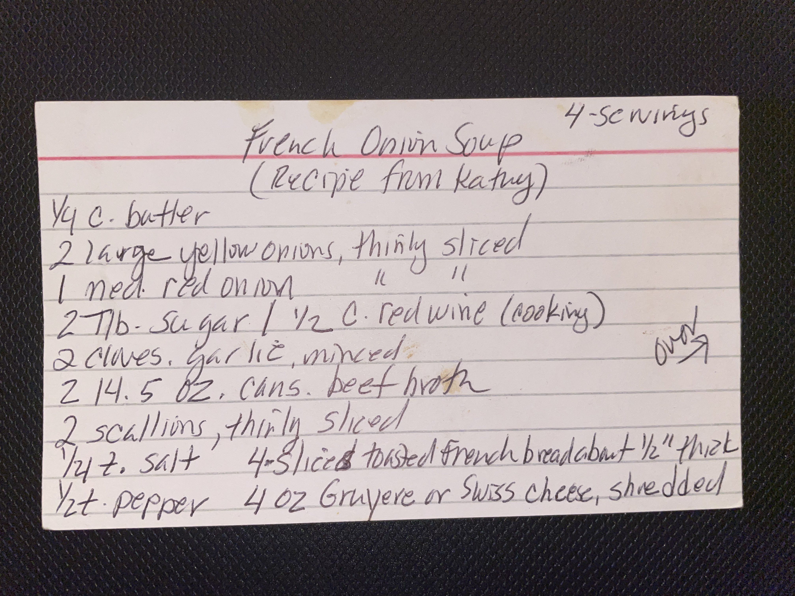

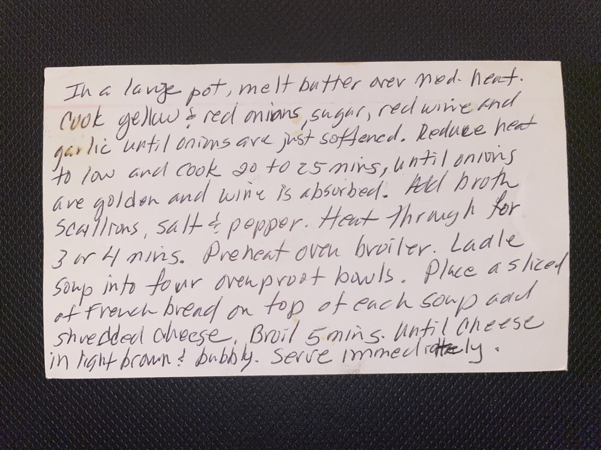

**Ingredients:**
- 1/4 c. butter, 2 large yellow onions (thinly sliced), 1 med. red onion (thinly sliced), 2 T. sugar, 1/2 c. red wine (cooking), 2 cloves garlic minced, 2 (14.5 oz.) cans beef broth, 2 scallions (thinly sliced), 1/4 t. salt, 1/2 t. pepper, 4 slices toasted French bread, 4 oz. Gruyere or Swiss cheese

**Instructions:**
Melt butter. Cook onions, sugar, wine and garlic until softened. Reduce heat, cook 20–25 mins until golden. Add broth, scallions, salt & pepper. Heat 3–4 mins. Ladle into ovenproof bowls. Top with bread and cheese. Broil 5 mins until bubbly.

---

### Green Pea Soup
*Source: IMG_9465*

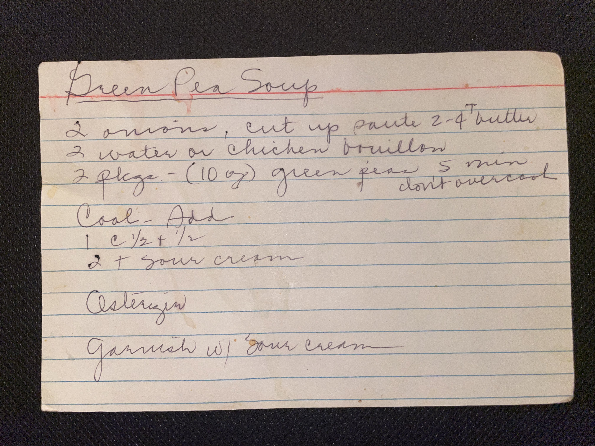

**Ingredients:**
- 2 onions, cut up, 2–4 T. butter
- 2 c. water or chicken bouillon
- 2 pkg. (10 oz.) green peas — cook 5 min, don't overcook

**Instructions:**
Cool. Add 1 c. half & half **[uncertain]**, 2 t. sour cream. Blend in blender. Garnish with sour cream.

---

### Market Street Clam Chowder
*Source: IMG_9458 / IMG_9459 — Serves 12*

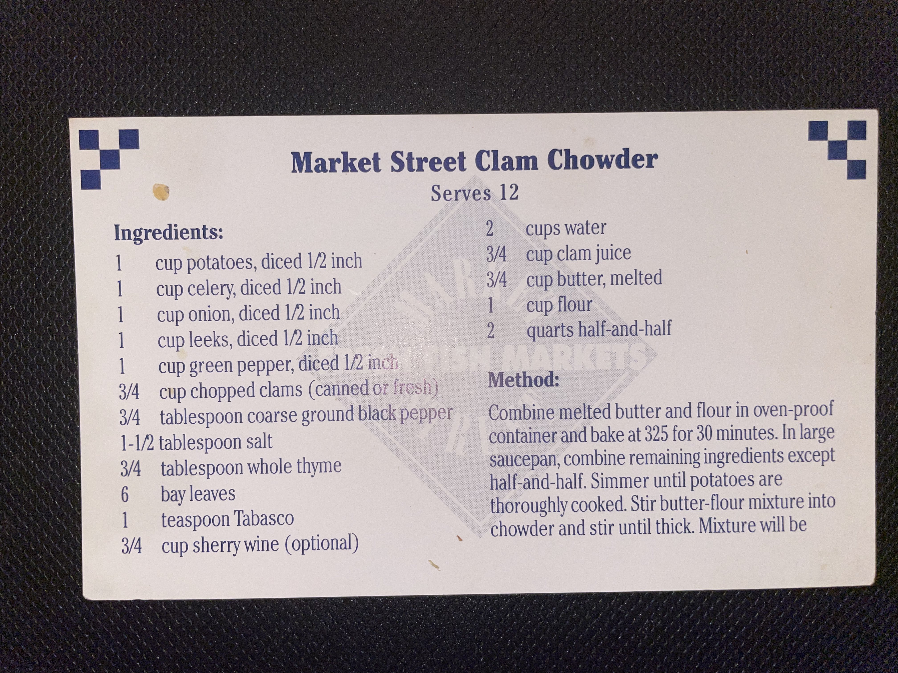

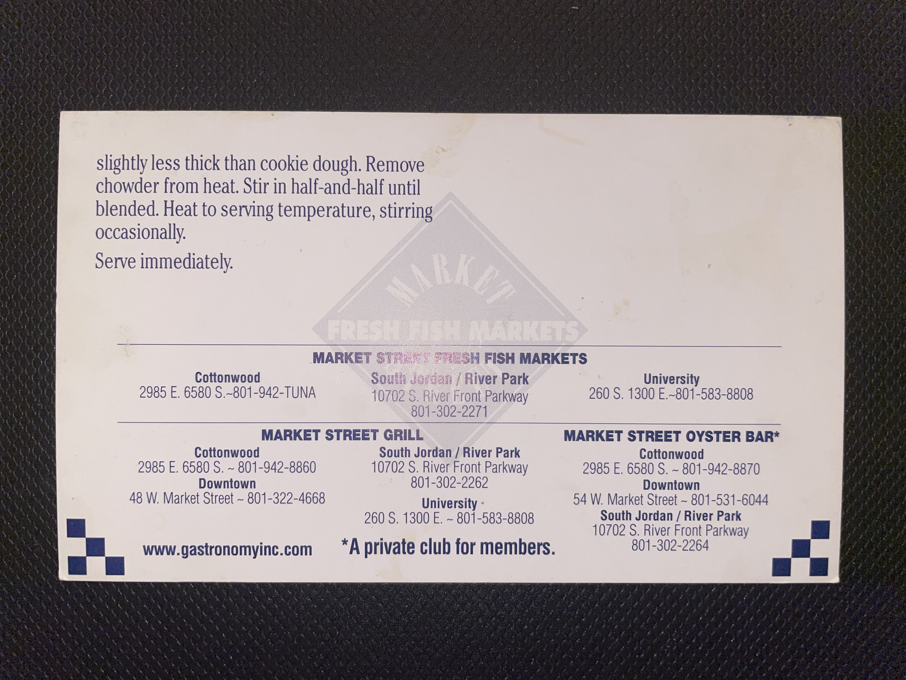

**Ingredients:**
- 1 cup each: potatoes, celery, onion, leeks, green pepper (all diced 1/2 inch)
- 3/4 cup chopped clams, 3/4 T. coarse ground pepper, 1 1/2 T. salt, 3/4 T. whole thyme, 6 bay leaves, 1 tsp. Tabasco, 3/4 cup sherry (optional), 2 cups water, 3/4 cup clam juice, 3/4 cup melted butter, 1 cup flour, 2 quarts half-and-half

**Instructions:**
Combine melted butter and flour; bake at 325° for 30 minutes. Combine remaining ingredients (except half-and-half) and simmer until potatoes are cooked. Stir butter-flour mixture in until thick. Remove from heat. Stir in half-and-half. Heat to serving temperature.

---

### Minestrone Soup
*Source: Mase **[uncertain]** (IMG_9468)*

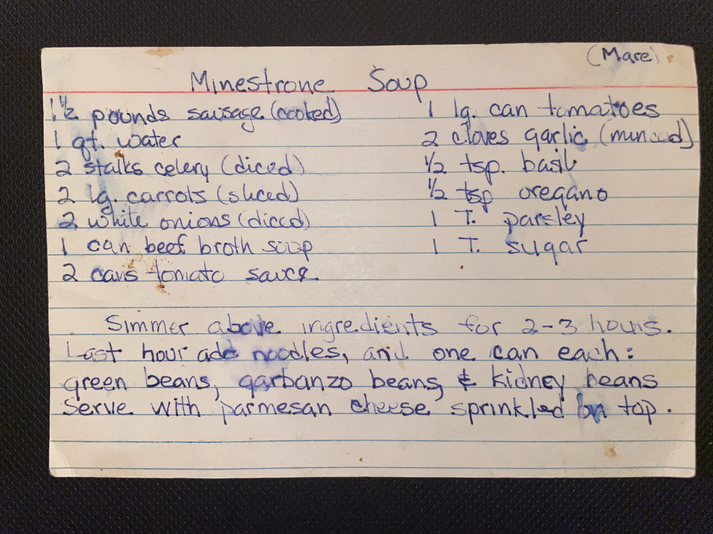

**Ingredients:**
- 1 1/2 lbs. sausage (cooked), 1 qt. water, 2 stalks celery, 2 large carrots, 2 white onions, 1 can beef broth, 2 cans tomato sauce, 1 large can tomatoes, 2 cloves garlic, 1/2 tsp. basil, 1/2 tsp. oregano, 1 T. parsley, 1 T. sugar

**Instructions:**
Simmer above ingredients for 2–3 hours. Last hour add noodles and one can each: green beans, garbanzo beans, and kidney beans. Serve with Parmesan cheese.

---

### Potato Soup
*Source: IMG_9535 — Serves 18*

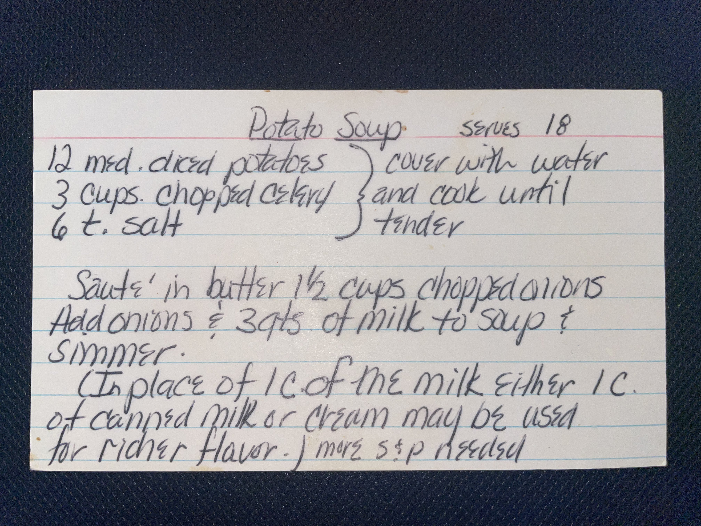

**Ingredients:**
- 12 med. diced potatoes, 3 cups chopped celery, 6 t. salt, 1 1/2 cups chopped onions, butter (for sauteing), 3 qts. milk

**Instructions:**
Cover potatoes and celery with water and cook until tender. Saute onions in butter. Add onions & 3 qts of milk to soup & simmer. (In place of 1 c. of the milk, either 1 c. canned milk or cream may be used for richer flavor.) More salt & pepper as needed **[uncertain]**.

---

### Taco Soup
*Source: Janet Spilker (IMG_9546; also IMG_9439, IMG_9453)*

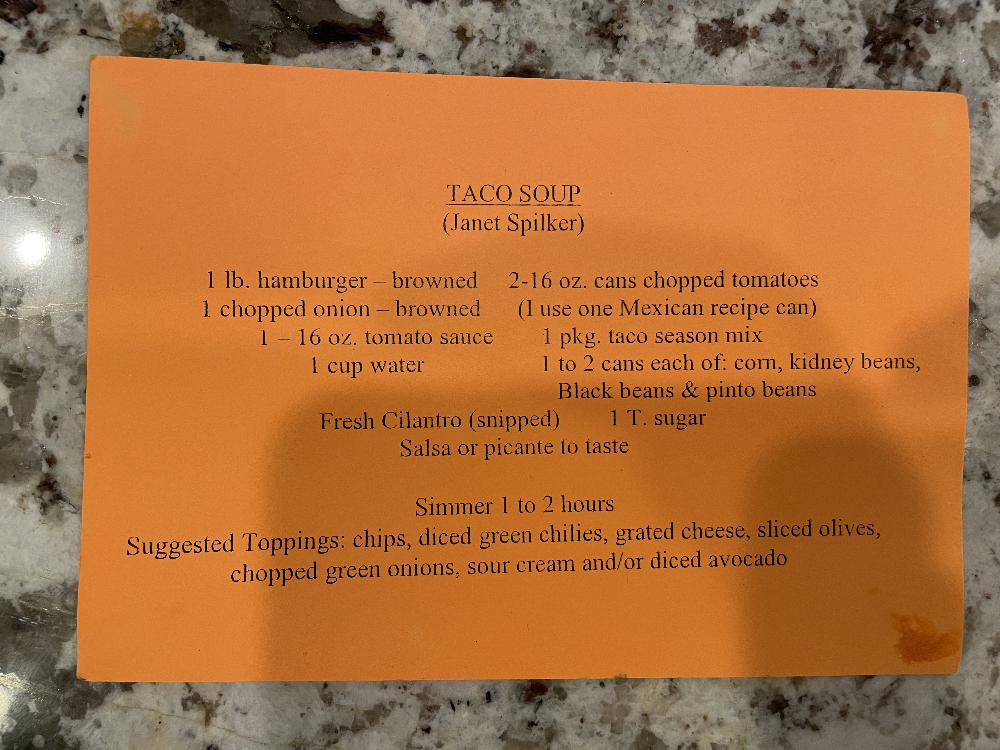

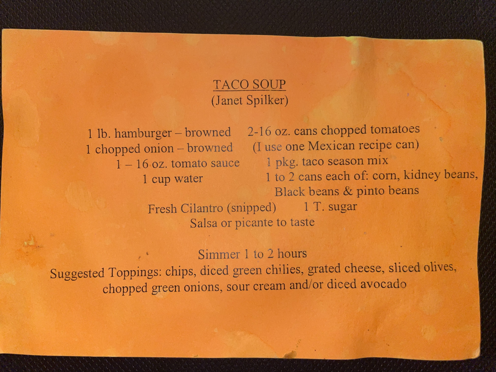

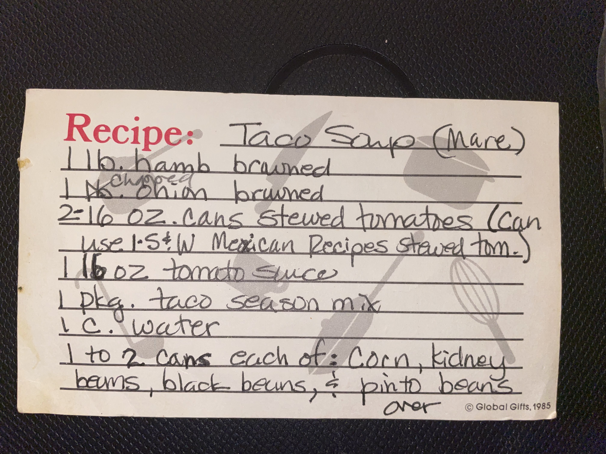

**Ingredients:**
- 1 lb. hamburger, browned
- 1 chopped onion, browned
- 1 (16 oz.) tomato sauce
- 1 cup water
- 2 (16 oz.) cans chopped tomatoes (can use one Mexican recipe can)
- 1 pkg. taco seasoning mix
- 1 to 2 cans each of: corn, kidney beans, black beans & pinto beans
- Fresh cilantro, snipped
- 1 T. sugar
- Salsa or picante to taste

**Instructions:**
Combine all ingredients and simmer 1 to 2 hours.

**Suggested Toppings:** chips, diced green chilies, grated cheese, sliced olives, chopped green onions, sour cream and/or diced avocado.

---

### Wendy's Chili
*Source: IMG_9442 — Serves 20 **[uncertain]***

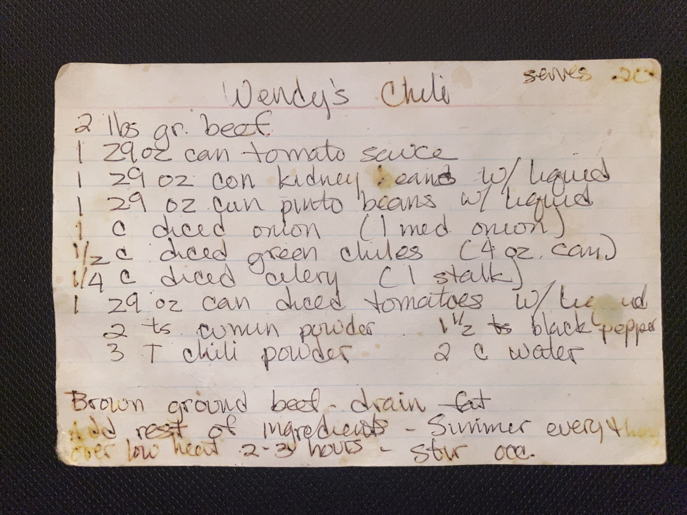

**Ingredients:**
- 2 lbs. ground beef, 1 (29 oz.) can tomato sauce, 1 (29 oz.) can kidney beans with liquid, 1 (29 oz.) can pinto beans with liquid, 1 c. diced onion, 1/2 c. diced green chiles, 1/4 c. diced celery, 1 (29 oz.) can diced tomatoes with liquid, 2 t. cumin, 1 1/2 t. black pepper, 3 T. chili powder, 2 c. water

**Instructions:**
Brown ground beef, drain fat. Add rest of ingredients. Simmer over low heat 2–3 hours, stirring occasionally.

---

### Zucchini Soup
*Source: IMG_9466*

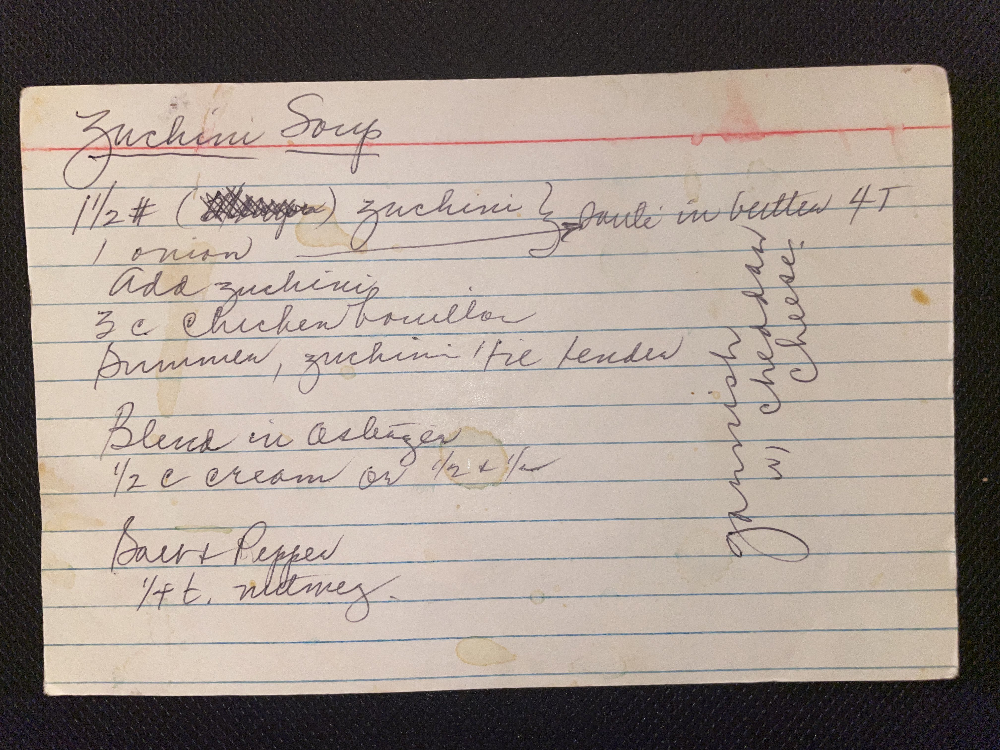

**Ingredients:**
- 1 1/2 lbs. zucchini, 1 onion, 4 T. butter (saute)
- 3 c. chicken bouillon — simmer til tender
- 1/2 c. cream or half & half
- Salt, pepper, 1/4 t. nutmeg

**Instructions:**
Blend in blender. Garnish with cheddar cheese **[uncertain]**.

---

## Salads & Sides

---

### Amy's Salad Dressing
*Source: Amy Poulton (IMG_9396)*

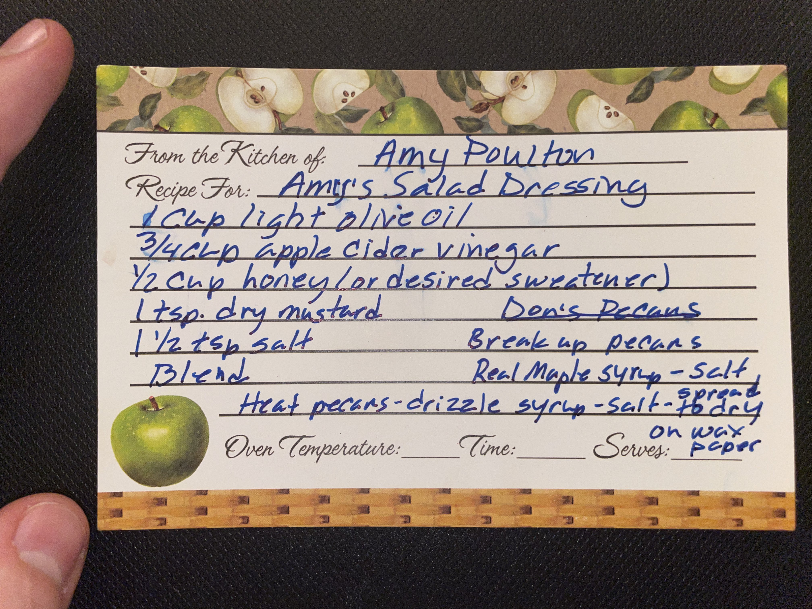

**Ingredients:**
- 1 cup light olive oil, 3/4 cup apple cider vinegar, 1/2 cup honey (or desired sweetener), 1 tsp. dry mustard, 1 1/2 tsp. salt

**Instructions:**
Blend.

---

### Asparagus Casserole
*Source: LaRue Duke (IMG_9528)*

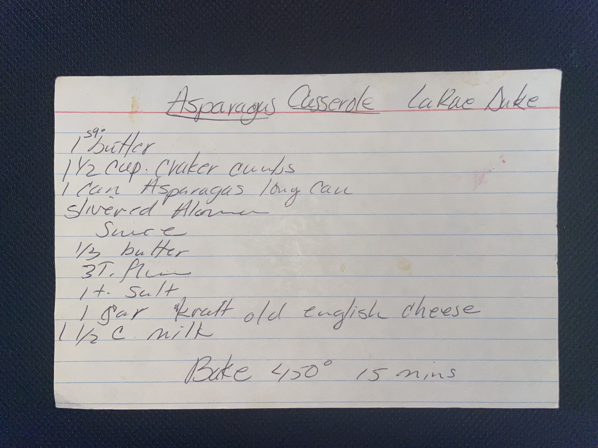

**Ingredients:**
- 3/4 c. **[uncertain]** butter, 1 1/2 cup cracker crumbs, 1 can asparagus (long cut) **[uncertain]**, slivered almonds

**Sauce:** 1/3 c. butter, 3 T. flour **[uncertain]**, 1 t. salt, 1 jar Kraft Old English Cheese, 1 1/2 c. milk

**Instructions:**
Bake at 450° for 15 mins.

---

### Baked Onions With Cheese
*Source: IMG_9422*

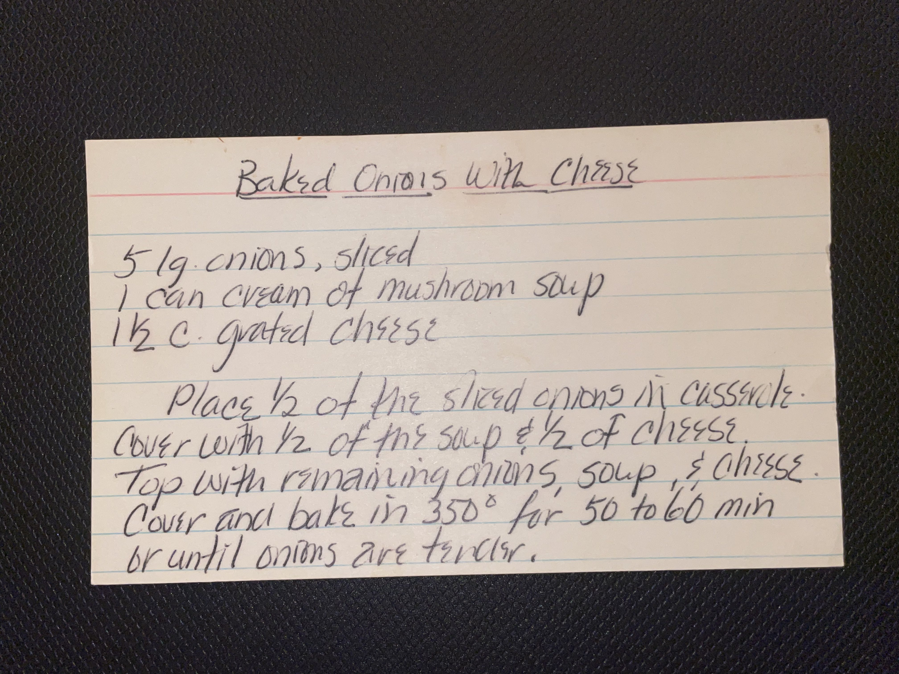

**Ingredients:**
- 5 large onions, sliced
- 1 can cream of mushroom soup
- 1 1/2 c. grated cheese

**Instructions:**
Place 1/2 onions in casserole. Cover with 1/2 soup & 1/2 cheese. Top with remaining onions, soup, & cheese. Cover and bake at 350° for 50–60 min or until onions are tender.

---

### Barbeque Ranch Chicken Salad
*Source: Cheesecake Factory (IMG_9397)*

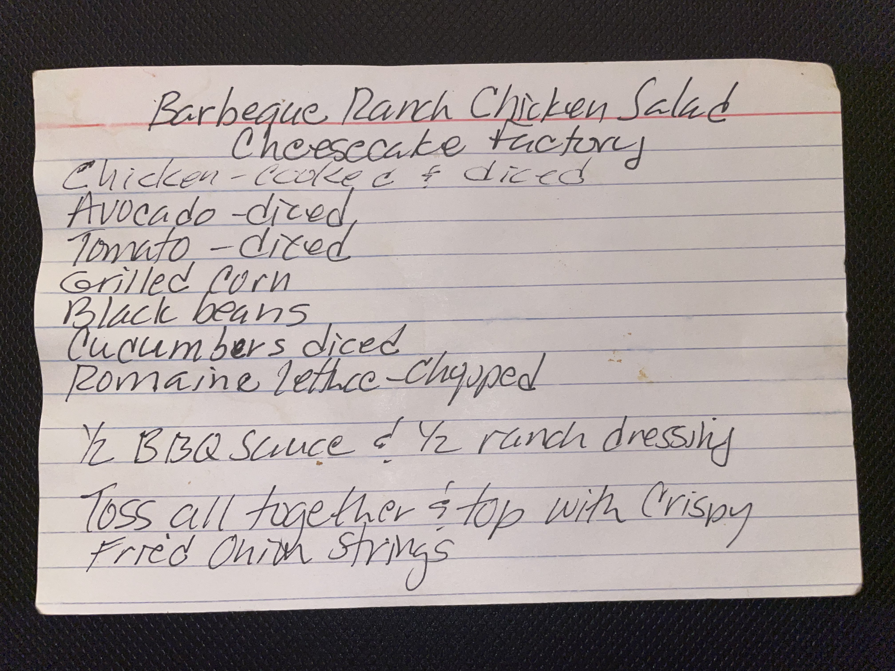

**Ingredients:**
- Chicken (cooked & diced), avocado, tomato, grilled corn, black beans, cucumbers (diced), romaine lettuce (chopped)
- 1/2 BBQ sauce & 1/2 ranch dressing

**Instructions:**
Toss all together and top with crispy fried onion strings.

---

### Broccoli Salad
*Source: Marjory Elgan / Joyce (IMG_9382)*

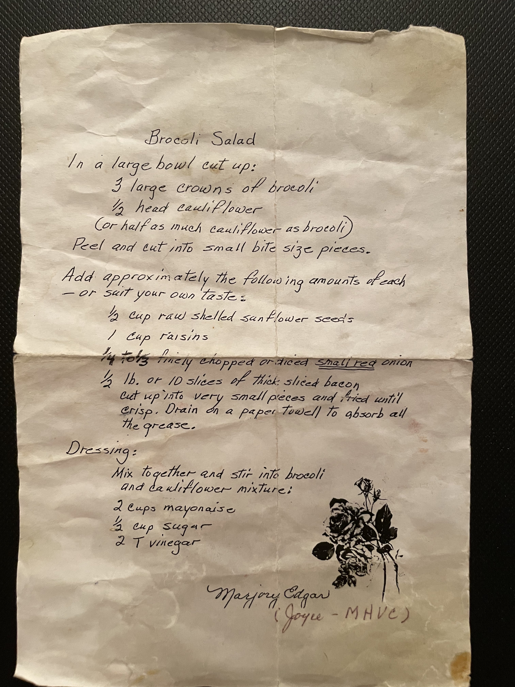

**Ingredients:**
- 3 large crowns broccoli, 1/3 head cauliflower (cut into bite-size pieces)
- 1/3 cup raw sunflower seeds, 1 cup raisins, 1/4 of a small red onion **[uncertain]**, 1/2 lb. bacon (fried crisp, crumbled)

**Dressing:** 2 cups mayonnaise, 1/2 cup sugar, 2 T. vinegar. Mix together and stir into broccoli mixture.

---

### Buttermilk Dressing
*Source: IMG_9389*

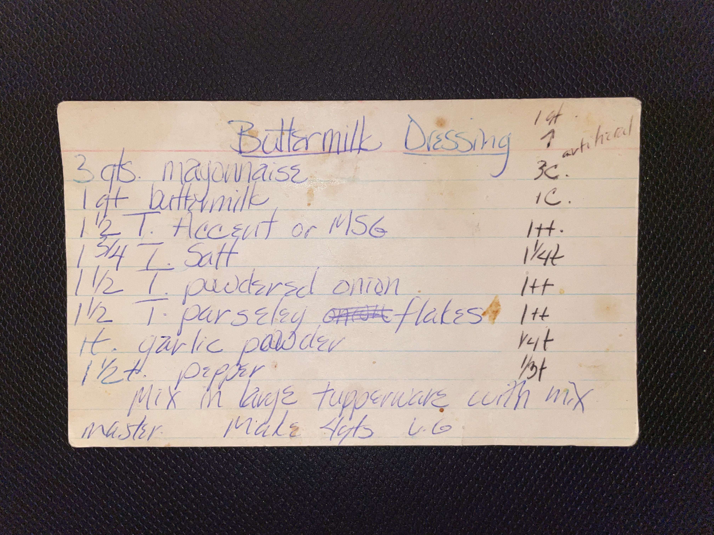

**Large batch:** 3 qts. mayonnaise, 1 qt. buttermilk, 1 1/2 T. Accent/MSG, 1 3/4 T. salt, 1 1/2 T. powdered onion, 1 1/2 T. parsley flakes, 1 t. garlic powder, 1 1/4 t. pepper **[uncertain]**

**Instructions:** Mix in large container with mixer. Makes about 4 qts.

---

### Cafe Rio Dressing
*Source: Kathy's (IMG_9264)*

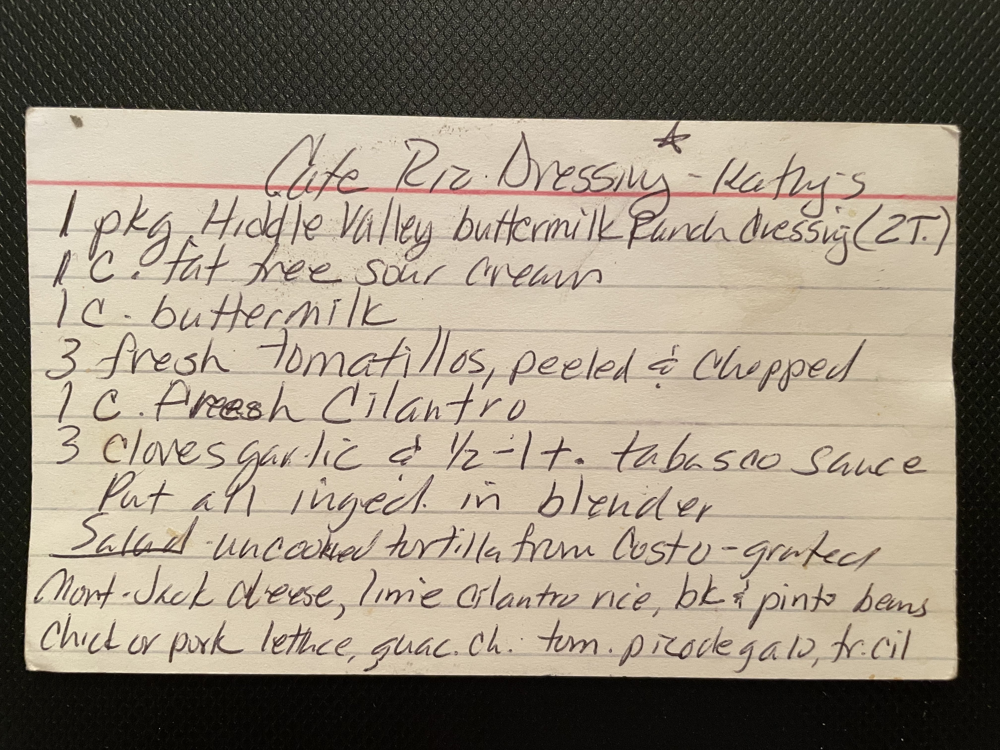

**Ingredients:**
- 1 pkg. Hidden Valley Buttermilk Ranch Dressing (2 T.)
- 1 c. fat free sour cream, 1 c. buttermilk
- 3 fresh tomatillos (peeled & chopped), 1 c. fresh cilantro
- 3 cloves garlic, 1/2–1 t. Tabasco sauce

**Instructions:**
Put all ingredients in blender.

---

### Candied Pecans
*Source: IMG_9401*

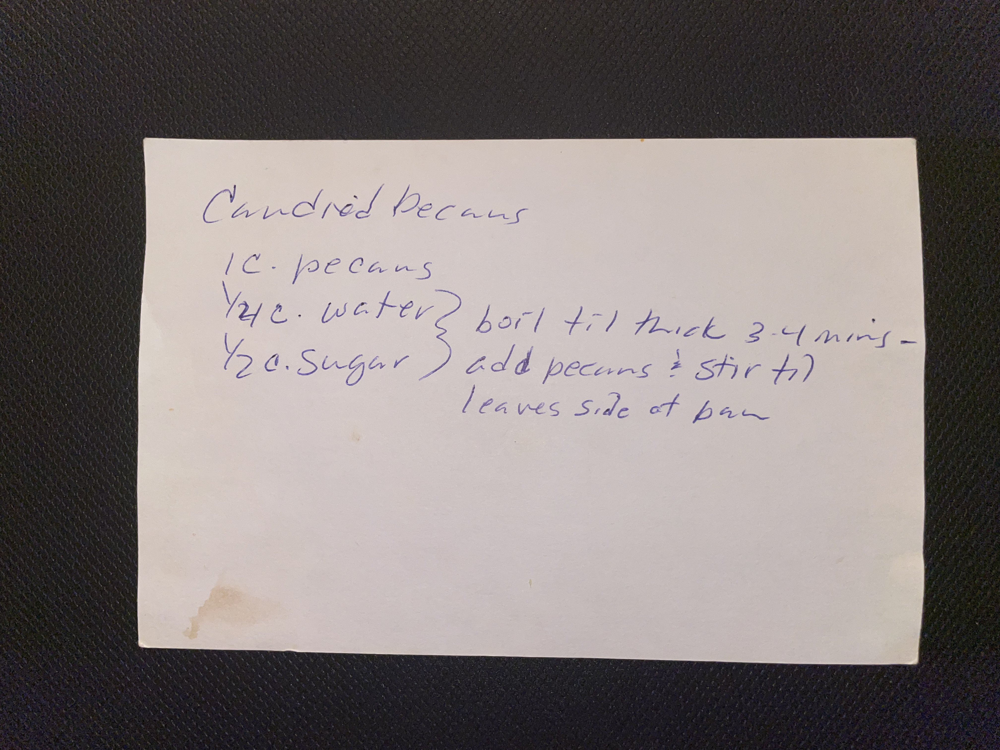

**Ingredients:**
- 1 c. pecans
- 1/4 c. water, 1/2 c. sugar

**Instructions:**
Boil water and sugar til thick (3–4 mins). Add pecans & stir til leaves side of pan.

---

### Chicken Pasta Salad
*Source: IMG_9403 — Serves 12–15*

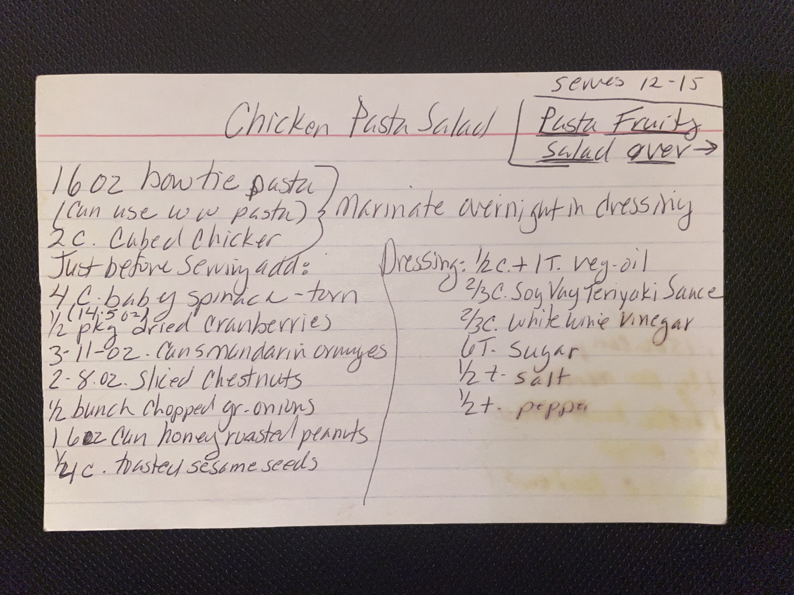

**Ingredients:**
- 16 oz. bow tie pasta, 2 c. cubed chicken (marinate overnight in dressing)
- Before serving add: 4 c. baby spinach (torn), 1/2 pkg. dried cranberries, 3 (11 oz.) cans mandarin oranges, 2 (8 oz.) cans sliced water chestnuts, 1/2 bunch green onions, 1 (6 oz.) can honey roasted peanuts, 1/4 c. toasted sesame seeds

**Dressing:** 1/2 c. + 1 T. vegetable oil, 2/3 c. Soy Vay Teriyaki Sauce **[uncertain]**, 2/3 c. white wine vinegar, 6 T. sugar, 1/2 t. salt, 1/2 t. pepper

---

### Chicken Salad
*Source: IMG_9398*

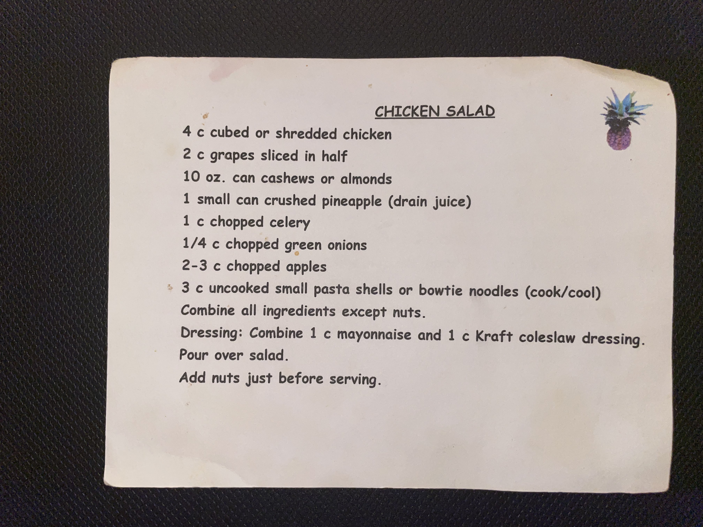

**Ingredients:**
- 4 c. cubed or shredded chicken, 2 c. grapes (sliced), 10 oz. can cashews or almonds, 1 small can crushed pineapple (drained), 1 c. chopped celery, 1/4 c. chopped green onions, 2–3 c. chopped apples, 3 c. small pasta shells or bowtie noodles (cook/cool)

**Dressing:** 1 c. mayonnaise and 1 c. Kraft coleslaw dressing. Add nuts just before serving.

---

### Chicken Salad — Janet
*Source: Janet — Clint's Wedding Brunch 1998 (IMG_9377)*

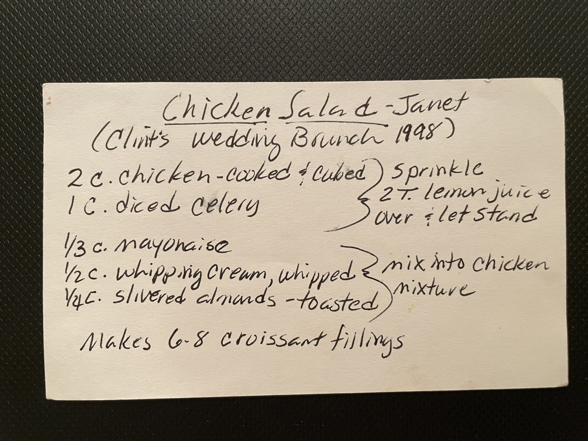

**Ingredients:**
- 2 c. chicken (cooked & cubed), 1 c. diced celery — sprinkle 2 T. lemon juice over & let stand
- 1/3 c. mayonnaise, 1/2 c. whipping cream (whipped), 1/4 c. slivered almonds (toasted) — mix into chicken

Makes 6–8 croissant fillings.

---

### Chinese Chicken Salad
*Source: IMG_9384 / IMG_9385*

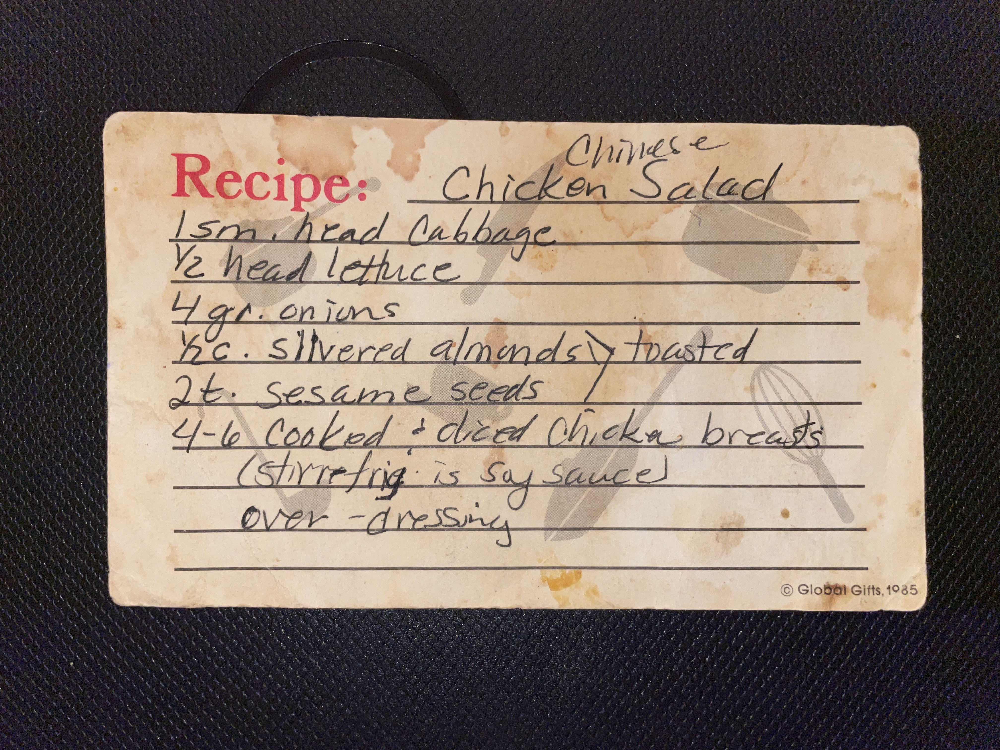

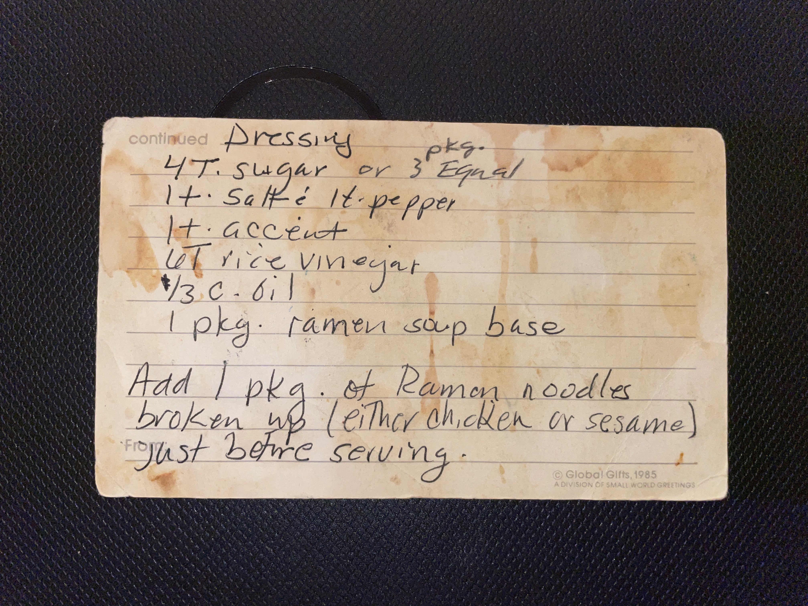

**Salad:** 1 sm. head cabbage, 1/2 head lettuce, 4 green onions, 1/2 c. slivered almonds (toasted), 2 t. sesame seeds, 4–6 cooked & diced chicken breasts

**Dressing:** 4 T. sugar (or 3 pkg. Equal), 1 t. salt, 1 t. pepper, 1 t. Accent, 4 T. rice vinegar **[uncertain]**, 1/3 c. oil, 1 pkg. ramen soup base. Add 1 pkg. ramen noodles (broken up) just before serving.

---

### Claire's Chicken Salad
*Source: IMG_9380 / IMG_9381*

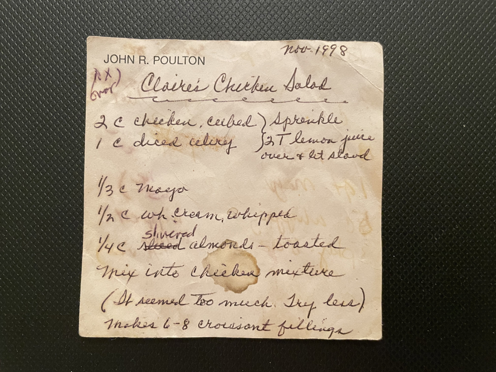

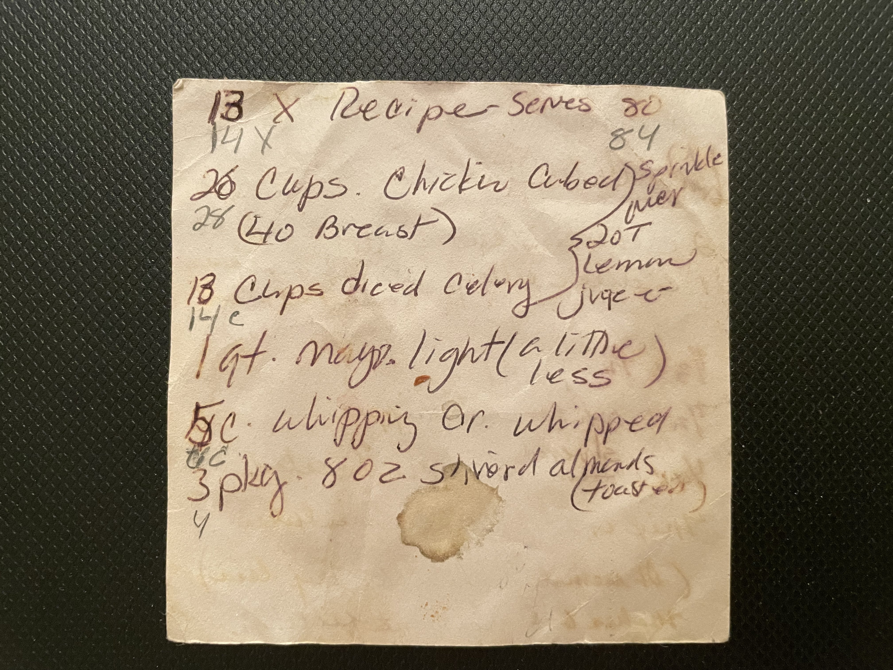

**Ingredients:**
- 2 c. chicken (cubed), 1 c. diced celery — sprinkle 3 T. lemon juice over & let stand
- 1/3 c. mayo, 1/2 c. whipping cream (whipped), 1/4 c. slivered almonds (toasted) — mix into chicken

Makes 6–8 croissant fillings. *(It seemed too much. Try less.)*

---

### Delicious Crunch-Top Salad
*Source: IMG_9393 — Serves 15 **[uncertain]***

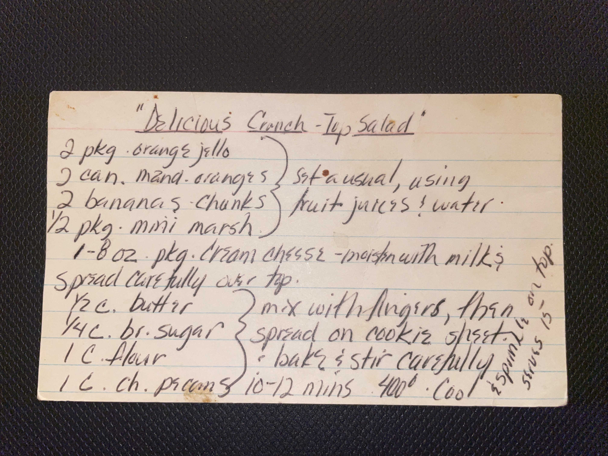

**Base:** 2 pkg. orange jello, 2 cans mandarin oranges, 2 bananas (chunks), 1/2 pkg. mini marshmallows — set as usual using fruit juices & water.

**Middle:** 1 (8 oz.) pkg. cream cheese — mash with milk, spread carefully over top.

**Topping:** 1/2 c. butter, 1/4 c. brown sugar, 1 c. flour, 1 c. chopped pecans — mix with fingers, spread on cookie sheet, bake & stir 10–12 mins at 400°. Cool, then sprinkle on top.

---

### Dixie Salad
*Source: IMG_9394*

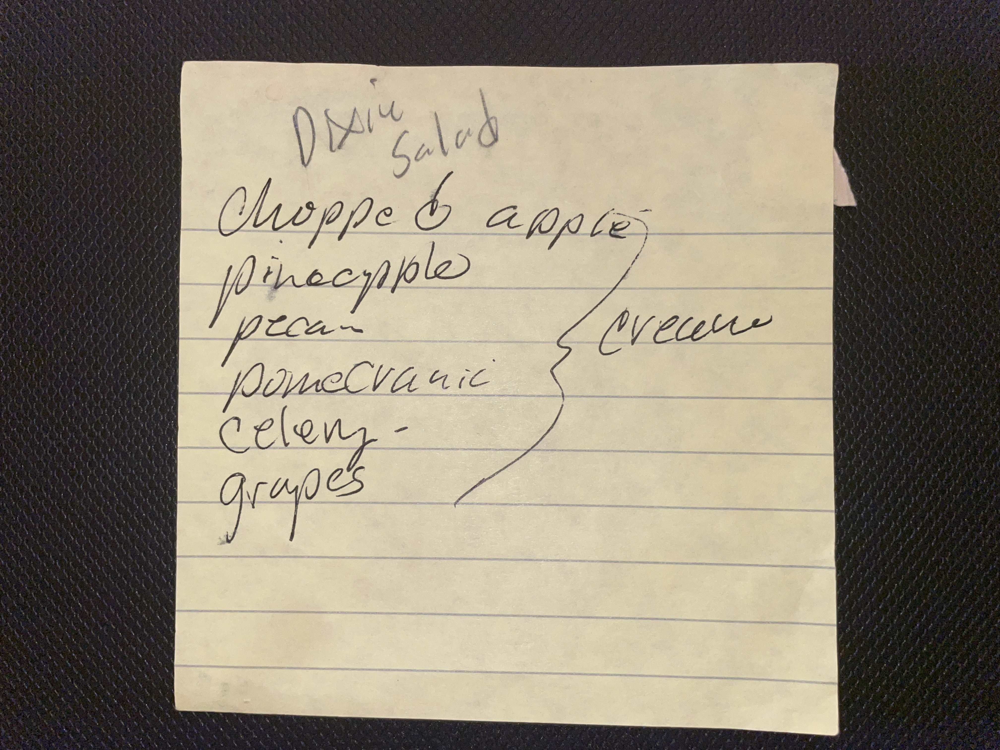

**Ingredients:**
Chopped apple, pineapple, pecans, pomegranate **[uncertain]**, celery, grapes — with cream.

---

### Don's Pecans
*Source: IMG_9396*

Break up pecans. Drizzle with real maple syrup and salt. Heat, then spread on wax paper.

---

### Elizabeth Adams Cabbage Salad
*Source: IMG_9392*

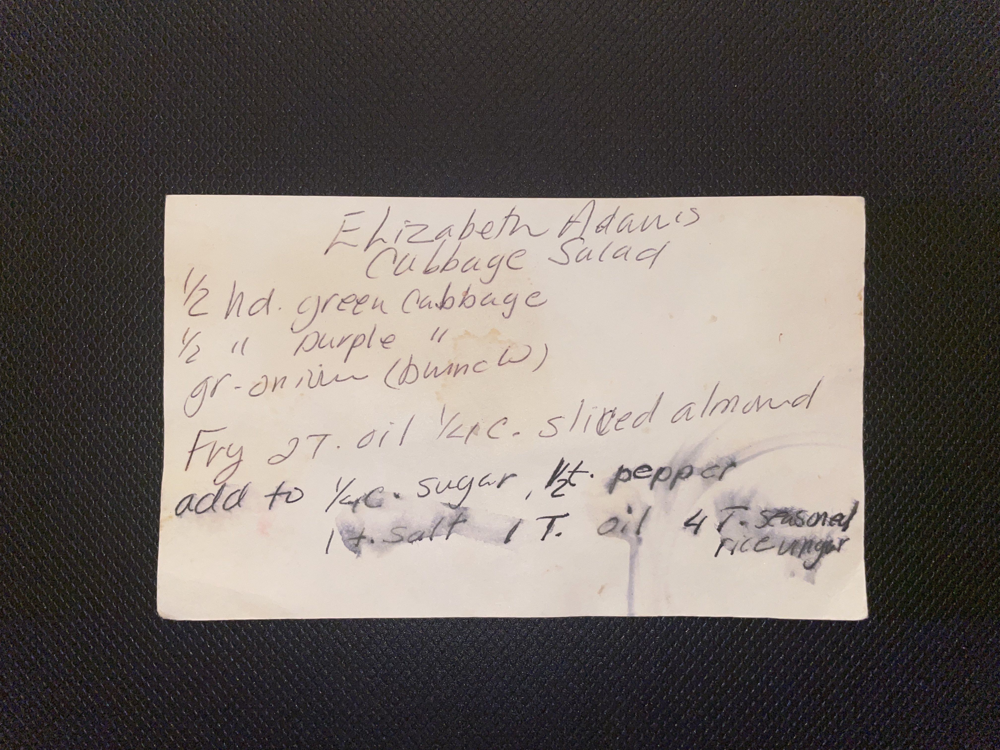

**Ingredients:**
- 1/2 head green cabbage, 1/2 head purple cabbage, 1 bunch green onions
- Fry 2 T. oil with 1/2 c. sliced almonds **[uncertain]**

**Dressing:** 1/4 c. sugar, light pepper **[uncertain]**, 1 t. salt, 1 T. oil, 4 T. seasoned rice vinegar **[uncertain]**

---

### Gable House Salad Dressing
*Source: IMG_9391*

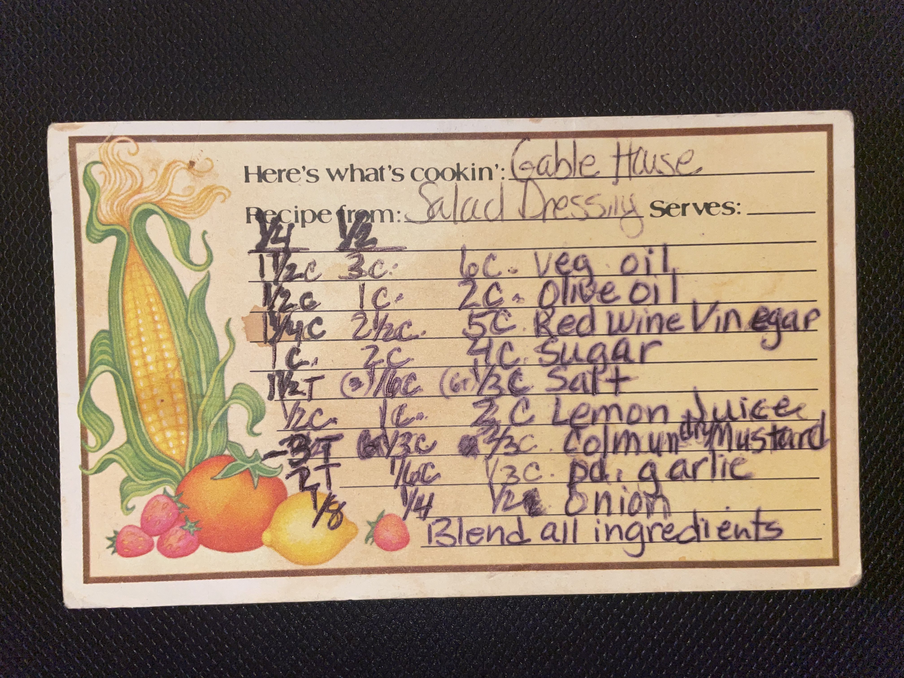

**Large batch:** 6 c. vegetable oil, 2 c. olive oil, 5 c. red wine vinegar, 4 c. sugar, 1/3 c. salt **[uncertain]**, 2 c. lemon juice, 1/3 c. Colman's dry mustard **[uncertain]**, 1/3 c. powdered garlic, 1/2 c. onion **[uncertain]**

**Instructions:** Blend all ingredients.

---

### German Red Cabbage
*Source: Cecelia Ludwig / Grandma Joyce (IMG_9416 / IMG_9417)*

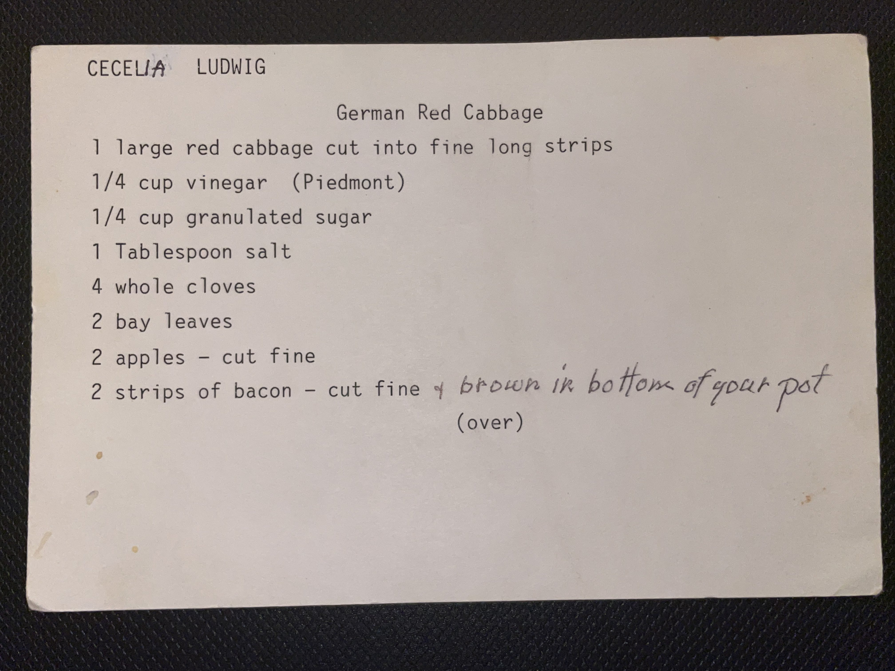

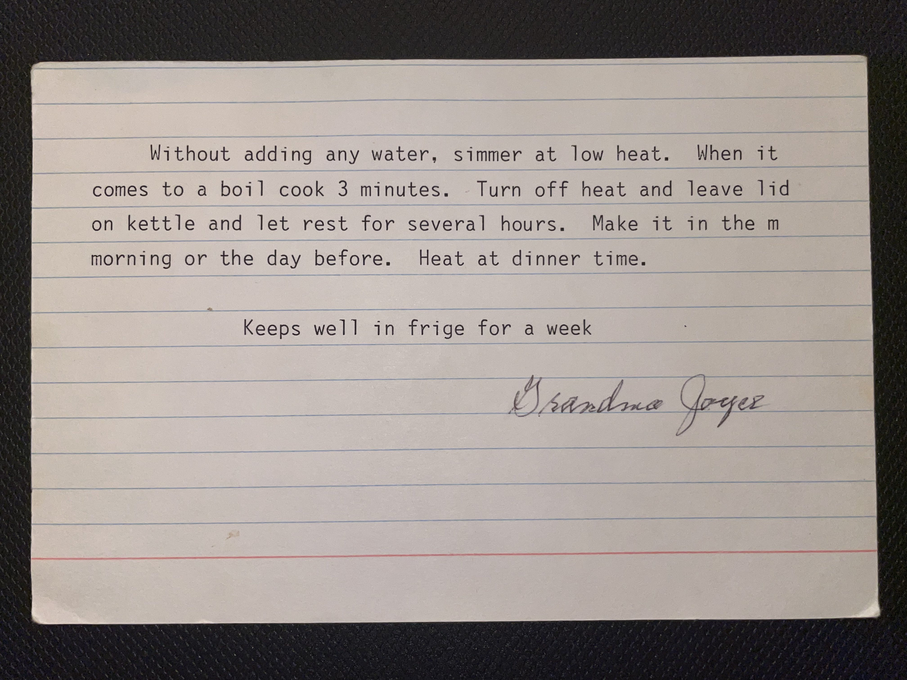

**Ingredients:**
- 1 large red cabbage (cut into fine long strips), 1/4 cup vinegar (Piedmont), 1/4 cup sugar, 1 T. salt, 4 whole cloves, 2 bay leaves, 2 apples (cut fine), 2 strips of bacon (cut fine & brown in bottom of pot)

**Instructions:**
Without adding water, simmer at low heat. When it comes to a boil, cook 3 minutes. Turn off heat and leave lid on kettle; let rest for several hours. Make in the morning or the day before. Heat at dinner time. Keeps well in fridge for a week.

---

### Grandma Daybell's Turkey Dressing
*Source: IMG_9481*

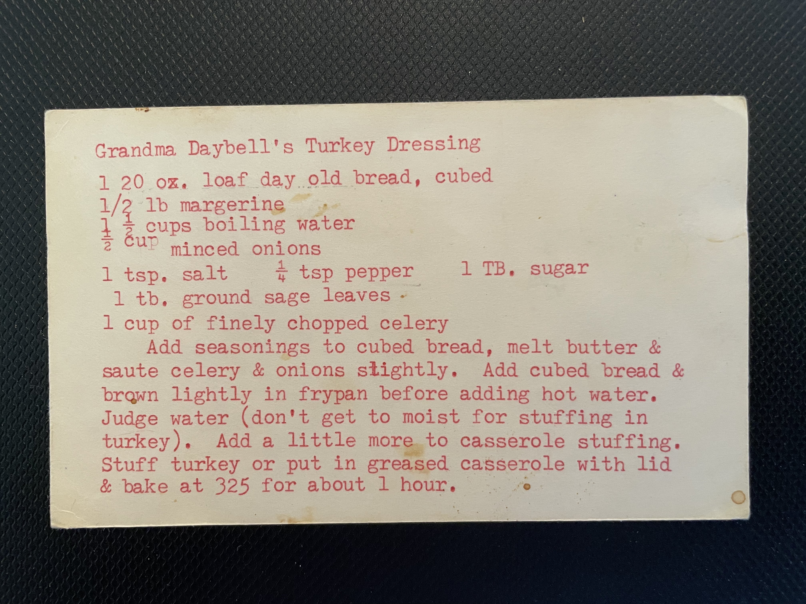

**Ingredients:**
- 1 (20 oz.) loaf day-old bread, cubed
- 1/2 lb. margarine
- 1 1/2 cups boiling water **[uncertain]**
- 1/2 cup minced onions
- 1 tsp. salt, 1/4 tsp. pepper, 1 T. sugar
- 1 T. ground sage leaves
- 1 cup finely chopped celery

**Instructions:**
Add seasonings to cubed bread. Melt butter & saute celery & onions slightly. Add cubed bread & brown lightly in frypan before adding hot water. Judge water (don't get too moist for stuffing in turkey). Add a little more for casserole stuffing. Stuff turkey or put in greased casserole with lid & bake at 325° for about 1 hour.

---

### Greek Rice Pilaf
*Source: Kate Dickson (IMG_9429; also IMG_9276) — Yields 6 cups, Serves 12*

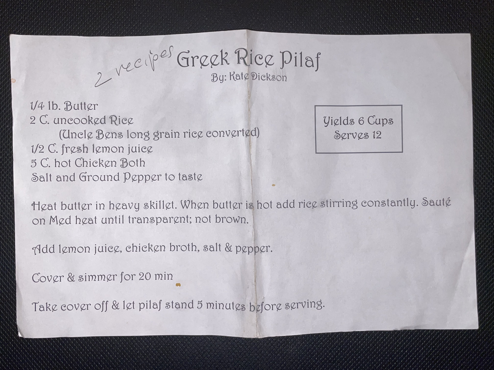

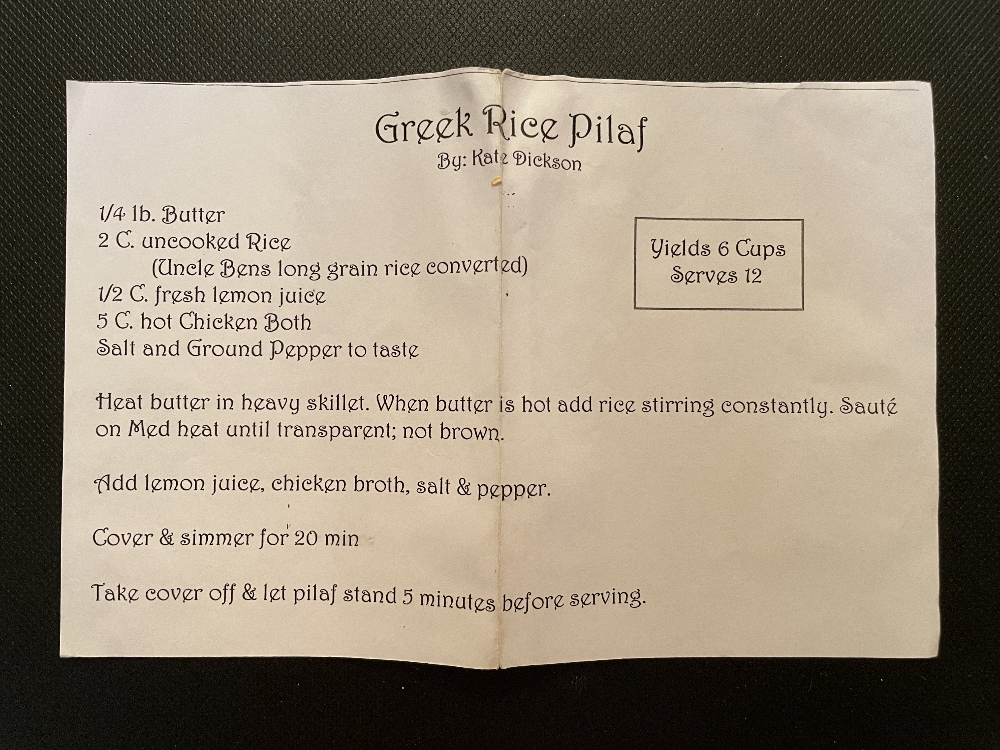

**Ingredients:**
- 1/4 lb. butter, 2 c. uncooked rice (Uncle Ben's long grain converted), 1/2 c. fresh lemon juice, 5 c. hot chicken broth, salt and pepper to taste

**Instructions:**
Heat butter in heavy skillet. When hot, add rice stirring constantly. Saute on med. heat until transparent, not brown. Add lemon juice, chicken broth, salt & pepper. Cover & simmer for 20 min. Take cover off & let stand 5 minutes before serving.

---

### Ike's Pinto Beans
*Source: IMG_9280*

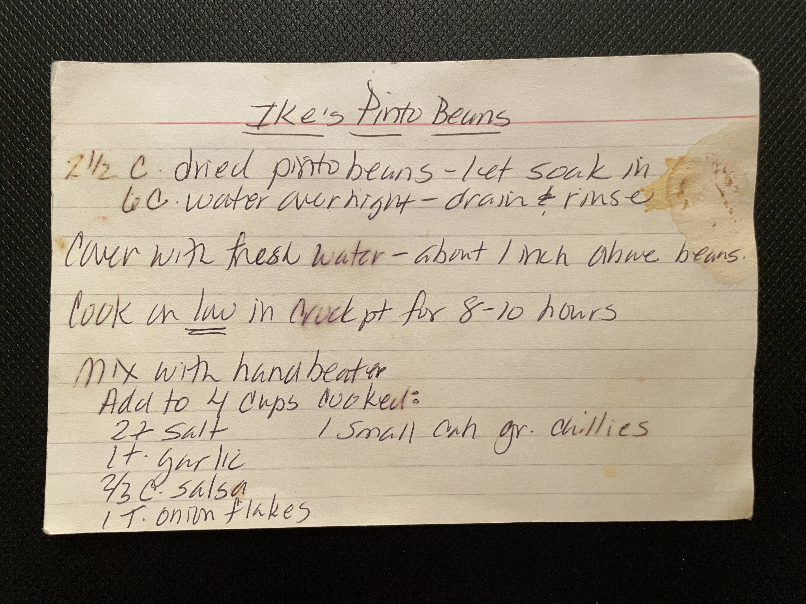

**Ingredients:**
- 2 1/2 c. dried pinto beans — soak overnight in 6 c. water, drain & rinse
- Cover with fresh water (1 inch above beans), cook on low in crockpot 8–10 hours
- Mix with hand beater, add: 2 T. salt, 1 t. garlic, 2/3 c. salsa, 1 T. onion flakes, 1 small can green chilies

---

### Joyce Salad
*Source: IMG_9376*

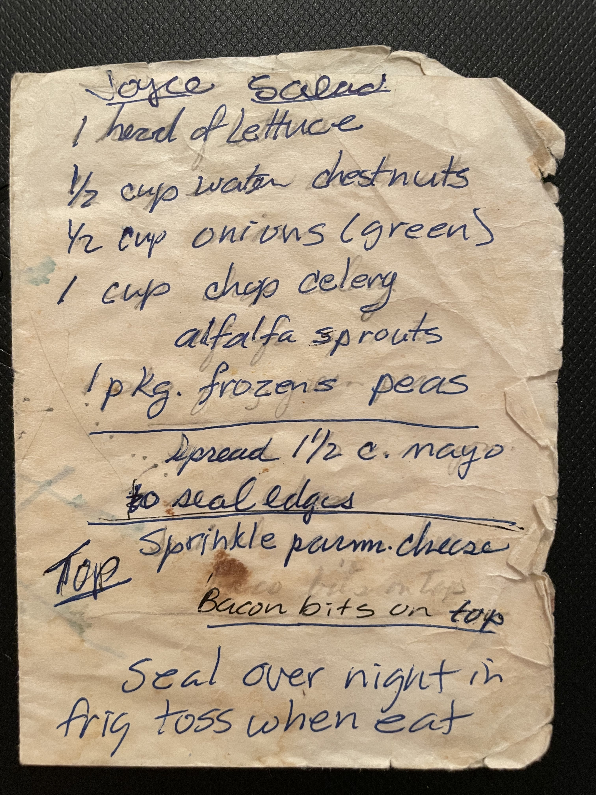

**Ingredients:**
- 1 head lettuce, 1/2 cup water chestnuts, 1/2 cup green onions, 1 cup chopped celery, alfalfa sprouts, 1 pkg. frozen peas

**Instructions:**
Spread 1 1/2 c. mayo to seal edges. Sprinkle Parmesan cheese. Top with bacon bits. Seal overnight in fridge. Toss when ready to eat.

---

### Kathy's Craisin Salad
*Source: IMG_9405 — Serves 18*

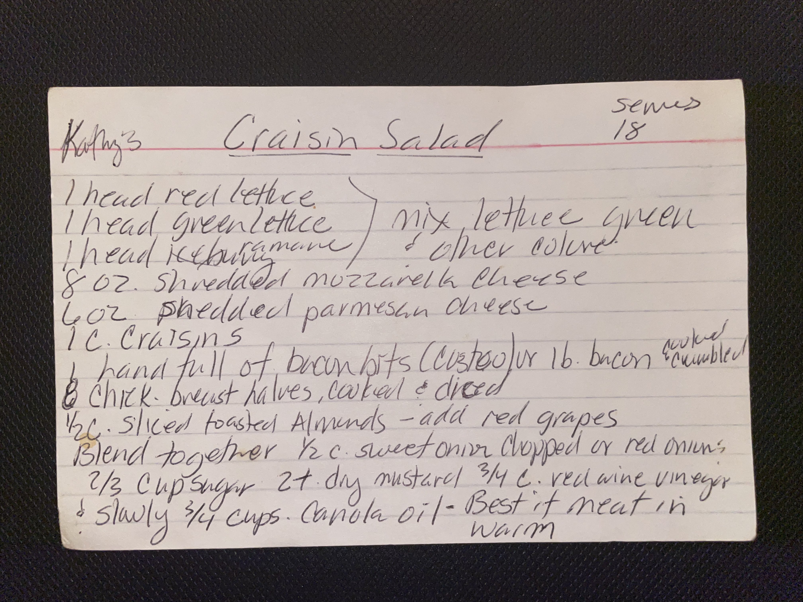

**Salad:** 1 head red lettuce, 1 head green lettuce, 1 head red romaine **[uncertain]**, 8 oz. shredded mozzarella, 6 oz. shredded Parmesan, 1 c. Craisins, bacon bits (or 1 lb. bacon cooked & crumbled), 8 chicken breast halves (cooked & diced), 1/2 c. sliced toasted almonds, red grapes

**Dressing:** 1/2 c. sweet or red onion (chopped), 2/3 cup sugar, 2 t. dry mustard, 3/4 c. red wine vinegar — slowly add 3/4 cups canola oil. Best if warm **[uncertain]**.

---

### Kathy's Orange Spinach Salad
*Source: IMG_9399 (original) / IMG_9400 (revised)*

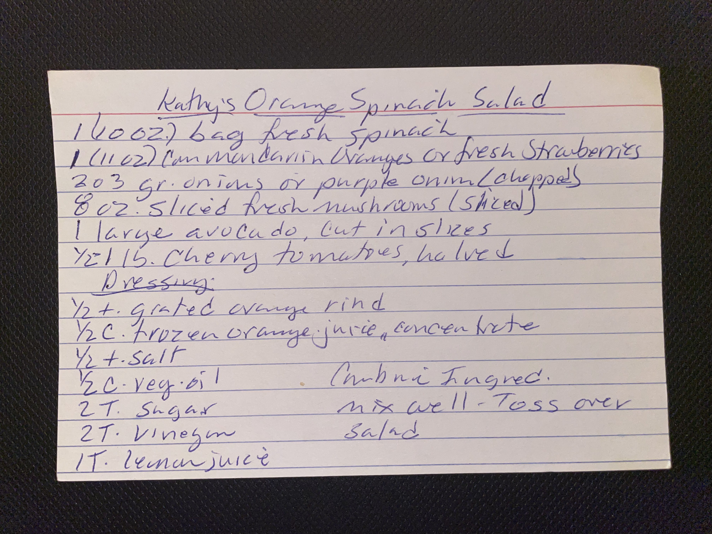

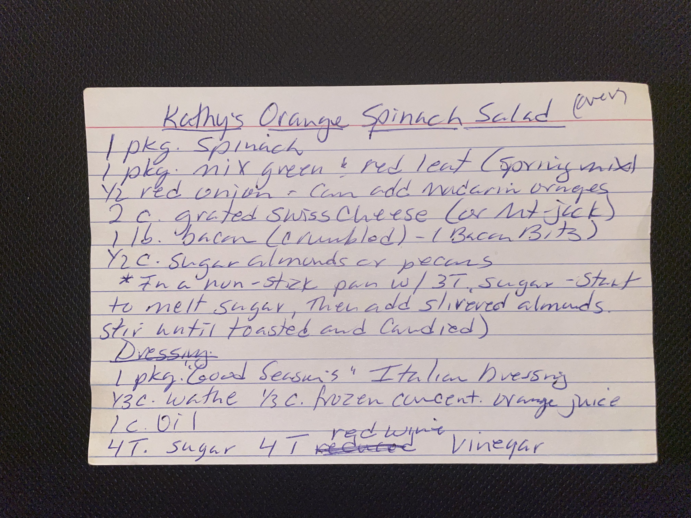

**Original Version (IMG_9399):**
- 1 (6 oz.) bag fresh spinach, 1 (11 oz.) can mandarin oranges or fresh strawberries, 2–3 green onions or purple onion, 8 oz. sliced fresh mushrooms, 1 large avocado, cherry tomatoes

**Dressing:** 1/2 t. grated orange rind, 1/2 c. frozen OJ concentrate, 1/2 t. salt, 1/2 c. vegetable oil, 2 T. sugar, 2 T. vinegar, 1 T. lemon juice

**Revised Version (IMG_9400):**
- 1 pkg. spinach, 1 pkg. spring mix, 1/2 red onion, mandarin oranges, 2 c. grated Swiss cheese, 1 lb. bacon crumbled, 1/2 c. candied almonds or pecans

**Dressing:** 1 pkg. Good Seasons Italian Dressing, 1/3 c. water **[uncertain]**, 1/3 c. frozen OJ concentrate, 1 c. oil, 4 T. sugar, 4 T. red wine vinegar

---

### Kathy's Pasta Salad
*Source: IMG_9554 (also IMG_9445) — 1987 **[uncertain]** — Serves 25*

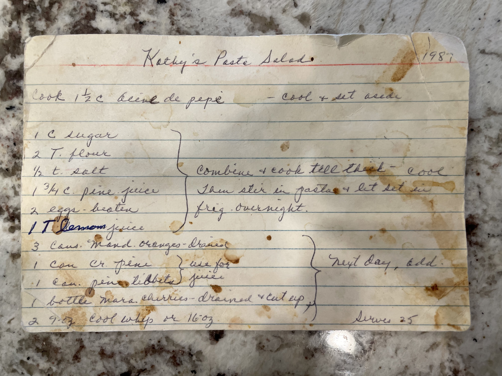

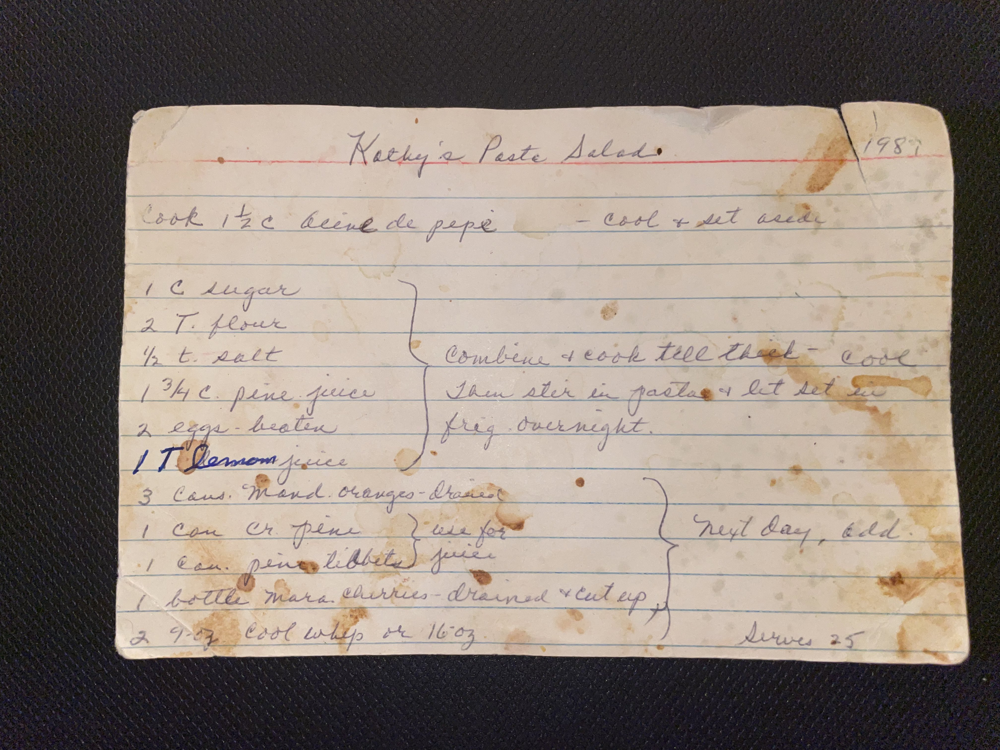

**Ingredients:**
- 1 1/2 c. acini de pepe pasta, cooked and cooled

**Dressing:** 1 c. sugar, 2 T. flour, 1/2 t. salt, 1 3/4 c. pineapple juice, 2 eggs beaten, 1 T. lemon juice

**Fold in next day:** 3 cans mandarin oranges (drained), 1 can crushed pineapple, 1 can pineapple tidbits **[uncertain]**, 1 bottle maraschino cherries (drained & cut up), 2 (9 oz.) Cool Whip or 16 oz.

**Instructions:**
Combine dressing ingredients & cook till thick. Cool. Stir in pasta & let set in fridge overnight. Next day, fold in fruit and Cool Whip.

---

### Lime Cilantro Rice
*Source: IMG_9260*

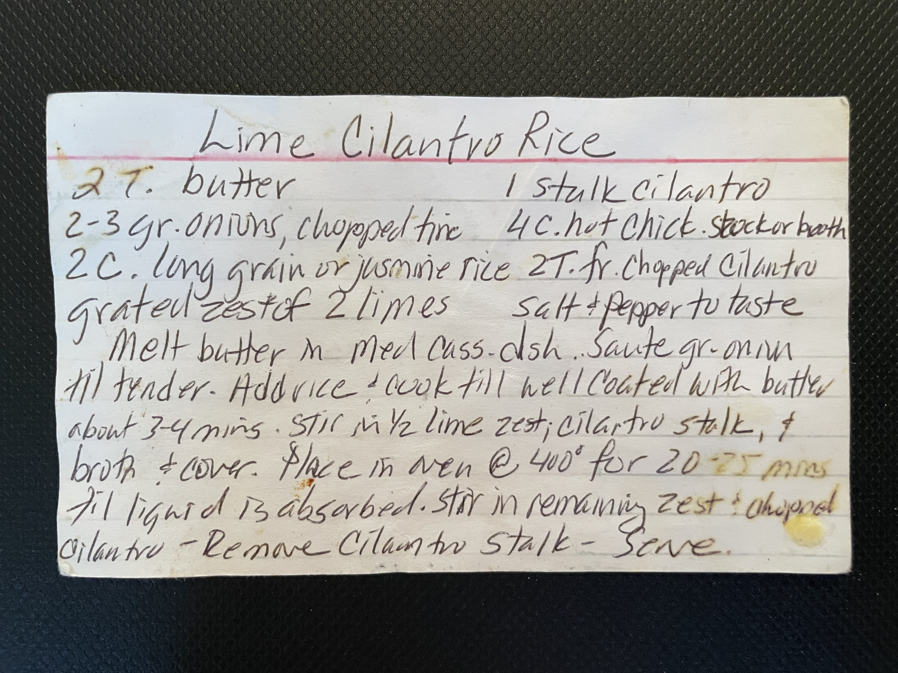

**Ingredients:**
- 2 T. butter, 1 stalk cilantro, 2–3 green onions (chopped fine), 4 c. hot chicken stock, 2 c. long grain or jasmine rice, 2 T. fresh chopped cilantro, grated zest of 2 limes, salt & pepper

**Instructions:**
Melt butter, saute green onion til tender. Add rice & cook til coated (3–4 mins). Stir in 1/2 lime zest, cilantro stalk, & broth. Cover. Place in oven at 400° for 20–25 mins til liquid is absorbed. Stir in remaining zest & chopped cilantro. Remove stalk. Serve.

---

### Mae's String Beans
*Source: IMG_9413 — Serves 8*

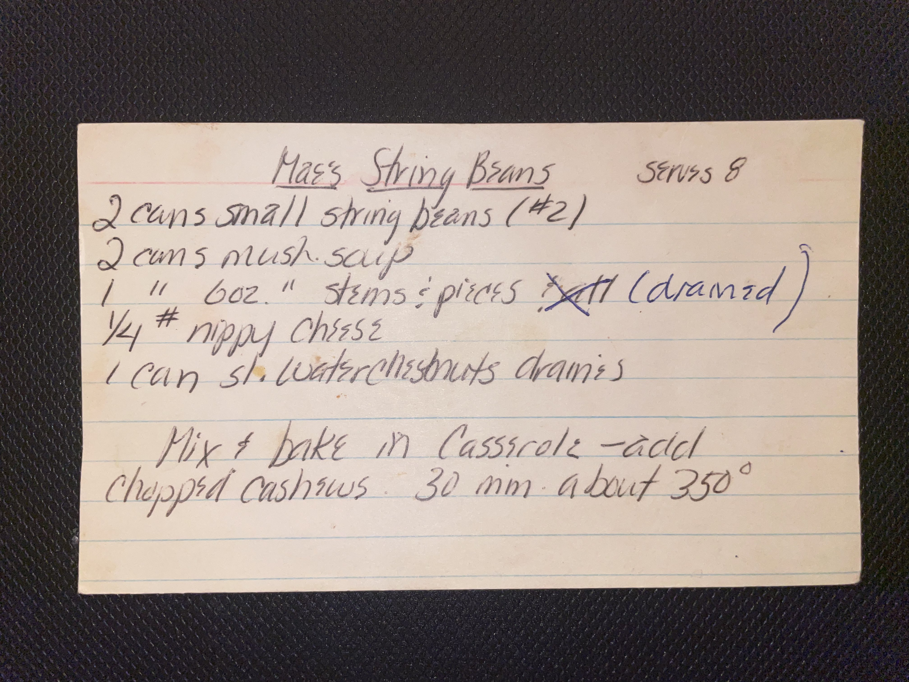

**Ingredients:**
- 2 cans small string beans, 2 cans mushroom soup, 1 (6 oz.) can mushroom stems & pieces (drained), 1/4 lb. nippy cheese, 1 can sliced water chestnuts (drained)

**Instructions:**
Mix & bake in casserole. Add chopped cashews. 30 min at about 350°.

---

### Mare's Funeral Potatoes
*Source: Spilker (IMG_9428)*

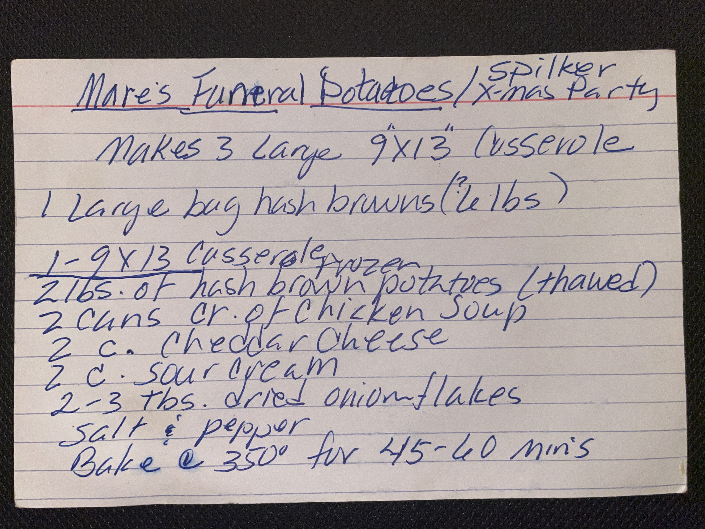

**For 1 (9x13) casserole:**
- 2 lbs. hash brown potatoes (thawed), 2 cans cream of chicken soup, 2 c. cheddar cheese, 2 c. sour cream, 2–3 T. dried onion flakes, salt & pepper

**Instructions:**
Bake at 350° for 45–60 mins. *(Makes 3 large casseroles at full batch.)*

---

### Mare's Veggie Pasta Salad
*Source: IMG_9395*

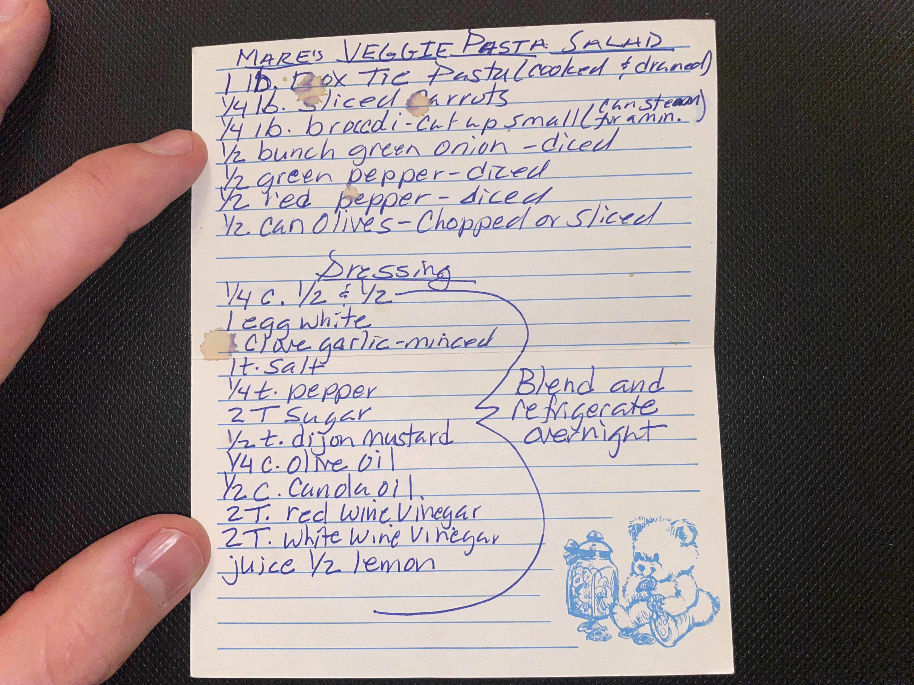

**Salad:** 1 lb. Rotini pasta (cooked & drained), 1/4 lb. sliced carrots, 1/4 lb. broccoli, 1/2 bunch green onion, 1/2 green pepper, 1/2 red pepper, 1/2 can olives

**Dressing:** 1/4 c. half & half **[uncertain]**, 1 egg white, 3 cloves garlic, 1 t. salt, 1/4 t. pepper, 2 T. sugar, 1/2 t. Dijon mustard, 1/4 c. olive oil, 1/2 c. canola oil, 2 T. red wine vinegar, 2 T. white wine vinegar, juice of 1/2 lemon. Blend and refrigerate overnight.

---

### Nane's Pasta Salad
*Source: IMG_9406 **[uncertain — name could be "Nane's" or "Nave's"]***

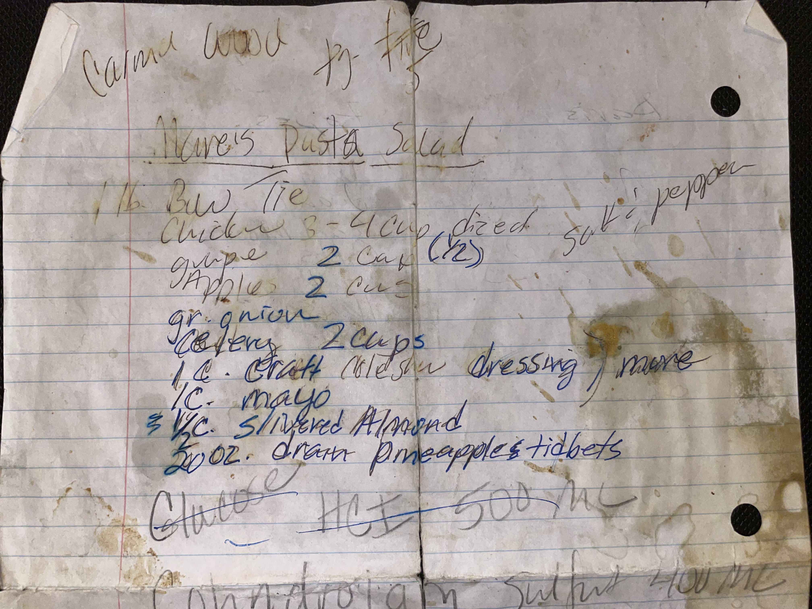

**Ingredients:**
- 1 lb. bow tie pasta, 3–4 c. diced chicken, 2 c. grapes (halved), 2 c. apples (cut), green onion, 2 c. celery, 1 c. Kraft coleslaw dressing, 1 c. mayo, 3/4 c. slivered almonds, 20 oz. pineapple tidbits (drained)

---

### Pasta Fruity Salad
*Source: IMG_9404*

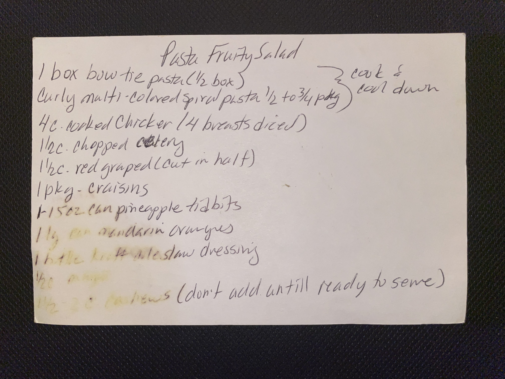

**Ingredients:**
- 1/2 box bow tie pasta + 1/2–3/4 pkg. curly multi-colored spiral pasta (cook & cool)
- 4 c. cooked chicken (4 breasts diced), 1/2 c. chopped celery **[uncertain]**, 1 1/2 c. red grapes (halved), 1 pkg. Craisins, 1 (15 oz.) can pineapple tidbits, 1 large can mandarin oranges, 1 bottle coleslaw dressing **[uncertain]**
- 1/2 c. croutons (add just before serving) **[uncertain]**

---

### Potato Casserole (Janna)
*Source: IMG_9411*

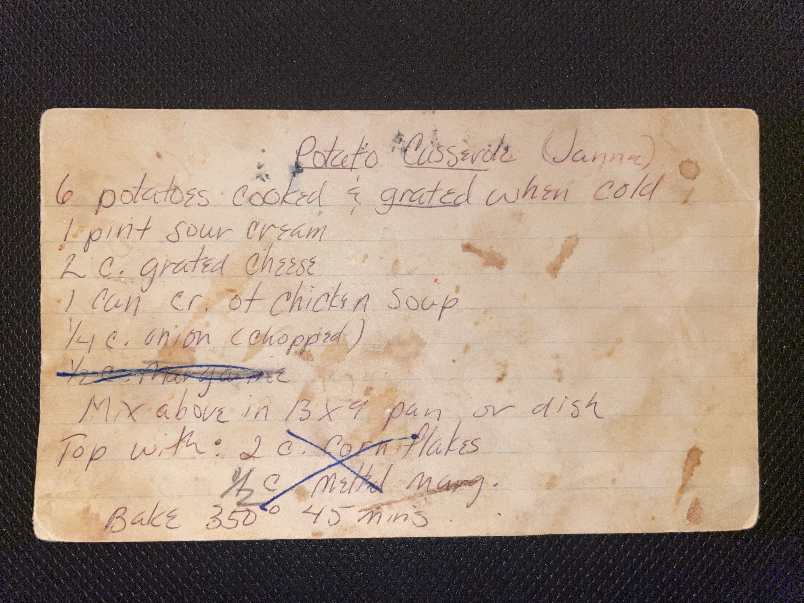

**Ingredients:**
- 6 potatoes (cooked & grated when cold), 1 pint sour cream, 2 c. grated cheese, 1 can cream of chicken soup, 1/4 c. onion (chopped)

**Topping:** 2 c. corn flakes, 1/2 c. melted margarine. Bake 350° for 45 mins.

---

### Potato Casserole (Fatfree)
*Source: IMG_9425*

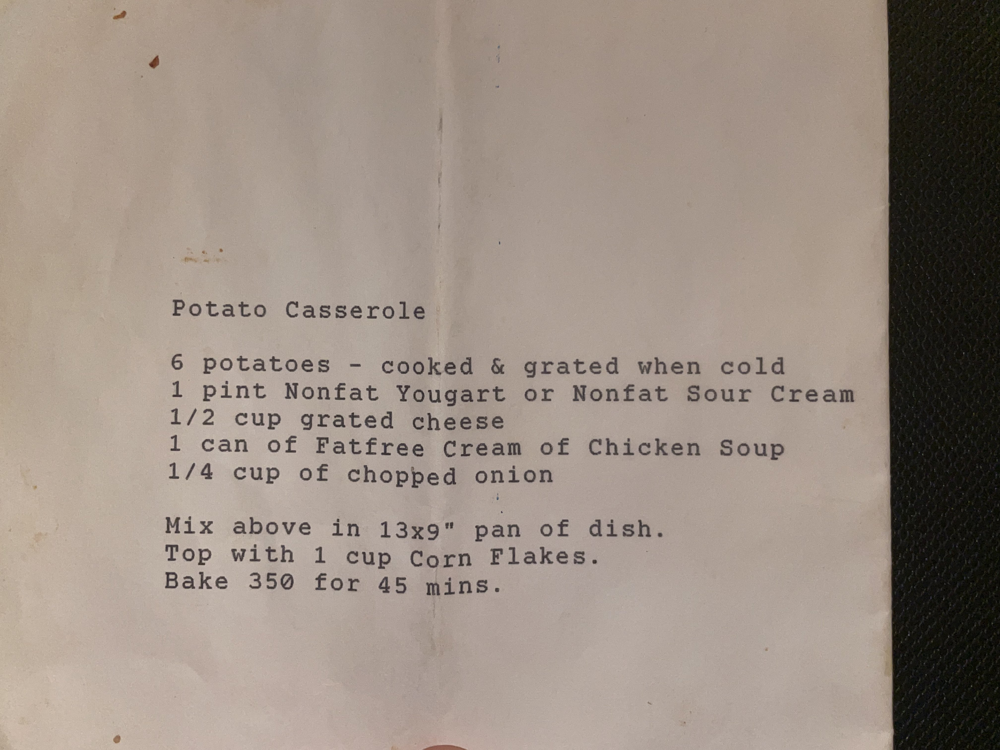

**Ingredients:**
- 6 potatoes (cooked & grated when cold), 1 pint nonfat yogurt or nonfat sour cream **[uncertain]**, 1/2 cup grated cheese, 1 can fatfree cream of chicken soup, 1/4 cup chopped onion

**Instructions:**
Mix in 13x9 pan. Top with 1 cup corn flakes. Bake 350° for 45 mins.

---

### Potato Salad
*Source: IMG_9378 / IMG_9379*

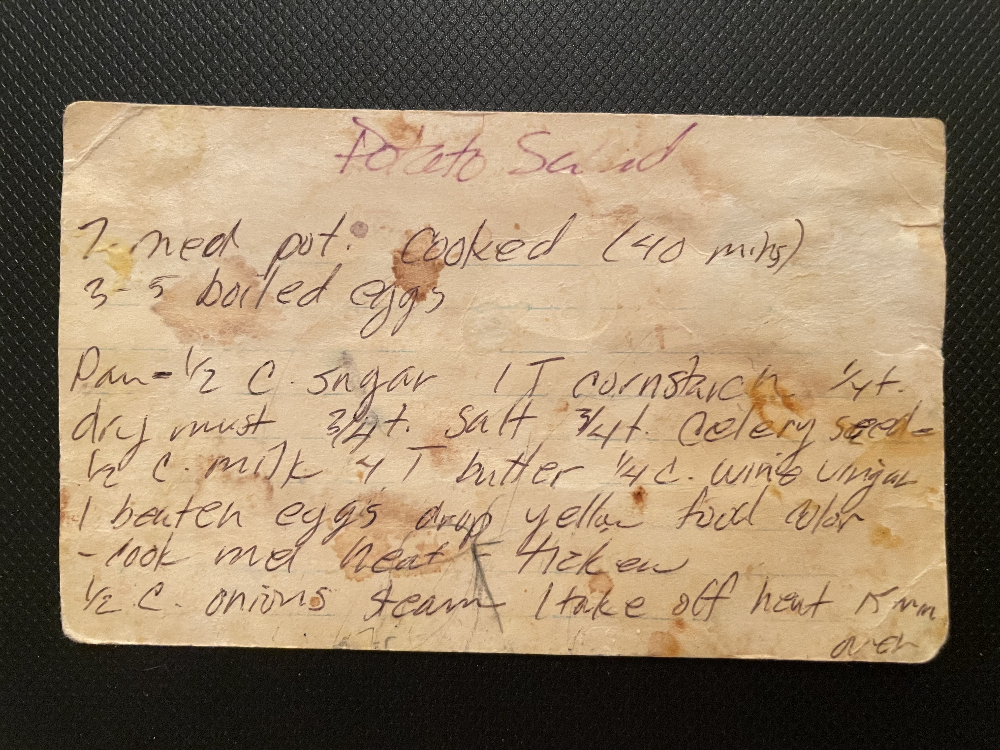

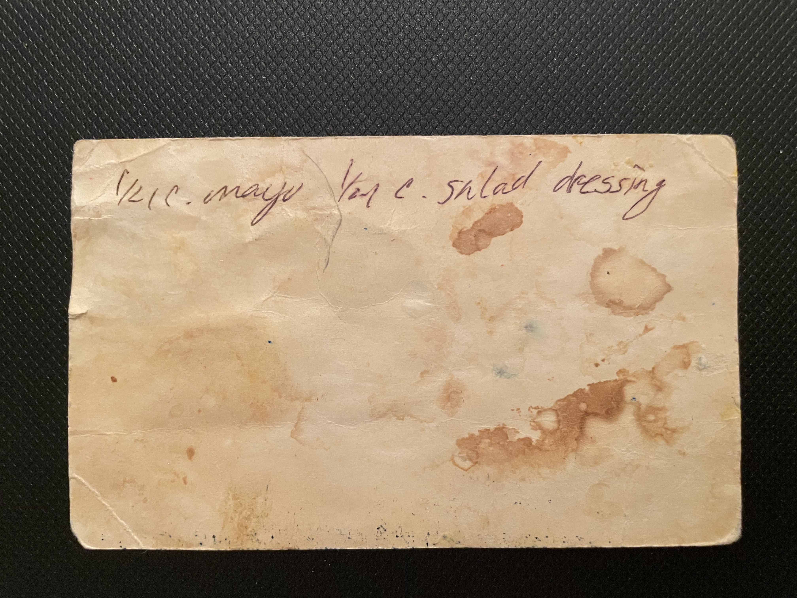

**Ingredients:**
- 7 med. potatoes (cooked 40 mins), 3–5 boiled eggs

**Dressing:** 1/2 c. sugar, 1 T. cornstarch, 1/4 t. dry mustard **[uncertain]**, 3/4 t. salt, 1/4 t. celery seed, 1/2 c. milk, 4 T. butter, 1/4 c. white vinegar **[uncertain]**, 1 beaten egg — cook over med. heat, thicken. Add 1/2 c. onions, 1/4 c. mayo, 1/4 c. salad dressing.

---

### Potato Topper
*Source: IMG_9424*

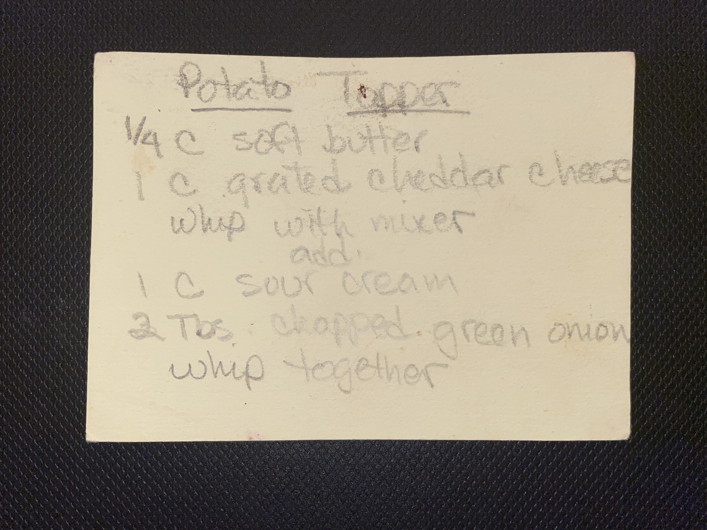

**Ingredients:**
- 1/4 c. soft butter, 1 c. grated cheddar cheese — whip with mixer
- Add: 1 c. sour cream, 2 Tbs. chopped green onion — whip together

---

### Pretzel-topped Sweet Potato Casserole
*Source: IMG_9423*

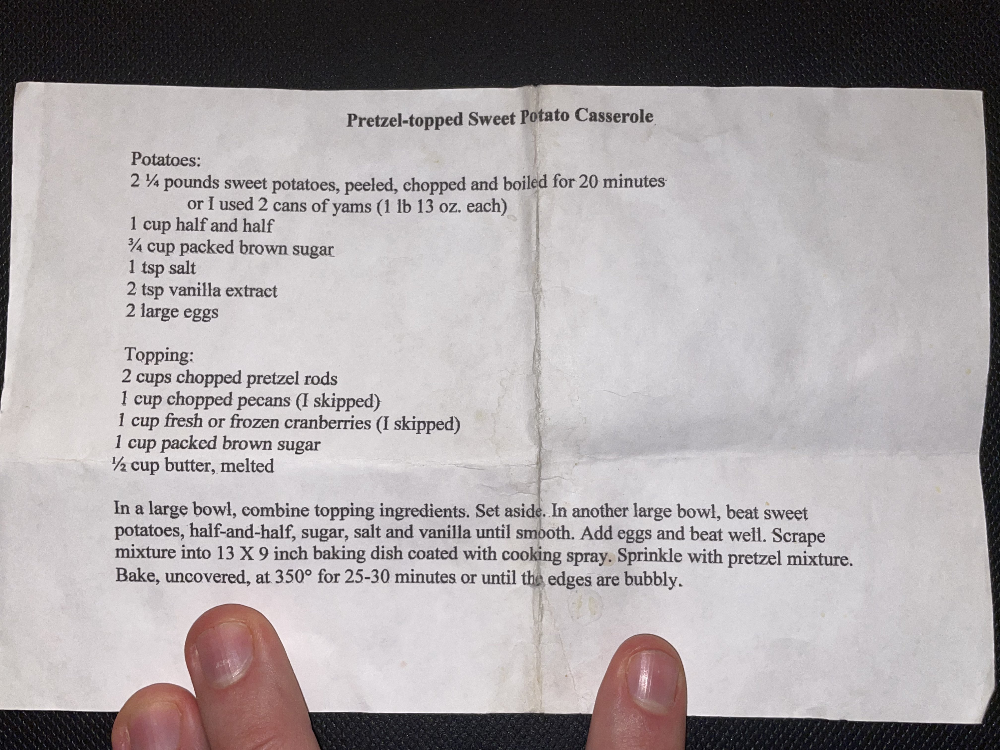

**Potatoes:** 2 1/4 lbs. sweet potatoes (or 2 cans yams), 1 cup half & half, 3/4 cup brown sugar, 1 tsp. salt, 2 tsp. vanilla, 2 large eggs

**Topping:** 2 cups chopped pretzel rods, 1 cup chopped pecans, 1 cup cranberries, 1 cup brown sugar, 1/2 cup melted butter

**Instructions:**
Beat sweet potatoes with half & half, sugar, salt, and vanilla until smooth. Add eggs. Pour into 13x9 dish. Sprinkle with topping. Bake at 350° for 25–30 minutes.

---

### R.S. Salad Dressing / Party Dip
*Source: IMG_9388*

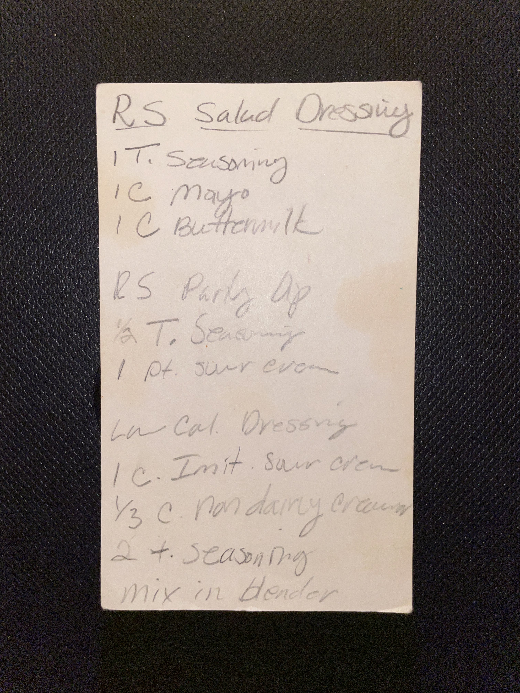

**Salad Dressing:** 1 T. seasoning, 1 c. mayo, 1 c. buttermilk

**Party Dip:** 1/2 T. seasoning, 1 pt. sour cream

**Lo-Cal Dressing:** 1 c. imitation sour cream, 1/3 c. non-dairy creamer **[uncertain]**, 2 t. seasoning — mix in blender.

---

### Red Cabbage
*Source: IMG_9418 / IMG_9419*

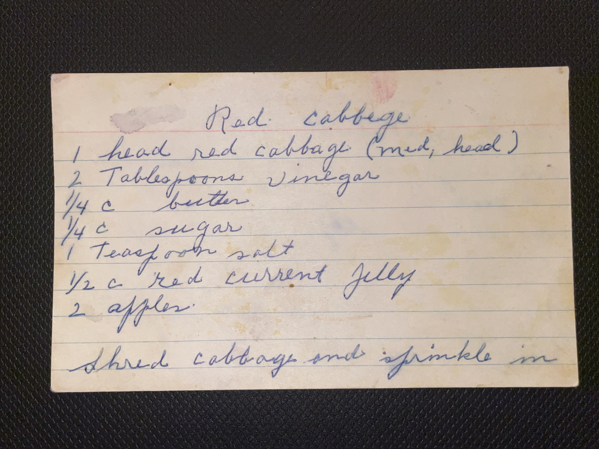

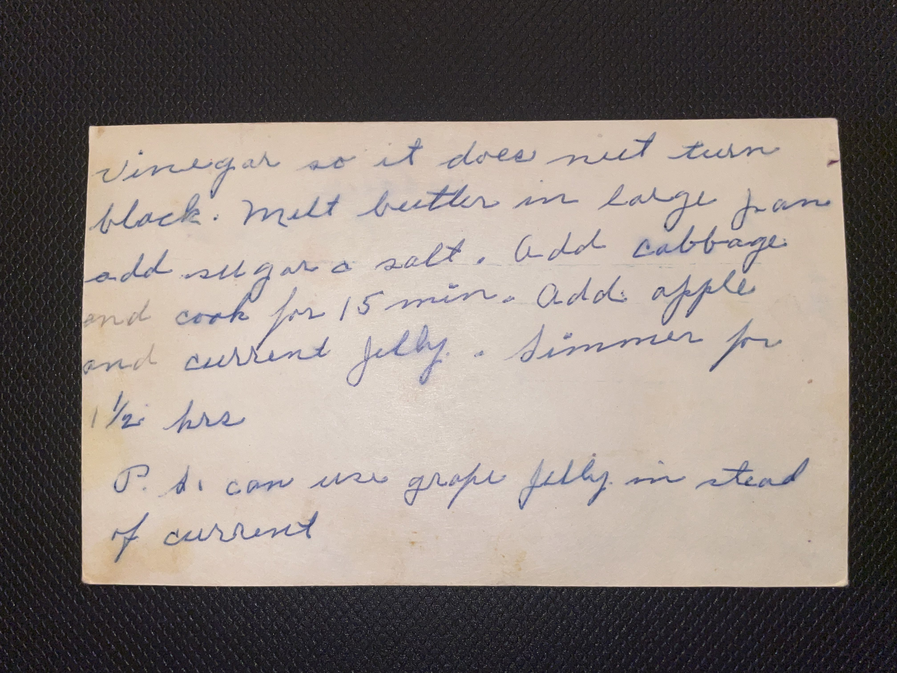

**Ingredients:**
- 1 head red cabbage (med.), 2 T. vinegar, 1/4 c. butter, 1/4 c. sugar, 1 tsp. salt, 1/2 c. red currant jelly (or grape jelly), 2 apples

**Instructions:**
Shred cabbage and sprinkle in vinegar. Melt butter, add sugar & salt. Add cabbage, cook 15 min. Add apple and jelly. Simmer 1 1/2 hrs.

---

### Rice Pilaf
*Source: IMG_9430*

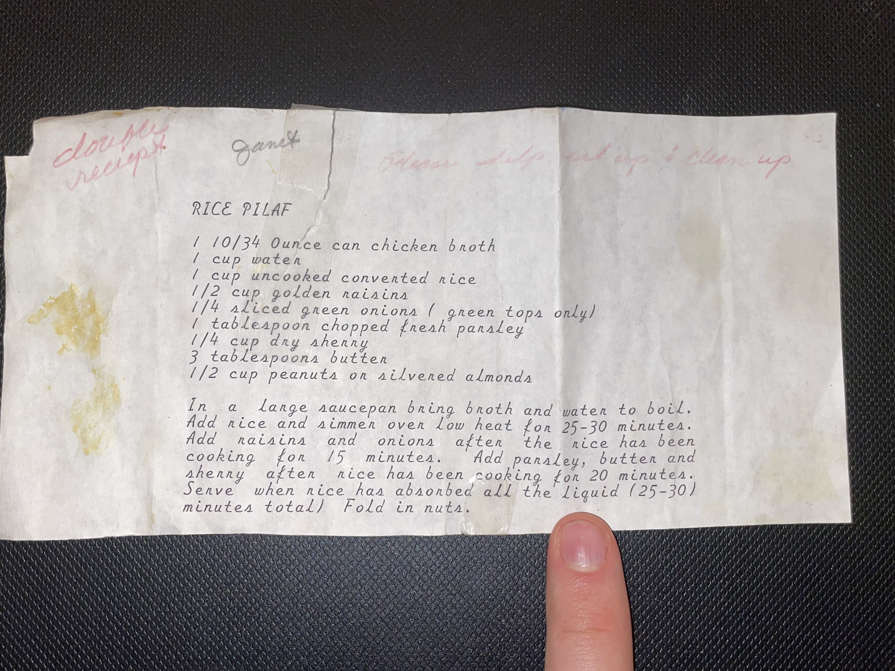

**Ingredients:**
- 1 (10 3/4 oz.) can chicken broth, 1 cup water, 1 cup uncooked converted rice, 1/2 cup golden raisins, 1/4 cup sliced green onions, 1 T. chopped fresh parsley, 1/4 cup dry sherry, 3 T. butter, 1/2 cup peanuts or slivered almonds

**Instructions:**
Bring broth and water to boil. Add rice, simmer 25–30 min. Add raisins and onions at 15 min. Add parsley, butter and sherry at 20 min. Fold in nuts when done.

---

### Rice Pilaf (Kathy Morgan)
*Source: IMG_9412 — Serves 6*

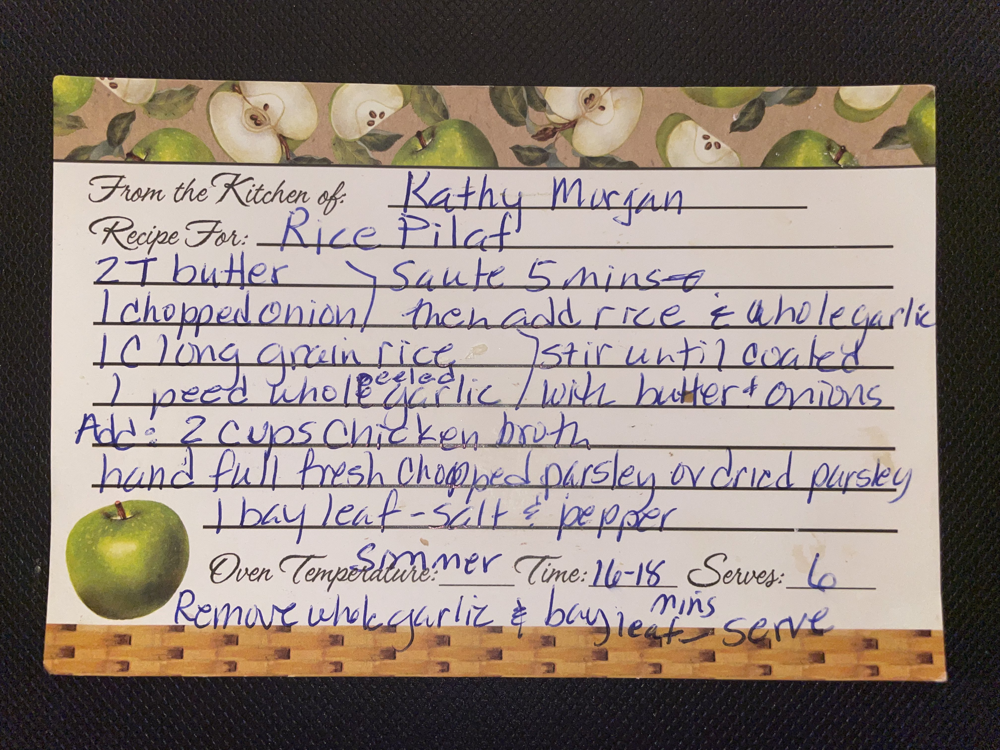

**Ingredients:**
- 2 T. butter, 1 chopped onion (saute 5 mins), 1 c. long grain rice, 1 whole garlic clove (peeled) — stir til coated
- 2 cups chicken broth, fresh chopped parsley, 1 bay leaf, salt & pepper

**Instructions:**
Simmer 16–18 mins. Remove garlic & bay leaf. Serve.

---

### Salade Oriental
*Source: IMG_9402*

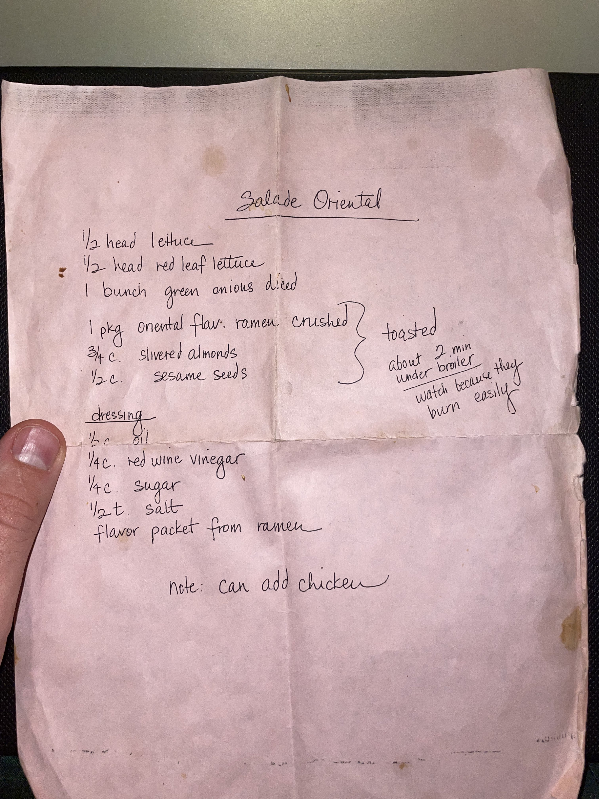

**Salad:** 1/2 head lettuce, 1/2 head red leaf lettuce, 1 bunch green onions (diced)
- 1 pkg. oriental ramen (crushed), 3/4 c. slivered almonds, 1/3 c. sesame seeds — toast under broiler about 2 min (watch, burns easily!)

**Dressing:** 1/2 c. oil **[uncertain]**, 1/4 c. red wine vinegar, 1/4 c. sugar, 1/2 t. salt, flavor packet from ramen. Note: can add chicken.

---

### Scalloped Potatoes
*Source: Janet Spilker **[uncertain]** (IMG_9529)*

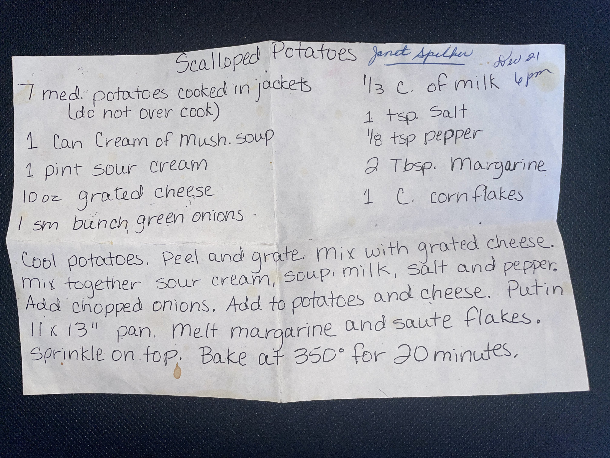

**Ingredients:**
- 7 med. potatoes (cooked in jackets, do not overcook), 1 can cream of mushroom soup, 1 pint sour cream, 10 oz. grated cheese, 1 sm. bunch green onions, 1/3 c. milk, 1 tsp. salt, 1/8 tsp. pepper, 2 Tbsp. margarine, 1 c. cornflakes

**Instructions:**
Cool potatoes. Peel and grate. Mix with cheese. Mix sour cream, soup, milk, salt and pepper. Add chopped onions. Add to potatoes and cheese. Put in 11x13" pan. Melt margarine, saute cornflakes, sprinkle on top. Bake at 350° for 30 minutes.

---

### Scalloped Potatoes (Simple)
*Source: IMG_9427*

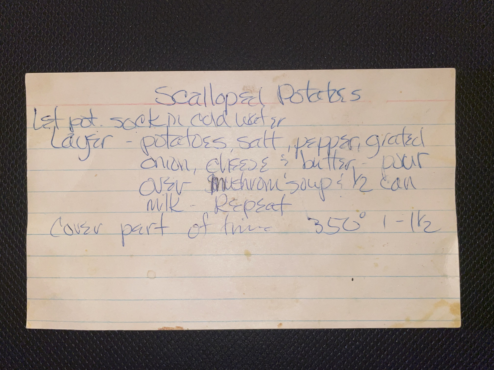

**Instructions:**
Let potatoes soak in cold water. Layer: potatoes, salt, pepper, grated onion, cheese & butter. Cover with mushroom soup & 1/2 can milk. Repeat. Cover part of time **[uncertain]**. 350° for 1–1 1/2 hours.

---

### Set Fruit Salad
*Source: Joyce (IMG_9390)*

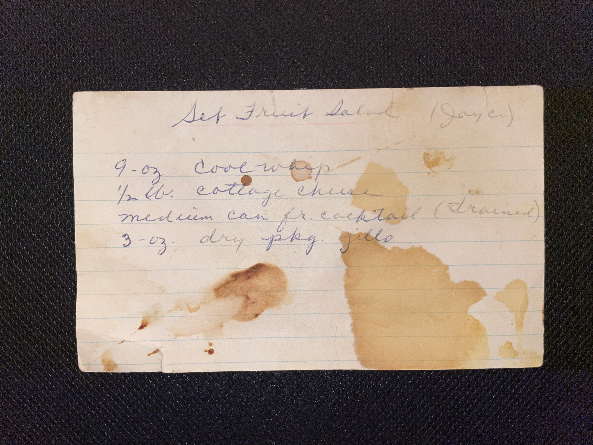

**Ingredients:**
- 9 oz. Cool Whip, 1/2 lb. cottage cheese, medium can fruit cocktail (drained), 3 oz. dry pkg. jello

---

### Spinach Salad (Elizabeth)
*Source: IMG_9386 / IMG_9387*

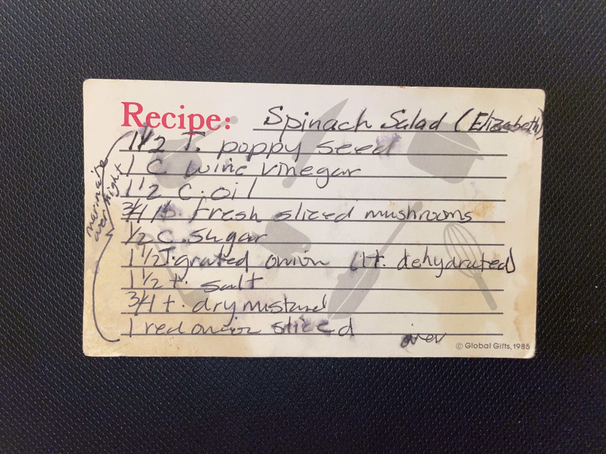

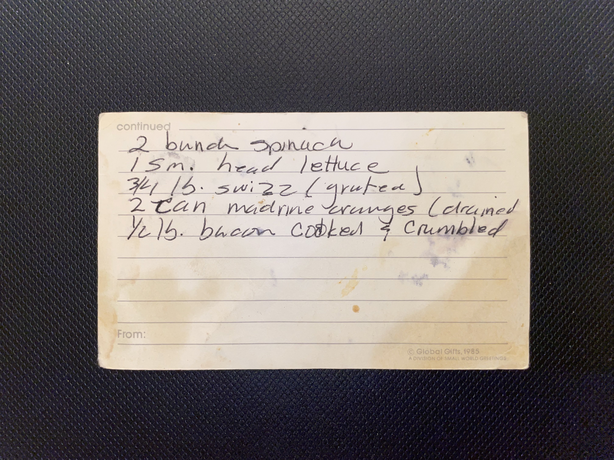

**Dressing:** 1 1/2 T. poppy seed, 1 c. wine vinegar, 1/2 c. oil, 1/2 c. sugar, 1 1/2 T. grated onion, 1 1/2 t. salt, 3/4 t. dry mustard

**Salad:** 3/4 lb. fresh sliced mushrooms, 1 red onion (sliced), 2 bunches spinach, 1 sm. head lettuce, 3/4 lb. Swiss cheese (grated), 2 cans mandarin oranges (drained), 1/2 lb. bacon (cooked & crumbled)

---

### Yam & Apple Casserole
*Source: Janet Spilker (IMG_9426; also IMG_9414/IMG_9415)*

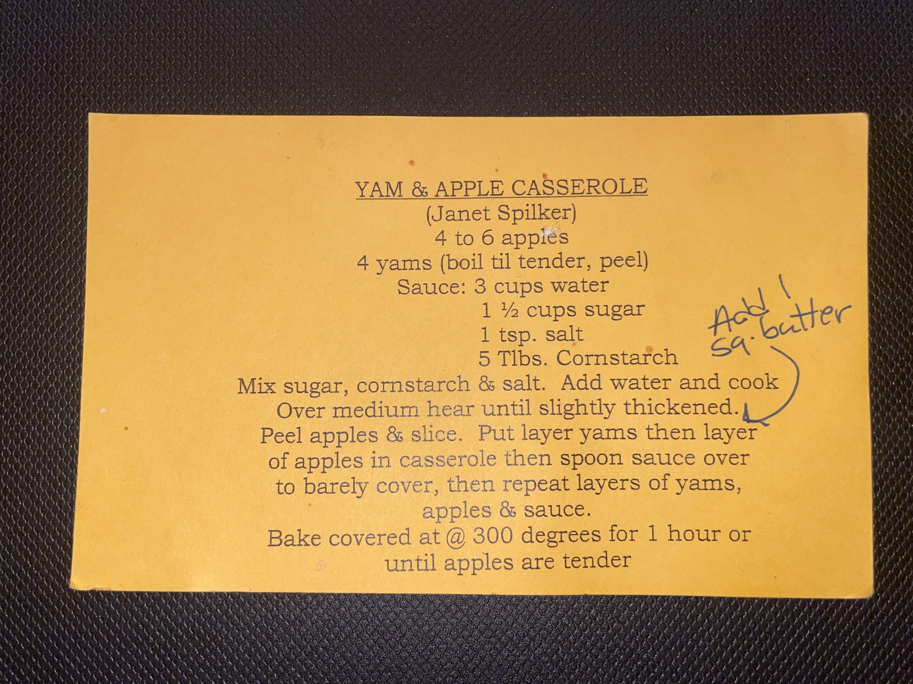

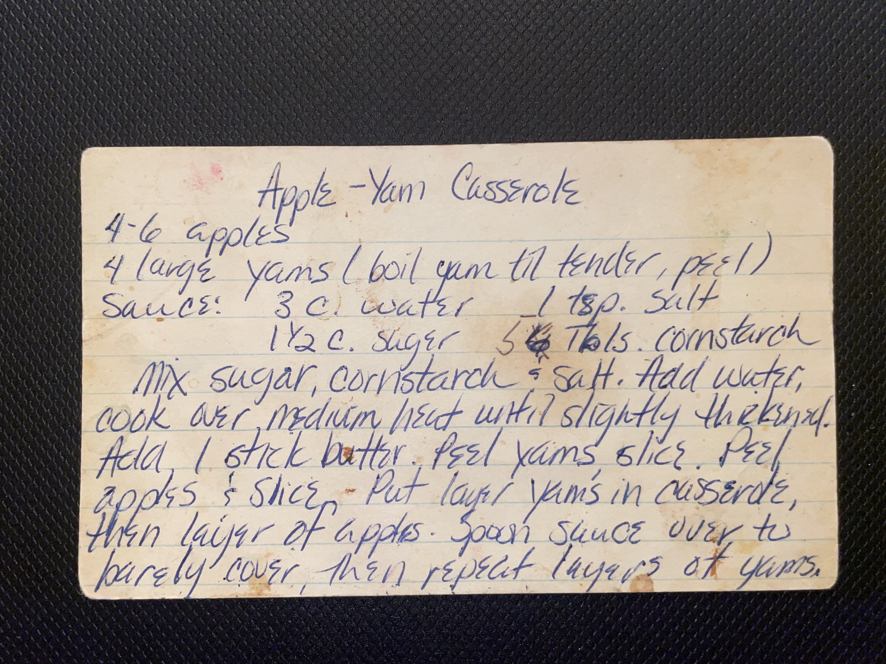

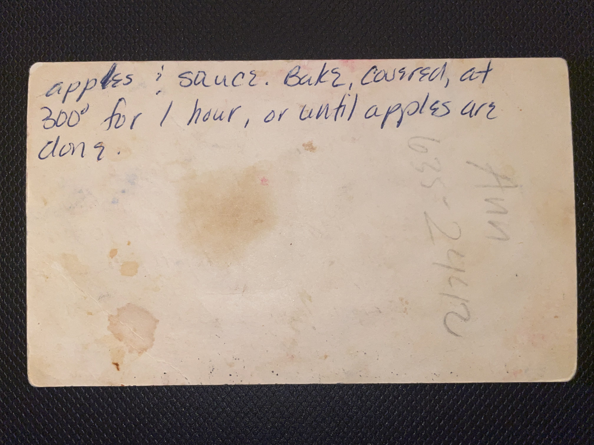

**Ingredients:**
- 4–6 apples, 4 yams (boil til tender, peel)

**Sauce:** 3 cups water, 1 1/2 cups sugar, 1 tsp. salt, 5 T. cornstarch — Mix sugar, cornstarch & salt. Add water, cook over medium heat until slightly thickened. Add 1 sq. butter.

**Instructions:**
Peel apples & slice. Layer yams then apples in casserole, spoon sauce over to barely cover. Repeat layers. Bake covered at 300° for 1 hour or until apples are tender.

---

## Main Dishes

---

### Amy's Pizza
*Source: IMG_9474*

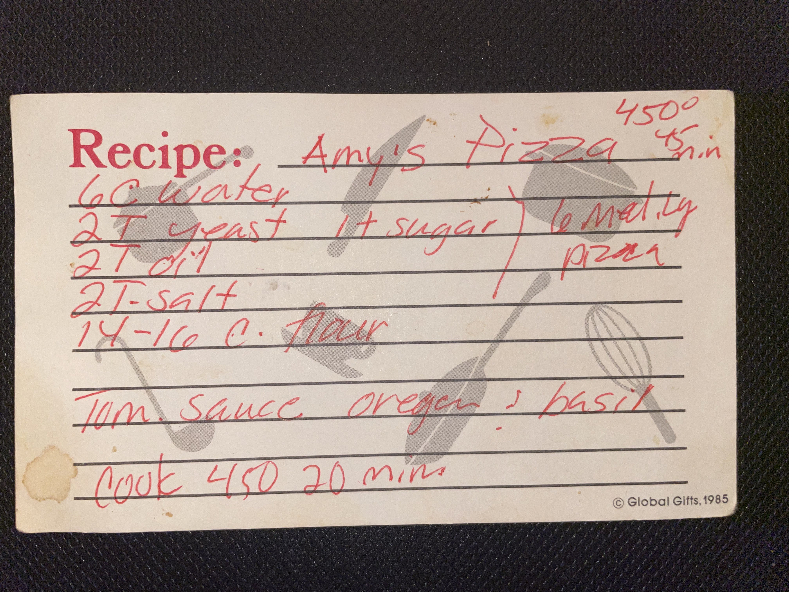

**Dough:** 6 c. water, 2 T. yeast, 1 t. sugar, 2 T. oil, 2 T. salt, 14–16 c. flour — makes 6 medium pizzas

**Instructions:**
Top with tomato sauce, oregano & basil. Cook at 450° for 20 min.

---

### Baked Halibut
*Source: IMG_9291 — Serves 6 **[uncertain]***

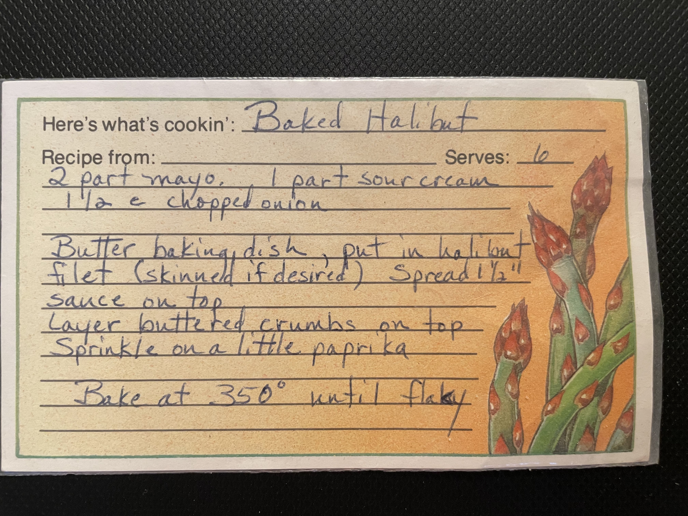

**Ingredients:**
- 2 parts mayo, 1 part sour cream, 1 1/2 c. chopped onion

**Instructions:**
Butter baking dish, put in halibut filet. Spread 1/2" sauce on top. Layer buttered crumbs on top. Sprinkle paprika. Bake at 350° until flaky.

---

### Barbecued Halibut with Baby Vegetables
*Source: Market Street (IMG_9297) — Serves 2*

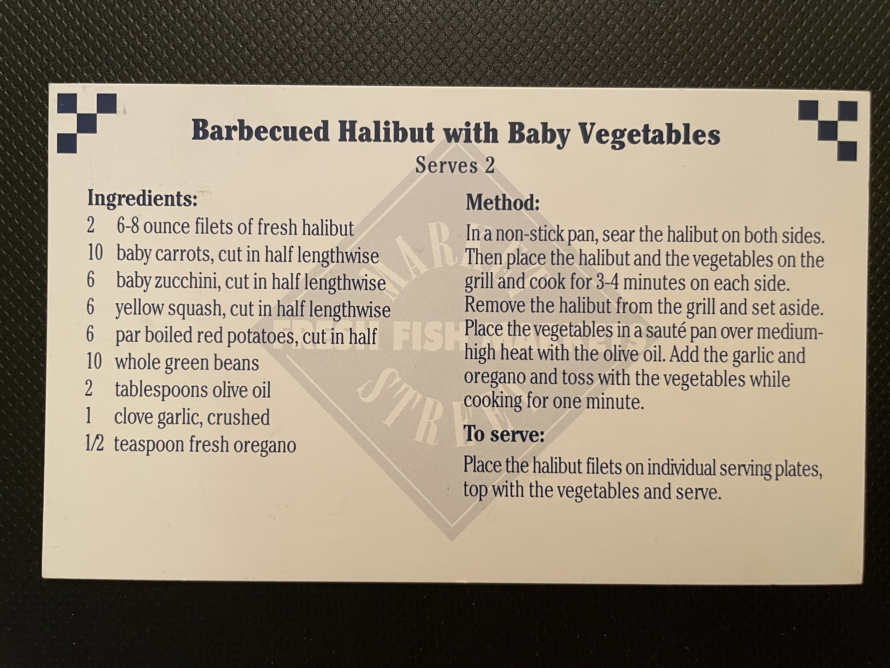

**Ingredients:**
- 2 (6–8 oz.) halibut filets, 10 baby carrots, 6 baby zucchini, 6 yellow squash, 6 par-boiled red potatoes, 6 whole green beans, 2 T. olive oil, 1 clove garlic (crushed), 1/2 tsp. fresh oregano

**Instructions:**
Sear halibut in non-stick pan on both sides. Place halibut and vegetables on grill, cook 3–4 minutes per side. Saute vegetables with olive oil, garlic, and oregano for one minute. Serve halibut topped with vegetables.

---

### Black and Blue Ahi Tuna
*Source: Market Street (IMG_9293) — Serves 4*

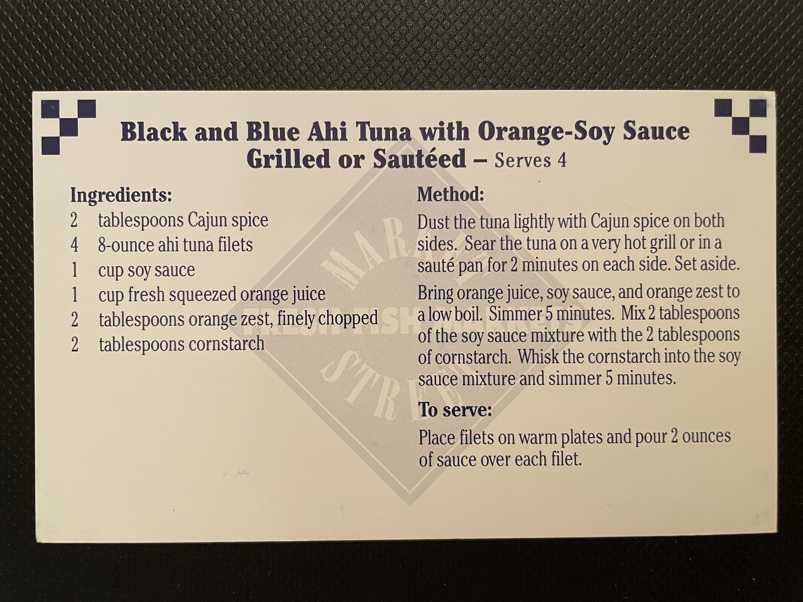

**Ingredients:**
- 2 T. Cajun spice, 4 (8 oz.) ahi tuna filets, 1 cup soy sauce, 1 cup fresh OJ, 2 T. orange zest, 2 T. cornstarch

**Instructions:**
Dust tuna with Cajun spice. Sear on very hot grill or pan, 2 min. each side. Make sauce: bring OJ, soy sauce, and zest to low boil, simmer 5 min. Thicken with cornstarch mixture, simmer 5 min. Pour 2 oz. sauce over each filet.

---

### Brisket
*Source: Brenda Graff **[uncertain]** (IMG_9328)*

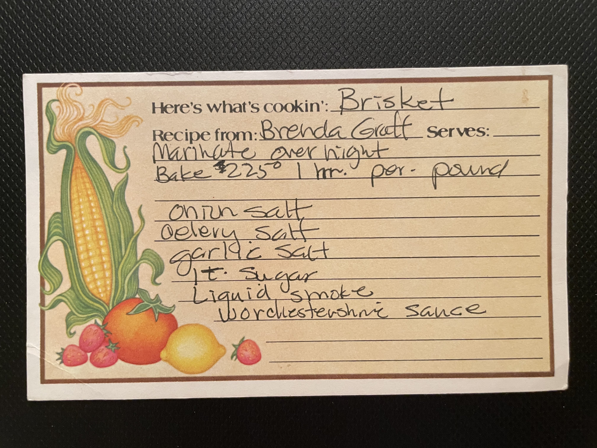

**Marinade:** onion salt, celery salt, garlic salt, sugar **[uncertain]**, liquid smoke, Worcestershire sauce

**Instructions:**
Marinate overnight. Bake 225° for 1 hr. per pound.

---

### Brown Tenderloin
*Source: IMG_9327*

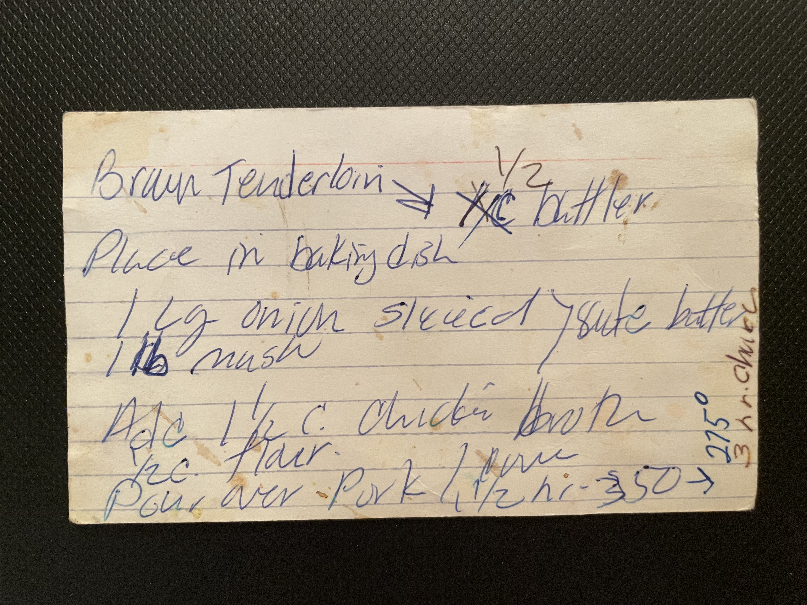

**Instructions:**
Brown tenderloin in butter **[uncertain]**. Place in baking dish. Saute 1 large onion (sliced) and 1 lb. mushrooms **[uncertain]** in butter. Add 1 1/2 c. chicken broth **[uncertain]** and flour. Pour over pork. Bake 1 hr at 350°.

---

### Cafe Rio Pork
*Source: Kathy's (IMG_9265)*

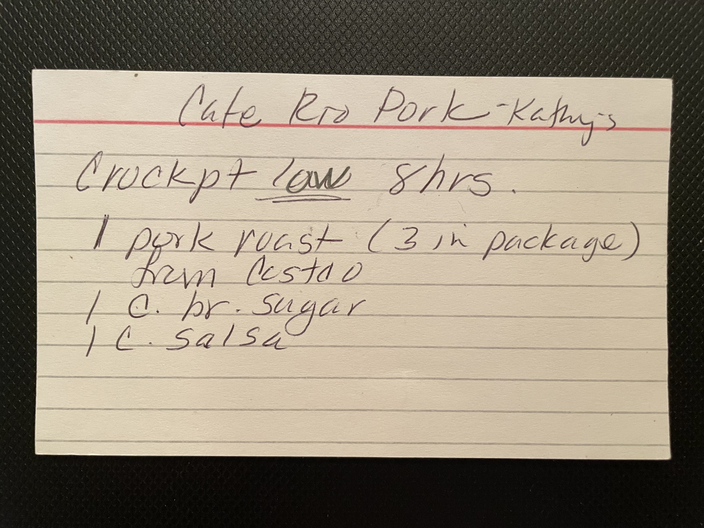

**Ingredients:**
- 1 pork roast (3 in package from Costco), 1 c. brown sugar, 1 c. salsa

**Instructions:**
Crockpot on low, 8 hrs.

---

### Caprese Chicken
*Source: homeandplate.com (IMG_9365) — Serves 4*

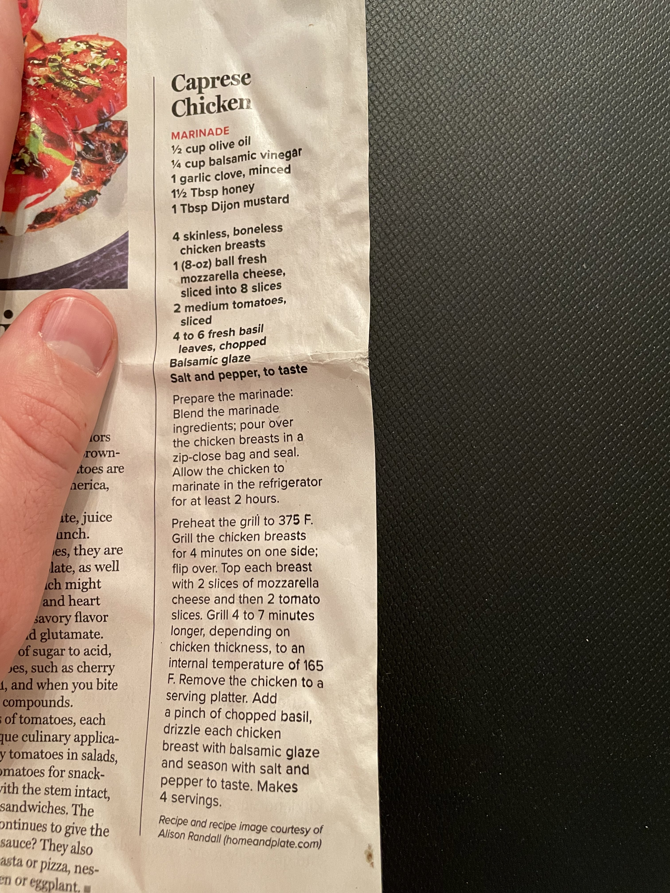

**Marinade:** 1/3 cup olive oil, 1/4 cup balsamic vinegar, 1 garlic clove minced, 1 1/2 T. honey, 1 T. Dijon mustard

**Other:** 4 chicken breasts, 1 (8 oz.) ball fresh mozzarella (8 slices), 2 medium tomatoes (sliced), fresh basil, balsamic glaze, salt & pepper

**Instructions:**
Marinate chicken at least 2 hours. Grill 4 min, flip. Top with mozzarella and tomato slices. Grill 4–7 min more to 165°F. Garnish with basil and balsamic glaze.

---

### Carla's Chicken Enchiladas
*Source: IMG_9271*

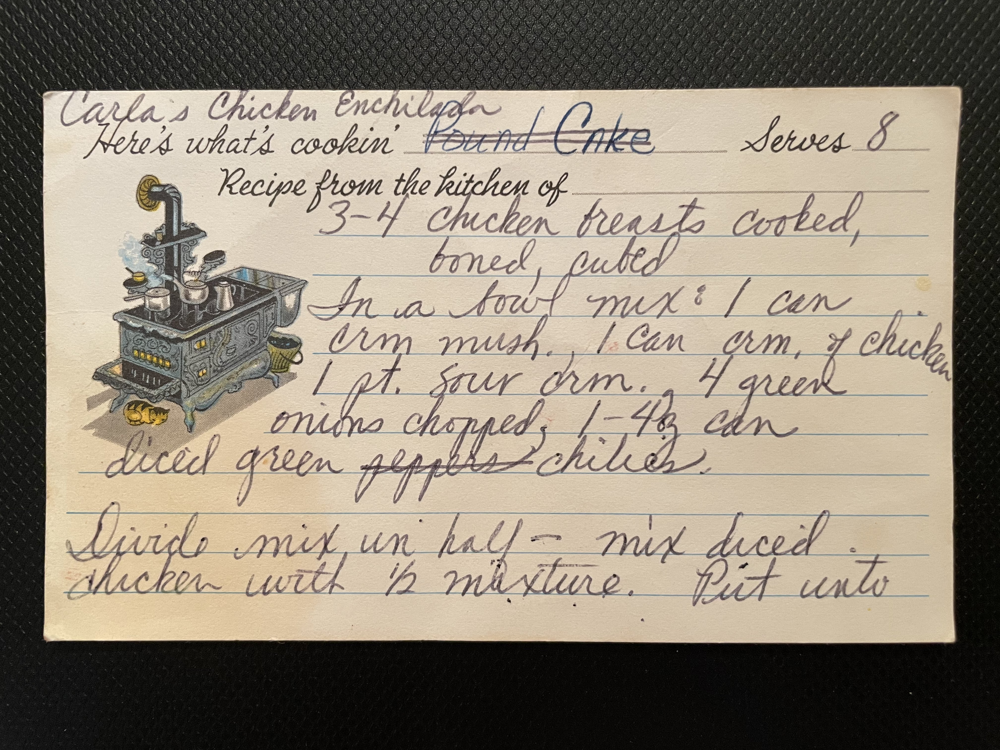

**Ingredients:**
- 3–4 chicken breasts (cooked, boned, cubed)
- 1 can cream of mushroom soup, 1 can cream of chicken soup, 1 pt. sour cream, 4 green onions (chopped), 1 (4 oz.) can diced green chilies

**Instructions:**
Mix soups, sour cream, onions, and chilies. Divide in half. Mix chicken with half of mixture. Put into tortillas. Serves 8.

---

### Carla's Zucchini Casserole
*Source: IMG_9531 / IMG_9532 — Serves 10–12*

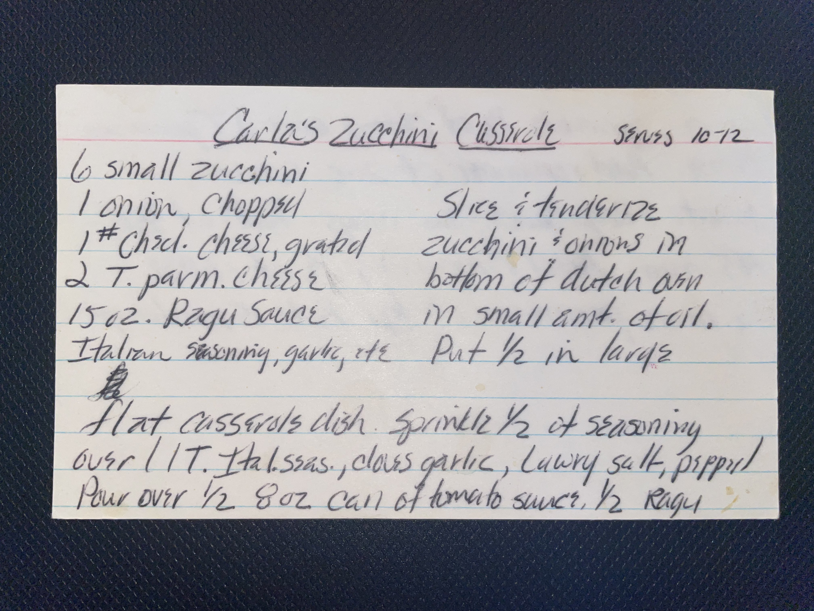

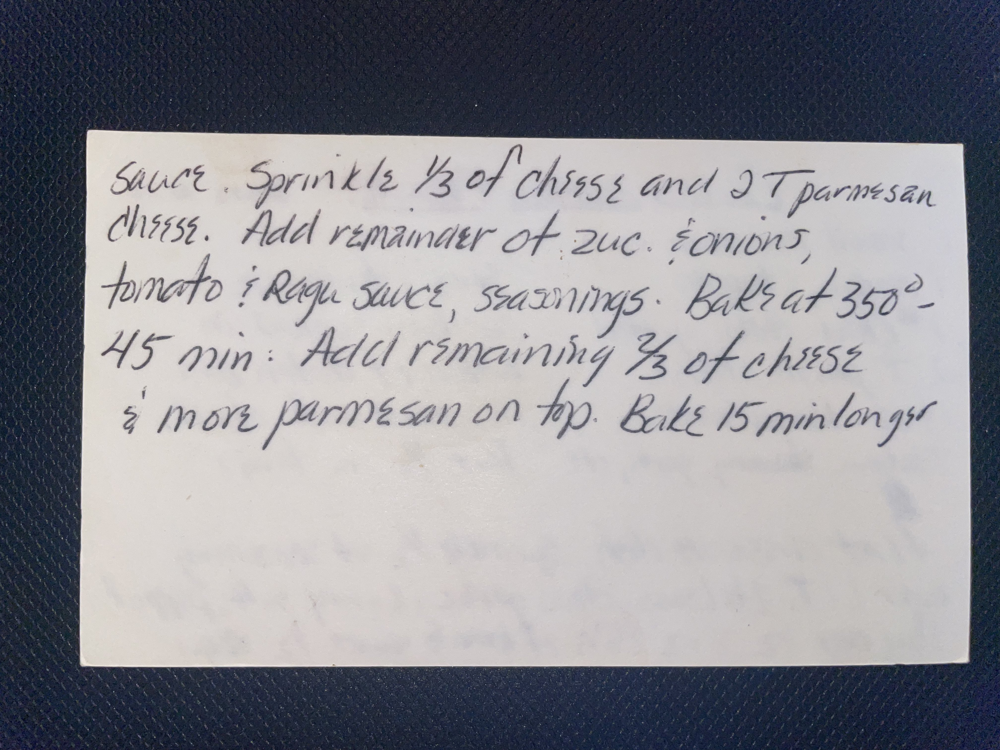

**Ingredients:**
- 6 small zucchini, 1 onion (chopped), 1 lb. cheddar cheese (grated), 2 T. Parmesan cheese, 15 oz. Ragu Sauce, Italian seasoning, garlic, 1 (8 oz.) can tomato sauce

**Instructions:**
Slice & tenderize zucchini & onions in oil. Put 1/2 in casserole. Sprinkle 1/2 seasoning (1 T. Italian seasoning, garlic, Lawry's salt **[uncertain]**, pepper). Pour over 1/2 tomato sauce, 1/2 Ragu. Sprinkle 1/3 cheese and Parmesan. Add remaining layers. Bake at 350° for 45 min. Add remaining cheese on top. Bake 15 min longer.

---

### Cheeseburger Loaf
*Source: IMG_9520 — 6 servings*

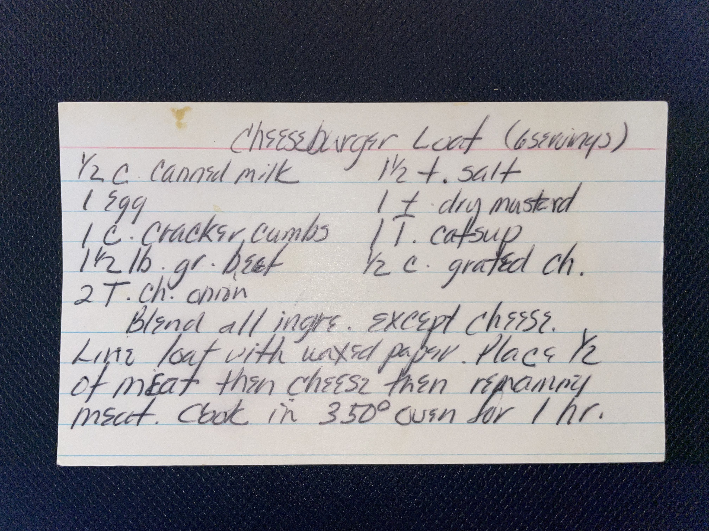

**Ingredients:**
- 1/2 c. canned milk, 1 1/2 t. salt, 1 egg, 1 t. dry mustard, 1 c. cracker crumbs, 1 T. catsup, 1 1/2 lb. ground beef, 1/2 c. grated cheese, 2 T. chopped onion

**Instructions:**
Blend all except cheese. Line loaf pan with waxed paper. Place 1/2 meat, then cheese, then remaining meat. Cook at 350° for 1 hr.

---

### Chicken and Broccoli
*Source: IMG_9204*

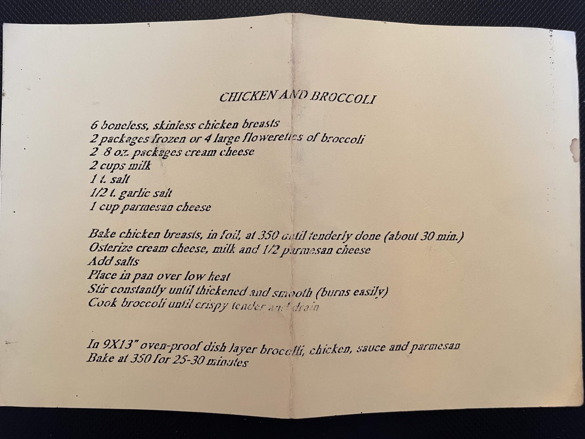

**Ingredients:**
- 6 chicken breasts, 2 pkg. frozen broccoli (or 4 large flowerettes), 2 (8 oz.) pkg. cream cheese, 2 cups milk, 1 t. salt, 1/2 t. garlic salt, 1 cup Parmesan cheese

**Instructions:**
Bake chicken in foil at 350° for 30 min. Blend cream cheese, milk, and 1/2 Parmesan. Add salts. Cook over low heat, stirring constantly until thickened. Cook broccoli until crispy tender. Layer broccoli, chicken, sauce, and Parmesan in 9x13 dish. Bake at 350° for 25–30 minutes.

---

### Chicken Breasts Parmesan
*Source: Relief Society Dinner (IMG_9372)*

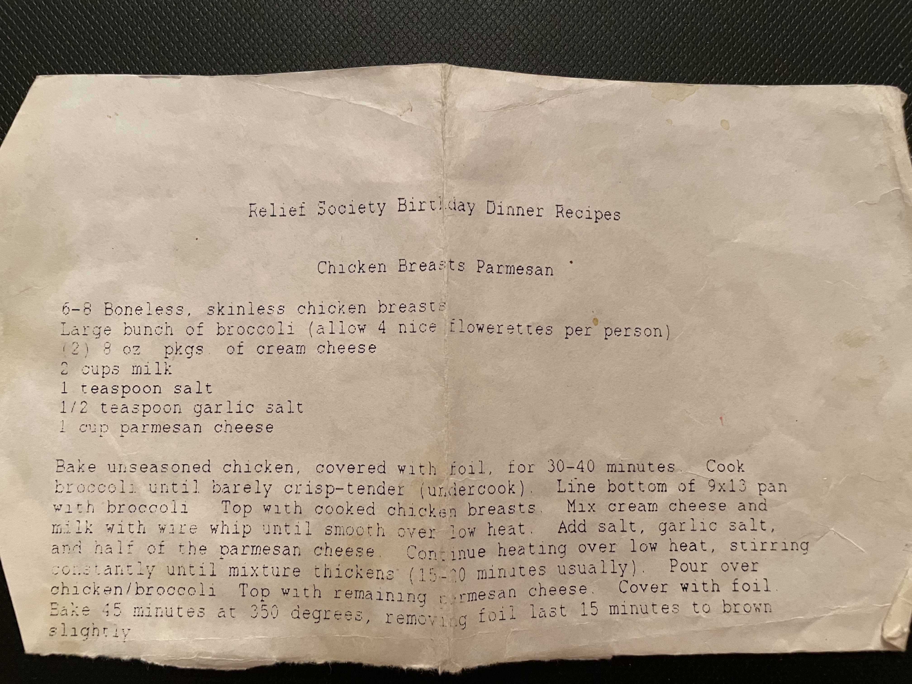

**Ingredients:**
- 6–8 chicken breasts, large bunch broccoli, 2 (8 oz.) pkg. cream cheese, 2 cups milk, 1 tsp. salt, 1/2 tsp. garlic salt, 1 cup Parmesan cheese

**Instructions:**
Bake chicken covered with foil for 30–40 mins. Cook broccoli until barely crisp-tender. Line pan with broccoli, top with chicken. Make cream sauce: mix cream cheese and milk until smooth over low heat, add salt, garlic salt, half the Parmesan. Pour over chicken. Top with remaining Parmesan. Bake 15 min at 350°, remove foil last 15 min.

---

### Chicken-Broccoli Casserole
*Source: Lou Bourdon **[uncertain]** (IMG_9193)*

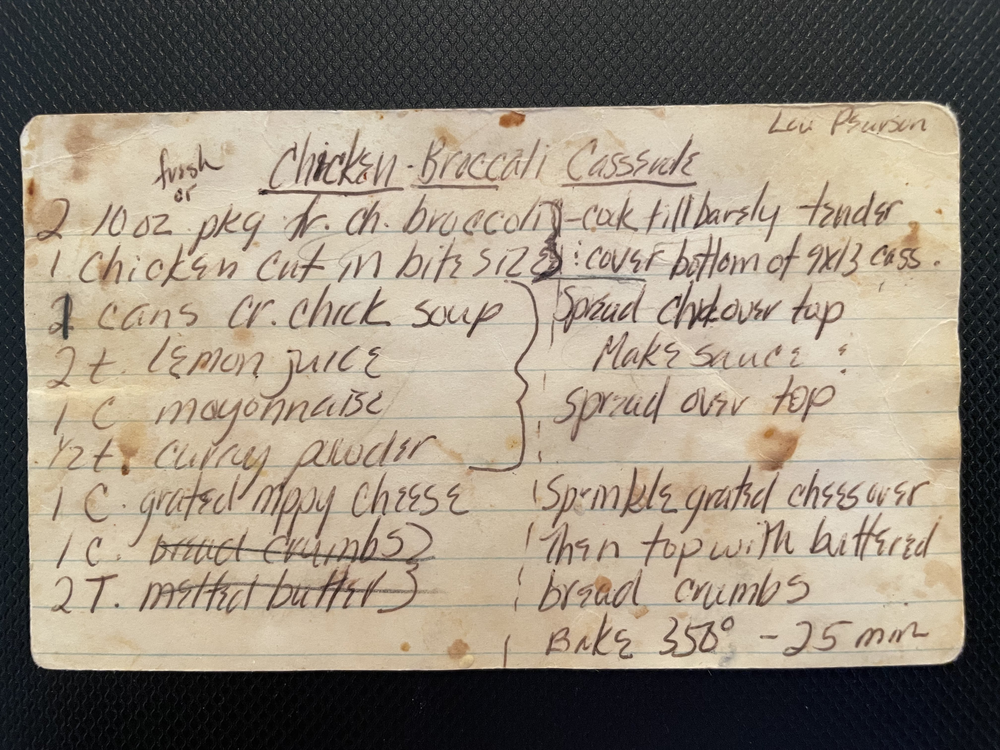

**Ingredients:**
- 2 (10 oz.) pkg. frozen broccoli (cook til barely tender), 1 chicken (cut in bite size), 2 cans cream of chicken soup, 2 t. lemon juice, 1 c. mayonnaise, 1/2 t. curry powder, 1 c. grated nippy cheese, 1 c. bread crumbs, 2 T. melted butter

**Instructions:**
Cover bottom of 9x13 casserole with broccoli. Spread chicken over top. Make sauce with soup, lemon juice, mayo, curry. Spread over top. Sprinkle grated cheese, then buttered bread crumbs. Bake 350° for 25 min.

---

### Chicken Casserole
*Source: IMG_9198 — Serves 10–12*

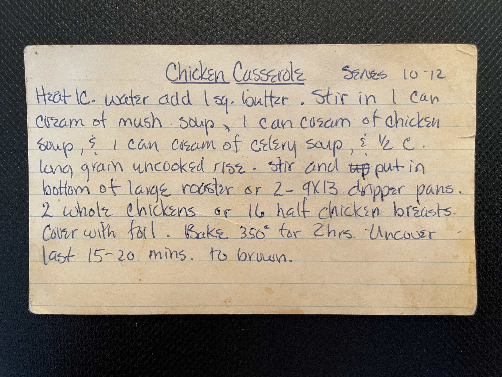

**Instructions:**
Heat 1 c. water, add 1 sq. butter. Stir in 1 can each: cream of mushroom, chicken, and celery soup, plus 1/2 c. long grain rice. Put in bottom of large roaster or 2 (9x13) pans. Add 2 whole chickens or 16 half chicken breasts. Cover with foil. Bake 350° for 2 hrs. Uncover last 15–20 mins to brown.

---

### Chicken Enchilada
*Source: IMG_9262 / IMG_9263*

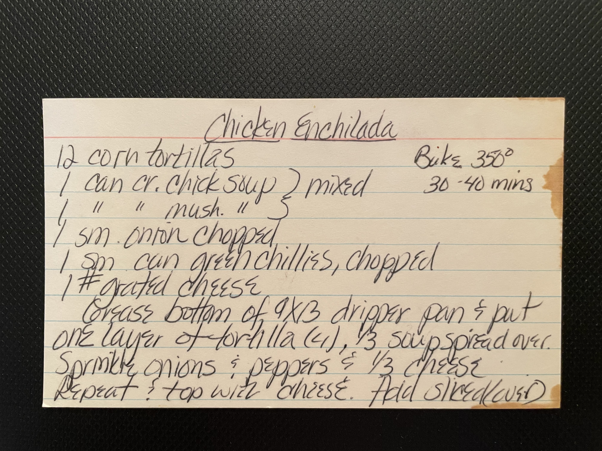

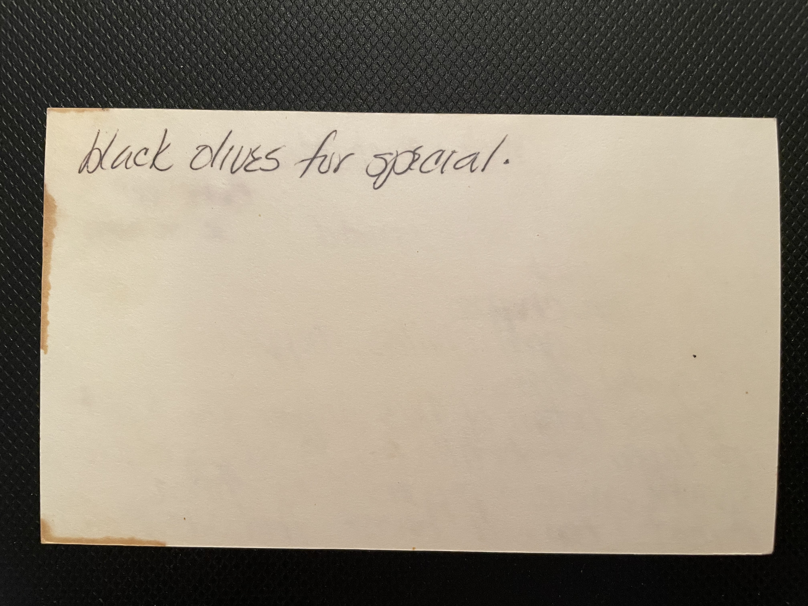

**Ingredients:**
- 12 corn tortillas, 1 can cream of chicken soup, 1 can cream of mushroom soup (mixed), 1 sm. onion (chopped), 1 sm. can green chilies (chopped), 1 lb. grated cheese

**Instructions:**
Grease bottom of 9x13 pan. Layer 4 tortillas, 1/3 soup, onions, peppers, 1/3 cheese. Repeat. Top with cheese and black olives. Bake at 350° for 30–40 mins.

---

### Chicken Noodle Bake
*Source: Kathy (IMG_9527)*

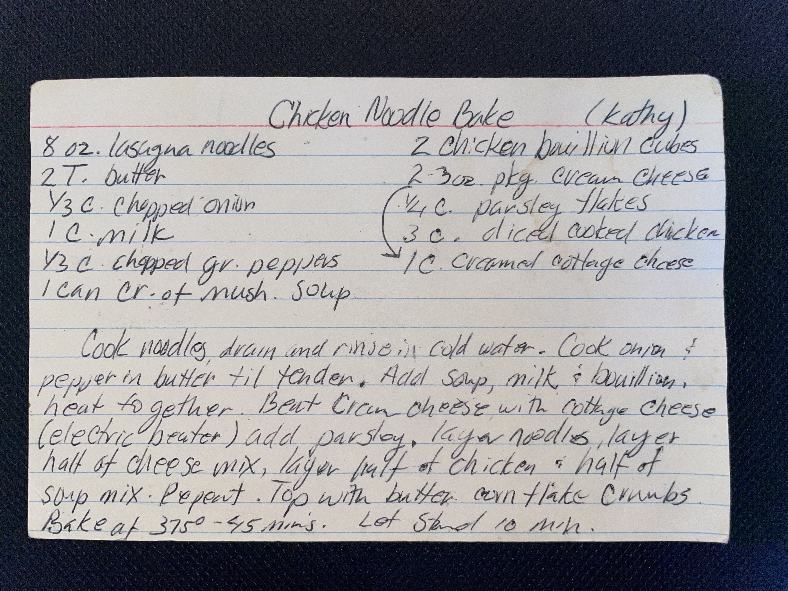

**Ingredients:**
- 8 oz. lasagna noodles, 2 T. butter, 1/3 c. chopped onion, 1 c. milk, 1/3 c. chopped green peppers, 1 can cream of mushroom soup, 2 chicken bouillon cubes, 2 (3 oz.) pkg. cream cheese, 1/4 c. parsley flakes, 3 c. diced cooked chicken, 1 c. creamed cottage cheese

**Instructions:**
Cook noodles. Cook onion & pepper in butter. Add soup, milk & bouillon. Beat cream cheese with cottage cheese. Add parsley. Layer noodles, cheese mix, chicken, soup mix. Repeat. Top with buttered corn flake crumbs. Bake at 375° for 45 mins. Let stand 10 min.

---

### Chile Relleno Casserole
*Source: IMG_9284 (also IMG_9275) — Serves 8–10*

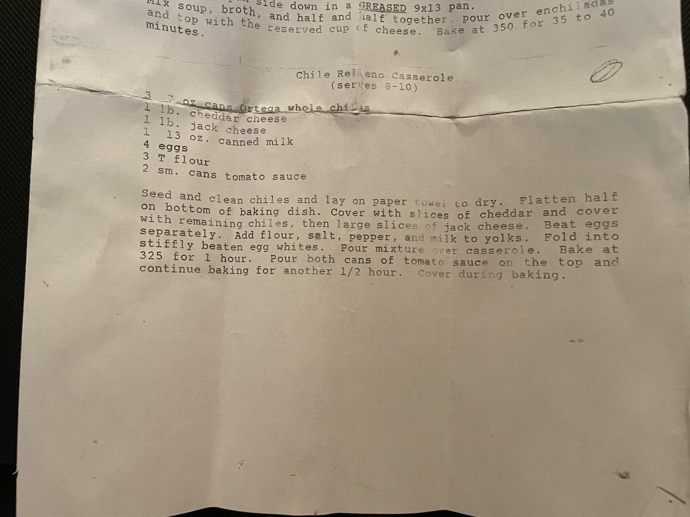

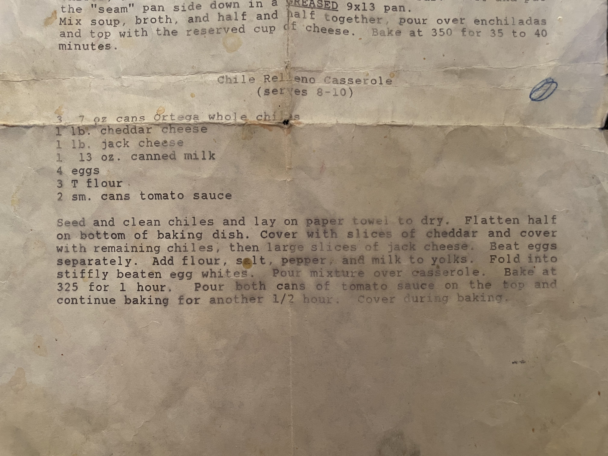

**Ingredients:**
- 3 (7 oz.) cans Ortega whole chiles **[uncertain]**, 1 lb. cheddar cheese, 1 lb. jack cheese, 1 (13 oz.) canned milk, 4 eggs, 3 T. flour, 2 sm. cans tomato sauce

**Instructions:**
Seed and clean chiles. Flatten half on bottom of baking dish. Cover with cheddar slices, then remaining chiles, then jack cheese slices. Beat eggs separately. Add flour, salt, pepper, and milk to yolks. Fold into stiffly beaten whites. Pour over casserole. Bake at 325° for 1 hour. Pour tomato sauce on top, bake another 1/2 hour. Cover during baking.

---

### Enchilada Casserole
*Source: IMG_9500*

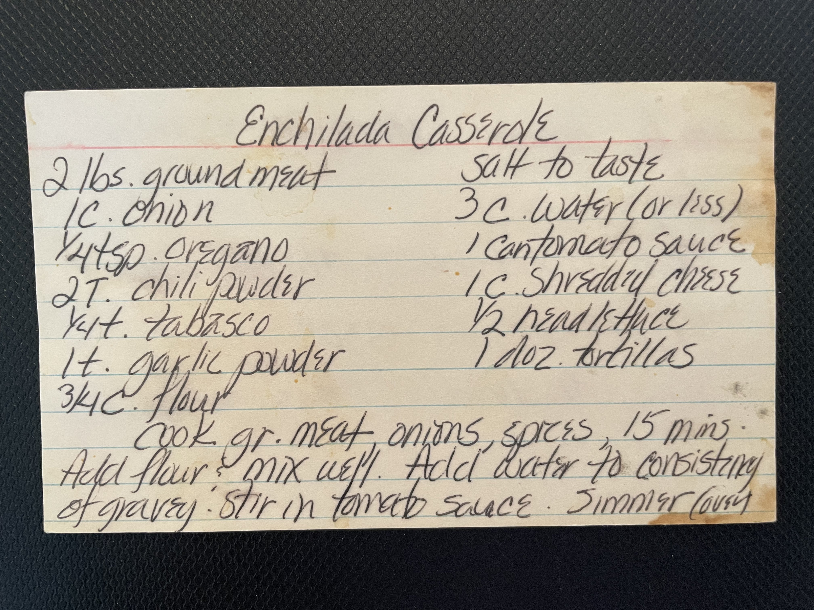

**Ingredients:**
- 2 lbs. ground meat, 1 c. onion, 1/4 tsp. oregano, 2 T. chili powder, 1/4 t. Tabasco, 1 t. garlic powder, 3/4 c. flour, salt to taste, 3 c. water (or less), 1 can tomato sauce, 1 c. shredded cheese, 1/2 head lettuce, 1 dozen tortillas

**Instructions:**
Cook ground meat, onions, spices 15 mins. Add flour & mix well. Add water to consistency of gravy. Stir in tomato sauce. Simmer. *(Instructions continue on back of card — "over")*

---

### Enchilada's (Mave's)
*Source: IMG_9273 / IMG_9272*

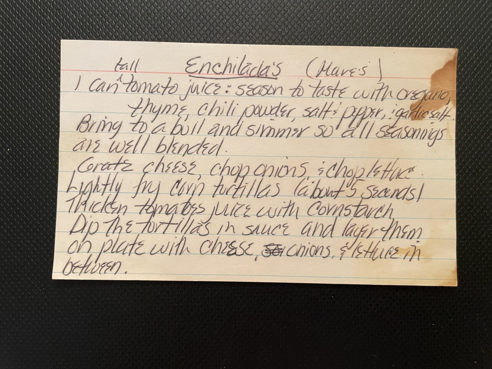

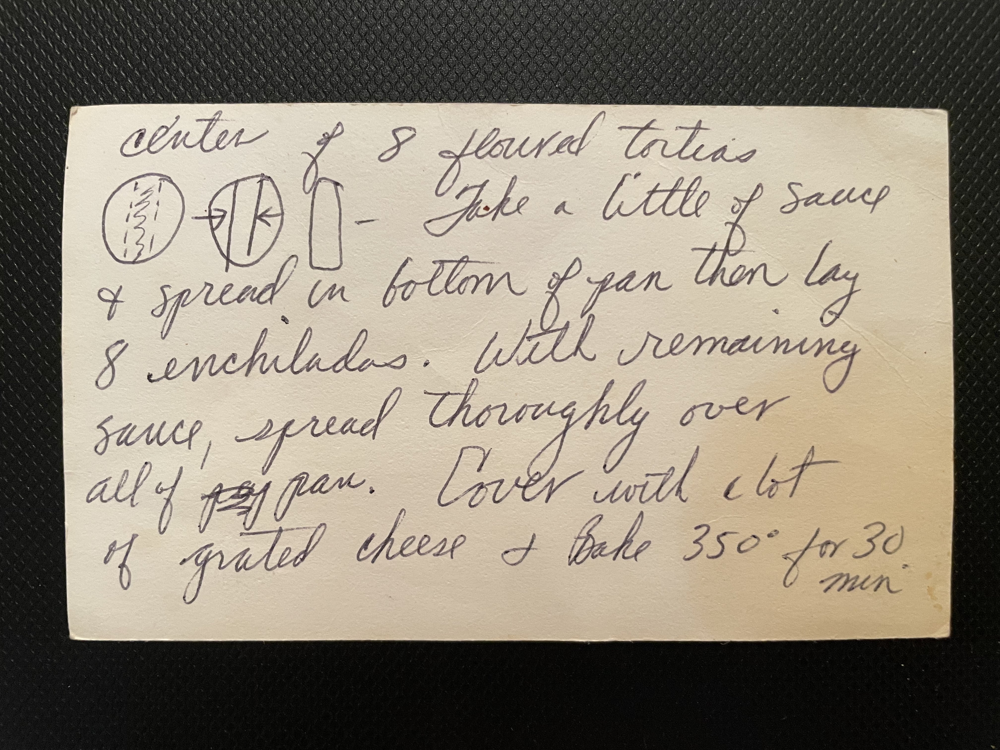

**Instructions:**
Season a tall can of tomato juice with oregano, thyme, chili powder, salt, pepper, garlic salt. Bring to a boil and simmer. Grate cheese, chop onions & lettuce. Lightly fry corn tortillas (~5 seconds). Thicken juice with cornstarch. Dip tortillas in sauce, layer with cheese, onions, & lettuce. For baked version: fill 8 flour tortillas, place in greased pan, spread remaining sauce over all. Cover with cheese. Bake 350° for 30 min.

---

### Festive Cranberry Chicken
*Source: IMG_9367*

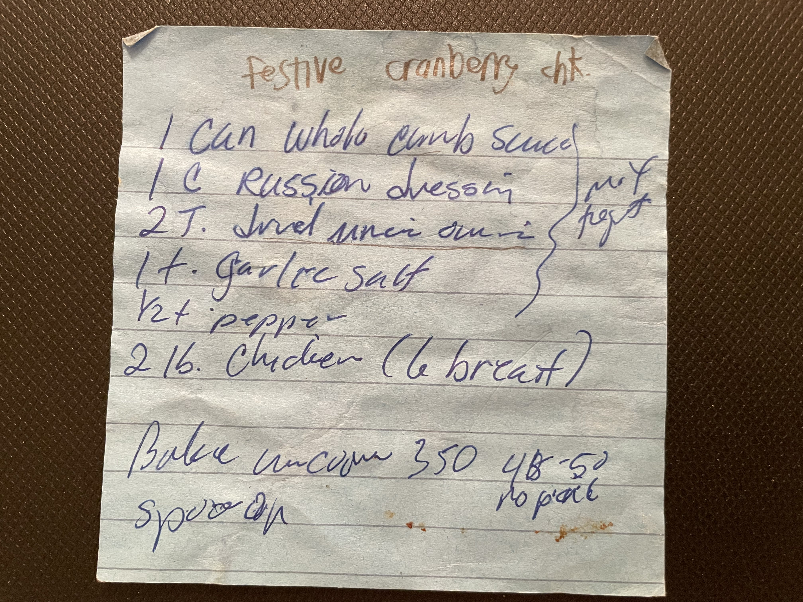

**Ingredients:**
- 1 can whole cranberry sauce, 1 c. Russian dressing, 2 T. dried onion **[uncertain]**, 1 t. garlic salt, 1/2 t. pepper, 2 lbs. chicken (6 breasts) — mix sauce together

**Instructions:**
Bake uncovered at 350° for 48–50 min **[uncertain]**. Spoon sauce on. No peeking **[uncertain]**.

---

### Good & Easy Pizza
*Source: B. Duff **[uncertain]** (IMG_9538 / IMG_9539)*

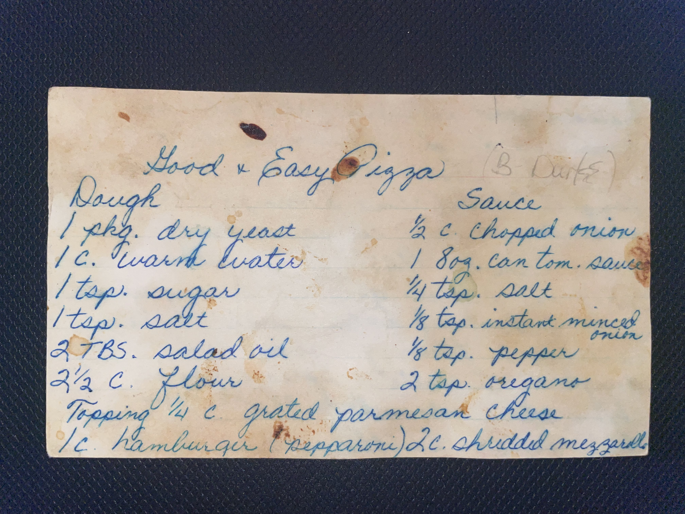

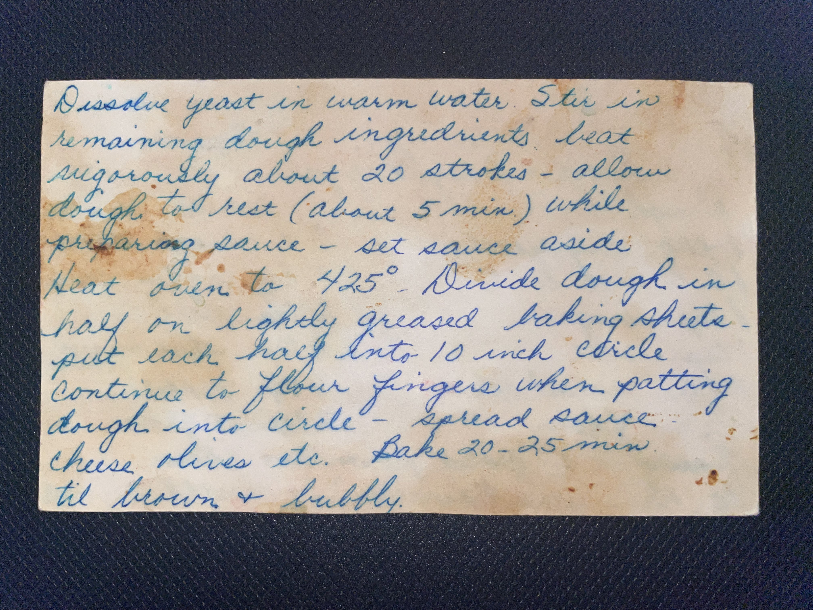

**Dough:** 1 pkg. dry yeast, 1 c. warm water, 1 tsp. sugar, 1 tsp. salt, 2 TBS. salad oil, 2 1/2 c. flour

**Sauce:** 1/2 c. chopped onion, 1 (8 oz.) can tomato sauce, 1/4 tsp. salt, 1/8 tsp. minced onion, 1/8 tsp. pepper, 2 tsp. oregano

**Topping:** 1/4 c. Parmesan, 1 c. hamburger or pepperoni, 2 c. shredded mozzarella **[uncertain]**

**Instructions:**
Dissolve yeast in warm water. Stir in dough ingredients, beat 20 strokes. Rest 5 min. Heat oven to 425°. Divide dough in half, pat into 10-inch circles on greased baking sheets. Spread sauce, cheese, olives, etc. Bake 20–25 min.

---

### Green Chili Verde
*Source: IMG_9285*

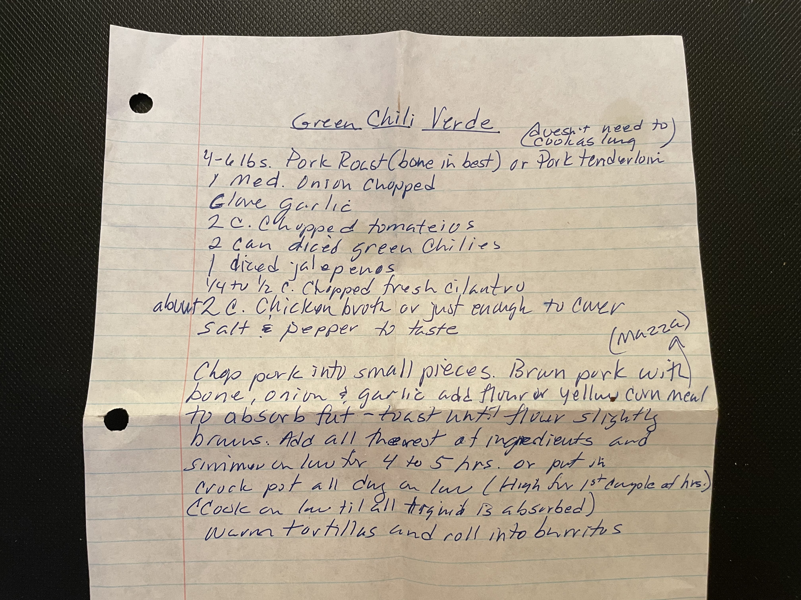

**Ingredients:**
- 4–6 lbs. pork roast (bone in best), 1 med. onion (chopped), 6 cloves garlic **[uncertain]**, 2 c. chopped tomatoes **[uncertain]**, 2 cans diced green chilies, 1 diced jalapeno, 1/4–1/2 c. chopped fresh cilantro, about 2 c. chicken broth, salt & pepper

**Instructions:**
Chop pork into small pieces. Brown with bone, onion & garlic; add flour or yellow corn meal to absorb fat. Toast until flour slightly browns. Add remaining ingredients. Simmer 4–5 hrs, or put in crockpot all day on low. Serve in warm tortillas as burritos.

---

### Ham Loaf
*Source: Joyce (IMG_9333)*

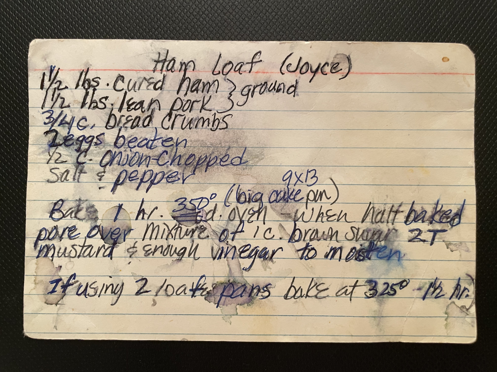

**Ingredients:**
- 1 1/2 lbs. cured ham (ground), 1 1/2 lbs. lean pork (ground), 3/4 c. bread crumbs, 2 eggs beaten, 1/2 c. onion chopped, salt & pepper

**Instructions:**
Bake in 9x13 pan at 350° for 1 hr. When half baked, pour over mixture of 1 c. brown sugar, 2 T. mustard, and enough vinegar to moisten.

---

### Ham Rolls
*Source: IMG_9521 / IMG_9522 — V.G. (Very Good)*

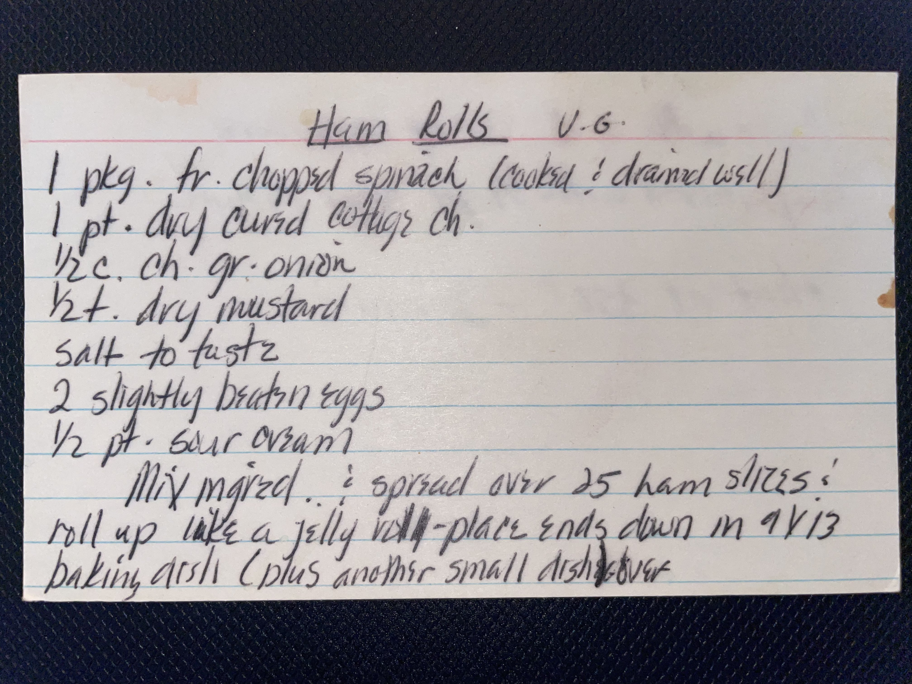

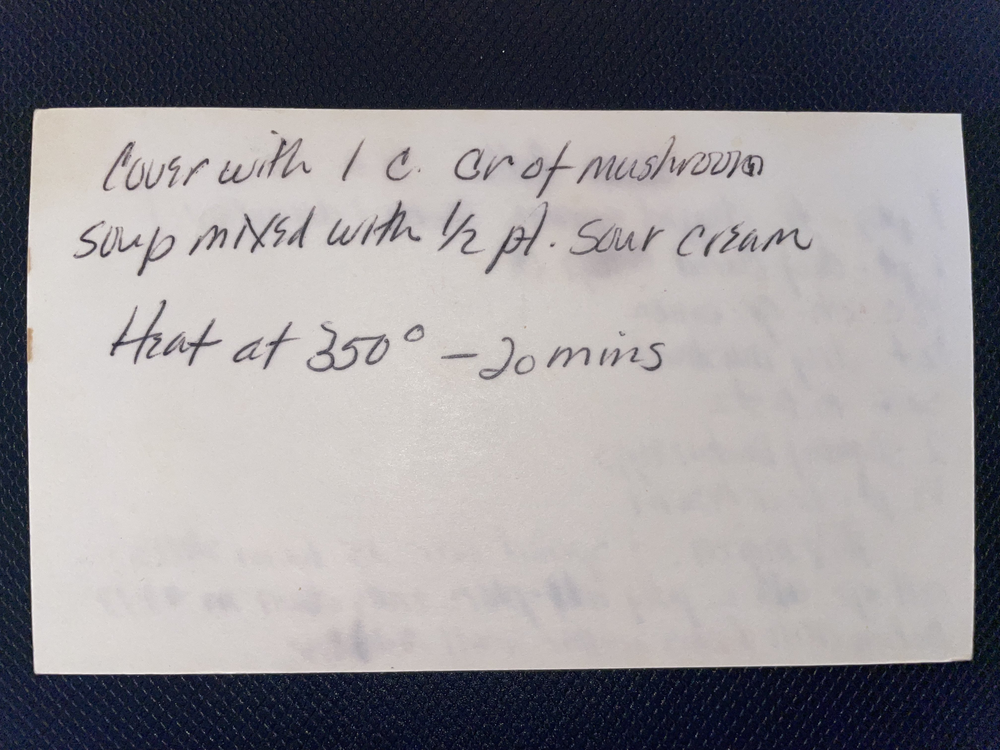

**Ingredients:**
- 1 pkg. frozen chopped spinach (cooked & drained well), 1 pt. dry curd cottage cheese, 1/2 c. chopped green onion **[uncertain]**, 1/2 t. dry mustard, salt to taste, 2 slightly beaten eggs, 1/2 pt. sour cream, 25 ham slices, 1 c. cream of mushroom soup

**Instructions:**
Mix filling & spread over 25 ham slices. Roll up like a jelly roll, place ends down in 9x13 dish. Cover with 1 c. cream of mushroom soup mixed with 1/2 pt. sour cream. Heat at 350° for 20 mins.

---

### Hamburger All-In-One Meal
*Source: IMG_9200*

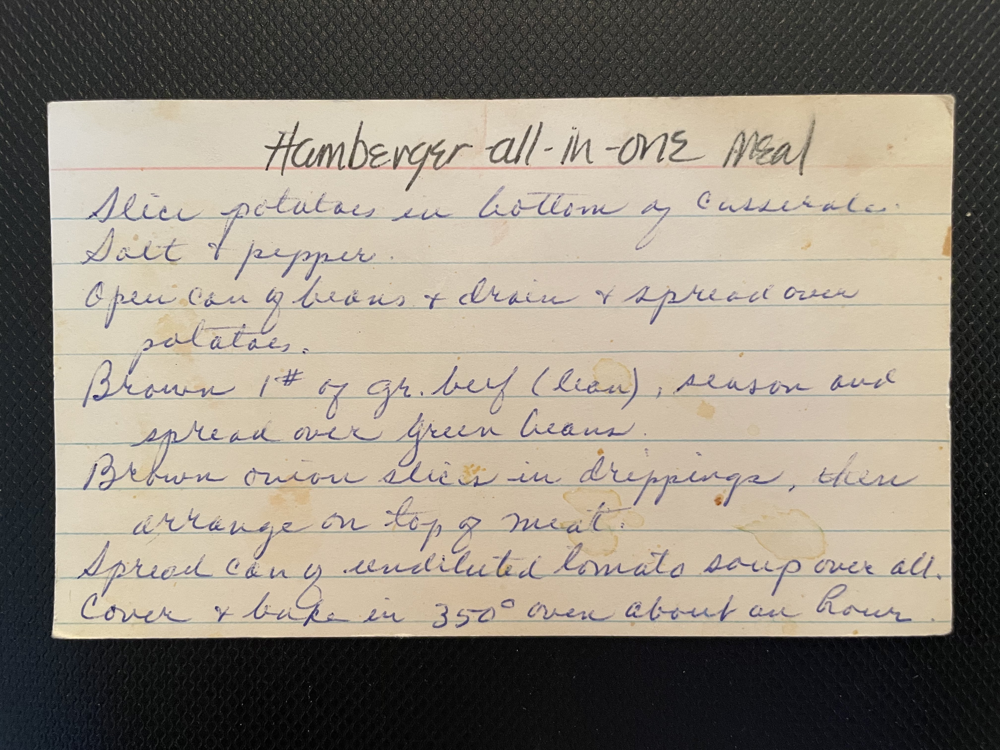

**Instructions:**
Slice potatoes in bottom of casserole, salt & pepper. Open can of beans, drain, spread over potatoes. Brown 1 lb. lean ground beef, season, spread over beans. Brown onion slices, arrange on top. Spread can of undiluted tomato soup over all. Cover & bake at 350° about an hour.

---

### Heather's Chicken Enchiladas
*Source: IMG_9274 (also IMG_9283) — Serves 8–10*

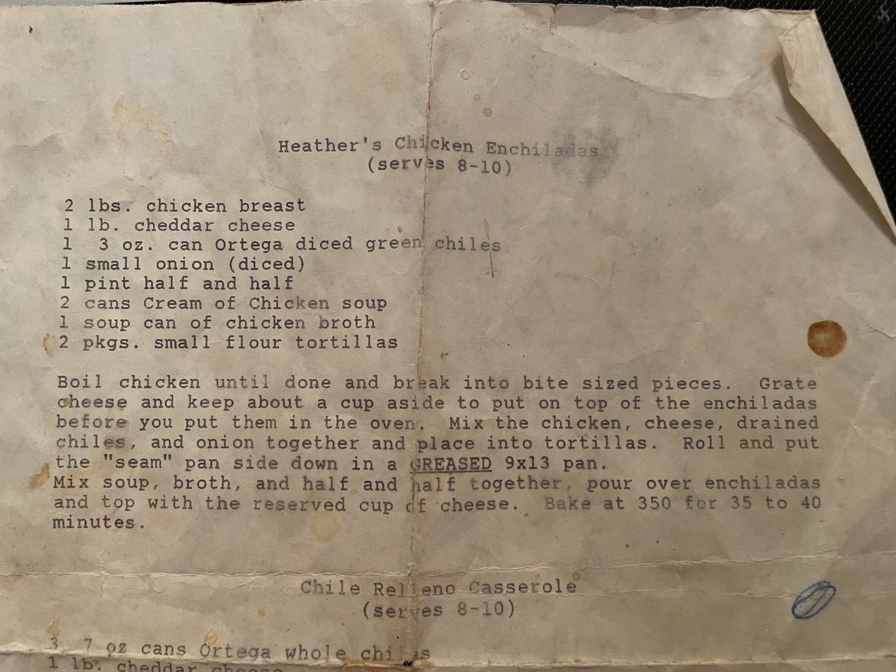

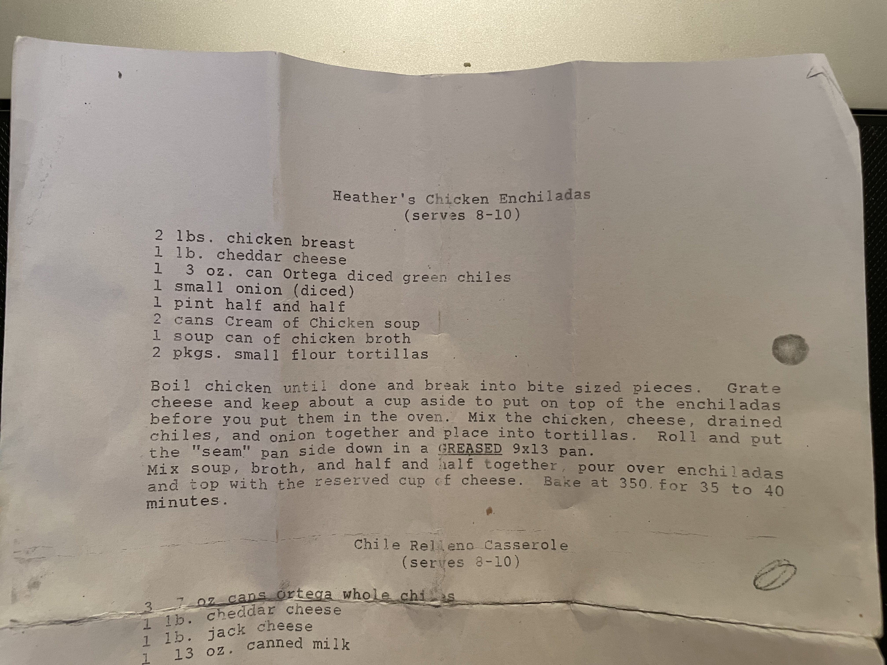

**Ingredients:**
- 2 lbs. chicken breast, 1 lb. cheddar cheese, 1 (3 oz.) can Ortega diced green chiles, 1 small onion (diced), 1 pint half & half, 2 cans cream of chicken soup, 1 soup can chicken broth, 2 pkg. small flour tortillas

**Instructions:**
Boil chicken, break into pieces. Grate cheese (reserve 1 cup). Mix chicken, cheese, chiles, and onion. Place in tortillas, roll seam-side down in greased 9x13 pan. Mix soup, broth, and half & half. Pour over enchiladas. Top with reserved cheese. Bake at 350° for 35–40 minutes.

---

### How to Cook Shrimp
*Source: Albertsons (IMG_9288 / IMG_9289)*

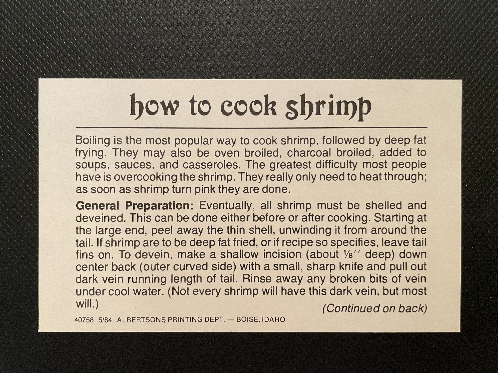

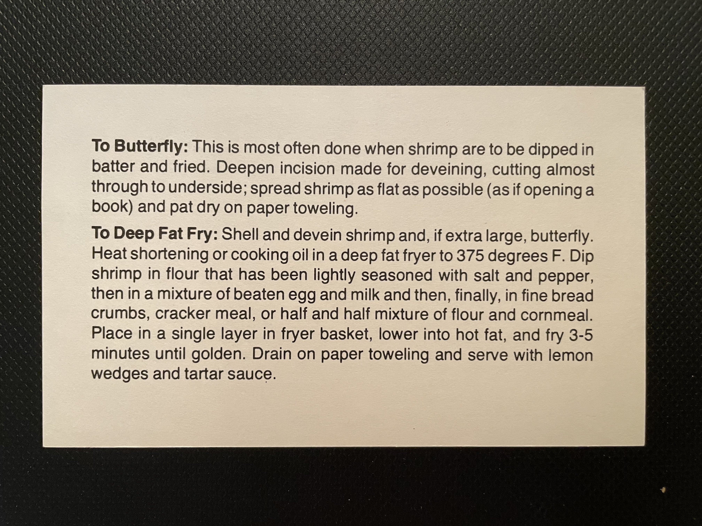

General preparation, butterflying, and deep fat frying instructions for shrimp. Fry at 375°F for 3–5 minutes until golden. Serve with lemon wedges and tartar sauce.

---

### Individual Pizzas
*Source: IMG_9540 — Serves 6*

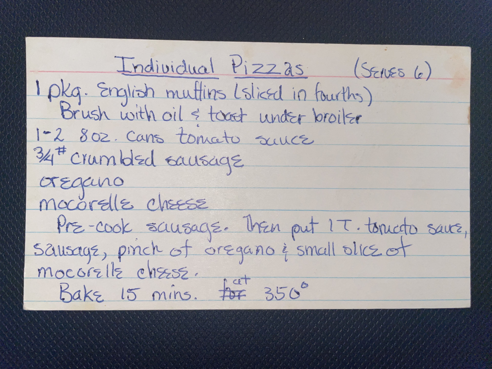

**Ingredients:**
- 1 pkg. English muffins (sliced in fourths), oil, 1–2 (8 oz.) cans tomato sauce, 3/4 lb. crumbled sausage, oregano, mozzarella cheese

**Instructions:**
Brush muffins with oil & toast under broiler. Pre-cook sausage. Put 1 T. tomato sauce, sausage, pinch of oregano & small slice of mozzarella on each. Bake 15 mins at 350°.

---

### Lake Chicken
*Source: IMG_9373*

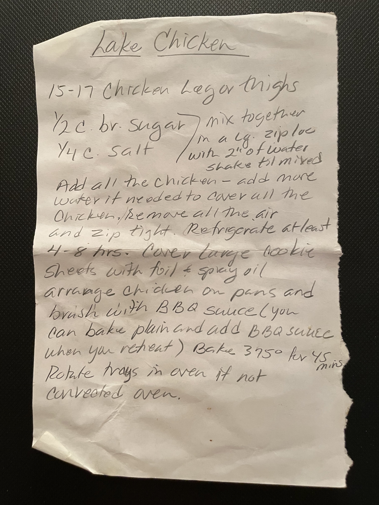

**Brine:** 1/2 c. brown sugar, 1/4 c. salt, water (in large ziploc) — add 15–17 chicken legs/thighs, cover with water, refrigerate 4–8 hrs.

**Instructions:**
Cover cookie sheets with foil, spray with oil. Arrange chicken, brush with BBQ sauce. Bake 375° for 45 mins. Rotate trays if not convection oven.

---

### Lasagna
*Source: Sayer **[uncertain]** (IMG_9197)*

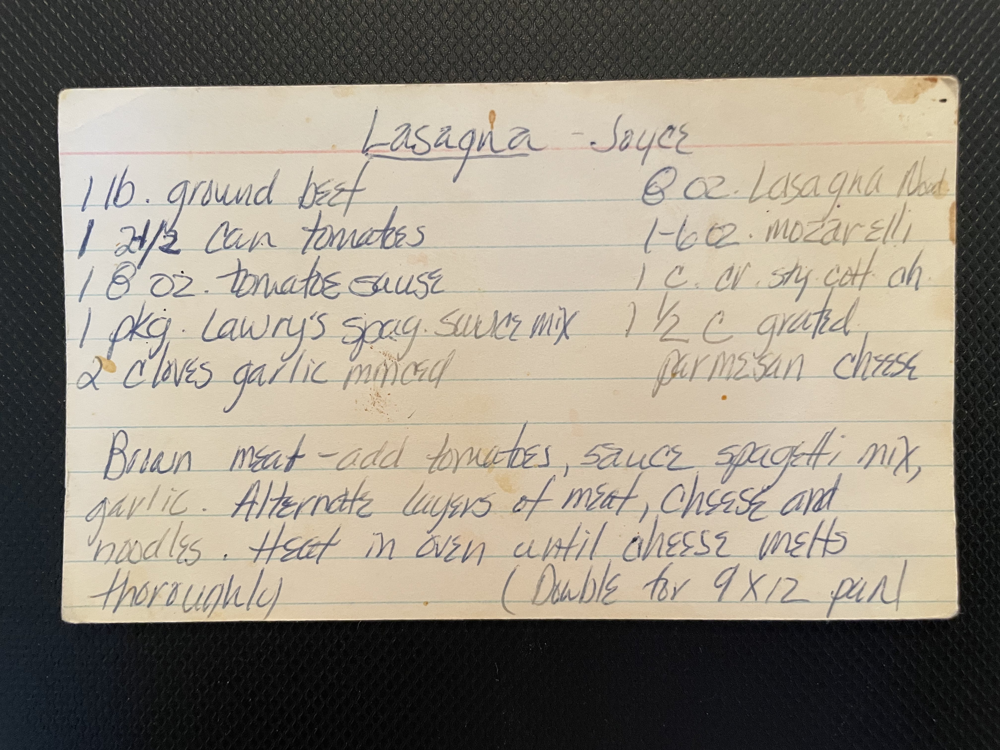

**Ingredients:**
- 1 lb. ground beef, 8 oz. lasagna noodles, 1 (2 1/2) can tomatoes **[uncertain]**, 1 (6 oz.) mozzarella, 1 (8 oz.) tomato sauce, 1 c. cottage cheese **[uncertain]**, 1 pkg. Lawry's spaghetti sauce mix, 1 1/2 c. grated Parmesan, 2 cloves garlic

**Instructions:**
Brown meat. Add tomatoes, sauce, spaghetti mix, garlic. Alternate layers of meat, cheese, and noodles. Heat in oven until cheese melts. (Double for 9x12 pan.)

---

### Lasagne
*Source: IMG_9194 / IMG_9195 — Serves 12–14*

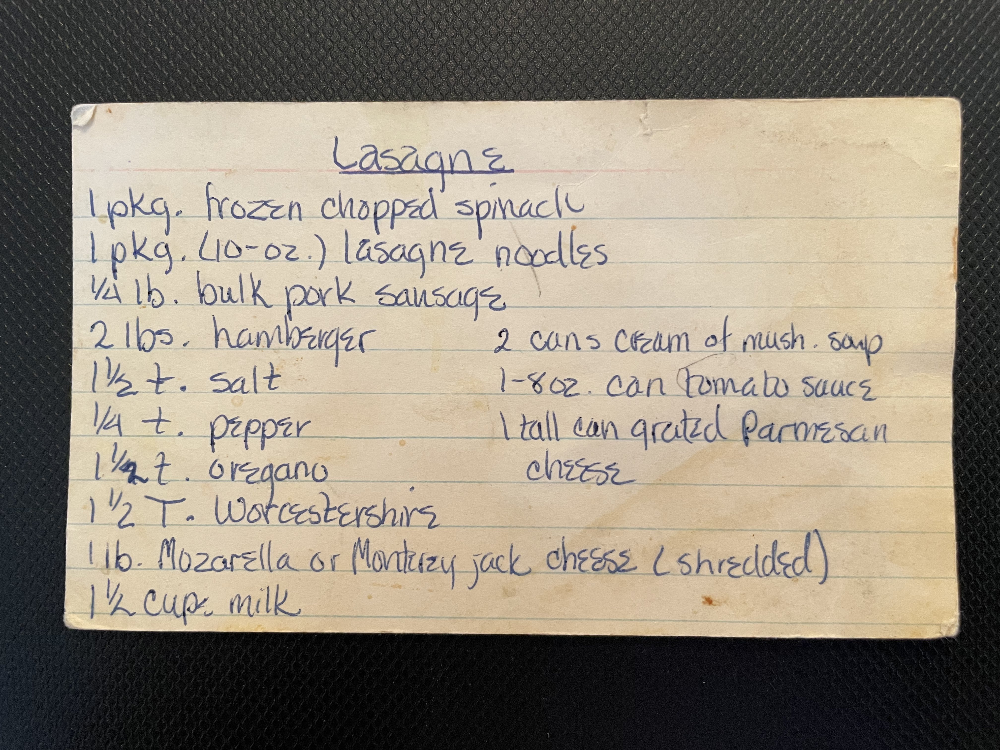

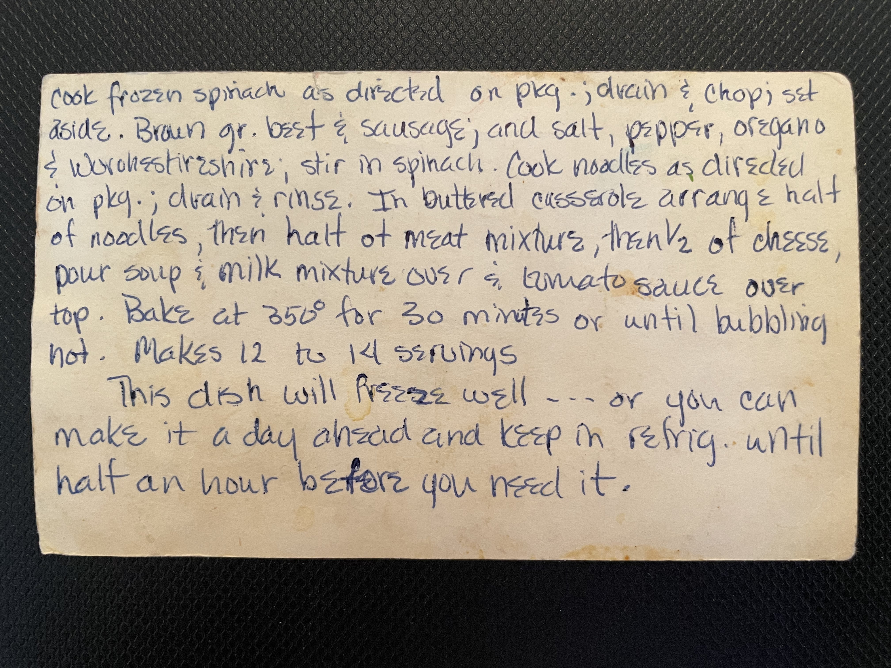

**Ingredients:**
- 1 pkg. frozen chopped spinach, 1 pkg. lasagne noodles, 1/4 lb. pork sausage, 2 lbs. hamburger, 1 1/2 t. salt, 1/4 t. pepper, 1 1/2 t. oregano, 1 1/2 T. Worcestershire, 1 lb. mozzarella or Monterey Jack, 1 1/2 cups milk, 2 cans cream of mushroom soup, 1 (8 oz.) can tomato sauce, 1 tall can grated Parmesan

**Instructions:**
Cook spinach, drain & chop. Brown beef & sausage with seasonings. Stir in spinach. Cook noodles. Layer noodles, meat mixture, cheese. Pour soup/milk mixture and tomato sauce over top. Bake at 350° for 30 minutes. Freezes well.

---

### Lumpia
*Source: IMG_9261*

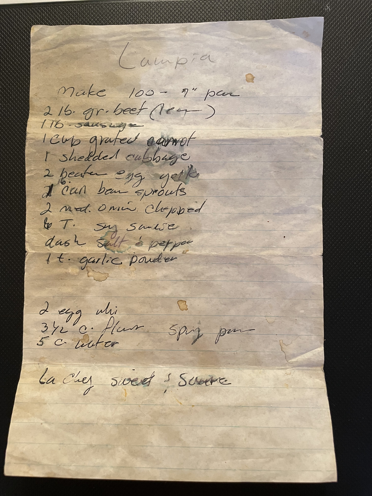

**Filling:** 2 lb. ground beef (lean), 1 lb. sausage, 1 cup grated carrot, 1 shredded cabbage, 2 beaten egg yolks, 1 can bean sprouts, 2 med. onion (chopped), 6 T. soy sauce, dash salt & pepper, 1 t. garlic powder

**Wrapper:** 2 egg whites, 3 1/2 c. flour, 5 c. water **[uncertain]**

Serve with La Choy Sweet & Sour sauce. Makes 100 **[uncertain]**.

---

### Mace's Italian Chicken Breast
*Source: IMG_9370 **[uncertain — could be "Marc's"]***

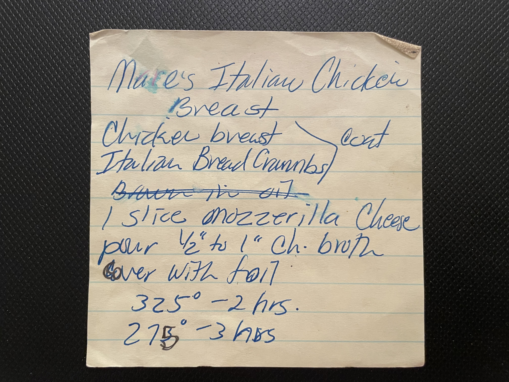

**Instructions:**
Coat chicken breast in Italian bread crumbs. Saute in oil. Top with 1 slice mozzarella cheese. Pour 1/2"–1" chicken broth in pan. Cover with foil. Bake at 325° for 2 hrs (or 275° for 3 hrs).

---

### Mexican Casserole
*Source: Janet Spilker (IMG_9203)*

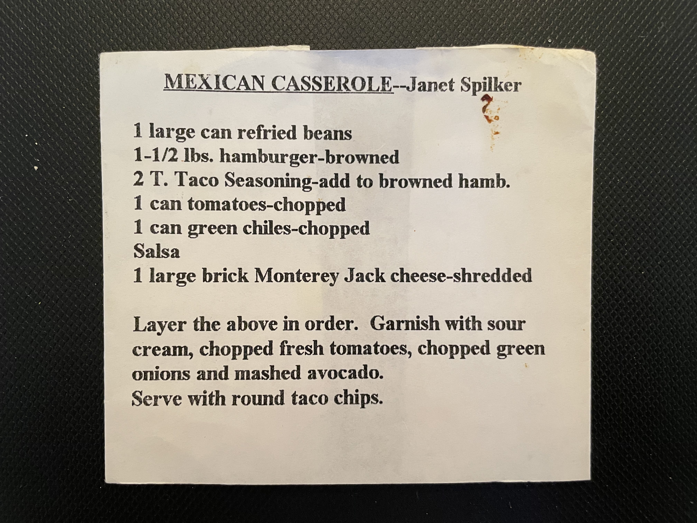

**Ingredients:**
- 1 large can refried beans, 1 1/2 lbs. hamburger (browned), 2 T. taco seasoning, 1 can tomatoes (chopped), 1 can green chiles (chopped), salsa, 1 large brick Monterey Jack cheese (shredded)

**Instructions:**
Layer the above in order. Garnish with sour cream, chopped fresh tomatoes, chopped green onions, and mashed avocado. Serve with round taco chips.

---

### Orange Honey Garlic Chicken
*Source: IMG_9374*

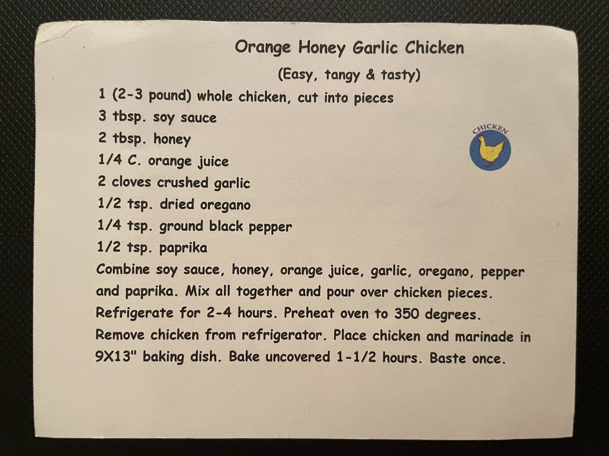

**Ingredients:**
- 1 (2–3 lb.) whole chicken, 3 T. soy sauce, 2 T. honey, 1/4 c. orange juice, 2 cloves crushed garlic, 1/2 tsp. dried oregano, 1/4 tsp. black pepper, 1/2 tsp. paprika

**Instructions:**
Combine all sauce ingredients. Pour over chicken, refrigerate 2–4 hours. Bake uncovered at 350° for 1 1/2 hours. Baste once.

---

### Panko Shrimp Tacos
*Source: Brittney (IMG_9277 / IMG_9278) — Serves 3–4*

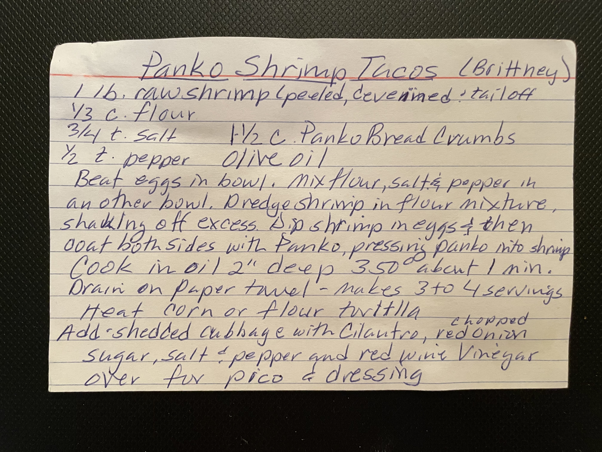

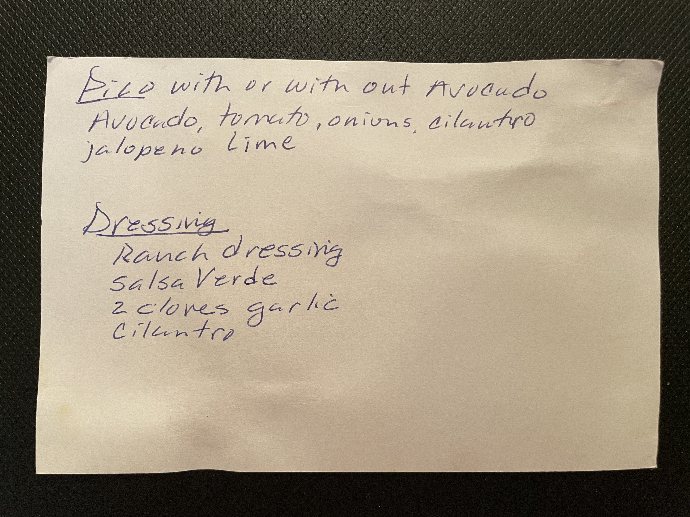

**Ingredients:**
- 1 lb. raw shrimp (peeled, deveined), 1/3 c. flour, 3/4 t. salt, 1/2 t. pepper, 1 1/2 c. Panko bread crumbs, olive oil, eggs

**Instructions:**
Dredge shrimp in flour, dip in eggs, coat with Panko. Cook in 2" oil at 350° about 1 min. Serve in tortillas with shredded cabbage, cilantro, red onion, pico de gallo, and ranch/salsa verde dressing.

---

### Paul's Roasted Turkey
*Source: IMG_9366 — 14 lbs.*

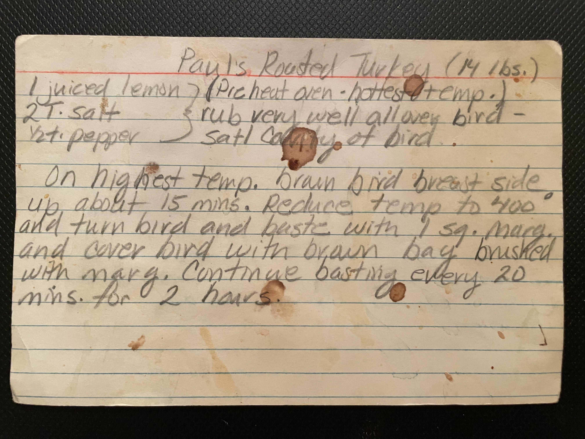

**Rub:** 1 juiced lemon, 2 T. salt, 1/2 t. pepper — rub all over bird, salt cavity

**Instructions:**
Preheat oven to hottest temp. Brown breast side up 15 mins. Reduce to 400°, turn bird, baste with 1 sq. margarine. Cover with brown bag brushed with margarine. Continue basting every 20 mins for 2 hours.

---

### Pepper Seared Ahi Tuna with Wasabi Plum Glaze
*Source: Market Street (IMG_9294 / IMG_9295) — Serves 2*

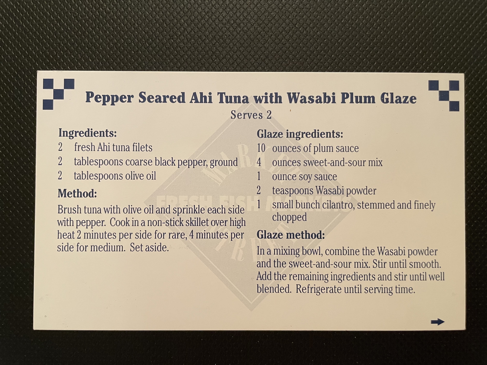

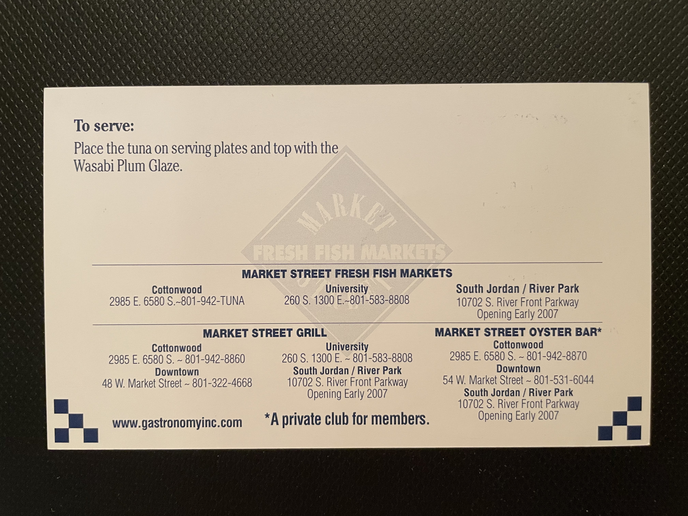

**Tuna:** 2 ahi tuna filets, 2 T. coarse ground pepper, 2 T. olive oil. Cook in skillet over high heat (2 min/side for rare, 4 min/side for medium).

**Glaze:** 10 oz. plum sauce, 4 oz. sweet-and-sour mix, 1 oz. soy sauce, 2 tsp. wasabi powder, 1 small bunch cilantro (chopped). Combine and chill. Serve on top of tuna.

---

### Poached Halibut
*Source: Market Street (IMG_9296)*

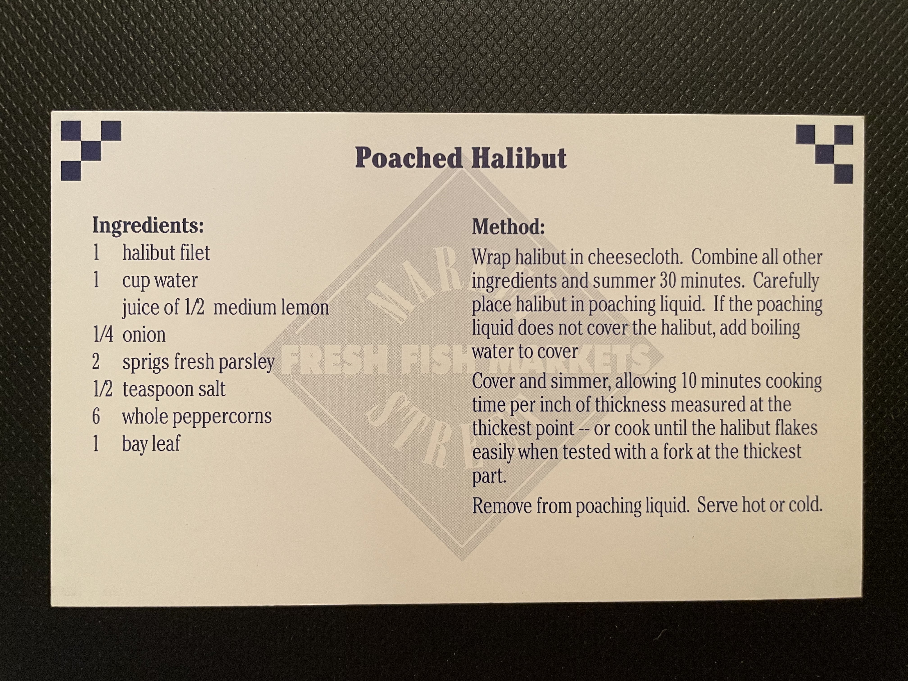

**Ingredients:**
- 1 halibut filet, 1 cup water, juice of 1/2 lemon, 1/4 onion, 2 sprigs parsley, 1/2 tsp. salt, 6 peppercorns, 1 bay leaf

**Instructions:**
Wrap halibut in cheesecloth. Combine other ingredients and simmer 30 minutes. Place halibut in poaching liquid (add boiling water if needed to cover). Cover and simmer, allowing 10 minutes per inch of thickness. Serve hot or cold.

---

### Razzpotle Wraps
*Source: Kathy (IMG_9409)*

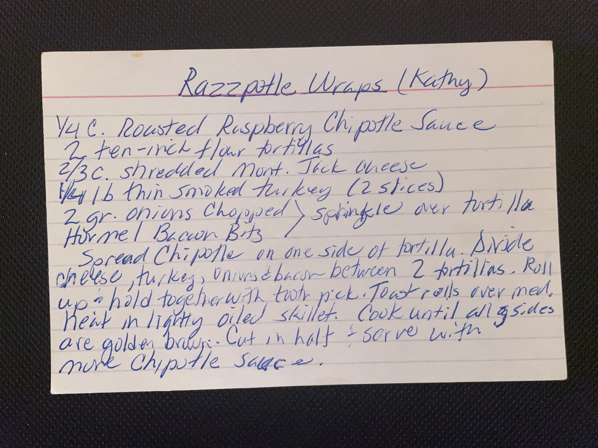

**Ingredients:**
- 1/4 c. Roasted Raspberry Chipotle Sauce, 2 (10-inch) flour tortillas, 2/3 c. shredded Monterey Jack, 1/4 lb. thin smoked turkey, 2 green onions (chopped), Hormel Bacon Bits

**Instructions:**
Spread Chipotle on tortilla. Divide cheese, turkey, onions & bacon between tortillas. Roll up, hold with toothpick. Toast in lightly oiled skillet until golden. Cut in half, serve with more Chipotle sauce.

---

### Sausage-Rice Casserole
*Source: IMG_9505*

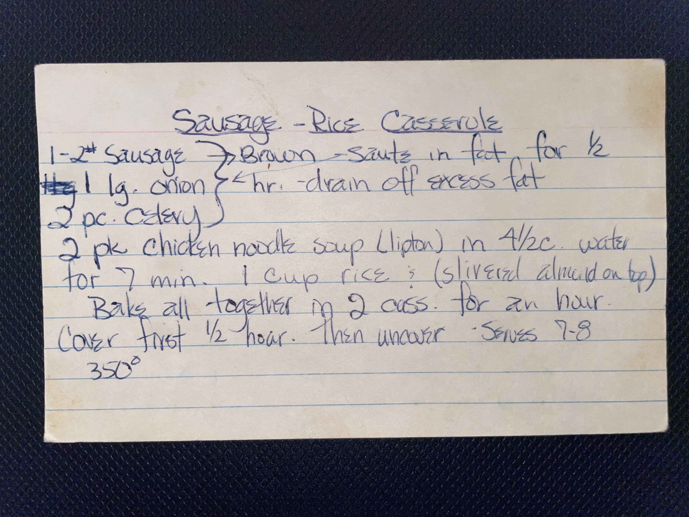

**Ingredients:**
- 1–2 lbs. sausage, 1 lg. onion, 2 pieces celery, 2 packets chicken noodle soup (Lipton), 4 1/2 c. water, 1 cup rice, slivered almonds (for top)

**Instructions:**
Brown sausage. Saute onion and celery in fat for 1/2 hr. Drain off excess fat. Cook soup in water for 7 min. Add rice. Bake all together in 2 casseroles for an hour. Cover first 1/2 hour, then uncover. 350°. Serves 7–8.

---

### Seafood Brochettes
*Source: Time Life Books (IMG_9292) — Serves 6*

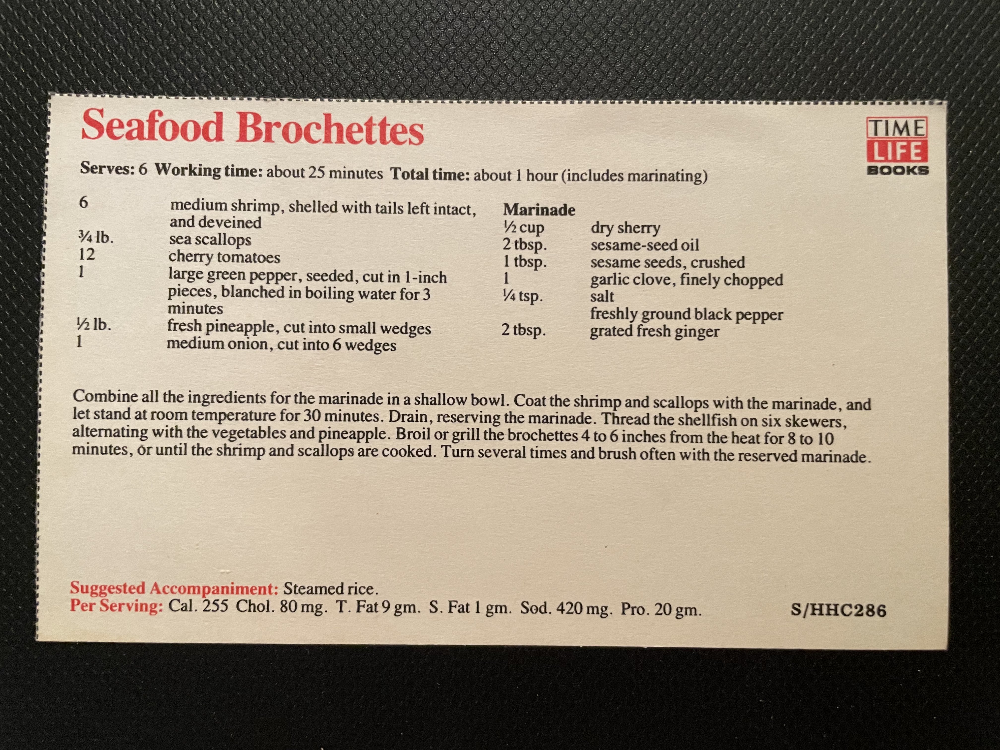

**Ingredients:**
- 6 medium shrimp, 3/4 lb. sea scallops, 12 cherry tomatoes, 1 large green pepper (blanched), 1/2 lb. fresh pineapple wedges, 1 medium onion (6 wedges)

**Marinade:** 1/3 cup dry sherry, 2 T. sesame oil, 1 T. crushed sesame seeds, 1 garlic clove, 1/4 tsp. salt, pepper, 2 T. grated fresh ginger

**Instructions:**
Coat shellfish with marinade, stand 30 min. Thread on skewers alternating with vegetables and pineapple. Broil or grill 4–6 inches from heat for 8–10 minutes, turning and basting often. Serve with steamed rice.

---

### Slow Cook Ham
*Source: IMG_9332 — 20 people*

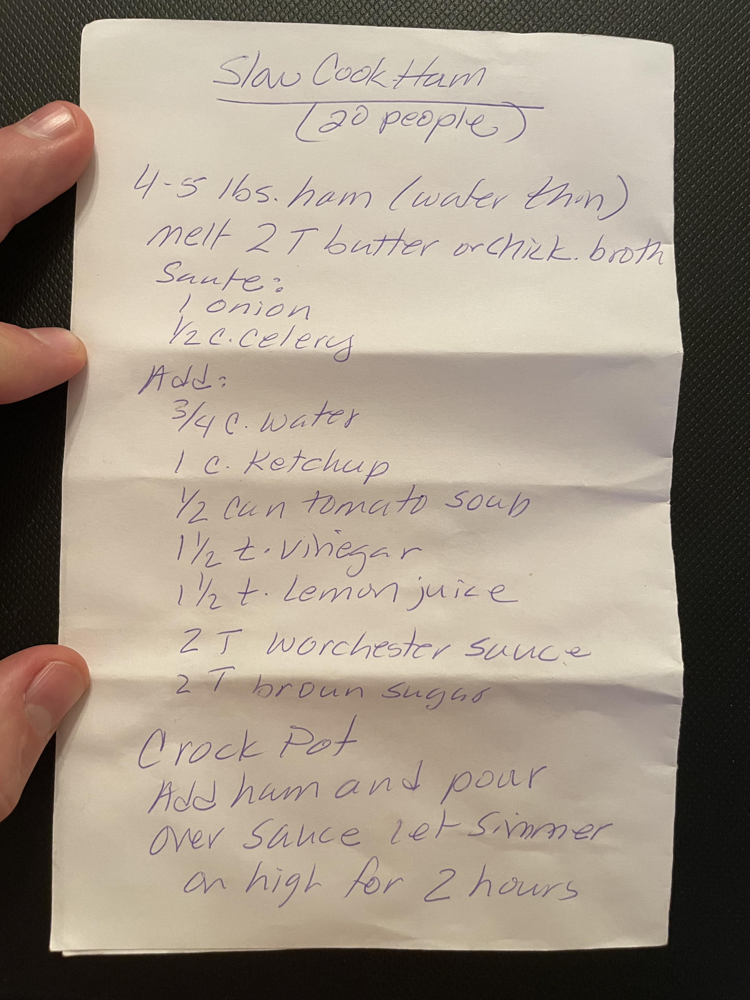

**Ingredients:**
- 4–5 lbs. ham
- Saute: 1 onion, 1/2 c. celery in 2 T. butter
- Add: 3/4 c. water, 1 c. ketchup, 1/2 can tomato soup, 1 1/2 t. vinegar, 1 1/2 t. lemon juice, 2 T. Worcestershire, 2 T. brown sugar

**Instructions:**
Add ham and pour sauce over. Crockpot on high for 2 hours.

---

### Stroganoff
*Source: IMG_9196 — Serves about 6*

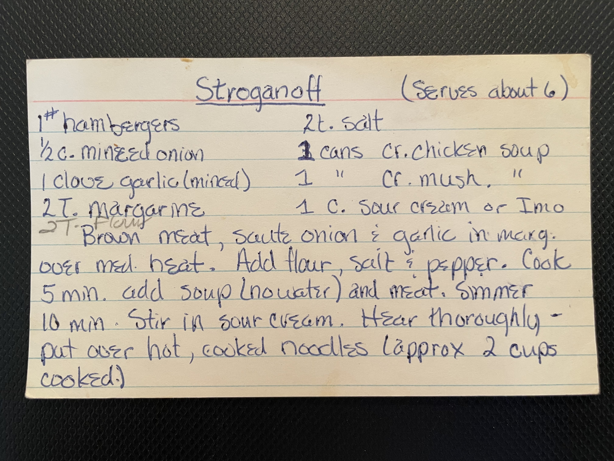

**Ingredients:**
- 1 lb. hamburger, 2 t. salt, 1/2 c. minced onion, 1 can cream of chicken soup, 1 clove garlic, 1 can cream of mushroom soup, 2 T. margarine, 1 c. sour cream, 2 T. flour

**Instructions:**
Brown meat, saute onion & garlic in margarine. Add flour, salt & pepper, cook 5 min. Add soups (no water) and meat. Simmer 10 min. Stir in sour cream. Heat through, serve over hot cooked noodles.

---

### Stuffed Zucchini Casserole
*Source: IMG_9420 / IMG_9421*

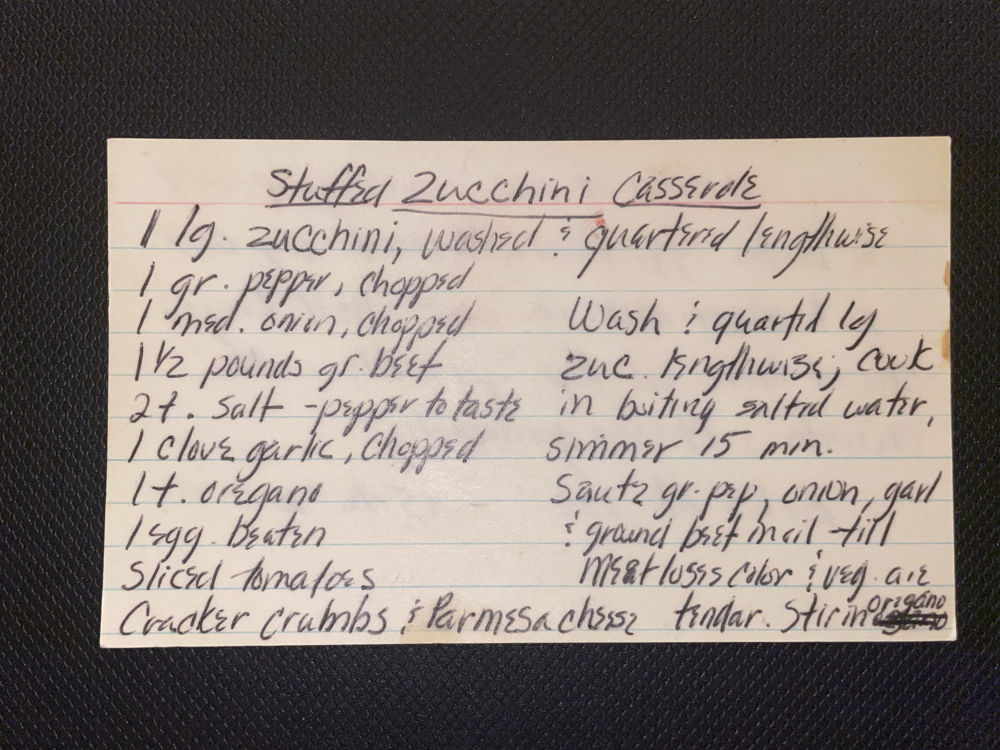

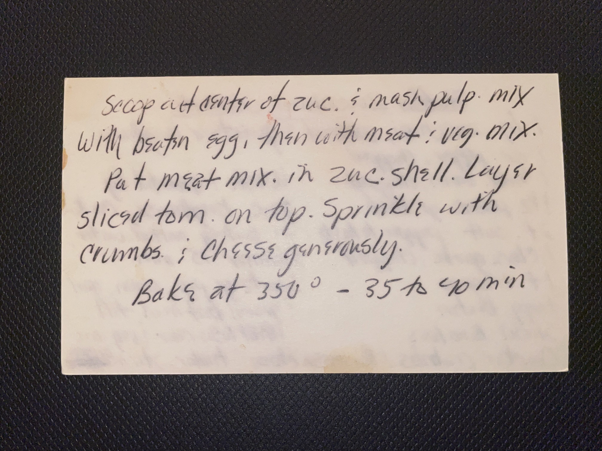

**Ingredients:**
- 1 large zucchini (quartered), 1 green pepper, 1 med. onion, 1 1/2 lbs. ground beef, 2 t. salt, pepper, 1 clove garlic, 1 t. oregano, 1 egg (beaten), sliced tomatoes, cracker crumbs, Parmesan cheese

**Instructions:**
Cook zucchini 15 min. Saute pepper, onion, garlic, beef. Stir in oregano. Scoop out zucchini center, mash pulp, mix with egg and meat mixture. Fill shells. Top with tomato slices, crumbs, and cheese. Bake at 350° for 35–40 min.

---

### Sweet & Sour Spareribs
*Source: IMG_9329*

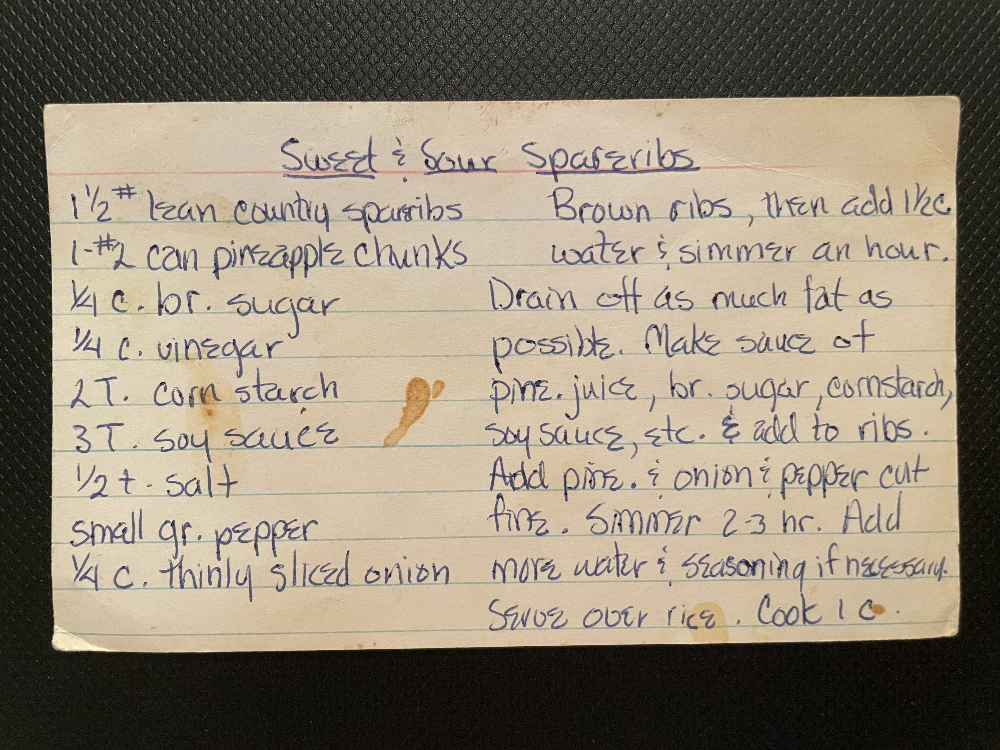

**Ingredients:**
- 1 1/2 lbs. lean spareribs, 1 (#2) can pineapple chunks, 1/4 c. brown sugar, 1/4 c. vinegar, 2 T. cornstarch, 3 T. soy sauce, 1/2 t. salt, 1 small green pepper, 1/4 c. thinly sliced onion

**Instructions:**
Brown ribs. Add 1 c. water, simmer 1 hour. Drain fat. Make sauce of pineapple juice, sugar, cornstarch, soy sauce. Add to ribs. Add pineapple, onion, pepper. Simmer 2–3 hrs. Serve over rice.

---

### Taco Hamburger Casserole
*Source: IMG_9502 / IMG_9503*

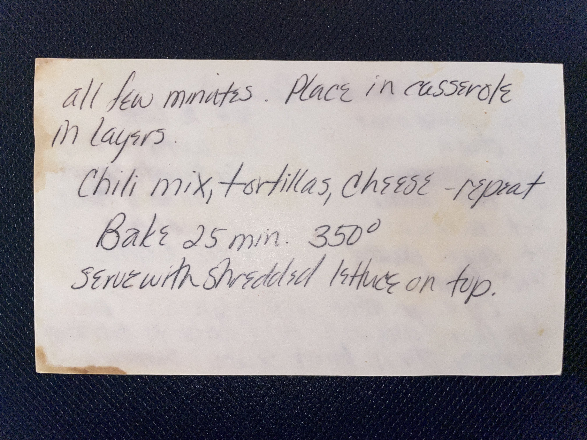

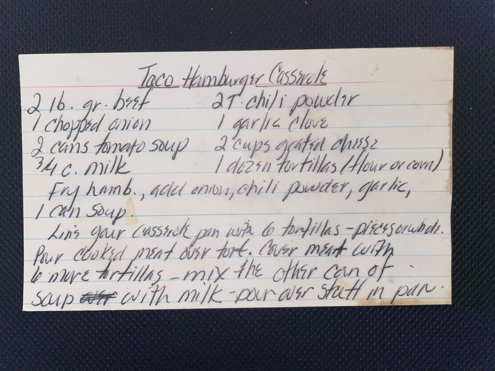

**Ingredients:**
- 2 lb. ground beef, 2 T. chili powder, 1 chopped onion, 1 garlic clove, 2 cans tomato soup, 2 cups grated cheese, 3/4 c. milk, 1 dozen tortillas

**Instructions:**
Fry hamburger, add onion, chili powder, garlic, 1 can soup. Line casserole with 6 tortillas. Pour cooked meat over. Cover with 6 more tortillas. Mix other can soup with milk — pour over everything. Layer: chili mix, tortillas, cheese — repeat. Bake 25 min at 350°. Serve with shredded lettuce on top.

---

### Tempura — Fish & Vegetables
*Source: IMG_9304*

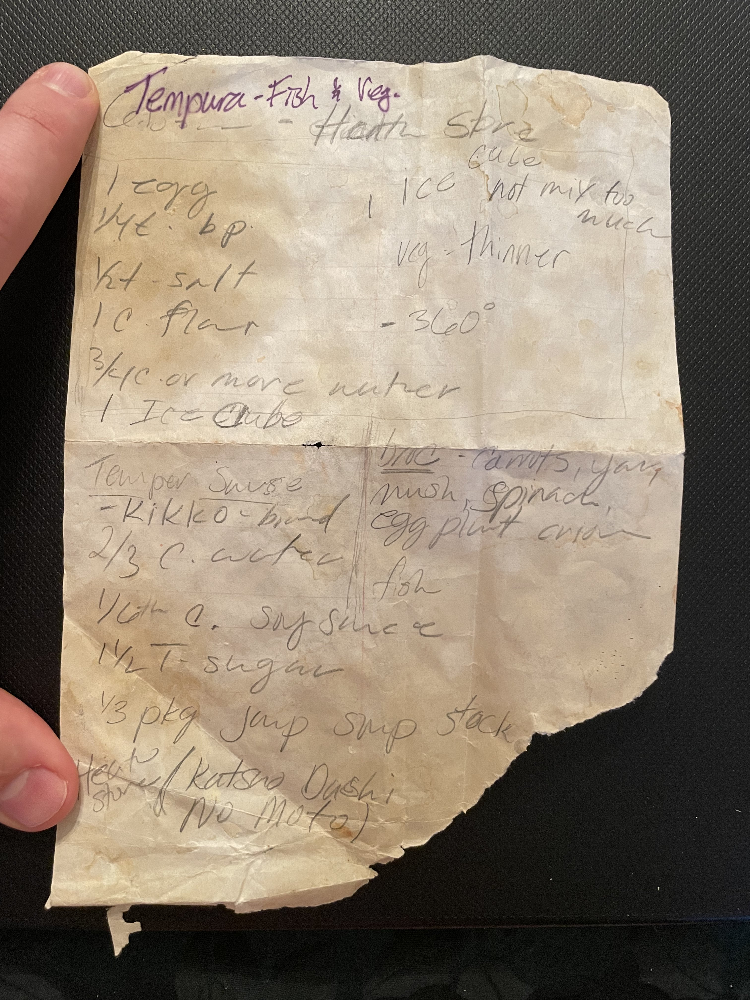

**Batter:** 1 egg, 1/4 t. baking powder **[uncertain]**, 1/4 t. salt **[uncertain]**, 1 c. flour, 3/4 c. or more water, 1 ice cube — don't mix too much. ~360°

**Vegetables:** carrots, yam, mushrooms, squash, eggplant, onion, fish **[uncertain]**

**Tempura Sauce:** Kikkoman **[uncertain]**, 2/3 c. water, 1/4 c. soy sauce, 1/4 T. sugar, 1/3 pkg. Japanese soup stock (Dashi) **[uncertain]**

---

### Tuna Casserole
*Source: IMG_9506 — Serves 8*

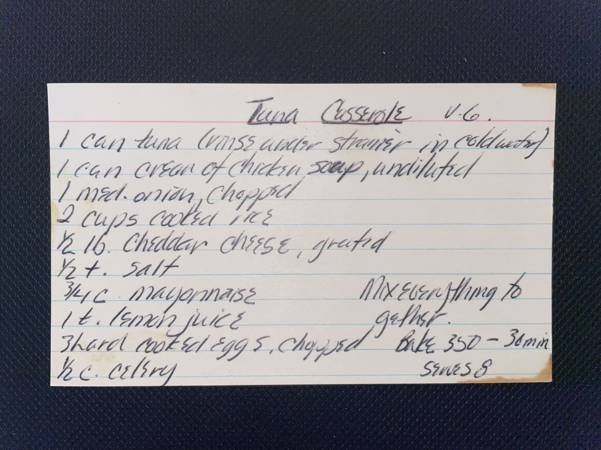

**Ingredients:**
- 1 can tuna (rinsed), 1 can cream of chicken soup (undiluted), 1 med. onion (chopped), 2 cups cooked rice, 1/2 lb. cheddar cheese (grated), 1/2 t. salt, 3/4 c. mayonnaise, 1 t. lemon juice, 3 hard cooked eggs (chopped), 1/2 c. celery

**Instructions:**
Mix everything together **[uncertain]**. Bake at 350° for 30 min.

---

### Turkey/Chicken Marinate
*Source: Janet Spilker / Lori Beard (IMG_9368 / IMG_9369)*

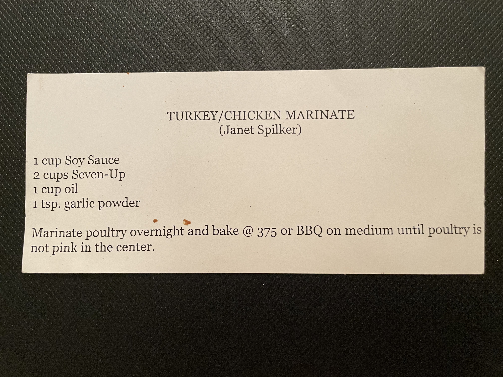

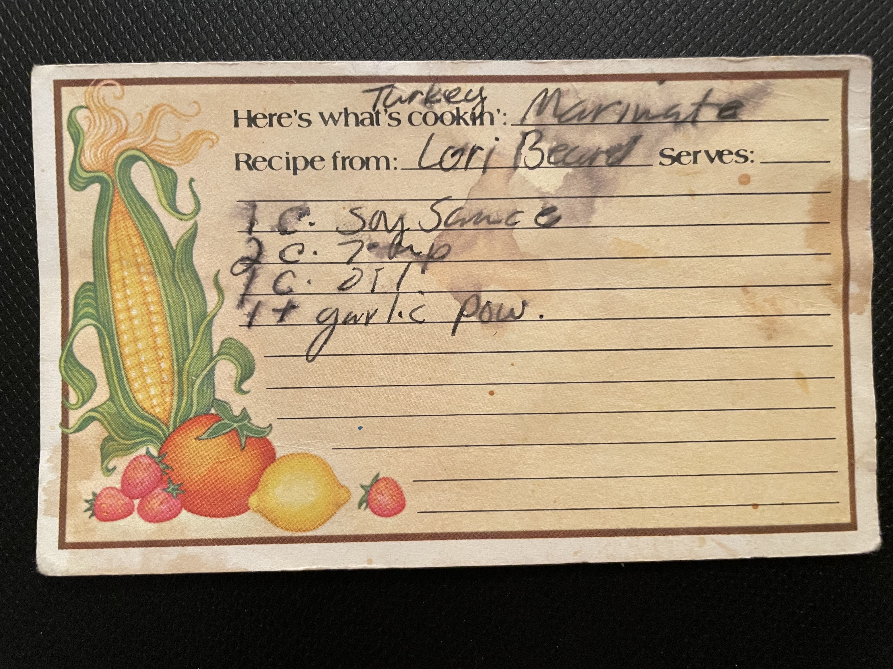

**Ingredients:**
- 1 cup soy sauce, 2 cups 7-UP, 1 cup oil, 1 tsp. garlic powder

**Instructions:**
Marinate poultry overnight and bake at 375° or BBQ on medium until not pink in center.

---

### Wiener Schnitzel
*Source: IMG_9364*

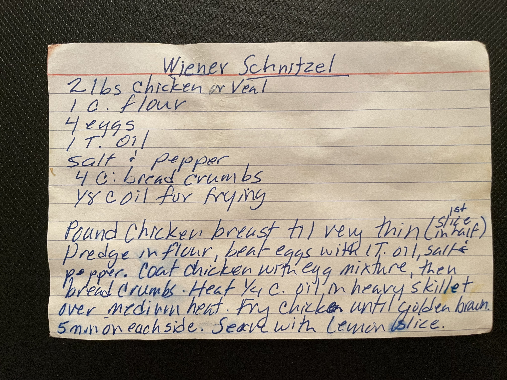

**Ingredients:**
- 2 lbs. chicken or veal, 1 c. flour, 4 eggs, 1 T. oil, salt & pepper, 4 c. bread crumbs, 1/2 c. oil for frying

**Instructions:**
Pound chicken breast very thin (slice in half first). Dredge in flour. Beat eggs with 1 T. oil, salt & pepper. Coat chicken with egg, then bread crumbs. Heat oil in heavy skillet, fry until golden brown (5 min each side). Serve with lemon slice.

---

## Sauces & Condiments

---

### Alfredo Sauce (Amy P.)
*Source: IMG_9435 / IMG_9436*

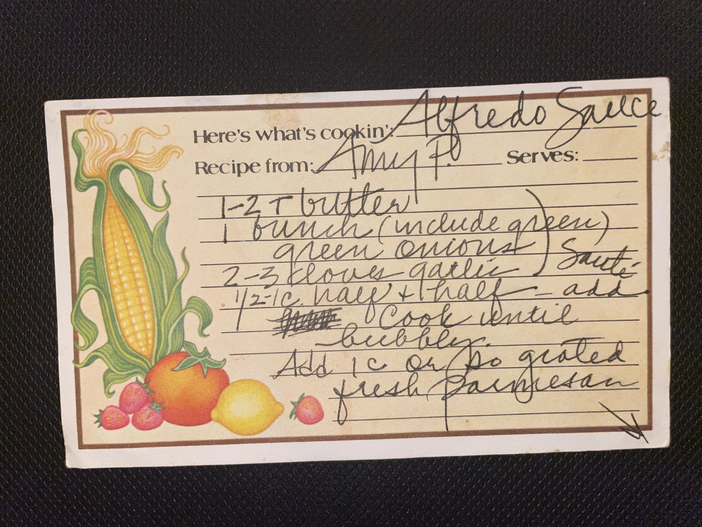

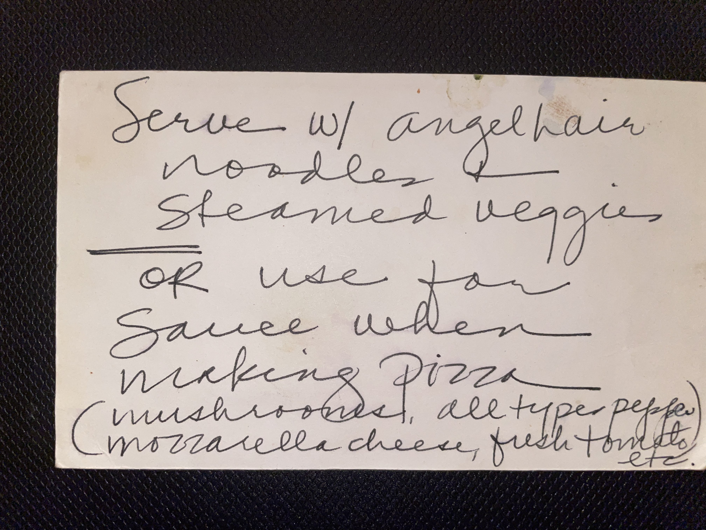

**Ingredients:**
- 1–2 T. butter, 1 bunch green onions (include green), 2–3 cloves garlic — saute
- 1/2 c. half & half — add, cook until bubbly
- Add 1 c. or so grated fresh Parmesan **[uncertain]**

Serve with angelhair noodles & steamed veggies, or use as pizza sauce.

---

### BBQ Sauce
*Source: IMG_9530*

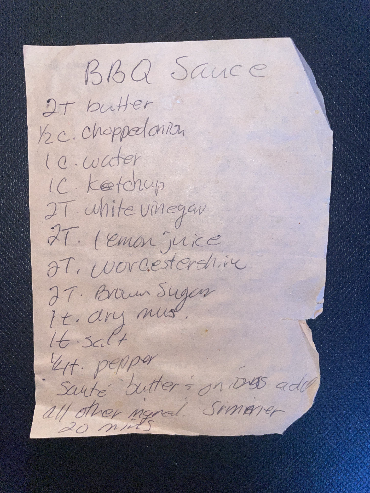

**Ingredients:**
- 2 T. butter, 1/2 c. chopped onion, 1 c. water, 1 c. ketchup, 2 T. white vinegar, 2 T. lemon juice, 2 T. Worcestershire **[uncertain]**, 2 T. brown sugar, 1 t. dry mustard **[uncertain]**, 1 t. salt, 1/4 t. pepper

**Instructions:**
Saute butter & onions. Add all other ingredients. Simmer 20 mins.

---

### Brittany's Alfredo Sauce
*Source: IMG_9437*

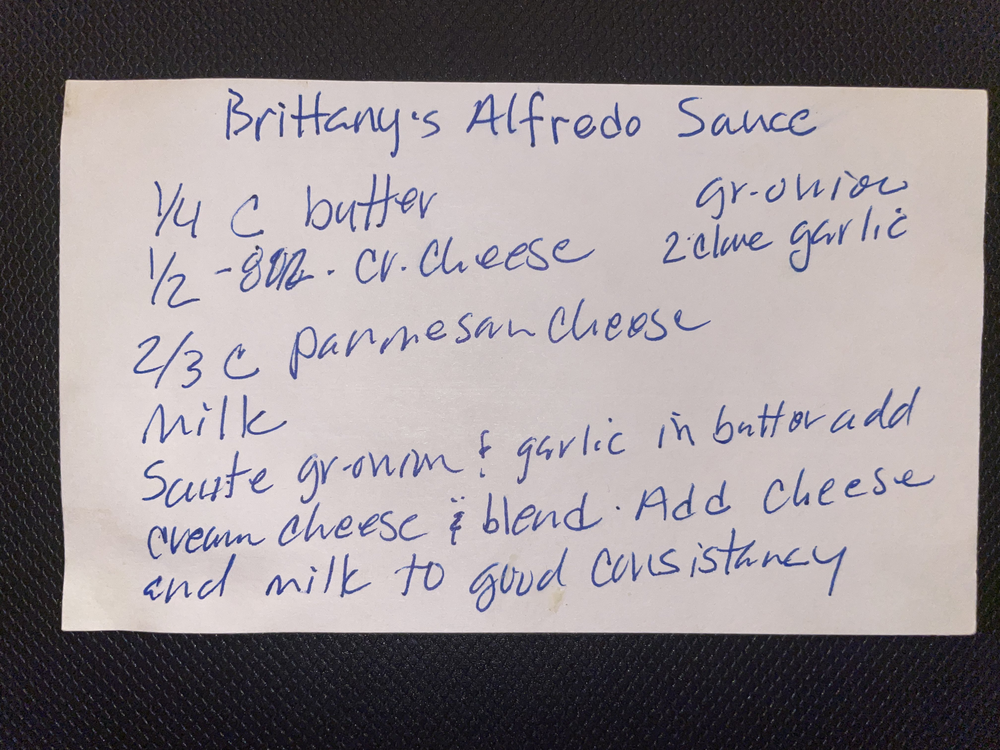

**Ingredients:**
- 1/4 c. butter, green onion, 2 cloves garlic — saute in butter
- 1/2 (8 oz.) pkg. cream cheese — add & blend
- 2/3 c. Parmesan cheese, milk to good consistency

---

### Butterscotch Sauce
*Source: IMG_9432 (also IMG_9433 — duplicate)*

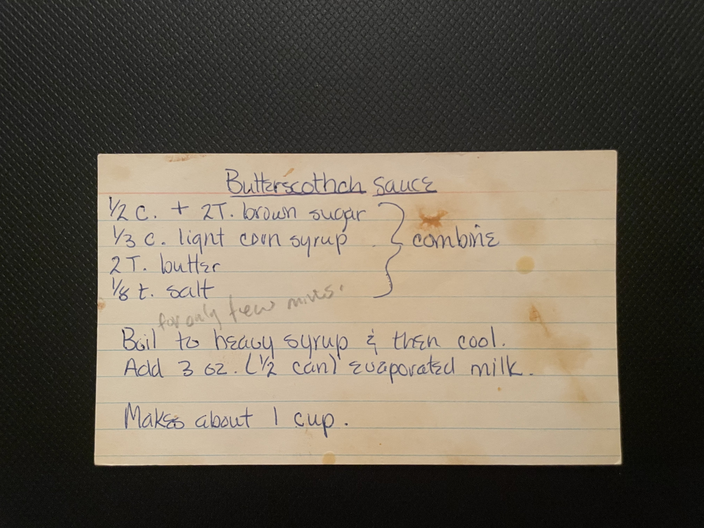

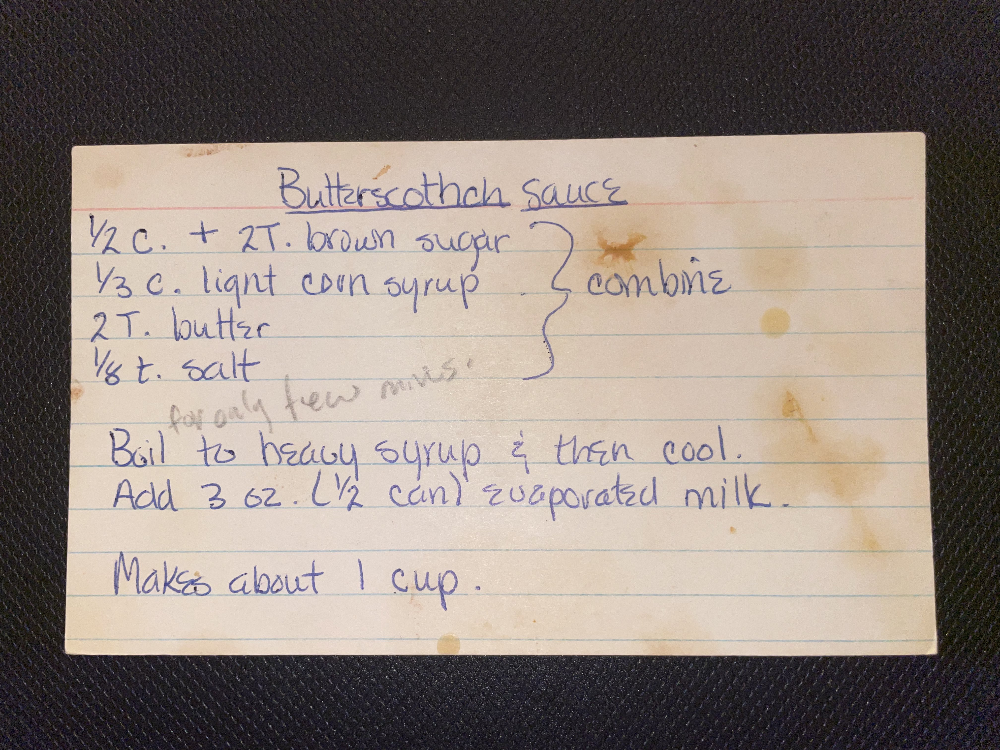

**Ingredients:**
- 1/2 c. + 2 T. brown sugar, 1/3 c. light corn syrup, 2 T. butter, 1/8 t. salt — combine

**Instructions:**
Boil to heavy syrup, then cool. Add 3 oz. (1/2 can) evaporated milk. Makes about 1 cup.

---

### Cafe Rio — Tomatillo Mild Sauce
*Source: IMG_9281 / IMG_9282*

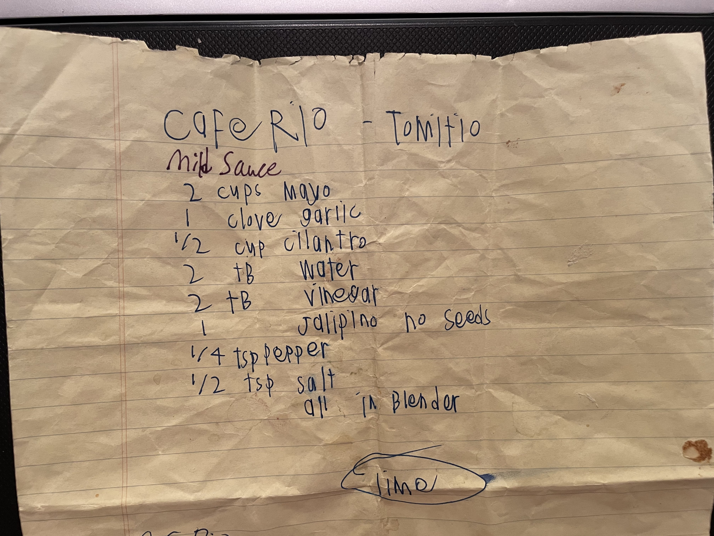

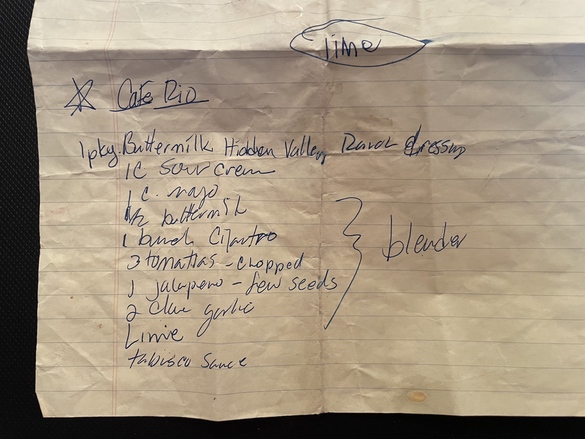

**Version 1 (IMG_9281):** 2 cups mayo, 1 clove garlic, 1/2 cup cilantro, 2 T. water, 2 T. vinegar, 1 jalapeno (no seeds), 1/4 tsp. pepper, 1/2 tsp. salt — all in blender

**Version 2 (IMG_9282):** 1 pkg. Buttermilk Hidden Valley Ranch, 1 c. sour cream, 1 c. mayo, 1/2 c. buttermilk **[uncertain]**, 1 bunch cilantro, 3 tomatillos (chopped), 1 jalapeno, 2 cloves garlic, lime, Tabasco — blender

---

### Caramel Sauce (Mare's)
*Source: IMG_9163 (also IMG_9464)*

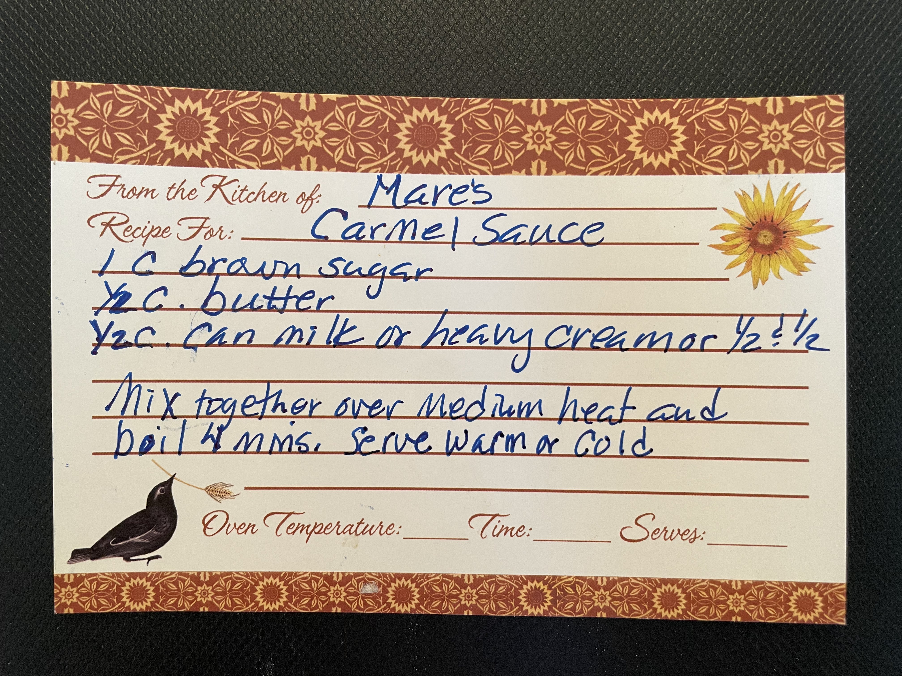

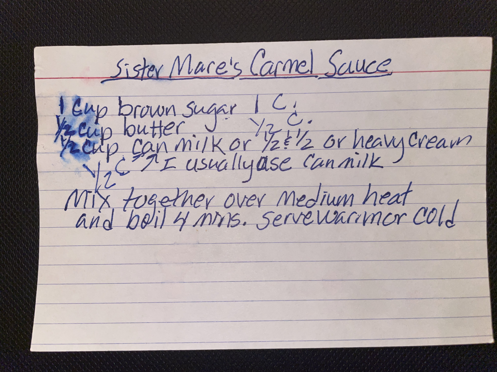

**Ingredients:**
- 1 c. brown sugar, 1/2 c. butter, 1/2 c. canned milk or heavy cream or half & half **[uncertain]**

**Instructions:**
Mix together over medium heat and boil 4 mins. Serve warm or cold.

---

### Cherry Sauce
*Source: IMG_9242*

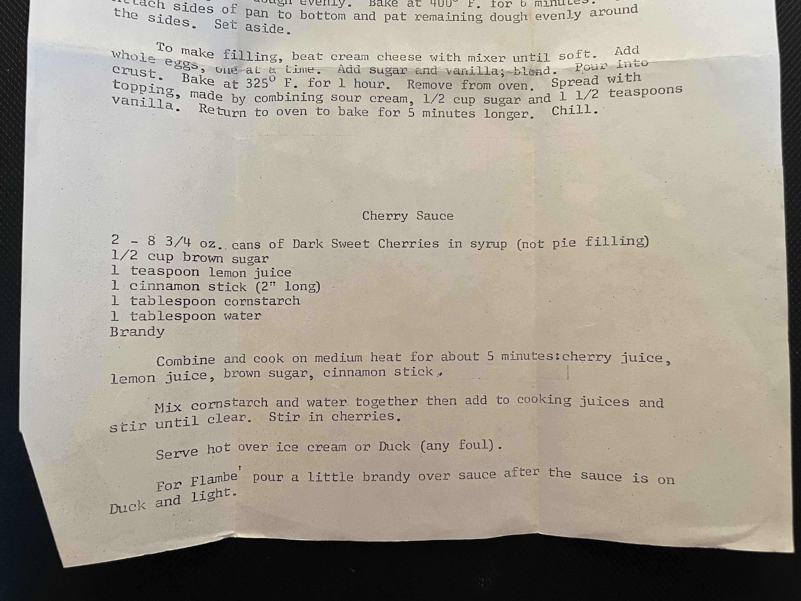

**Ingredients:**
- 2 (8 3/4 oz.) cans dark sweet cherries in syrup (not pie filling), 1/2 cup brown sugar, 1 teaspoon lemon juice, 1 cinnamon stick (2"), 1 tablespoon cornstarch, 1 tablespoon water, brandy

**Instructions:**
Combine cherry juice, lemon juice, brown sugar, cinnamon stick and cook on medium heat ~5 minutes. Mix cornstarch and water, add to cooking juices and stir until clear. Stir in cherries. Serve hot over ice cream or duck. For flambe, pour a little brandy over sauce and light.

---

### Chicken Wings Brine
*Source: IMG_9371*

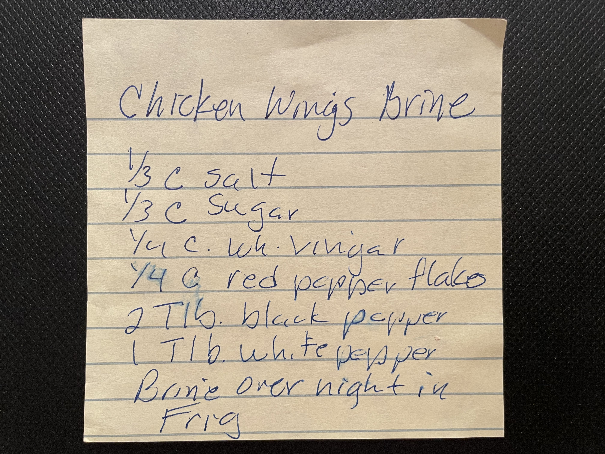

**Ingredients:**
- 1/3 c. salt, 1/3 c. sugar, 1/4 c. white vinegar, 1/4 c. red pepper flakes, 2 T. black pepper, 1 T. white pepper

**Instructions:**
Brine overnight in fridge.

---

### Chocolate Sauce (Stovetop)
*Source: IMG_9434*

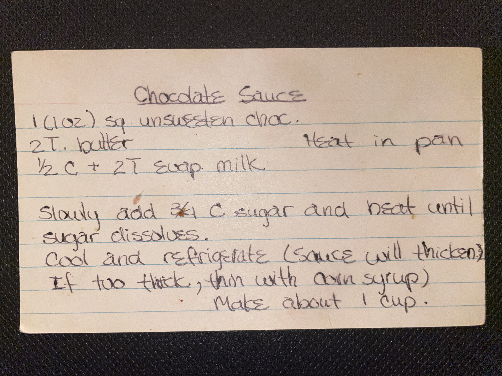

**Ingredients:**
- 1 (1 oz.) sq. unsweetened chocolate, 2 T. butter — heat in pan
- 1/2 c. + 2 T. evaporated milk

**Instructions:**
Slowly add 3/4 c. sugar and heat until sugar dissolves. Cool and refrigerate (sauce will thicken). If too thick, thin with corn syrup. Makes about 1 cup.

---

### Chocolate Sauce (with Cocoa)
*Source: IMG_9438*

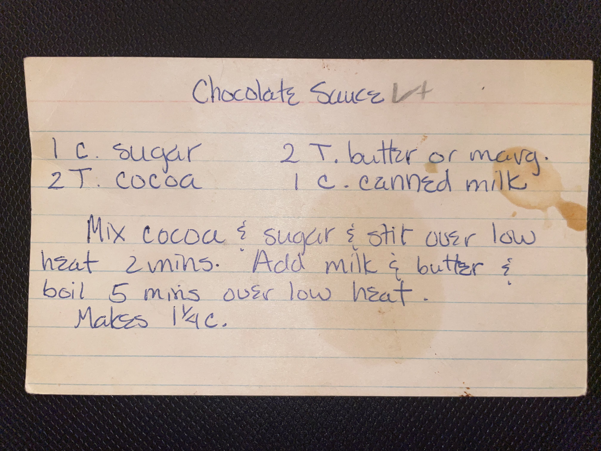

**Ingredients:**
- 1 c. sugar, 2 T. cocoa, 2 T. butter or margarine, 1 c. canned milk

**Instructions:**
Mix cocoa & sugar, stir over low heat 2 mins. Add milk & butter, boil 5 mins over low heat. Makes 1 1/4 c.

---

### Lemon Sauce
*Source: IMG_9188*

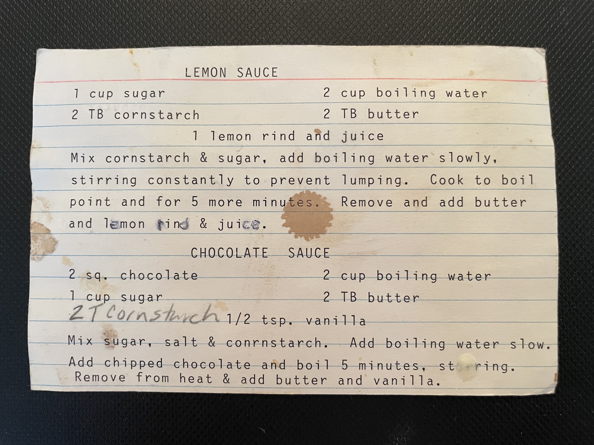

**Ingredients:**
- 1 cup sugar, 2 T. cornstarch, 2 cups boiling water, 2 T. butter, 1 lemon (rind and juice)

**Instructions:**
Mix cornstarch & sugar. Add boiling water slowly, stirring constantly. Cook to boiling point and for 5 more minutes. Remove and add butter and lemon.

---

### Marinade (Soy-Pineapple)
*Source: IMG_9330*

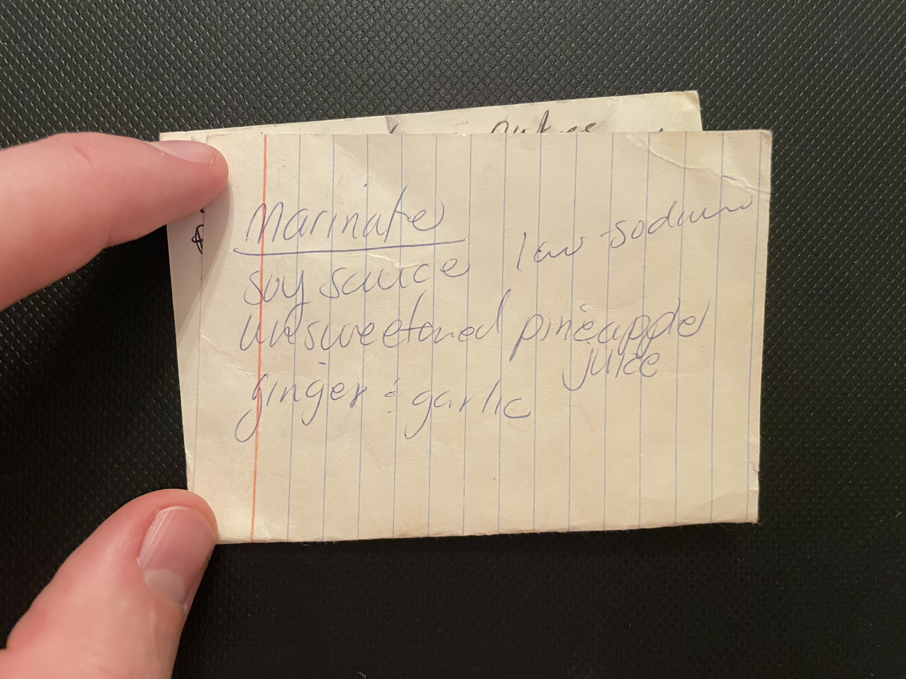

Soy sauce (low sodium), unsweetened pineapple juice, ginger, garlic.

---

## Desserts — Cakes

---

### Amy's Carrot Cake
*Source: IMG_9161 / IMG_9162*

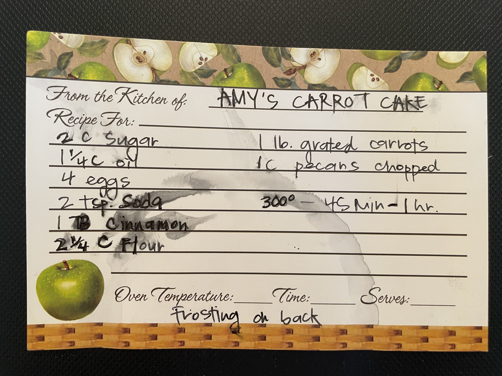

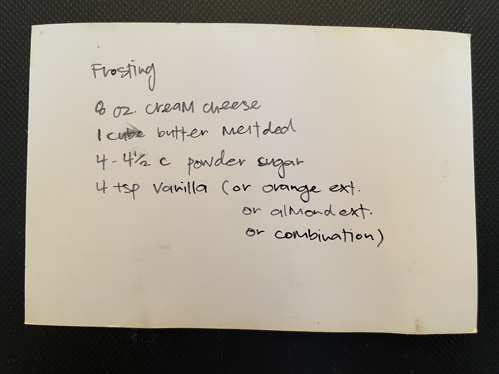

**Ingredients:**
- 2 c. sugar, 1 1/4 c. oil, 4 eggs, 2 tsp. soda, 1 T. cinnamon, 2 1/4 c. flour, 1 lb. grated carrots, 1 c. pecans (chopped)

**Instructions:**
Bake at 300° for 45 min.–1 hr.

**Frosting:** 8 oz. cream cheese, 1 cube butter (melted), 4–4 1/2 c. powdered sugar, 4 tsp. vanilla (or orange/almond extract, or combination)

---

### Apple Chip Cake
*Source: Joyce Spilker (IMG_9160)*

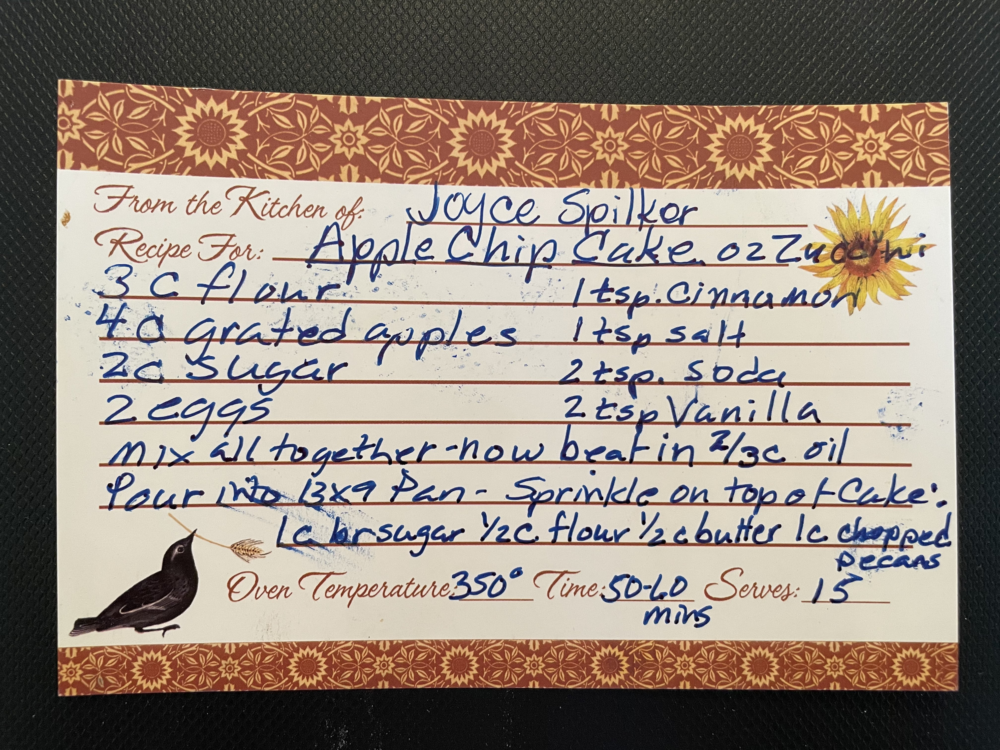

**Ingredients:**
- 3 c. flour, 4 c. grated apples, 2 c. sugar, 2 eggs, 1 tsp. cinnamon, 1 tsp. salt, 2 tsp. soda, 2 tsp. vanilla

**Instructions:**
Mix all together, then beat in 3/4 c. oil. Pour into 13x9 pan. Sprinkle topping: 1 c. brown sugar, 1/2 c. flour, 1/2 c. butter, 1 c. chopped pecans. Bake at 350° for 50–60 mins.

---

### Cafe Rio Tres Leches
*Source: IMG_9159*

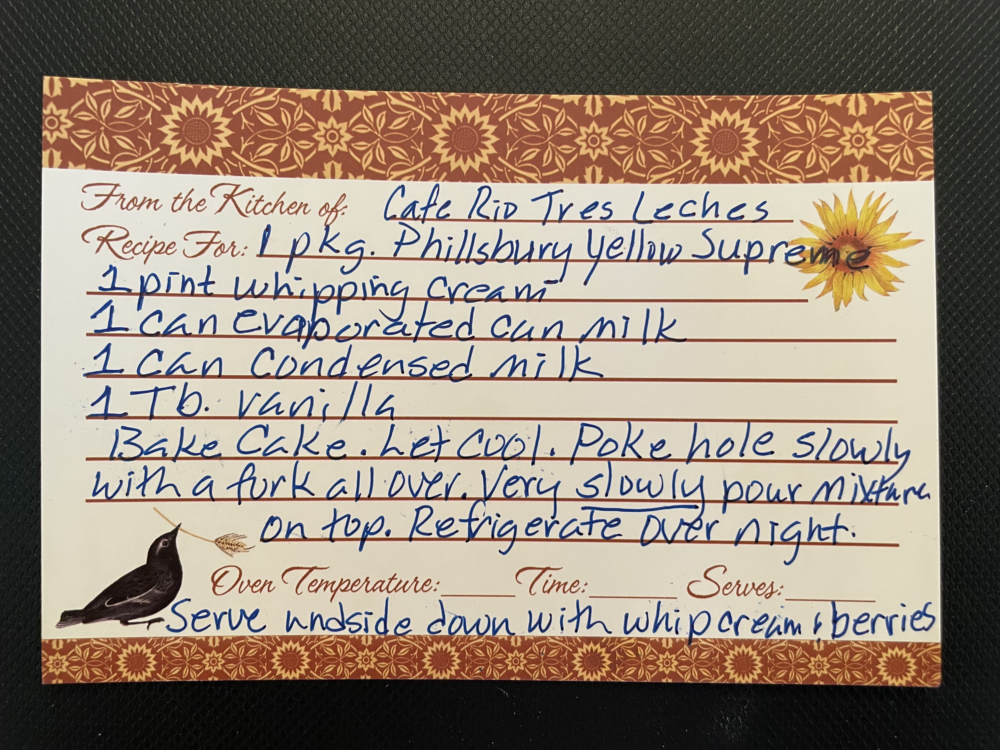

**Ingredients:**
- 1 pkg. Pillsbury Yellow Supreme cake mix, 1 pint whipping cream, 1 can evaporated milk, 1 can condensed milk, 1 T. vanilla

**Instructions:**
Bake cake. Let cool. Poke holes with fork all over. Very slowly pour mixture on top. Refrigerate overnight. Serve upside down with whip cream & berries.

---

### Carrot Cake (Mae F.)
*Source: IMG_9489 / IMG_9488*

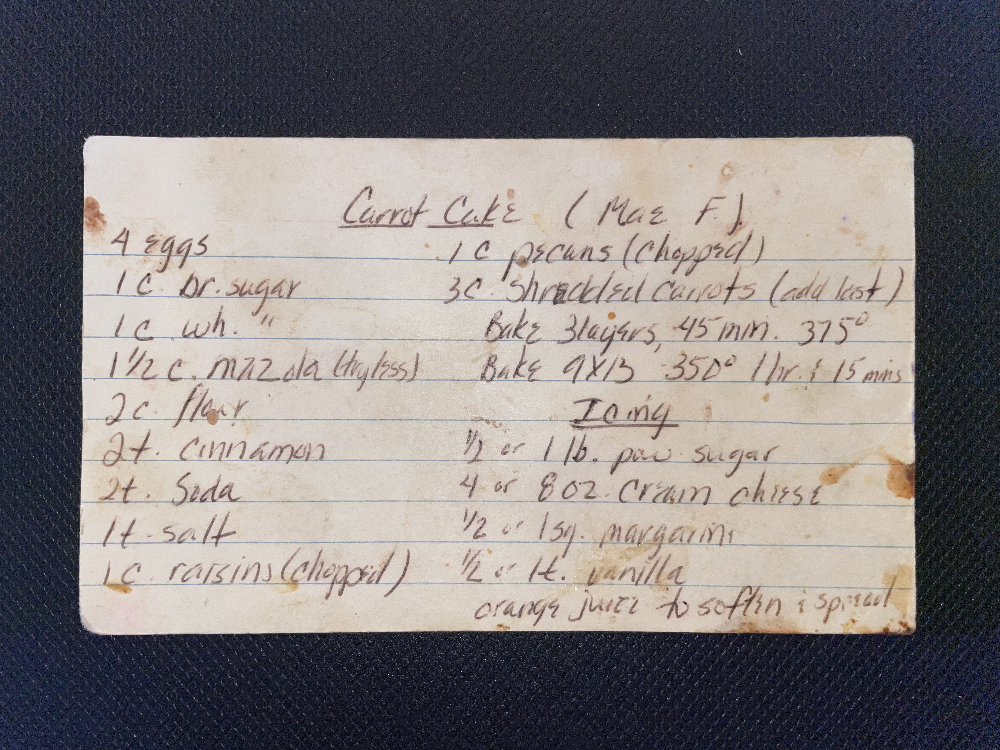

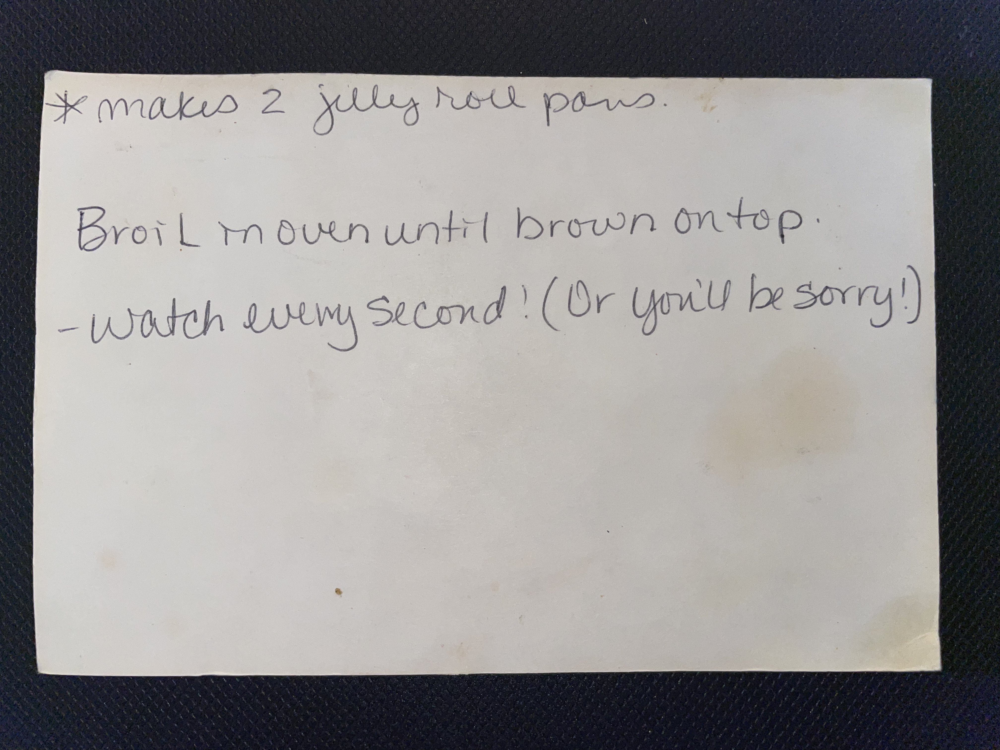

**Ingredients:**
- 4 eggs, 1 c. brown sugar, 1 c. white sugar, 1 1/2 c. Mazola oil **[uncertain]**, 2 c. flour, 2 t. cinnamon, 2 t. soda, 1 t. salt, 1 c. raisins (chopped), 1 c. pecans (chopped), 3 c. shredded carrots (add last)

**Baking:** 3 layers: 45 min at 375°. 9x13 pan: 350° for 1 hr. & 15 mins.

**Icing:** 1/2 or 1 lb. powdered sugar, 4 or 8 oz. cream cheese, 1/2 or 1 stick margarine, 1/2 or 1 t. vanilla, orange juice to soften & spread

*Note: Makes 2 jelly roll pans. Broil in oven until brown on top. Watch every second!*

---

### Chocolate Cream Cake
*Source: IMG_9549 (cookbook page 85) — "Clint & Nick's Birthday Cake"*

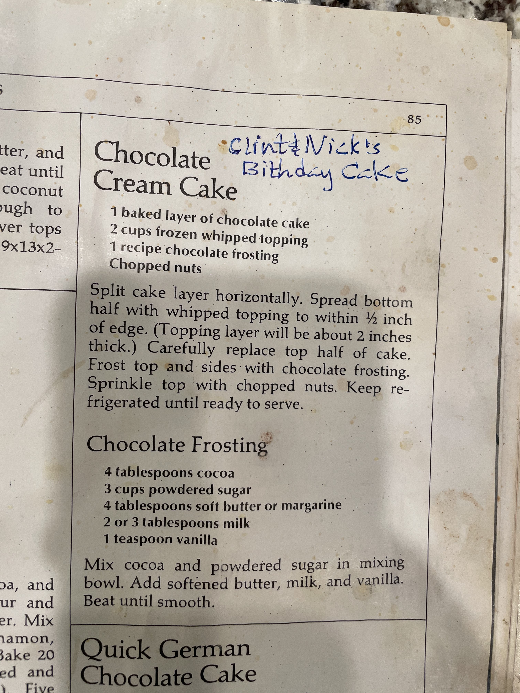

**Ingredients:**
- 1 baked layer of chocolate cake, 2 cups frozen whipped topping, 1 recipe Chocolate Frosting, chopped nuts

**Instructions:**
Split cake layer horizontally. Spread bottom half with whipped topping to within 1/2 inch of edge (about 2 inches thick). Replace top. Frost top and sides with chocolate frosting. Sprinkle with chopped nuts. Keep refrigerated.

---

### German's Sweet Chocolate Cake
*Source: IMG_9547 / IMG_9548*

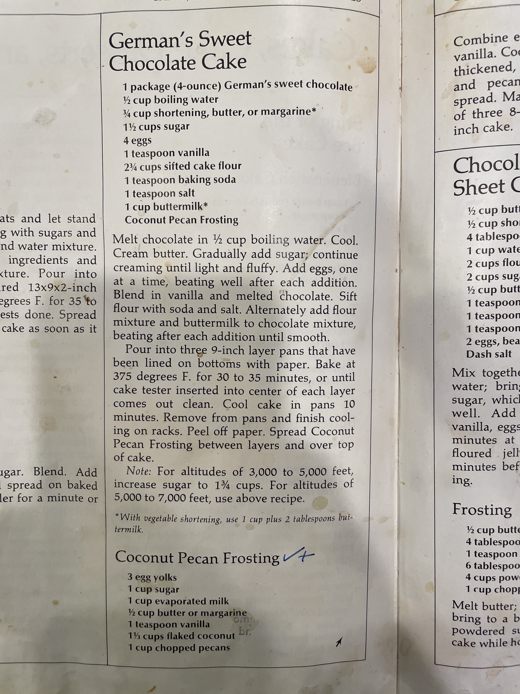

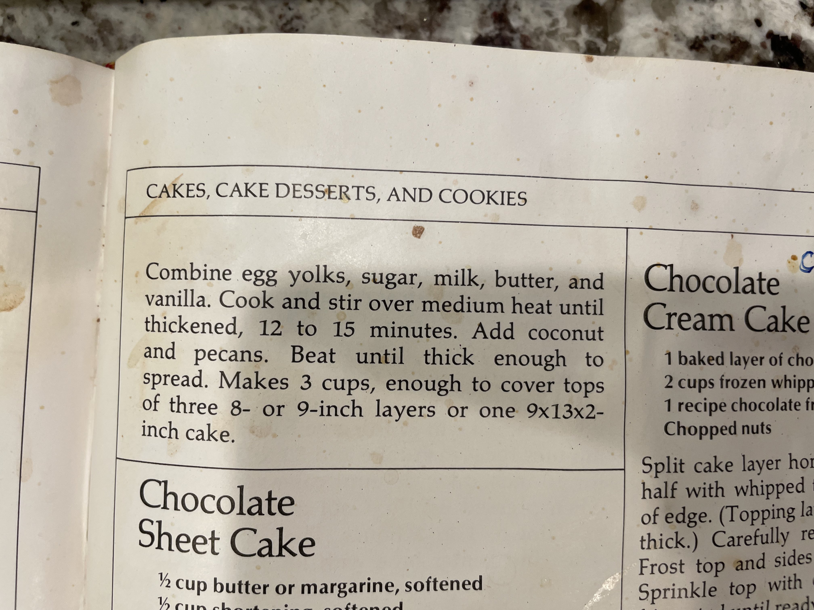

**Ingredients:**
- 1 package (4 oz.) German's sweet chocolate, 1/2 cup boiling water, 1/4 cup butter, 1 1/2 cups sugar **[uncertain]**, 4 eggs, 1 teaspoon vanilla, 2 1/4 cups sifted cake flour, 1 teaspoon baking soda, 1 teaspoon salt, 1 cup buttermilk, Coconut Pecan Frosting

**Instructions:**
Melt chocolate in boiling water. Cool. Cream butter, add sugar until fluffy. Add eggs one at a time. Blend in vanilla and chocolate. Sift flour with soda and salt. Alternately add flour mixture and buttermilk. Pour into three 9-inch layer pans. Bake at 375°F for 30–35 minutes. Cool, frost with Coconut Pecan Frosting.

*With vegetable shortening, use 1 cup + 2 tablespoons buttermilk. Altitude note: For 3,000–5,000 feet, increase sugar to 1 3/4 cups.*

---

### Jan's Oatmeal Cake
*Source: IMG_9487 — Oven 350° for 35 min*

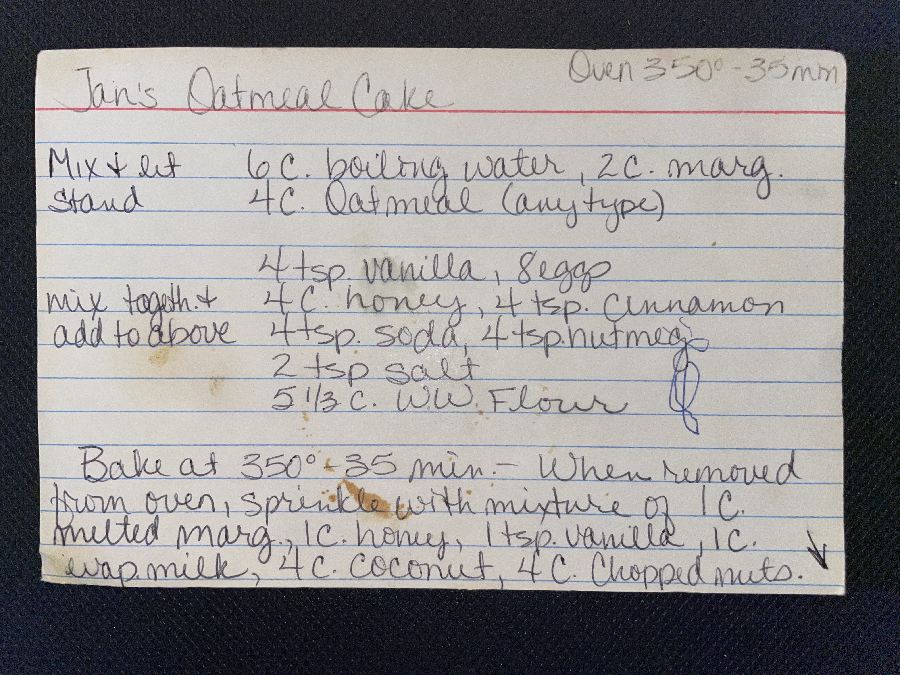

**Mix & let stand:** 6 c. boiling water, 2 c. margarine, 4 c. oatmeal

**Add:** 4 tsp. vanilla, 8 eggs, 4 c. honey, 4 tsp. cinnamon, 4 tsp. soda, 4 tsp. nutmeg, 2 tsp. salt, 5 1/3 c. whole wheat flour

**Instructions:**
Bake at 350° for 35 min. When removed, sprinkle with: 1 c. melted margarine, 1 c. honey, 1 tsp. vanilla, 1 c. evaporated milk, 4 c. coconut, 4 c. chopped nuts.

---

### Kathy's Carrot Cake
*Source: IMG_9493 / IMG_9494*

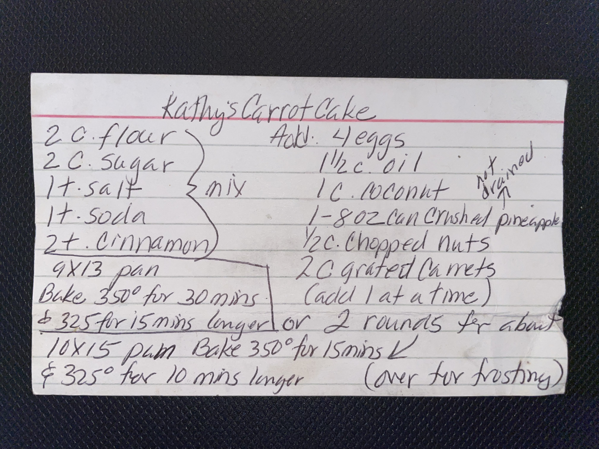

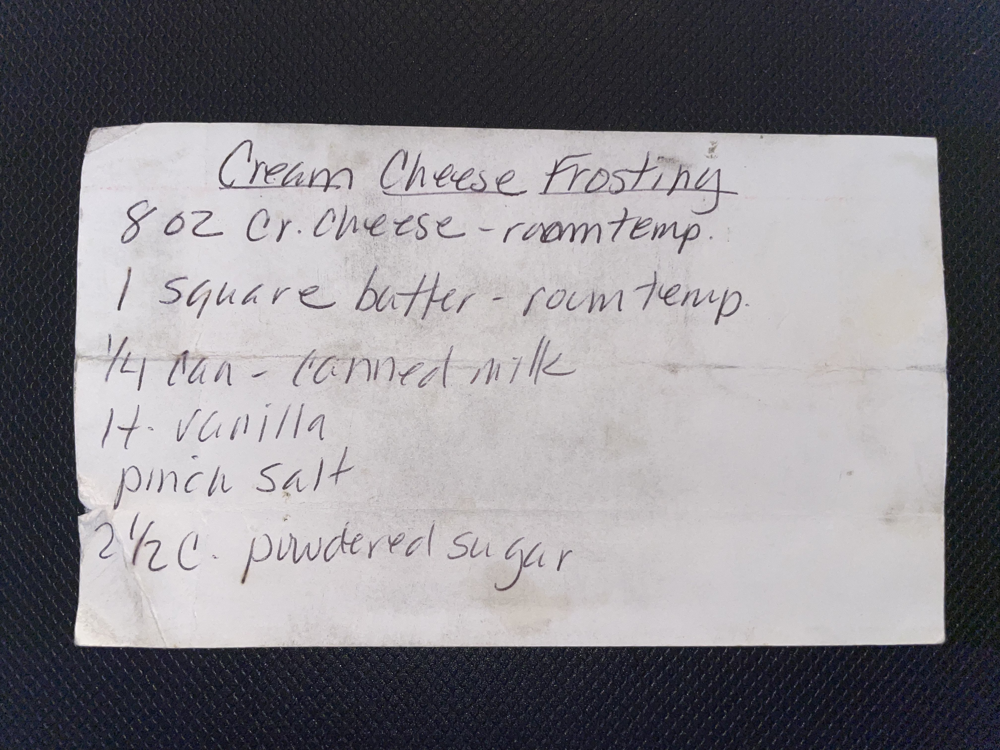

**Dry:** 2 c. flour, 2 c. sugar, 1 t. salt, 1 t. soda, 2 t. cinnamon

**Add:** 4 eggs, 1 1/2 c. oil, 1 c. coconut **[uncertain]**, 1 (8 oz.) can crushed pineapple, 1/2 c. chopped nuts, 2 c. grated carrots

**Baking:** 9x13: 350° for 30 mins, then 325° for 15 mins. 10x15: 350° for 15 mins, then 325° for 10 mins.

**Cream Cheese Frosting:** 8 oz. cream cheese, 1 stick butter (room temp), 1/4 can canned milk, 1 t. vanilla, pinch salt, 2 1/2 c. powdered sugar

---

### Nacogdoches Cake / Texas Sheet Cake
*Source: Joyce (IMG_9157)*

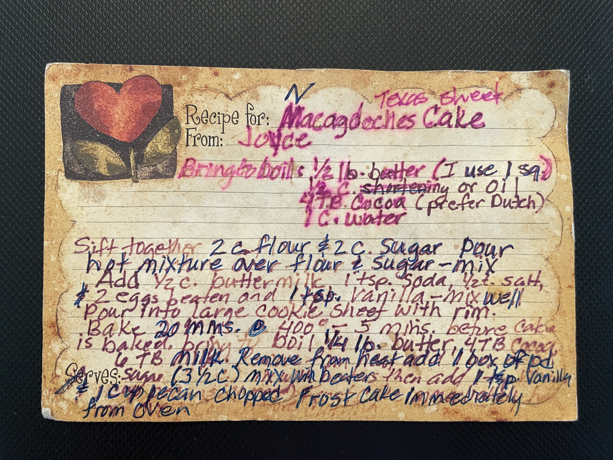

**Ingredients:**
Bring to boil: 1/2 lb. butter (or 1 sq. **[uncertain]**), 1/2 c. shortening or oil, 4 T. cocoa (Dutch preferred), 1 c. water

Sift together: 2 c. flour, 2 c. sugar. Pour hot mixture over, mix. Add 1/2 c. buttermilk, 1 tsp. soda, 1/2 tsp. salt, 2 eggs beaten, 1 tsp. vanilla.

**Instructions:**
Pour into large cookie sheet with rim. Bake 20 mins at 400°.

**Frosting:** 5 mins before done, boil 1/2 lb. butter, 4 T. cocoa, 6 T. milk. Remove, add 1 box powdered sugar (3 1/2 c.), 1 tsp. vanilla, 1 cup chopped pecans. Frost immediately from oven.

---

### Oatmeal Spice Cake
*Source: IMG_9485 — [Card says "(over)" — back not photographed]*

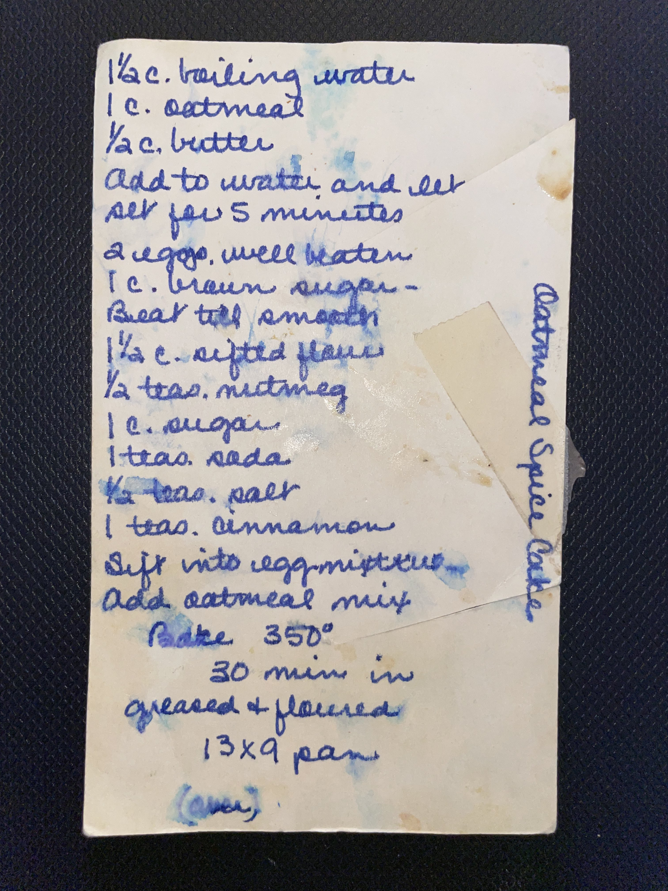

**Ingredients:**
- 1 1/2 c. boiling water, 1 c. oatmeal, 1/2 c. butter — add to water and let set 5 minutes
- 2 eggs (well beaten), 1 c. brown sugar — beat til smooth
- 1 1/2 c. sifted flour, 1/2 tsp. nutmeg, 1 c. sugar, 1 tsp. soda, 1/2 tsp. salt **[uncertain]**, 1 tsp. cinnamon

**Instructions:**
Sift into egg mixture. Add oatmeal mix. Bake at 350° for 30 min in greased & floured 13x9 pan.

---

### Pineapple Cream Cake
*Source: Jaye **[uncertain]** (IMG_9170)*

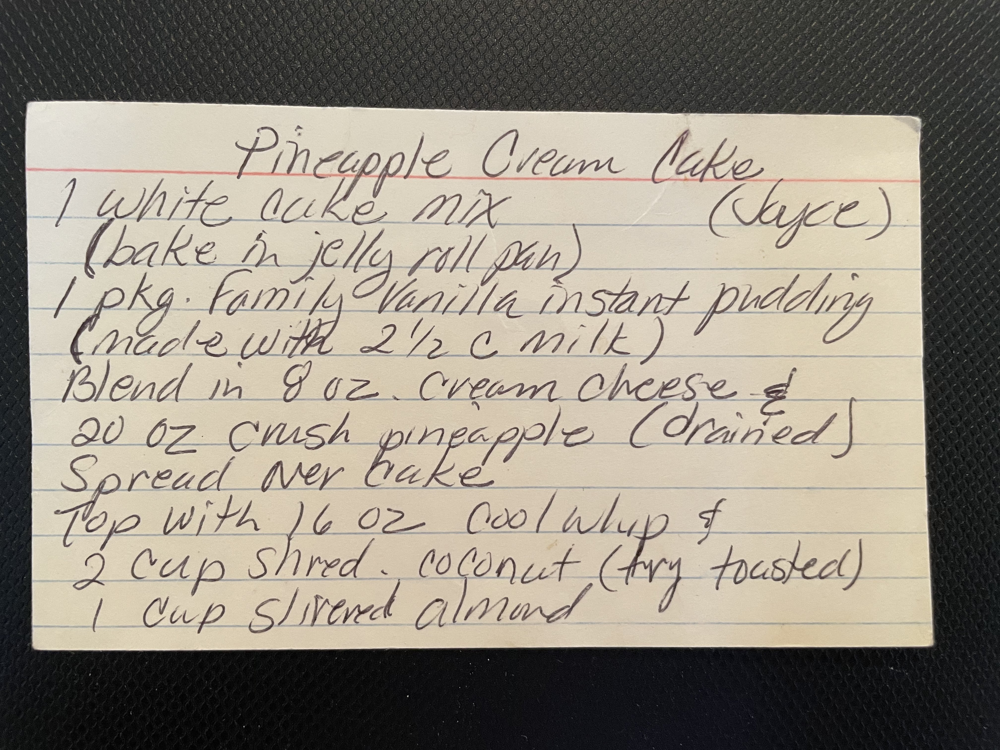

**Ingredients:**
- 1 white cake mix (bake in jelly roll pan)
- 1 pkg. family vanilla instant pudding (made with 2 1/2 c. milk)
- Blend in 8 oz. cream cheese & 20 oz. crushed pineapple (drained)
- Top with 16 oz. Cool Whip, 2 c. shredded coconut (try toasted), 1 c. slivered almonds

---

### Pumpkin Cake Roll
*Source: IMG_9166 / IMG_9167 — Serves 10–12*

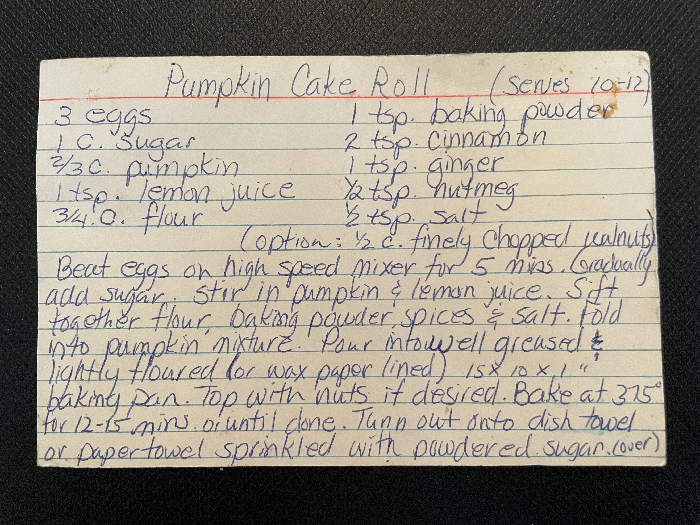

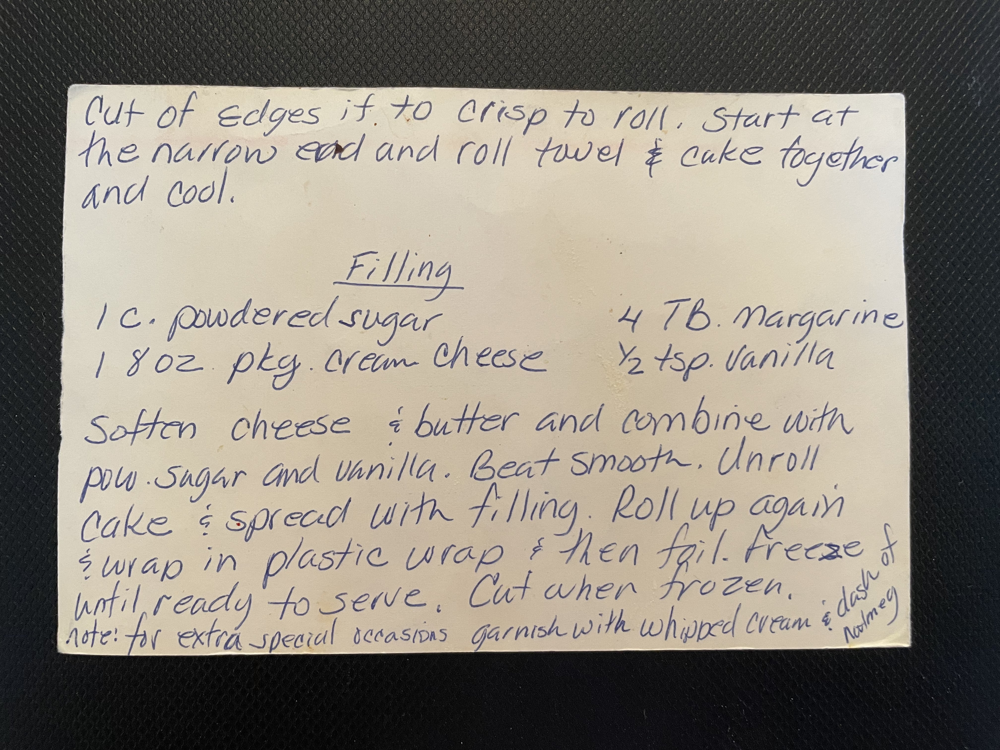

**Ingredients:**
- 3 eggs, 1 c. sugar, 2/3 c. pumpkin, 1 tsp. lemon juice, 3/4 c. flour, 1 tsp. baking powder, 2 tsp. cinnamon, 1 tsp. ginger, 1/2 tsp. nutmeg, 1/2 tsp. salt, (optional: 1/2 c. finely chopped walnuts)

**Instructions:**
Beat eggs 5 mins, add sugar. Stir in pumpkin & lemon juice. Sift flour with spices. Fold in. Pour into 15x10x1" pan. Bake at 375° for 12–15 min. Turn out onto towel sprinkled with powdered sugar. Roll towel & cake together and cool.

**Filling:** 1 c. powdered sugar, 1 (8 oz.) cream cheese, 4 T. margarine, 1/2 tsp. vanilla. Unroll cake, spread filling, roll up. Wrap and freeze. Cut when frozen.

---

### Sour Cream Chocolate Cake
*Source: Carla Poulton (IMG_9164 / IMG_9165)*

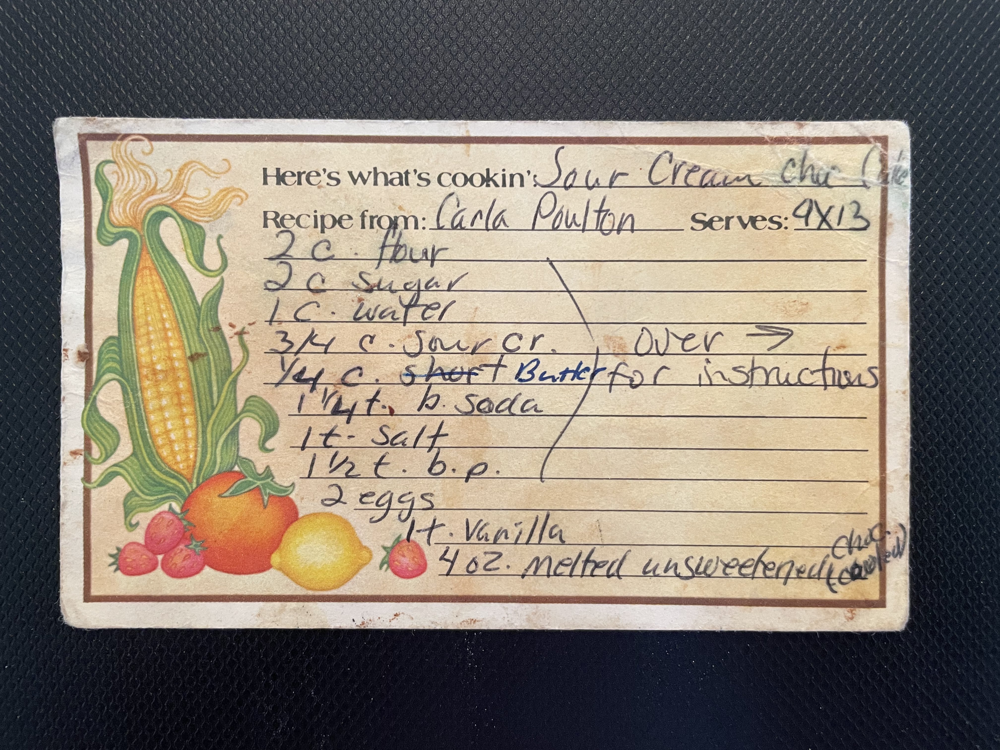

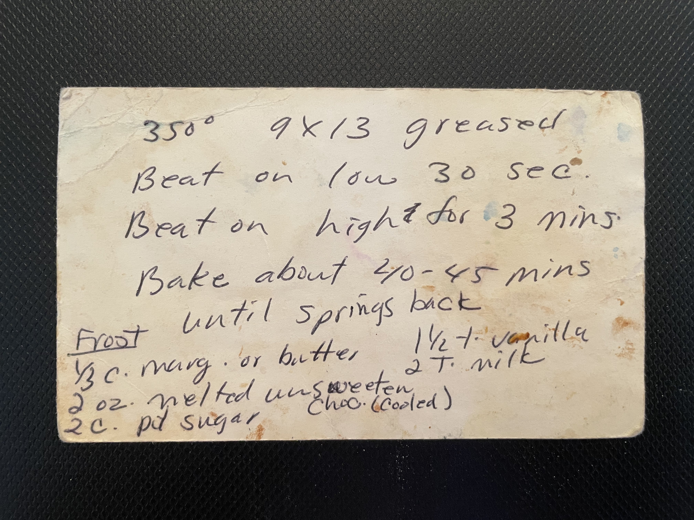

**Ingredients:**
- 2 c. flour, 2 c. sugar, 1 c. water, 3/4 c. sour cream, 1/4 c. butter **[uncertain]**, 1 1/4 t. soda, 1 t. salt, 1 1/2 t. baking powder, 2 eggs, 1 t. vanilla, 4 oz. melted unsweetened chocolate (cooled)

**Instructions:**
Beat on low 30 sec, high 3 mins. Bake 350° in greased 9x13 for 40–45 mins.

**Frosting:** 1/3 c. butter, 1 1/2 t. vanilla, 2 T. milk, 2 oz. melted unsweetened chocolate (cooled), 2 c. powdered sugar

---

### Strawberry Cake
*Source: Laurie Lundin (IMG_9158)*

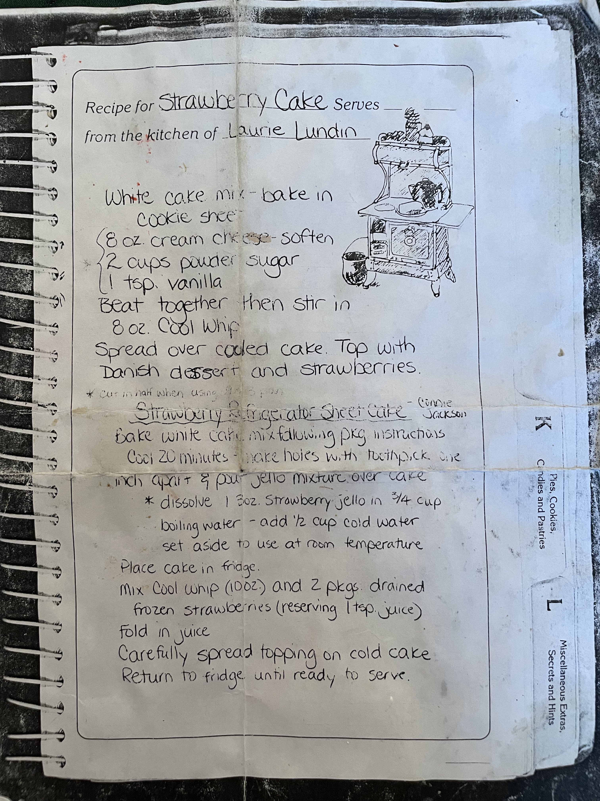

White cake mix — bake in cookie sheet. Beat 8 oz. cream cheese, 2 cups powdered sugar, 1 tsp. vanilla together. Stir in 8 oz. Cool Whip. Spread over cooled cake. Top with Danish dessert and strawberries.

---

### Strawberry & Pineapple Sheet Cake
*Source: IMG_9158*

Bake white cake mix per instructions. Cool 20 min. Poke holes 1" apart. Dissolve 1 (3 oz.) strawberry jello in 3/4 cup boiling water + 1/2 cup cold water. Pour over cake. Chill. Mix 10 oz. Cool Whip and 2 pkg. drained frozen strawberries (reserve 1 tsp. juice, fold in). Spread on cold cake. Refrigerate.

---

### Sweetheart Cake
*Source: IMG_9491 / IMG_9492*

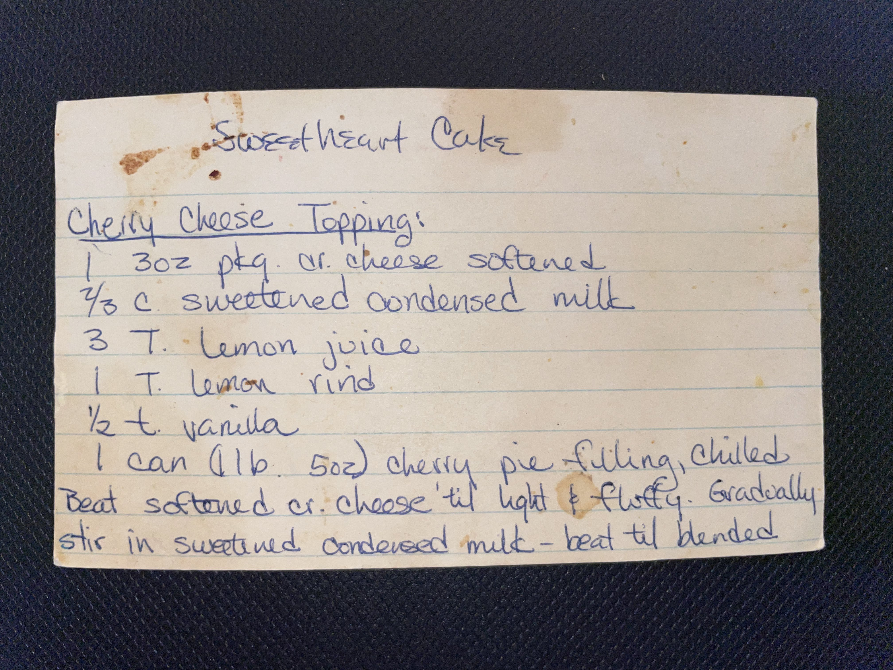

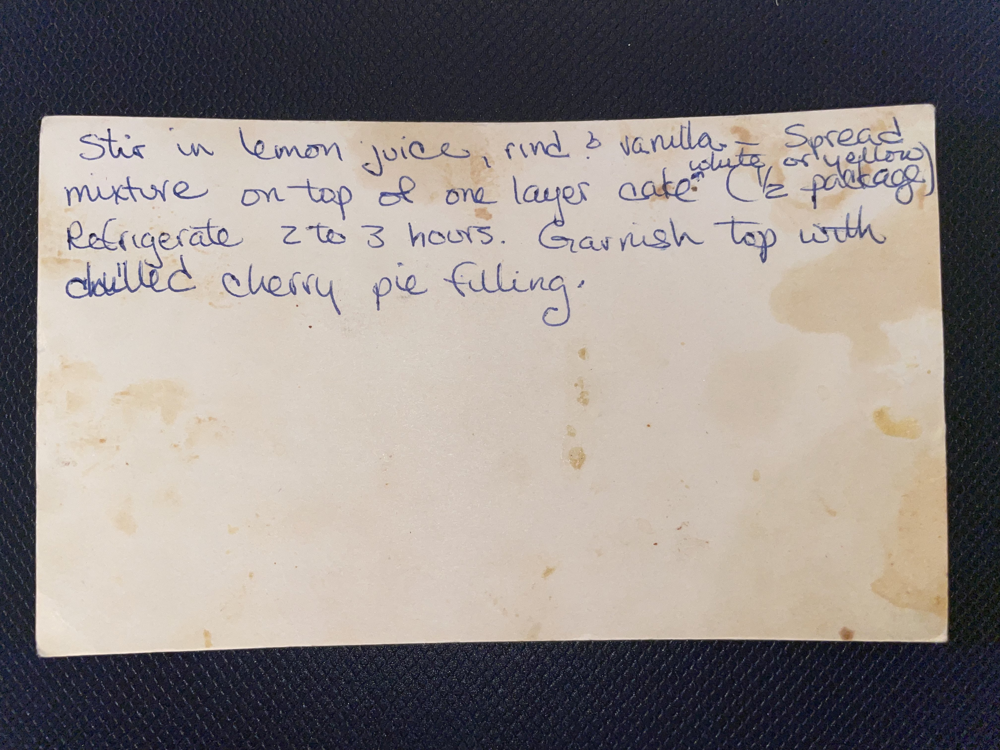

**Cherry Cheese Topping:**
- 1 (3 oz.) pkg. cream cheese (softened), 1/3 c. sweetened condensed milk, 3 T. lemon juice, 1 T. lemon rind, 1/2 t. vanilla, 1 can (1 lb. 5 oz.) cherry pie filling (chilled)

**Instructions:**
Beat cream cheese til fluffy. Stir in condensed milk, beat til blended. Stir in lemon juice, rind & vanilla. Spread on top of one layer cake (white or yellow, 1/2 package). Refrigerate 2–3 hours. Garnish with cherry pie filling.

---

## Desserts — Cookies

---

### Best Chocolate Chip Bars
*Source: IMG_9211*

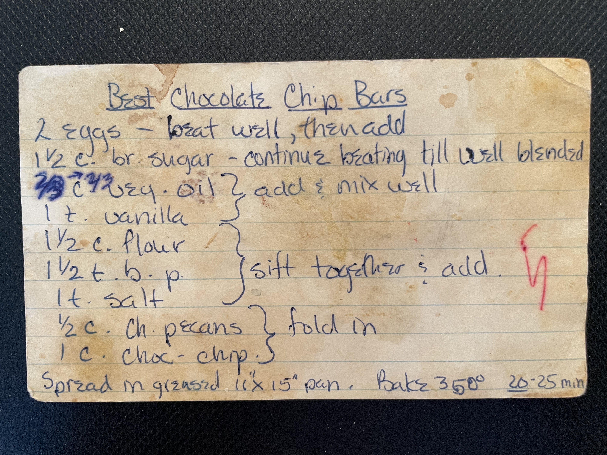

**Ingredients:**
- 2 eggs (beat well), 1 1/2 c. brown sugar, 2/3 c. vegetable oil **[uncertain]**, 1 t. vanilla, 1 1/2 c. flour, 1 1/2 t. baking powder, 1 t. salt, 1/2 c. chopped pecans, 1 c. chocolate chips

**Instructions:**
Spread in greased 11" x 15" pan. Bake 350° for 20–25 min.

---

### Brownies
*Source: IMG_9216*

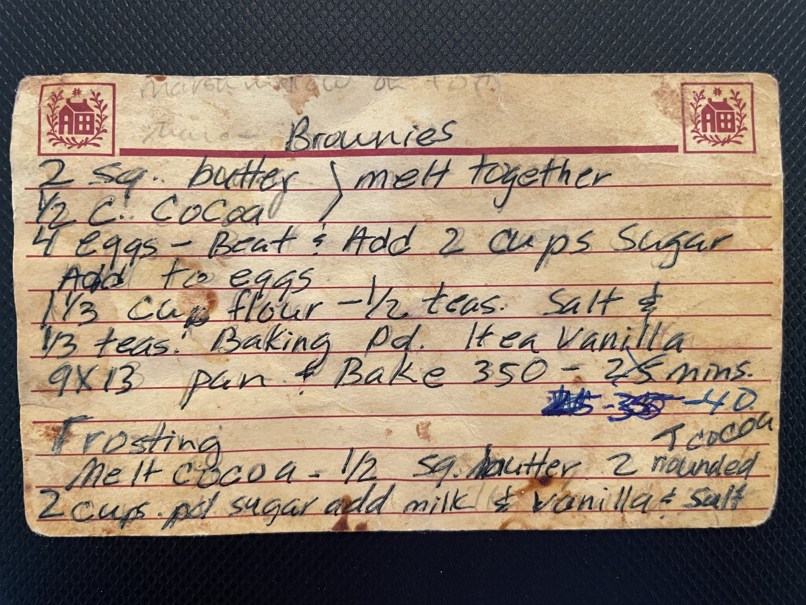

**Ingredients:**
- 2 sq. butter, 1/2 c. cocoa (melt together), 4 eggs, 2 cups sugar, 1 1/3 cup flour, 1/2 t. salt, 1/3 t. baking powder, 1 t. vanilla

**Instructions:**
Bake 350° in 9x13 pan for 25 mins **[uncertain]**.

**Frosting:** Melt 1/2 sq. butter, 2 T. cocoa. Add 2 cups powdered sugar, milk, vanilla, salt.

---

### Butterscotch Brownies
*Source: IMG_9213*

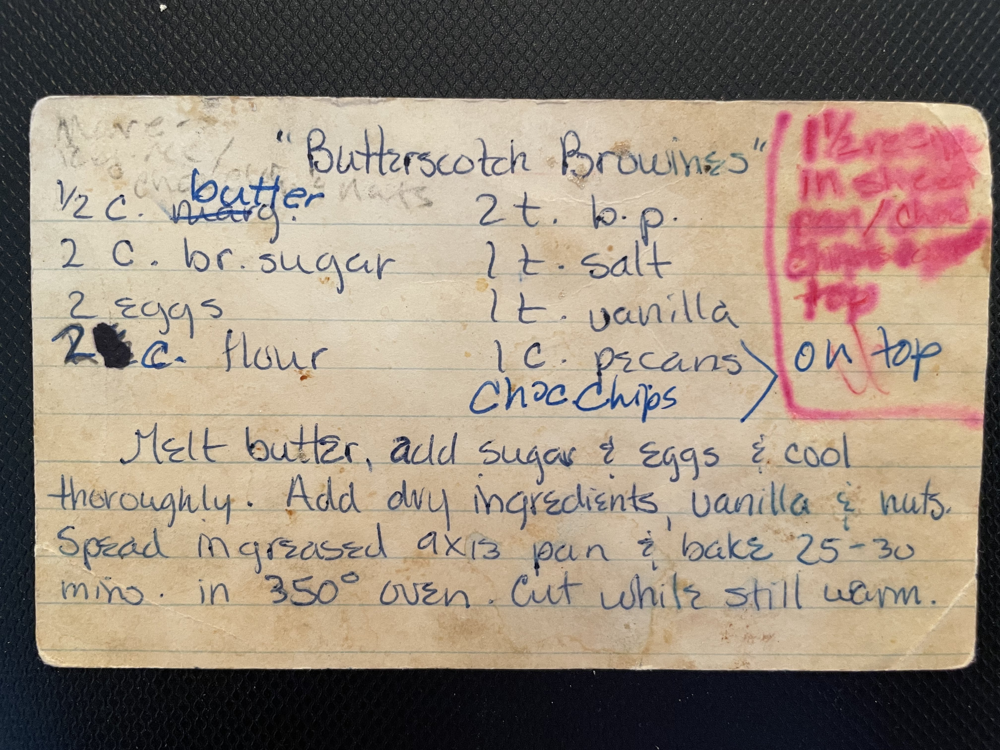

**Ingredients:**
- 1/2 c. butter, 2 c. brown sugar, 2 eggs, 2 c. flour, 2 t. baking powder, 1 t. salt, 1 t. vanilla, 1 c. pecans (on top), chocolate chips

**Instructions:**
Melt butter, add sugar & eggs. Cool thoroughly. Add dry ingredients, vanilla & nuts. Spread in greased 9x13 pan. Bake 25–30 min at 350°. Cut while still warm.

---

### Caramel Brownies
*Source: IMG_9225 / IMG_9226*

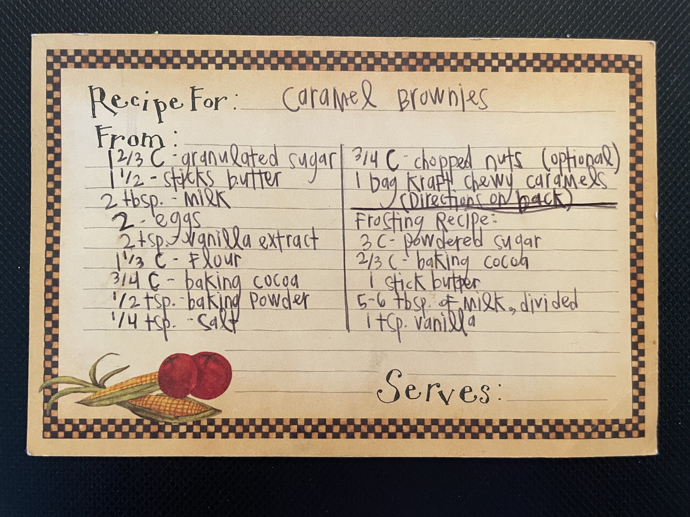

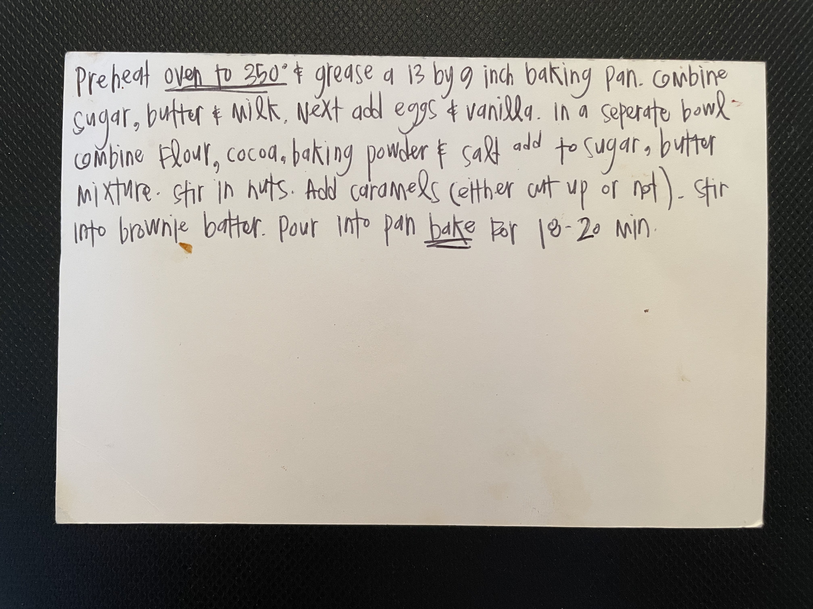

**Brownie:** 1 2/3 c. sugar, 1 1/2 sticks butter, 2 T. milk, 2 eggs, 2 tsp. vanilla, 1 1/3 c. flour, 3/4 c. baking cocoa, 1/2 tsp. baking powder, 1/4 tsp. salt, 3/4 c. chopped nuts (optional), 1 bag Kraft chewy caramels

**Frosting:** 3 c. powdered sugar, 2/3 c. baking cocoa, 1 stick butter, 5–6 T. milk, 1 tsp. vanilla

**Instructions:**
Preheat 350°, grease 13x9 pan. Mix sugar, butter & milk. Add eggs & vanilla. Combine dry ingredients separately, add to wet mixture. Stir in nuts and caramels. Bake 18–20 min **[uncertain]**.

---

### Chocolate Bars (Janet Spilker)
*Source: IMG_9478 / IMG_9479*

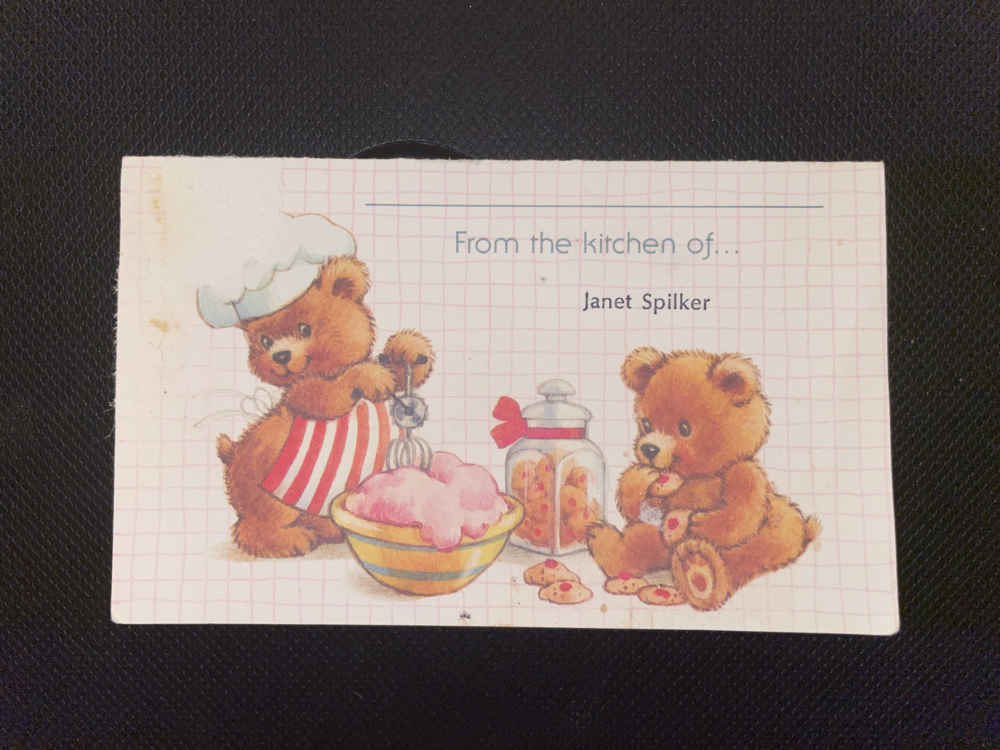

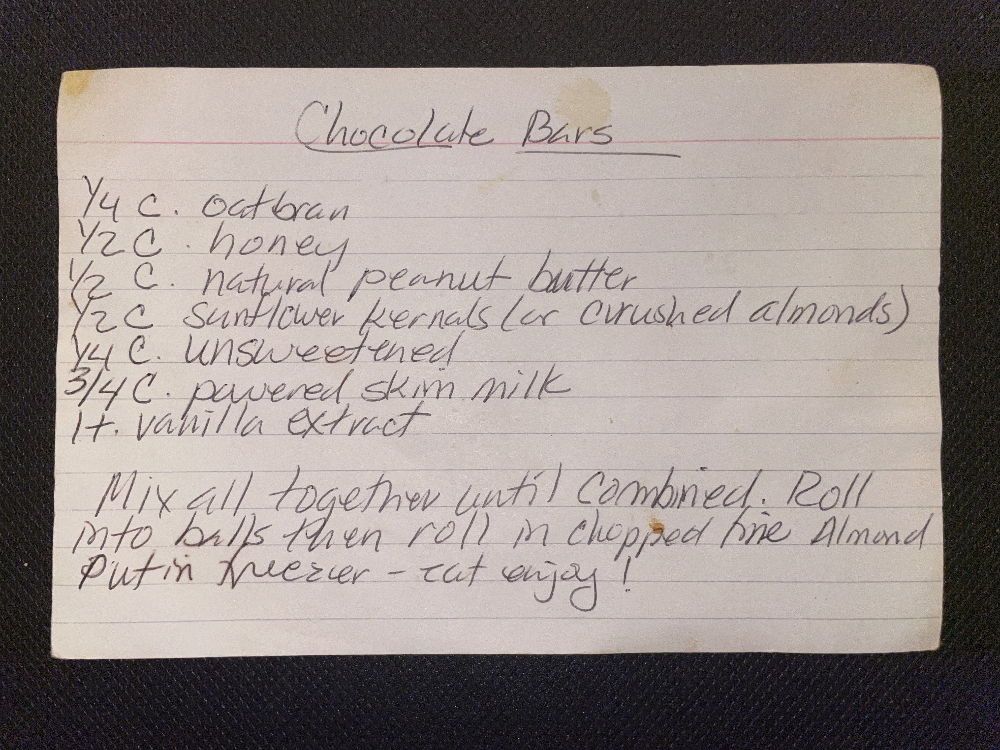

**Ingredients:**
- 1/4 c. oat bran, 1/2 c. honey, 1/2 c. natural peanut butter, 1/2 c. sunflower kernels (or crushed almonds), 1/4 c. unsweetened **[uncertain — likely coconut or cocoa]**, 3/4 c. powdered skim milk, 1 t. vanilla extract

**Instructions:**
Mix all together until combined. Roll into balls, then roll in chopped fine almonds. Put in freezer.

---

### Chocolate Chip Squares
*Source: IMG_9214 / IMG_9215*

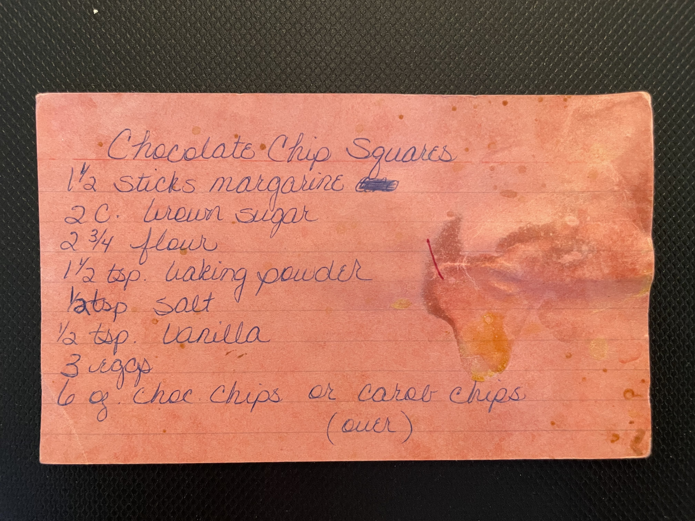

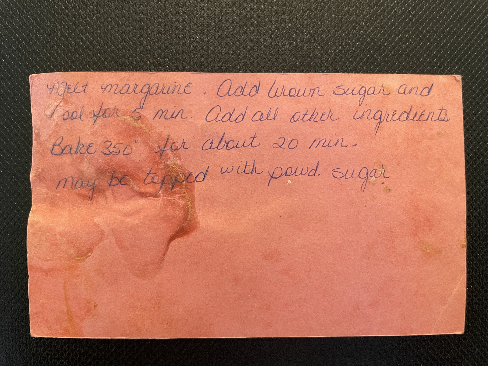

**Ingredients:**
- 1 1/2 sticks margarine, 2 c. brown sugar, 2 3/4 c. flour, 1 1/2 tsp. baking powder, 1/2 tsp. salt, 1/2 tsp. vanilla, 3 eggs, 6 oz. chocolate chips or carob chips

**Instructions:**
Melt margarine. Add brown sugar and cool 5 min. Add all other ingredients. Bake 350° for about 20 min. May be topped with powdered sugar.

---

### Coconut Bar Cookies
*Source: IMG_9219*

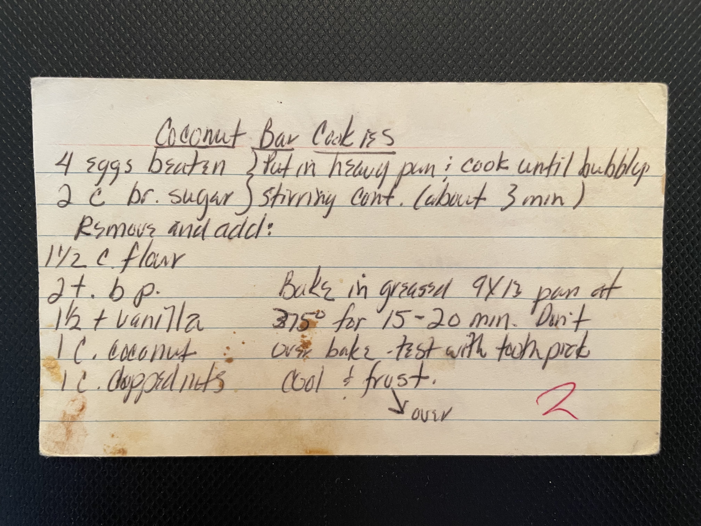

**Ingredients:**
- 4 eggs beaten, 2 c. brown sugar (put in heavy pan, cook until bubbly ~3 min.)
- Remove and add: 1 1/2 c. flour, 2 t. baking powder, 1 1/2 t. vanilla, 1 c. coconut, 1 c. chopped nuts

**Instructions:**
Bake in greased 9x13 pan at 375° for 15–20 min. Don't overbake. Cool & frost.

---

### Gingersnaps
*Source: Amy P. (IMG_9207) — 3 dozen **[uncertain]***

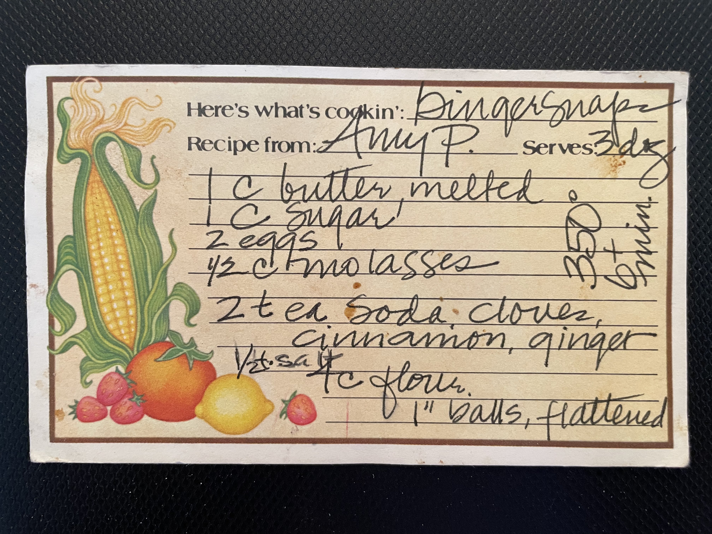

**Ingredients:**
- 1 c. butter (melted), 1 c. sugar, 2 eggs, 1/2 c. molasses, 2 t. each: soda, cloves, cinnamon, ginger, 1/2 t. salt **[uncertain]**, 4 c. flour

**Instructions:**
Form 1" balls, flatten. Bake at 375° for 10–12 min.

---

### Kathy's Pumpkin Chocolate Chip Bars
*Source: IMG_9222 / IMG_9223*

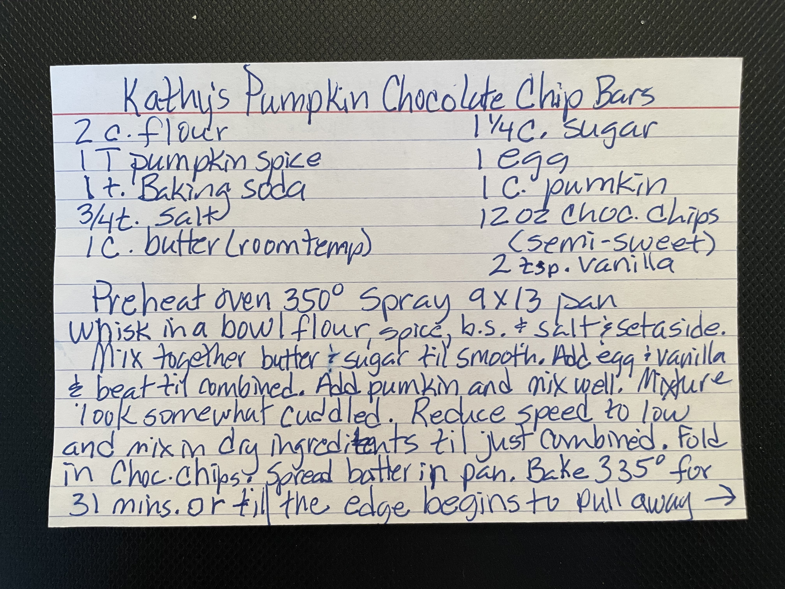

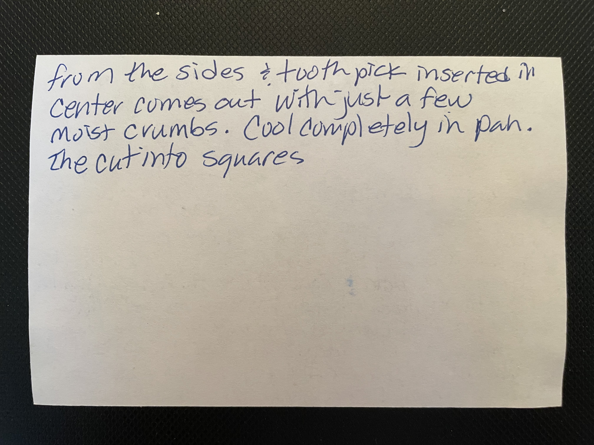

**Ingredients:**
- 2 c. flour, 1 T. pumpkin spice, 1 t. baking soda, 3/4 t. salt, 1 c. butter (room temp), 1 3/4 c. sugar, 1 egg, 1 c. pumpkin **[uncertain]**, 12 oz. semi-sweet chocolate chips, 2 tsp. vanilla

**Instructions:**
Preheat 350°. Spray 9x13 pan. Whisk flour, spice, soda & salt. Mix butter & sugar til smooth. Add egg & vanilla. Add pumpkin. Mix in dry ingredients. Fold in chips. Bake at 335° for 31 mins. Cool completely and cut.

---

### Leibkuchen Cookies
*Source: Mother (IMG_9510)*

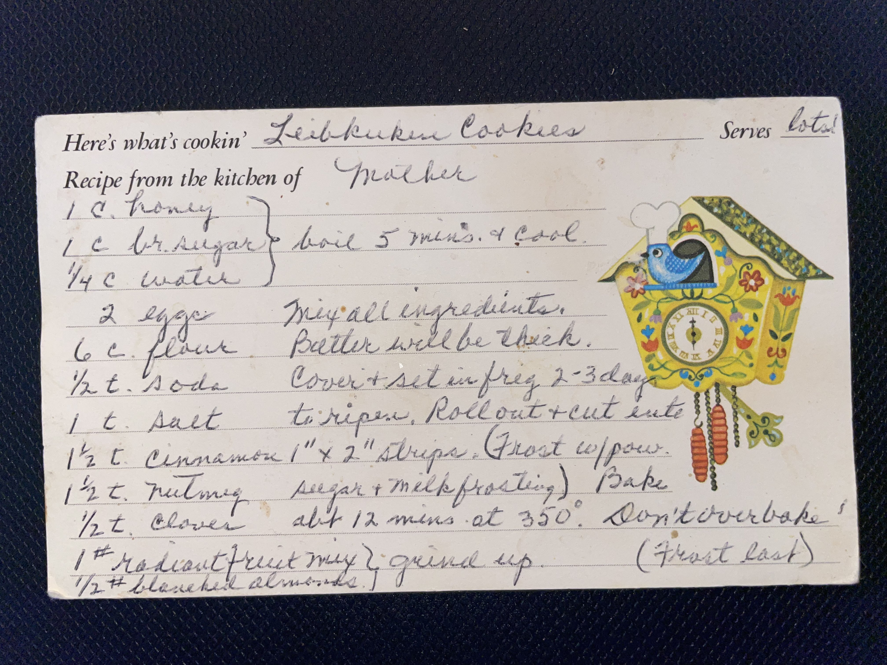

> **[uncertain]** *Several words on this card are difficult to read. "Leibkuchen" may be "Lebkuchen" (German spice cookies).*

**Ingredients:**
- 1 c. honey, 1 c. brown sugar, 1/4 c. water — boil 5 mins. & cool
- 2 eggs, 6 c. flour, 1/2 t. soda, 1 t. salt, 1 1/2 t. cinnamon, 1 1/2 t. nutmeg, 1/2 t. cloves **[uncertain]**
- 1 lb. candied fruit (ground up) **[uncertain]**, 1/2 lb. bleached almonds

**Instructions:**
Mix all. Batter will be thick. Cover & set in fridge 2–3 days to ripen. Roll out & cut into 1" x 2" strips. Frost with powdered sugar & milk frosting. Bake about 12 mins at 350°. Don't overbake!

---

### Lemon Squares
*Source: IMG_9508*

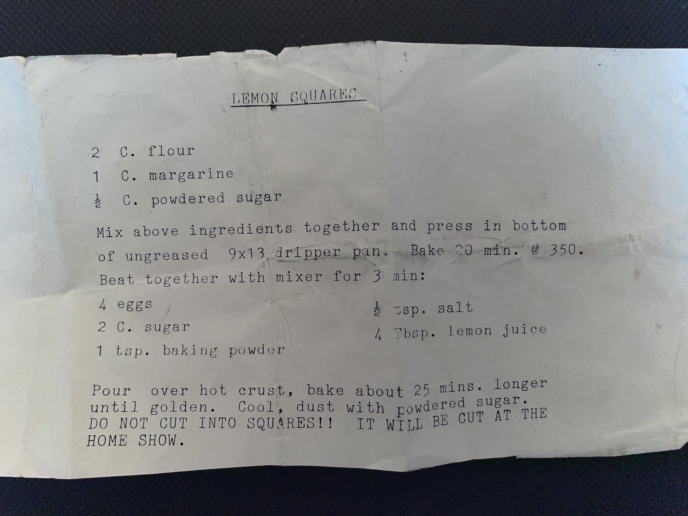

**Crust:** 2 c. flour, 1 c. margarine, 1/2 c. powdered sugar — mix and press in 9x13 pan. Bake 20 min at 350°.

**Filling:** 4 eggs, 2 c. sugar, 1 tsp. baking powder, 1/2 tsp. salt, 4 Tbsp. lemon juice — beat 3 min, pour over hot crust, bake 25 mins until golden. Cool, dust with powdered sugar.

---

### Mint Brownies
*Source: Amy (IMG_9449)*

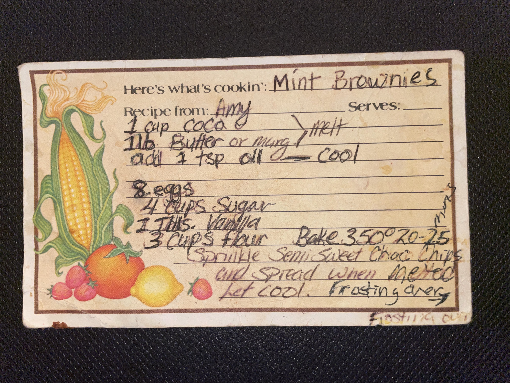

**Ingredients:**
- 1 cup cocoa, 1 lb. butter or margarine (melt), 1 tsp. oil (add, cool), 8 eggs, 4 cups sugar, 1 T. vanilla, 3 cups flour

**Instructions:**
Bake 350° for 20–25 min. Sprinkle semi-sweet chocolate chips on top and spread when melted. Let cool. Frost over.

---

### Mint Cookies
*Source: The Bleazards — "To Spilkers" (IMG_9507)*

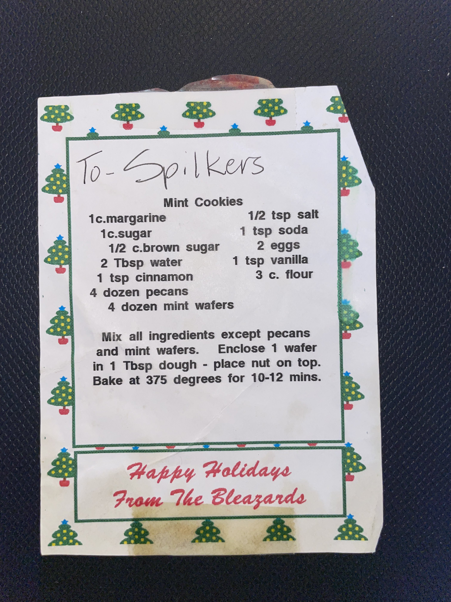

**Ingredients:**
- 1 c. margarine, 1 c. sugar, 1/2 c. brown sugar, 2 Tbsp. water, 1 tsp. cinnamon, 1/2 tsp. salt, 1 tsp. soda, 2 eggs, 1 tsp. vanilla, 3 c. flour, 4 dozen pecans, 4 dozen mint wafers

**Instructions:**
Mix all except pecans and mint wafers. Enclose 1 wafer in 1 Tbsp. dough — place nut on top. Bake at 375° for 10–12 mins.

---

### Mom's Sugar Cookies
*Source: Janet (IMG_9557 / IMG_9558; also IMG_9443 / IMG_9444)*

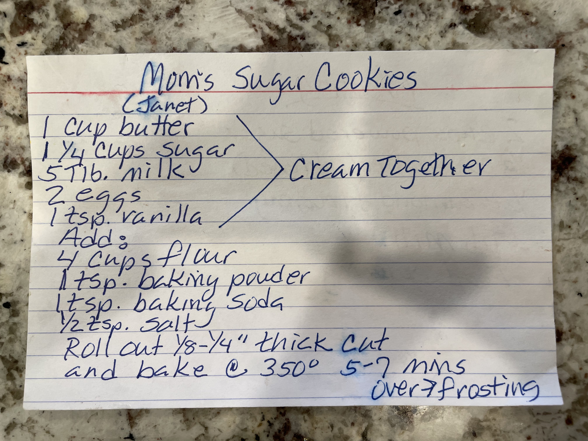

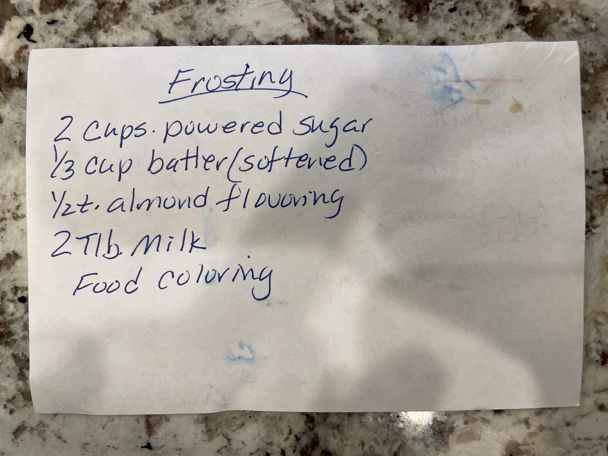

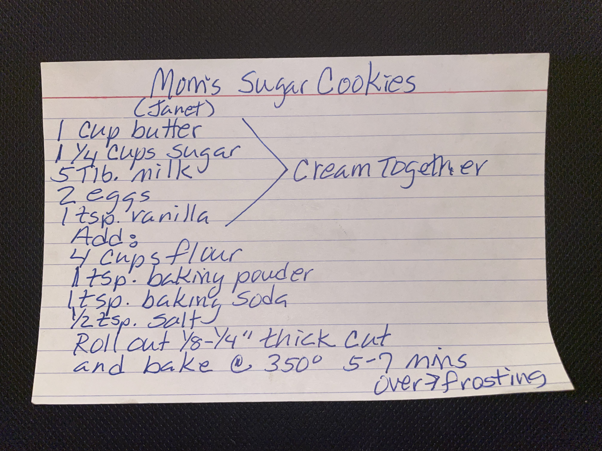

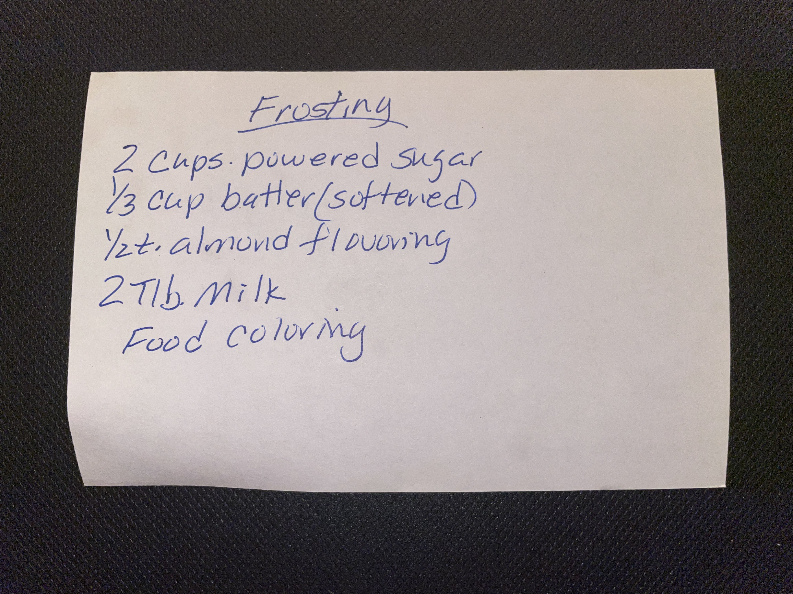

**Ingredients:**
- 1 cup butter, 1 1/4 cups sugar, 5 Tbsp. milk, 2 eggs, 1 tsp. vanilla — cream together
- 4 cups flour, 1 tsp. baking powder, 1 tsp. baking soda, 1/2 tsp. salt

**Instructions:**
Roll out 1/8–1/4" thick. Cut and bake at 350° for 5–7 mins.

**Frosting:** 2 cups powdered sugar, 1/3 cup butter (softened), 1/2 t. almond flavoring, 2 Tbsp. milk, food coloring

---

### Mrs. Fields Chocolate Chip Cookies
*Source: IMG_9217*

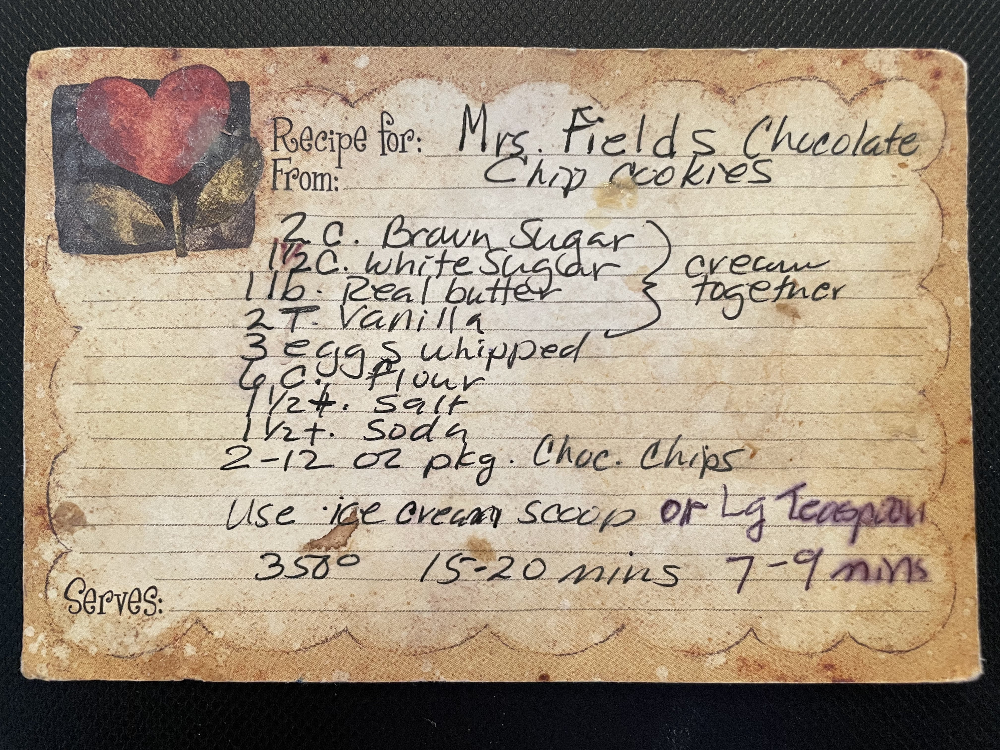

**Ingredients:**
- 2 c. brown sugar, 1 1/2 c. white sugar, 1 lb. real butter — cream together
- 2 T. vanilla, 3 eggs (whipped), 6 c. flour, 1 1/2 t. salt, 1 1/2 t. soda, 2 (12 oz.) pkg. chocolate chips

**Instructions:**
Use ice cream scoop or large teaspoon. Bake at 350° for 7–9 mins **[uncertain]**.

---

### No-Bake Cookies
*Source: IMG_9212*

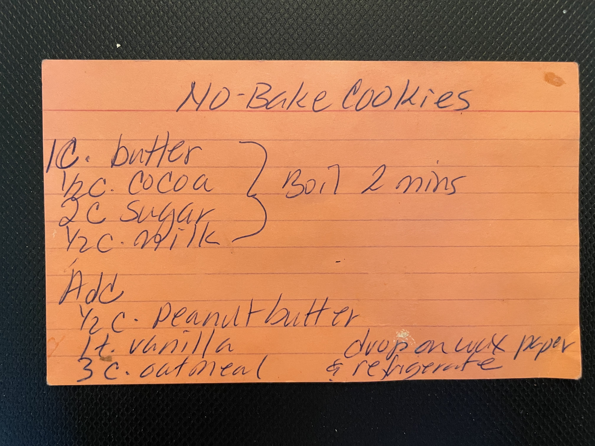

**Ingredients:**
- 1 c. butter, 1/2 c. cocoa, 2 c. sugar, 1/2 c. milk — boil 2 mins
- Add: 1/2 c. peanut butter, 1 t. vanilla, 3 c. oatmeal

**Instructions:**
Drop on wax paper & refrigerate.

---

### Oatmeal Brownies
*Source: Mom / Nana (IMG_9208 / IMG_9209)*

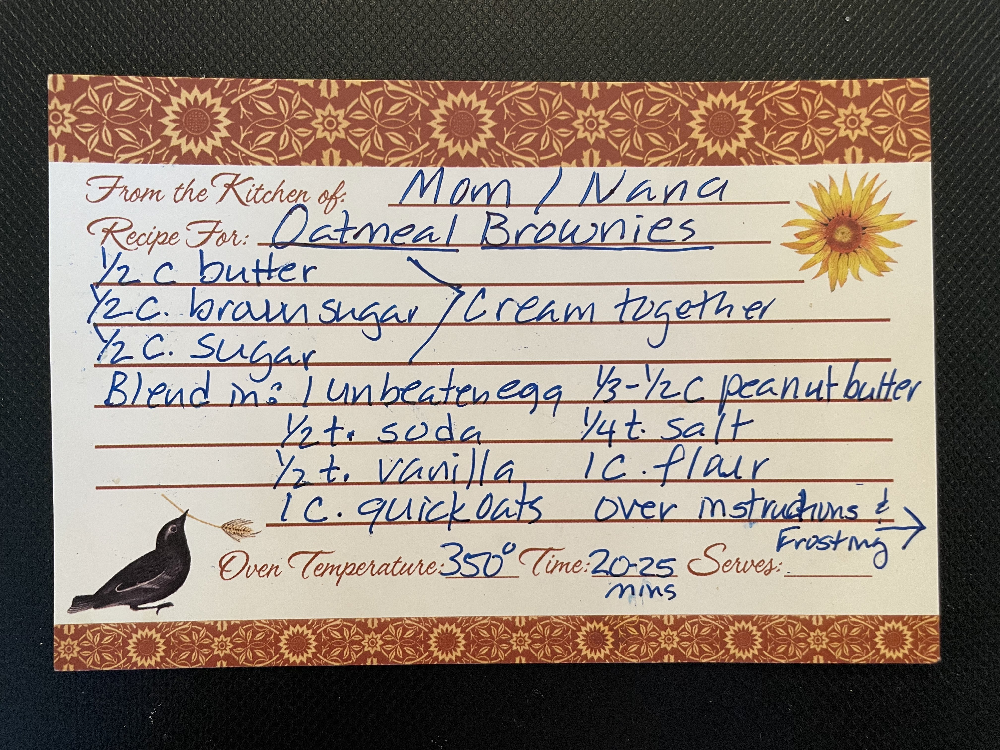

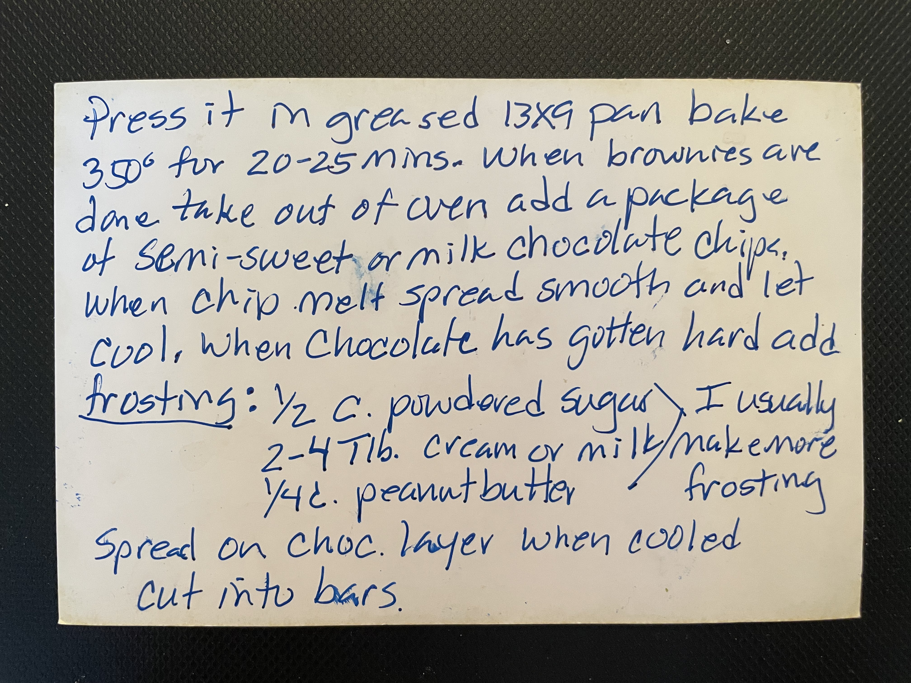

**Ingredients:**
- 1/2 c. butter, 1/2 c. brown sugar, 1/2 c. sugar — cream together
- Blend in: 1 egg, 1/3–1/2 c. peanut butter, 1/2 t. soda, 1/4 t. salt, 1/2 t. vanilla, 1 c. flour, 1 c. quick oats

**Instructions:**
Press in greased 13x9 pan. Bake 350° for 20–25 mins. Add 1 package chocolate chips on top. When melted, spread smooth. Let cool.

**Frosting:** 1/2 c. powdered sugar, 2–4 T. cream or milk, 1/4 c. peanut butter. Spread on cooled chocolate layer.

---

### Pumpkin Cookies (Joyce's)
*Source: IMG_9221*

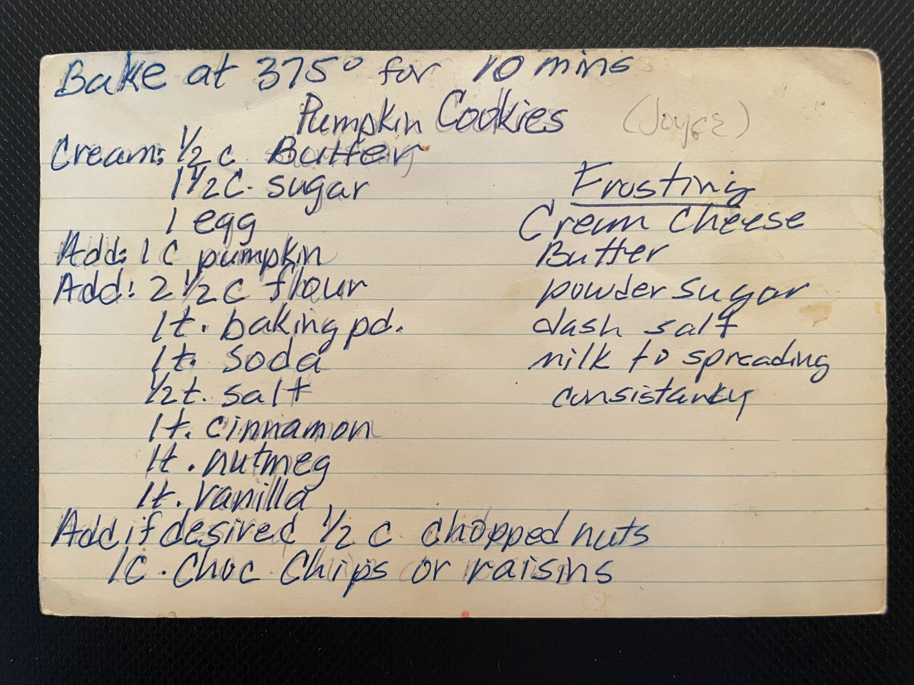

**Ingredients:**
- Cream: 1/2 c. butter, 1 1/2 c. sugar, 1 egg
- Add: 1 c. pumpkin
- Add: 2 1/2 c. flour, 1 t. baking powder, 1 t. soda, 1/2 t. salt, 1 t. cinnamon, 1 t. nutmeg, 1 t. vanilla
- Optional: 1/2 c. chopped nuts, 1 c. chocolate chips or raisins

**Instructions:**
Bake at 375° for 10 mins.

**Frosting:** Cream cheese, butter, powdered sugar, dash salt, milk to spreading consistency.

---

### Short Bread Cookies
*Source: Barb's **[uncertain]** (IMG_9509)*

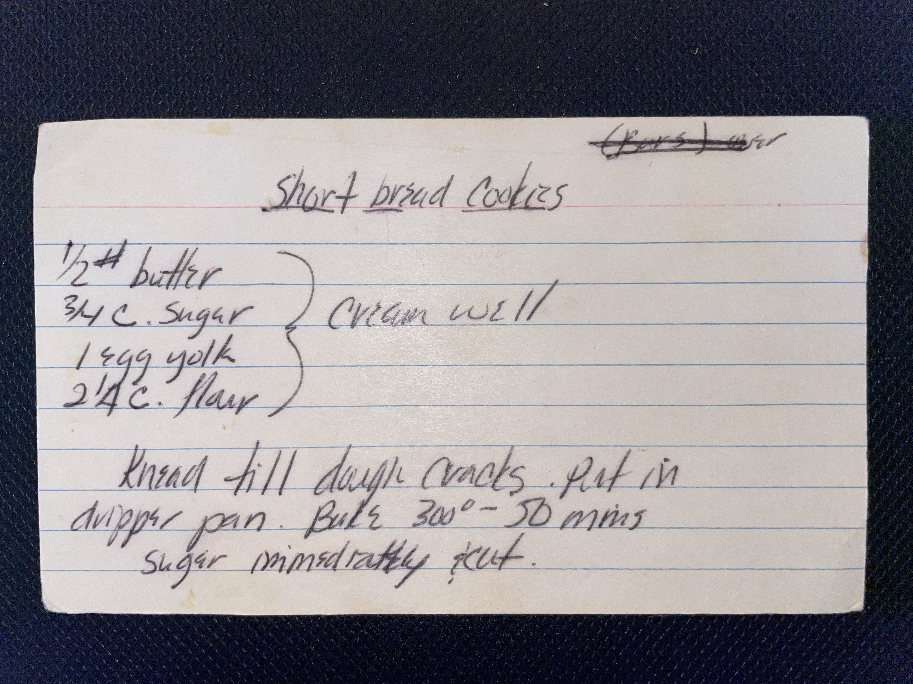

**Ingredients:**
- 1/2 lb. butter, 3/4 c. sugar, 1 egg yolk, 2 1/4 c. flour

**Instructions:**
Cream well. Knead till dough cracks. Put in pan. Bake at 300° for 50 mins **[uncertain]**. Sugar immediately. Cut.

---

### Soft Molasses Cookies
*Source: Marianne Yower **[uncertain]** (IMG_9218)*

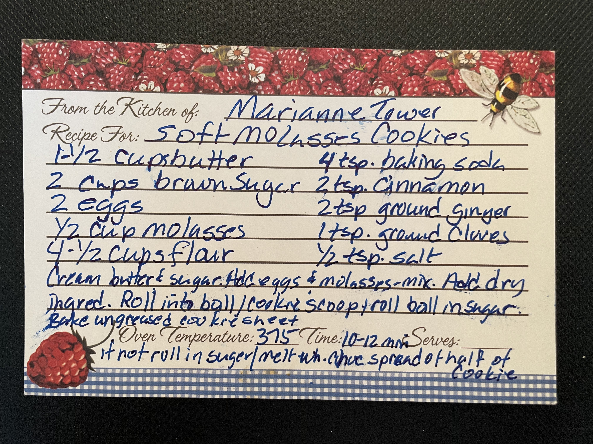

**Ingredients:**
- 1 1/2 cups butter, 2 cups brown sugar, 2 eggs, 1/2 cup molasses, 4 1/2 cups flour, 4 tsp. baking soda, 2 tsp. cinnamon, 2 tsp. ground ginger, 1 tsp. ground cloves, 1/2 tsp. salt

**Instructions:**
Cream butter & sugar. Add eggs & molasses. Add dry ingredients. Roll into balls, roll in sugar. Bake at 375° for 10–12 min.

---

### Thumbprint Cookies
*Source: IMG_9210*

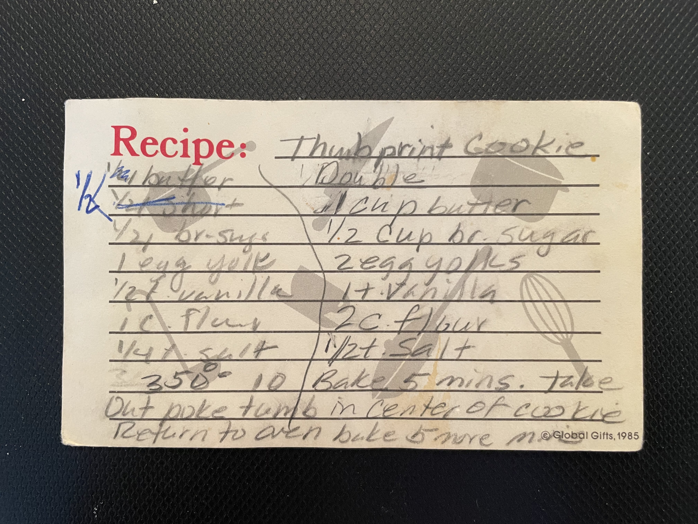

**Double batch:**
- 1 cup butter **[uncertain]**, 1/2 cup brown sugar, 2 egg yolks, 1 t. vanilla, 2 c. flour, 1/2 t. salt

**Instructions:**
Bake at 350° for 5 mins. Take out, poke thumb in center. Return to oven, bake 5 more mins.

---

### Vanishing Oatmeal Raisin Cookies
*Source: Quaker Oats (IMG_9206; also IMG_9201/IMG_9202) — About 4 dozen*

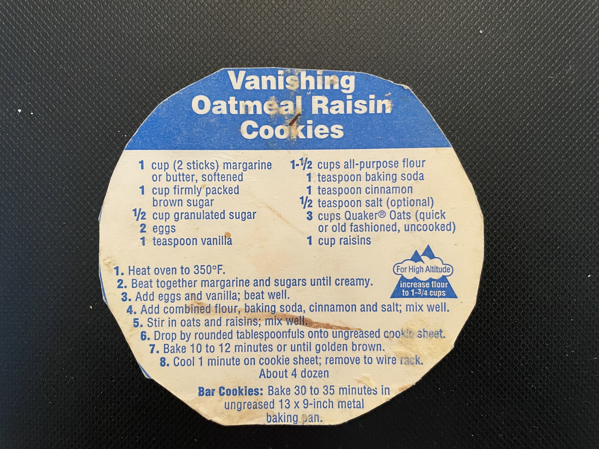

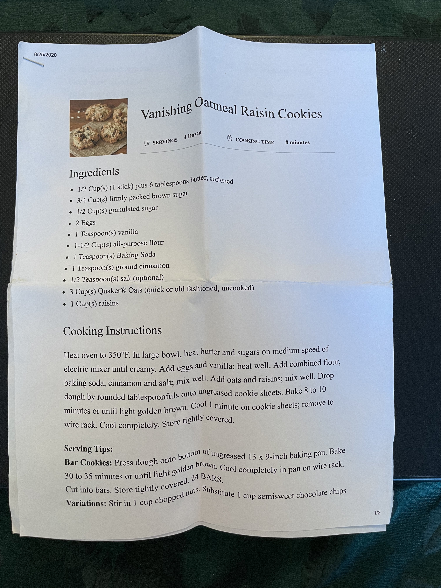

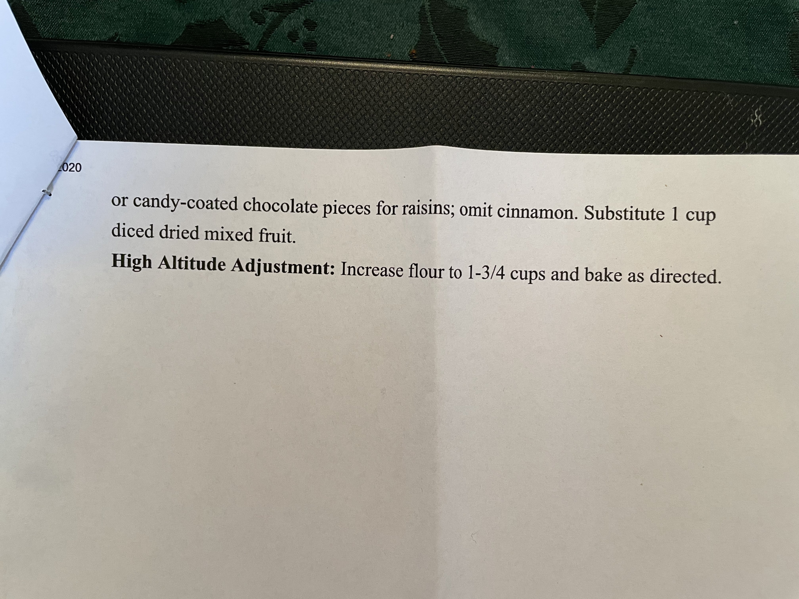

**Ingredients:**
- 1 cup butter (softened), 1 cup brown sugar, 1/2 cup granulated sugar, 2 eggs, 1 teaspoon vanilla, 1 1/2 cups flour, 1 teaspoon baking soda, 1 teaspoon cinnamon, 1/2 teaspoon salt (optional), 3 cups Quaker Oats (uncooked), 1 cup raisins

**Instructions:**
Beat butter and sugars until creamy. Add eggs and vanilla. Add flour, soda, cinnamon, salt. Stir in oats and raisins. Drop by rounded tablespoonfuls onto ungreased cookie sheet. Bake at 350°F for 10–12 minutes. High altitude: increase flour to 1 3/4 cups.

---

## Desserts — Candy & Sweets

---

### Butterscotch Crunchies
*Source: IMG_9180*

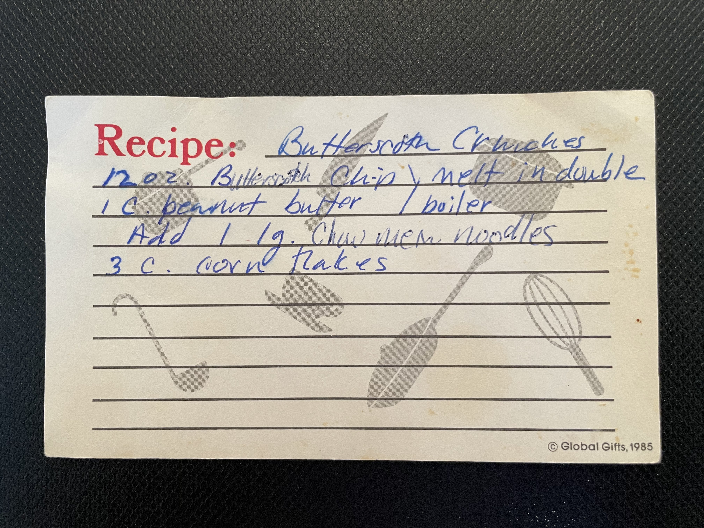

**Ingredients:**
- 12 oz. butterscotch chips, 1 c. peanut butter — melt in double boiler
- Add: 1 large can chow mein noodles **[uncertain]**, 3 c. corn flakes

---

### Candy Cereal Clusters
*Source: IMG_9185*

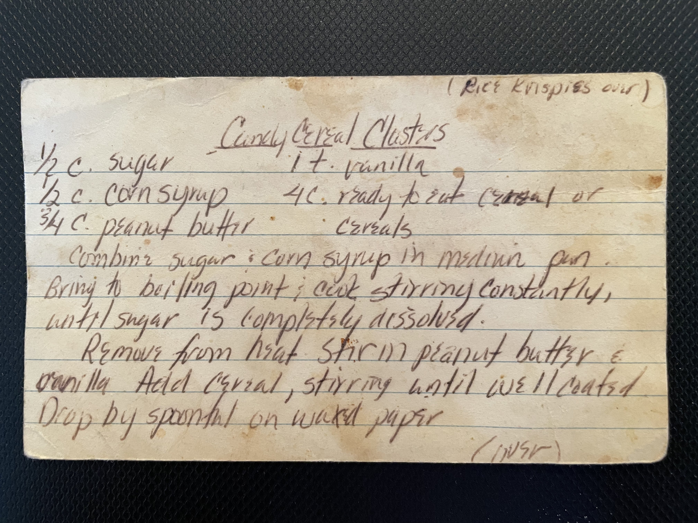

**Ingredients:**
- 1/2 c. sugar, 1/2 c. corn syrup — bring to boiling, cook, stirring, until sugar dissolved
- 3/4 c. peanut butter, 1 t. vanilla — stir in
- 4 c. ready-to-eat cereal — add, coat well. Drop by spoonful on waxed paper.

---

### Caramels (Leslie T.)
*Source: IMG_9495 / IMG_9496*

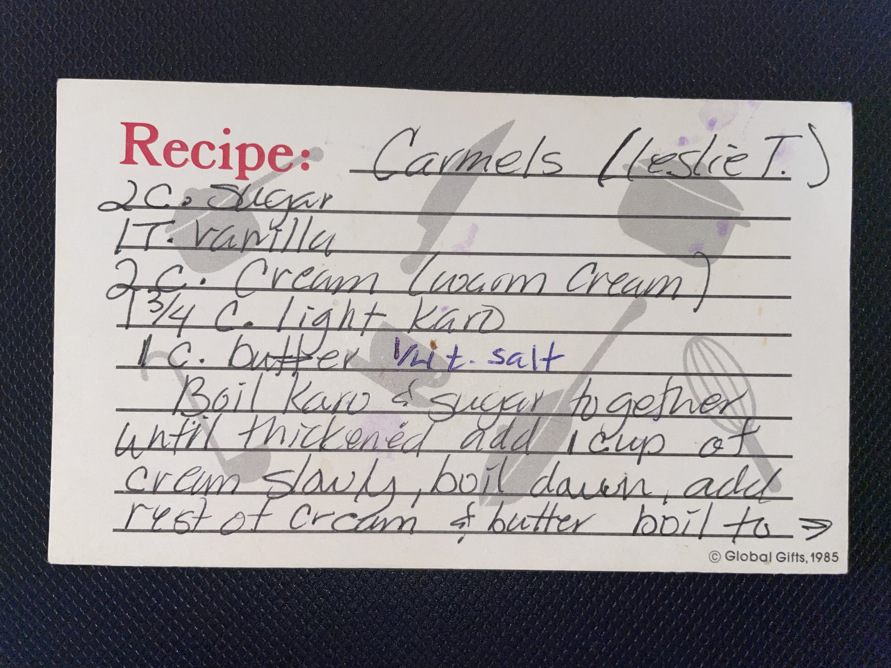

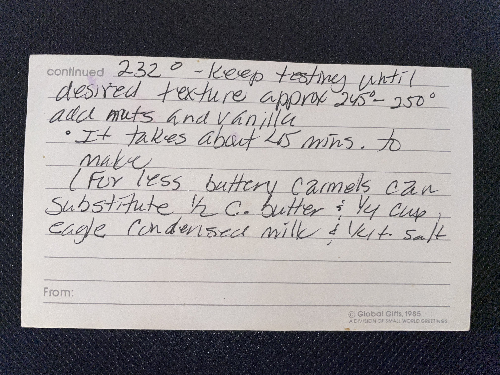

**Ingredients:**
- 2 c. sugar, 1 T. vanilla, 2 c. cream **[uncertain]**, 3/4 c. light Karo, 1 c. butter, 1/4 t. salt

**Instructions:**
Boil Karo & sugar together until thickened. Add 1 cup cream slowly, boil down, add rest of cream & butter. Boil to 232°. Keep testing until desired texture, approx 245°–250°. Add nuts and vanilla. Takes about 45 mins.

*(For less buttery caramels: substitute 1/2 c. butter & 1/4 cup Eagle condensed milk & 1/4 t. salt.)*

---

### Cereal Treat (Leslie)
*Source: IMG_9184*

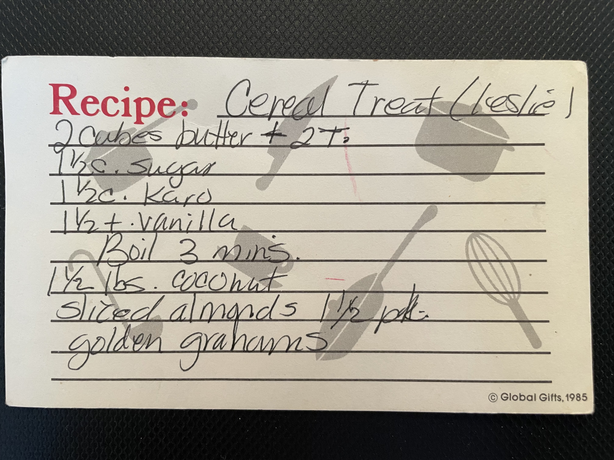

**Ingredients:**
- 2 cubes butter + 2 T., 1/3 c. sugar, 1/3 c. Karo, 1 1/2 t. vanilla — boil 3 mins
- 1 1/2 lbs. coconut, sliced almonds (1 1/2 pkg.) **[uncertain]**, Golden Grahams cereal

---

### Chocolate Peanut-Butter Balls
*Source: Trevor Glauser and Jeff Gilbert (IMG_9490)*

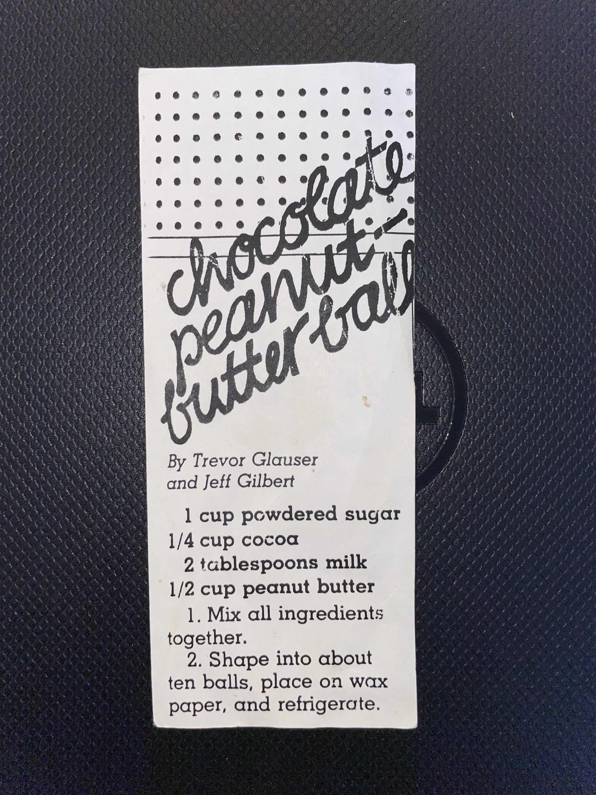

**Ingredients:**
- 1 cup powdered sugar, 1/4 cup cocoa, 2 tablespoons milk, 1/2 cup peanut butter

**Instructions:**
Mix all ingredients. Shape into about ten balls, place on wax paper, refrigerate.

---

### Cracker Jack
*Source: IMG_9497*

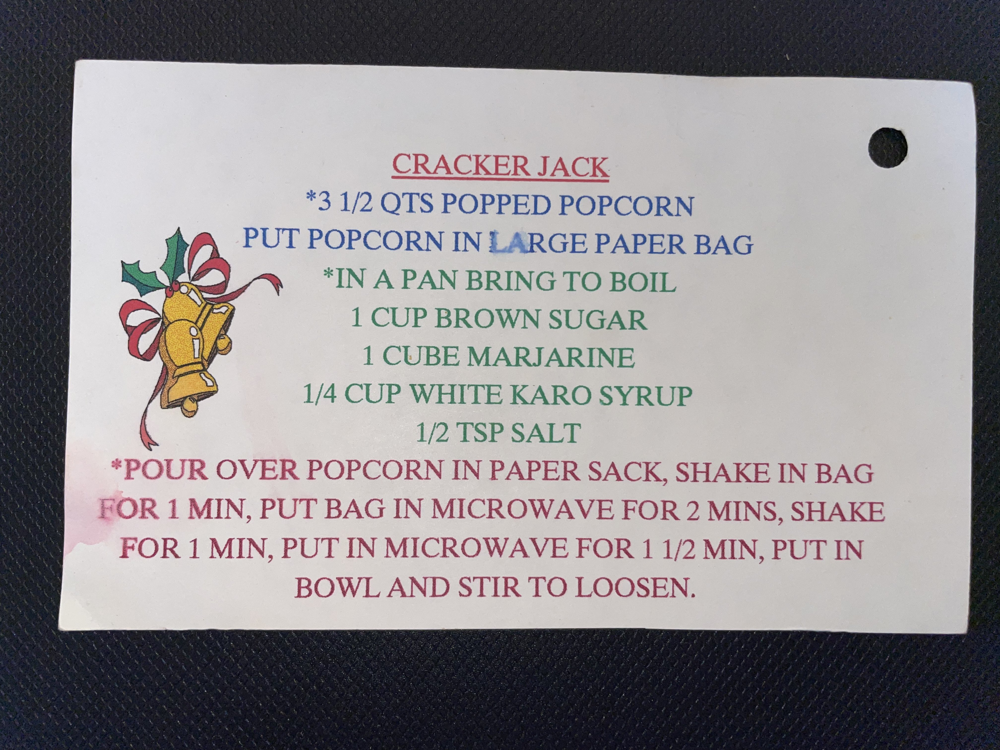

**Ingredients:**
- 3 1/2 qts. popped popcorn, 1 cup brown sugar, 1 cube margarine **[uncertain]**, 1/4 cup white Karo syrup, 1/2 tsp. salt

**Instructions:**
Put popcorn in large paper bag. Bring brown sugar, margarine, Karo syrup, and salt to a boil. Pour over popcorn in sack. Shake 1 min, microwave 2 mins, shake 1 min, microwave 1 1/2 min. Put in bowl and stir.

---

### Cracker Jacks (Oven Method)
*Source: IMG_9181*

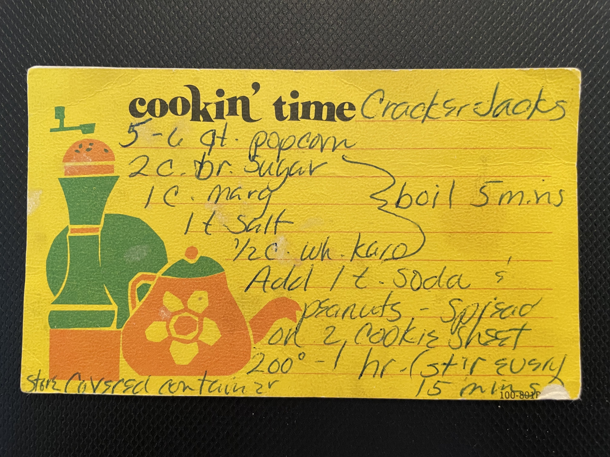

**Ingredients:**
- 5–6 qt. popcorn, 2 c. brown sugar, 1 c. margarine, 1 t. salt, 1/2 c. white Karo — boil 5 mins. Add 1 t. soda, peanuts.

**Instructions:**
Spread on 2 cookie sheets. 200° for 1 hr (stir every 15 mins). Store in covered container.

---

### English Toffee
*Source: IMG_9550 (cookbook page 181)*

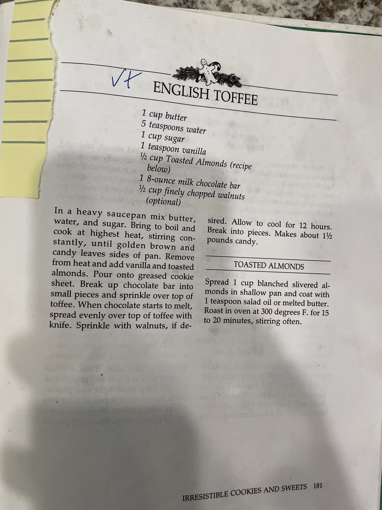

**Ingredients:**
- 1 cup butter, 5 teaspoons water, 1 cup sugar, 1 teaspoon vanilla, 3/4 cup toasted almonds, 1 (8 oz.) milk chocolate bar, 1/2 cup finely chopped walnuts (optional)

**Instructions:**
Mix butter, water, and sugar. Bring to boil, cook stirring constantly until golden brown. Remove, add vanilla and almonds. Pour onto greased cookie sheet. Sprinkle chocolate on top; when melting, spread evenly. Sprinkle with walnuts. Cool 12 hours. Break into pieces.

**Toasted Almonds:** 1 cup blanched slivered almonds, 1 tsp. salad oil. Roast at 300°F for 15–20 minutes, stirring often.

---

### Fudge Krispies
*Source: IMG_9177*

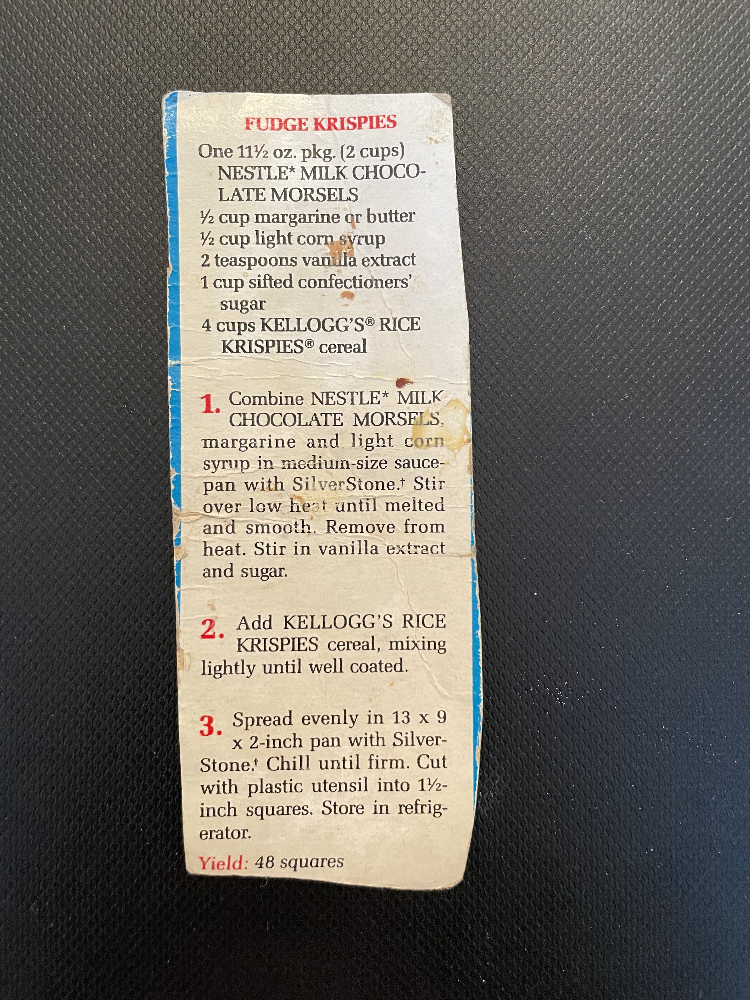

**Ingredients:**
- 1 (11 1/2 oz.) pkg. Nestle milk chocolate morsels, 1/2 cup margarine, 1/2 cup light corn syrup, 2 tsp. vanilla, 1 cup confectioners' sugar, 4 cups Rice Krispies

**Instructions:**
Combine chocolate, margarine, and corn syrup. Stir over low heat until melted. Add vanilla and sugar. Add Rice Krispies. Spread in 13x9x2 pan. Chill until firm. Cut. Store in refrigerator. Yield: 48 squares.

---

### Grandpa's Caramel Corn
*Source: IMG_9175*

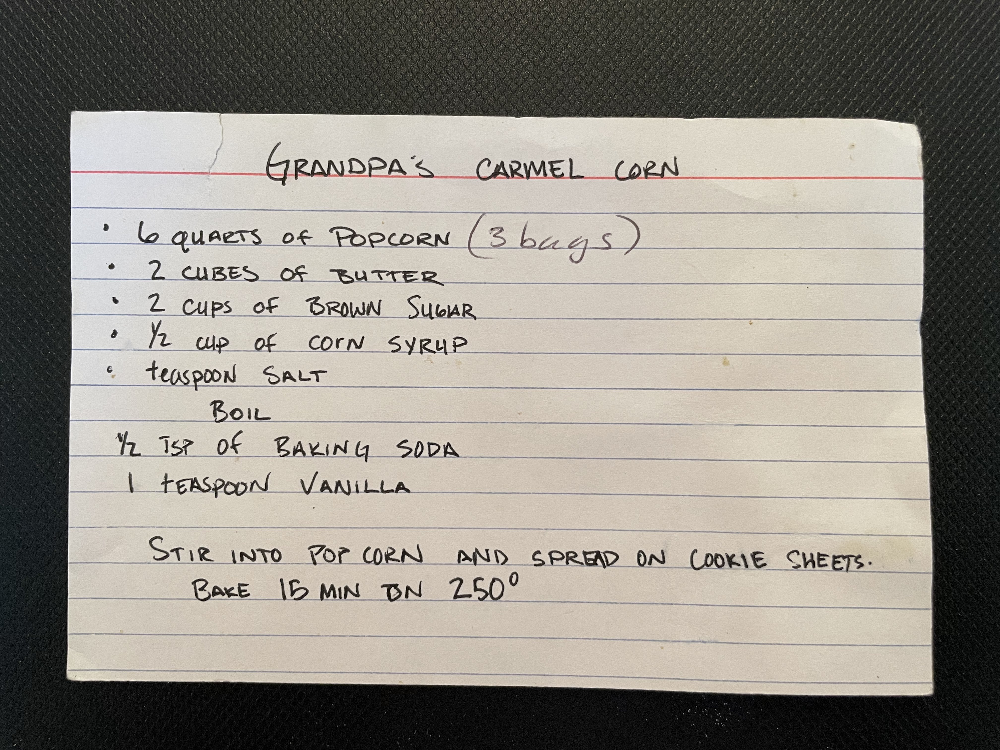

**Ingredients:**
- 6 quarts popcorn (3 bags), 2 cubes butter, 2 cups brown sugar, 1/2 cup corn syrup, 1 tsp. salt — boil
- Add: 1/2 tsp. baking soda, 1 tsp. vanilla

**Instructions:**
Stir into popcorn. Spread on cookie sheets. Bake 15 min at 250°.

---

### Honey Popcorn
*Source: Jolly Time (IMG_9178)*

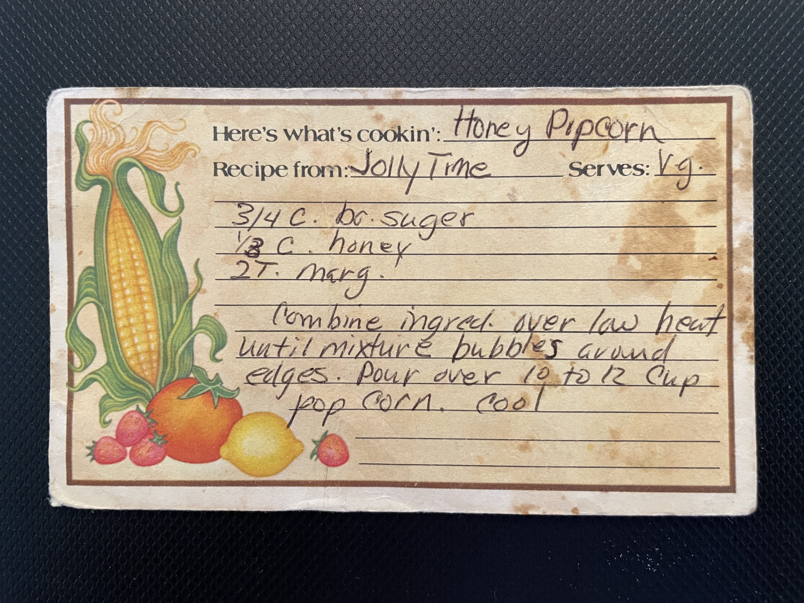

**Ingredients:**
- 3/4 c. brown sugar, 1/3 c. honey, 2 T. margarine

**Instructions:**
Combine over low heat until mixture bubbles around edges. Pour over 10–12 cups popcorn. Cool.

---

### Kathy's Party Snack
*Source: IMG_9189*

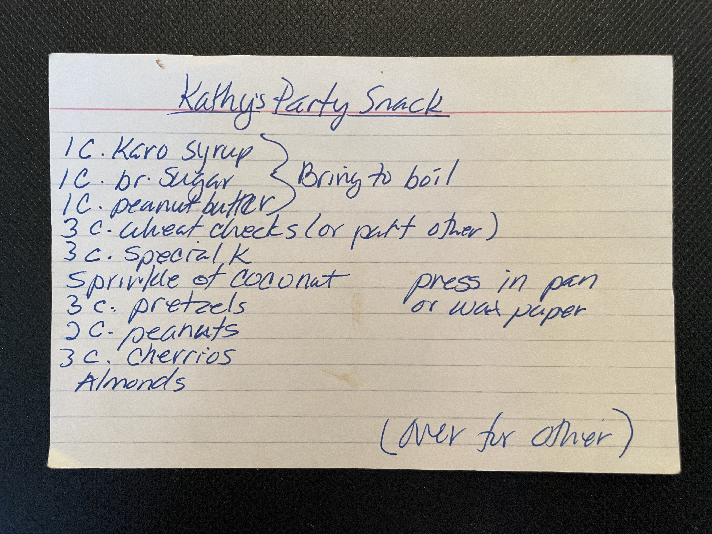

**Ingredients:**
- 1 c. Karo syrup, 1 c. brown sugar — bring to boil
- 1 c. peanut butter
- 3 c. Wheat Chex **[uncertain]**, 3 c. Special K, 3 c. pretzels, 2 c. peanuts, 3 c. Cheerios, almonds, coconut

**Instructions:**
Press in pan or on wax paper.

---

### Chex Mix
*Source: IMG_9190*

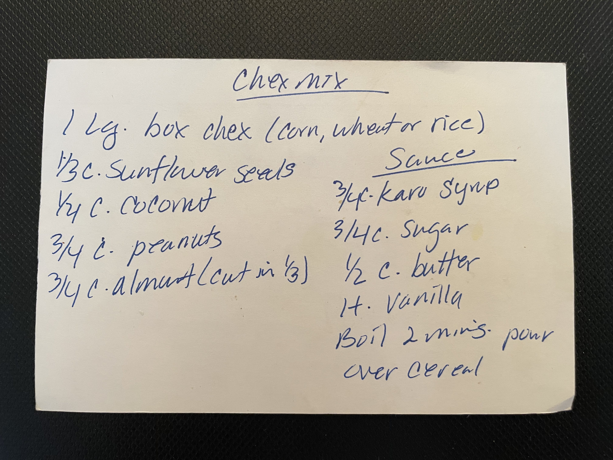

**Ingredients:**
- 1 large box Chex (corn, wheat, or rice), 1/3 c. sunflower seeds, 1/4 c. coconut, 3/4 c. peanuts, 3/4 c. almonds (cut in thirds)

**Sauce:** 3/4 c. Karo syrup **[uncertain]**, 3/4 c. sugar, 1/2 c. butter, 1 t. vanilla — boil 2 mins, pour over cereal.

---

### Microwave Peanut Brittle
*Source: Mom — Nancy Jane (IMG_9551; also IMG_9191, IMG_9452)*

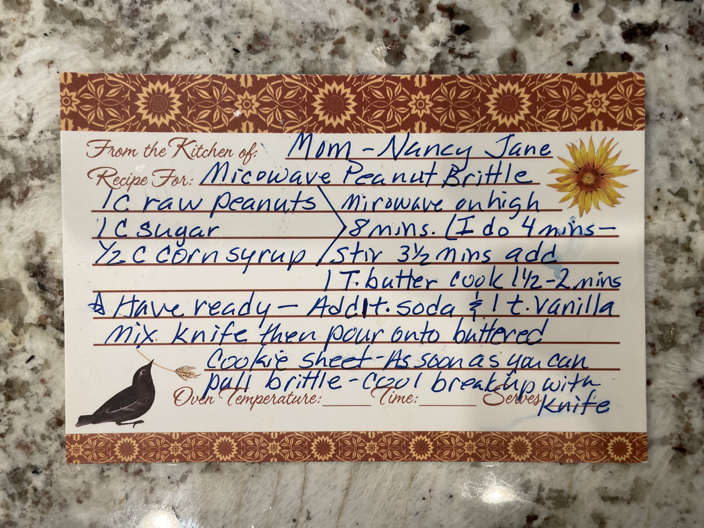

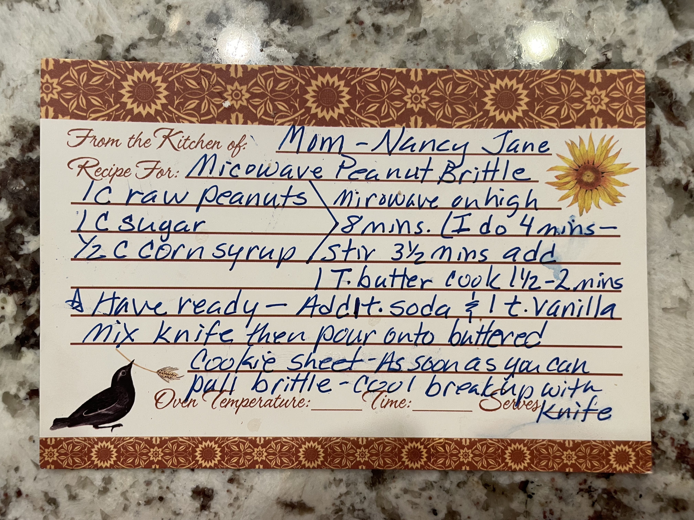

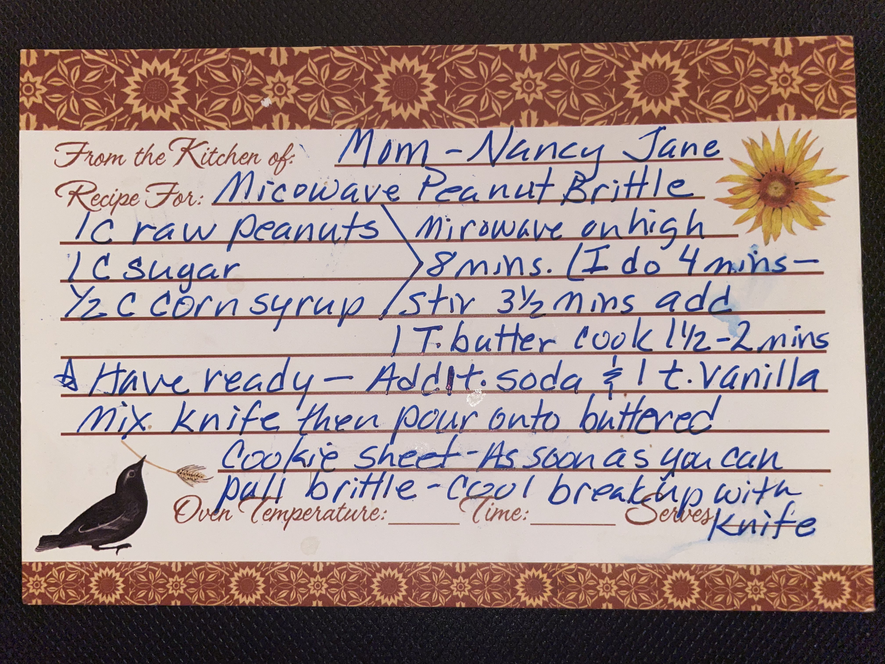

**Ingredients:**
- 1 c. raw peanuts, 1 c. sugar, 1/2 c. corn syrup

**Instructions:**
Microwave on high 8 mins (I do 4 mins, stir, 3 1/2 mins). Add 1 T. butter, cook 1 1/2–2 mins. Have ready: 1 t. soda & 1 t. vanilla. Add and mix with knife, pour onto buttered cookie sheet. Pat brittle when cool enough. Break up.

---

### Mother's Caramels
*Source: IMG_9498 — about 1 hr.*

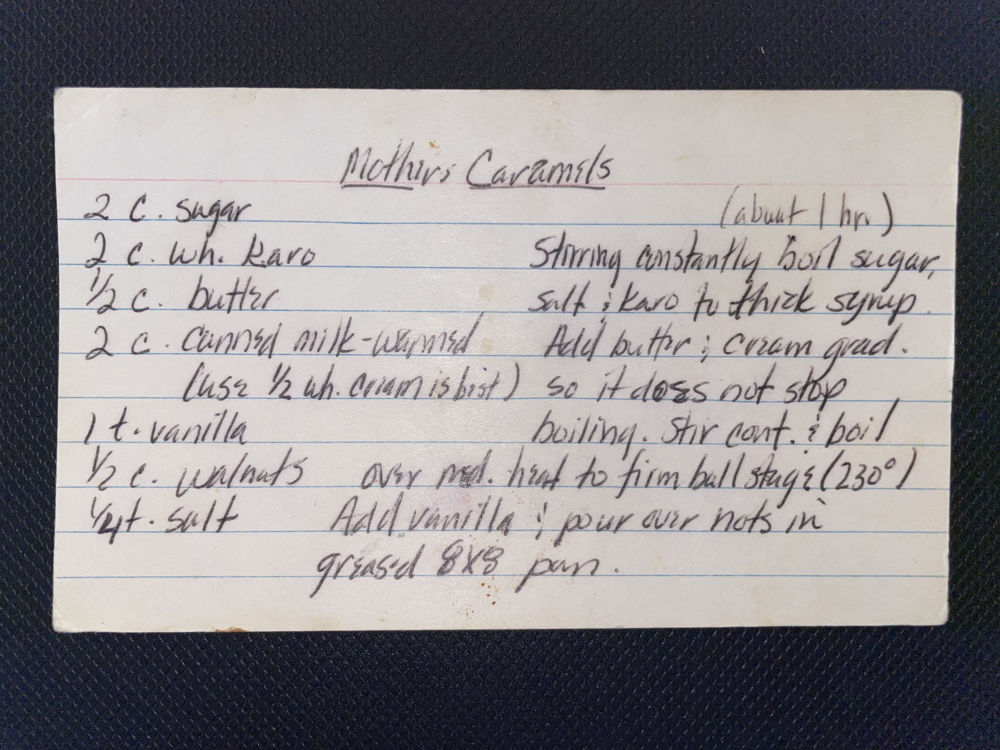

**Ingredients:**
- 2 c. sugar, 2 c. white Karo, 1/2 c. butter, 2 c. canned milk (warmed; use 1/2 whipping cream is best) **[uncertain]**, 1 t. vanilla, 1/2 c. walnuts, 1/4 t. salt

**Instructions:**
Stirring constantly, boil sugar, salt, Karo to thick syrup. Add butter; add cream gradually so it does not stop boiling. Stir continuously & boil over med. heat to firm ball stage (230°–236°) **[uncertain]**. Add vanilla; pour over nuts in greased 8x8 pan.

---

### Mother's Molasses Caramels
*Source: IMG_9499 — don't overcook!*

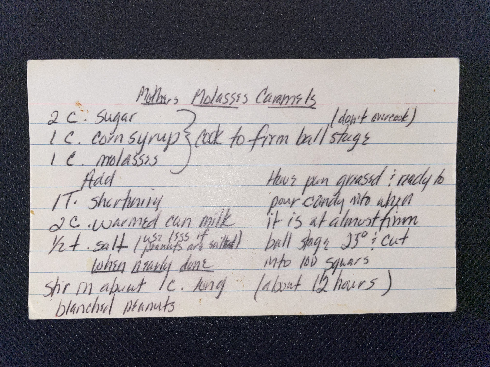

**Ingredients:**
- 2 c. sugar, 1 c. corn syrup, 1 c. molasses, 1 T. shortening, 2 c. warmed canned milk **[uncertain]**, 1/2 t. salt (less if peanuts are salted)

**Instructions:**
Cook to firm ball stage, 233° **[uncertain]**. Have greased pan ready. Pour candy. Cut into 100 squares (~1 1/2 hours). Stir in about 1 c. long blanched peanuts.

---

### Peanut Brittle (Joyce)
*Source: IMG_9182*

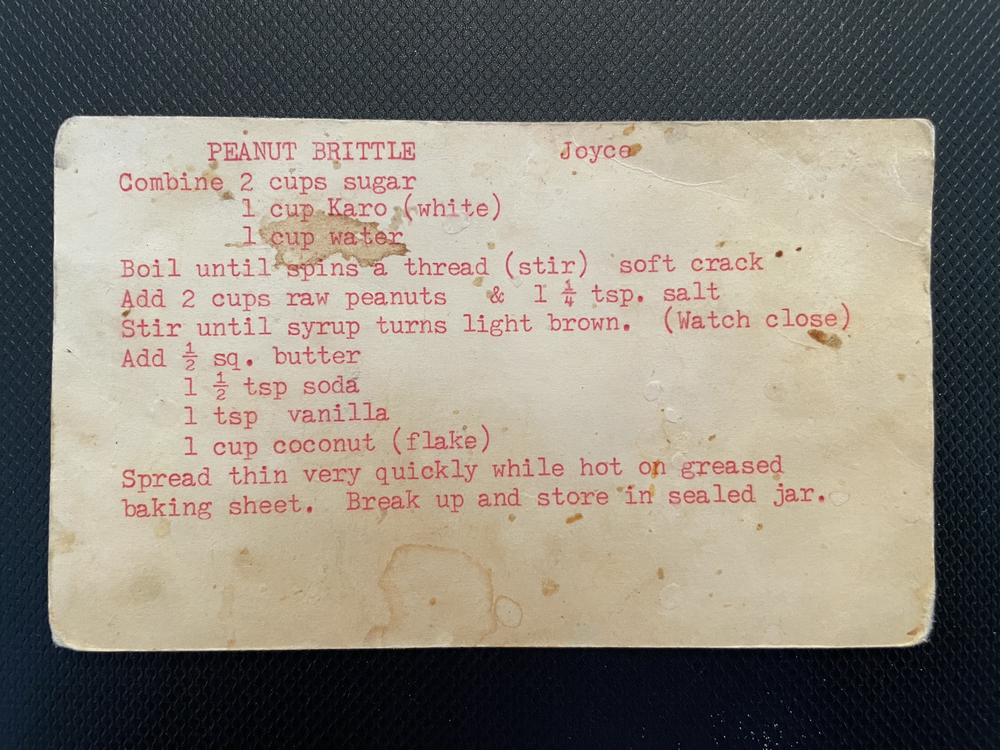

**Ingredients:**
- 2 cups sugar, 1 cup white Karo, 1 cup water — boil until spins a thread (soft crack)
- Add: 2 cups raw peanuts, 1 1/4 tsp. salt — stir until syrup turns light brown
- Add: 2/3 sq. butter **[uncertain]**, 1 1/2 tsp. soda, 1 tsp. vanilla, 1 cup coconut (flake)

**Instructions:**
Spread thin very quickly while hot on greased baking sheet. Break up and store in sealed jar.

---

### Peanut Clusters
*Source: IMG_9183*

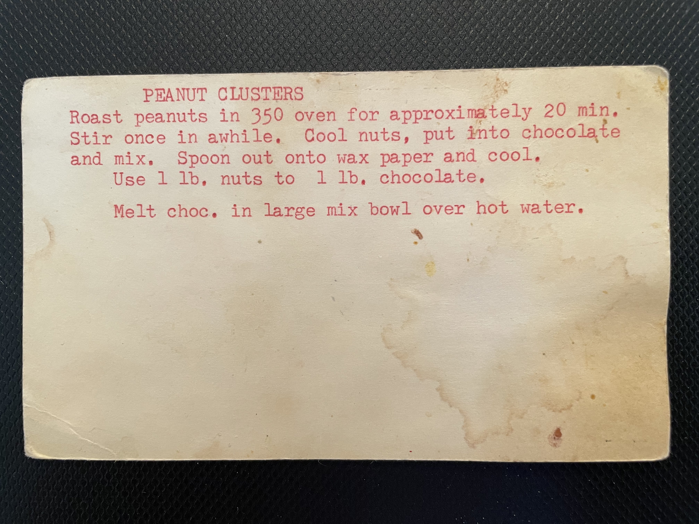

**Instructions:**
Roast peanuts at 350° for ~20 min, stir occasionally. Cool. Melt 1 lb. chocolate in large bowl over hot water. Add 1 lb. peanuts and mix. Spoon onto wax paper and cool.

---

### Protein Bars
*Source: IMG_9473*

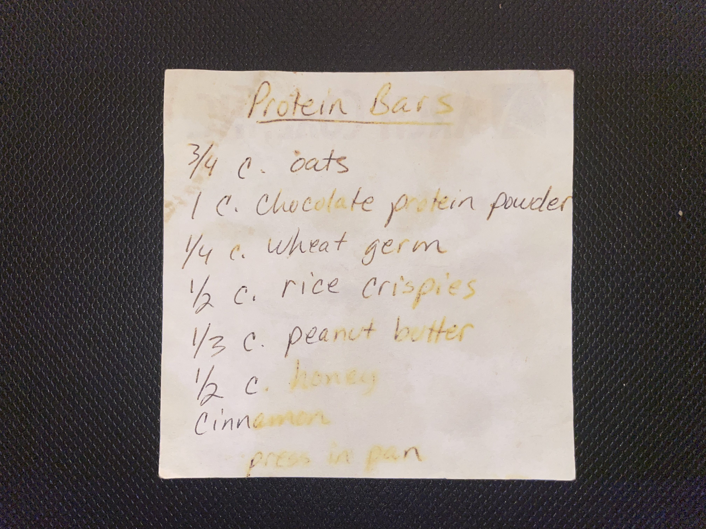

**Ingredients:**
- 3/4 c. oats, 1 c. chocolate protein powder, 1/4 c. wheat germ, 1/2 c. Rice Krispies, 1/3 c. peanut butter, 1/2 c. honey, cinnamon

**Instructions:**
Press in pan.

---

### Rice Krispies Treats
*Source: Kellogg's (IMG_9176) — 24 squares*

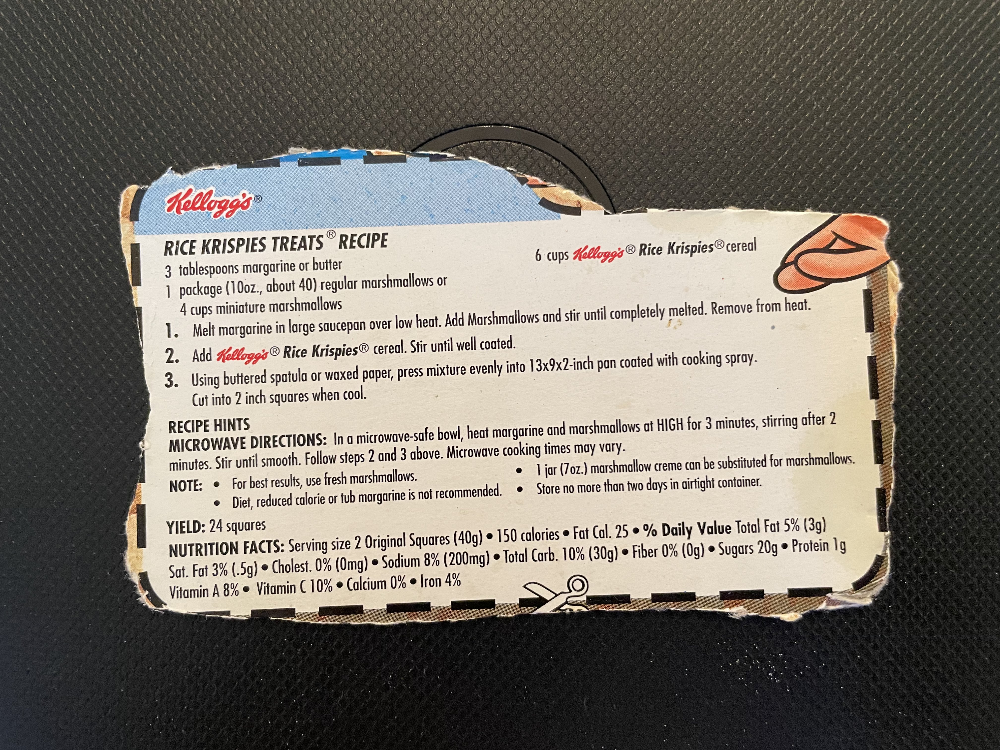

**Ingredients:**
- 3 tablespoons margarine or butter, 1 package (10 oz.) marshmallows (or 4 cups miniature), 6 cups Rice Krispies cereal

**Instructions:**
Melt margarine, add marshmallows, stir until melted. Add Rice Krispies. Press into 13x9x2 pan.

---

### Scotch-a-roo
*Source: IMG_9179*

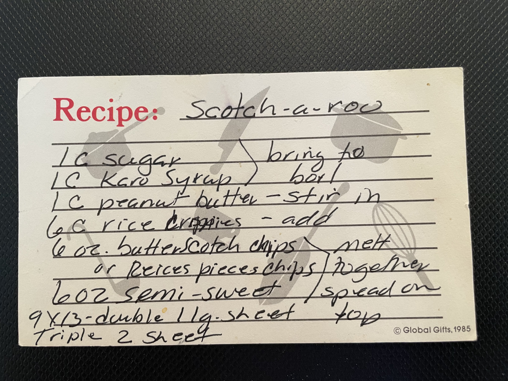

**Ingredients:**
- 1 c. sugar, 1 c. Karo syrup — bring to boil
- 1 c. peanut butter — stir in
- 6 c. Rice Krispies — add
- 6 oz. butterscotch chips (or Reese's Pieces chips **[uncertain]**), 6 oz. semi-sweet chocolate chips — melt together, spread on top

---

### Sees Fudge
*Source: IMG_9174*

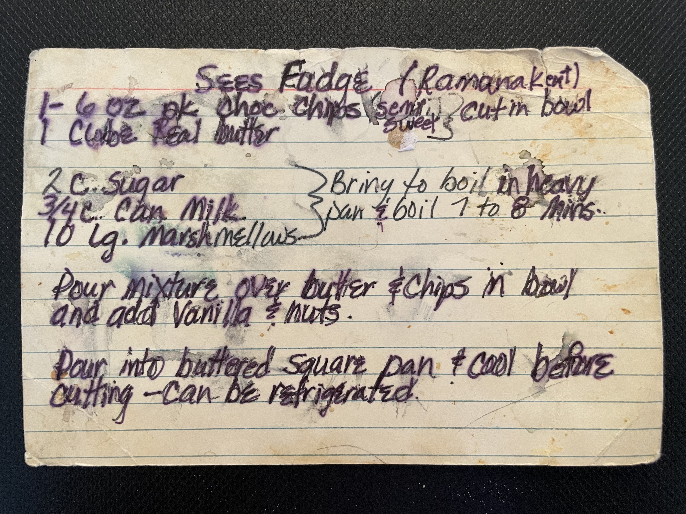

**Ingredients:**
- 1 (6 oz.) pkg. chocolate chips (semi-sweet), 1 cube real butter
- 2 c. sugar, 3/4 c. canned milk — bring to boil in heavy pan, boil 7–8 mins **[uncertain]**
- 10 large marshmallows

**Instructions:**
Pour hot mixture over butter & chips. Add vanilla & nuts. Pour into buttered square pan, cool before cutting.

---

### Special K Treat
*Source: Janet / Mom / Nana (IMG_9552; also IMG_9451)*

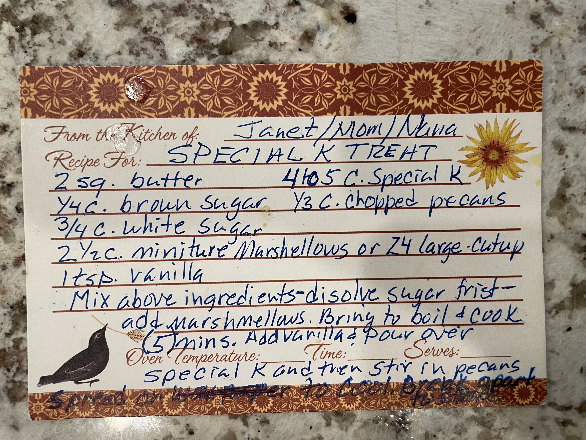

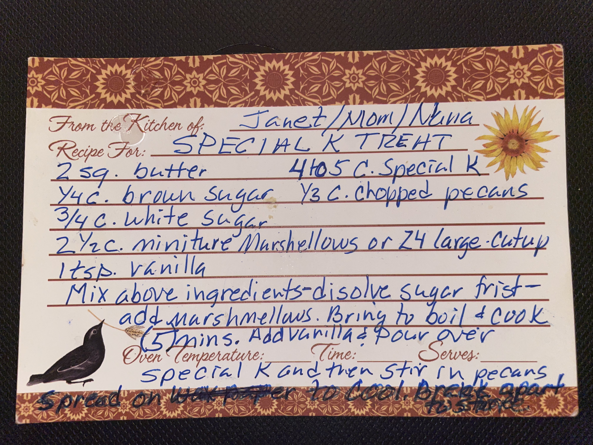

**Ingredients:**
- 2 squares butter, 1/2 c. brown sugar, 3/4 c. white sugar, 2 1/2 c. miniature marshmallows (or 24 large, cut up) **[uncertain]**, 1 tsp. vanilla, 4–5 c. Special K cereal, 1/2 c. chopped pecans

**Instructions:**
Mix butter and sugars — dissolve sugar first. Add marshmallows. Bring to boil & cook 5 mins. Add vanilla & pour over Special K, then stir in pecans.

---

## Desserts — Frostings & Icings

---

### Amy's Frosting (Wedding Cake)
*Source: IMG_9168*

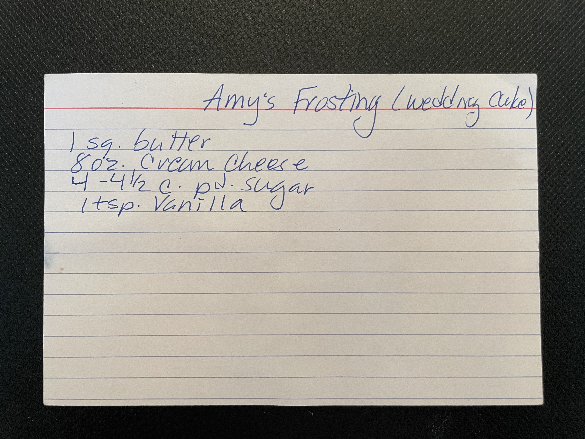

**Ingredients:**
- 1 sq. butter, 8 oz. cream cheese, 4–4 1/2 c. powdered sugar, 1 tsp. vanilla

---

### Broiled Icing
*Source: IMG_9486*

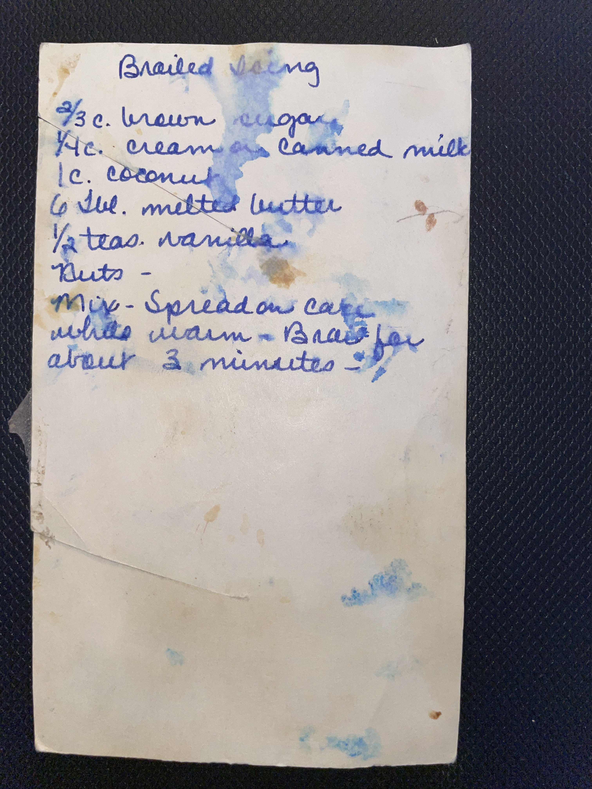

**Ingredients:**
- 2/3 c. brown sugar, 1/4 c. cream or canned milk, 1 c. coconut, 6 Tbl. melted butter, 1/2 teas. vanilla, nuts

**Instructions:**
Mix. Spread on cake while warm. Broil for about 3 minutes.

---

### Brown Butter Frosting
*Source: IMG_9220*

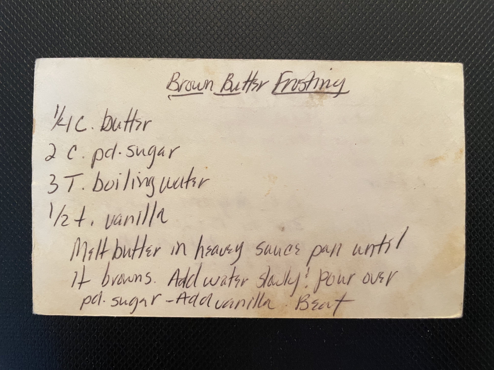

**Ingredients:**
- 1/4 c. butter, 2 c. powdered sugar, 3 T. boiling water, 1/2 t. vanilla

**Instructions:**
Melt butter in heavy sauce pan until it browns. Add water slowly. Pour over powdered sugar. Add vanilla. Beat.

---

### Caramel Frosting
*Source: IMG_9171*

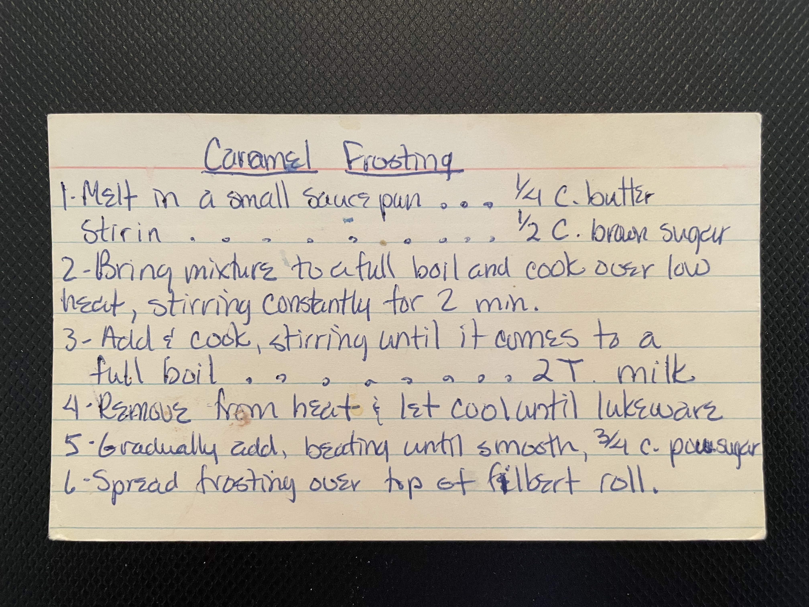

1. Melt 1/4 c. butter. Stir in 1/2 c. brown sugar.
2. Bring to full boil, cook over low heat stirring 2 min.
3. Add 2 T. milk, cook stirring to full boil.
4. Cool until lukewarm.
5. Gradually add 3/4 c. powdered sugar **[uncertain — could be "1 3/4"]**, beat until smooth.
6. Spread over top.

---

### Chocolate Frosting
*Source: IMG_9549*

**Ingredients:**
- 4 tablespoons cocoa, 3 cups powdered sugar, 4 tablespoons soft butter, 2–3 tablespoons milk, 1 teaspoon vanilla

**Instructions:**
Mix cocoa and powdered sugar. Add softened butter, milk, and vanilla. Beat until smooth.

---

### Coconut Pecan Frosting
*Source: IMG_9547 / IMG_9548 (also IMG_9169)*

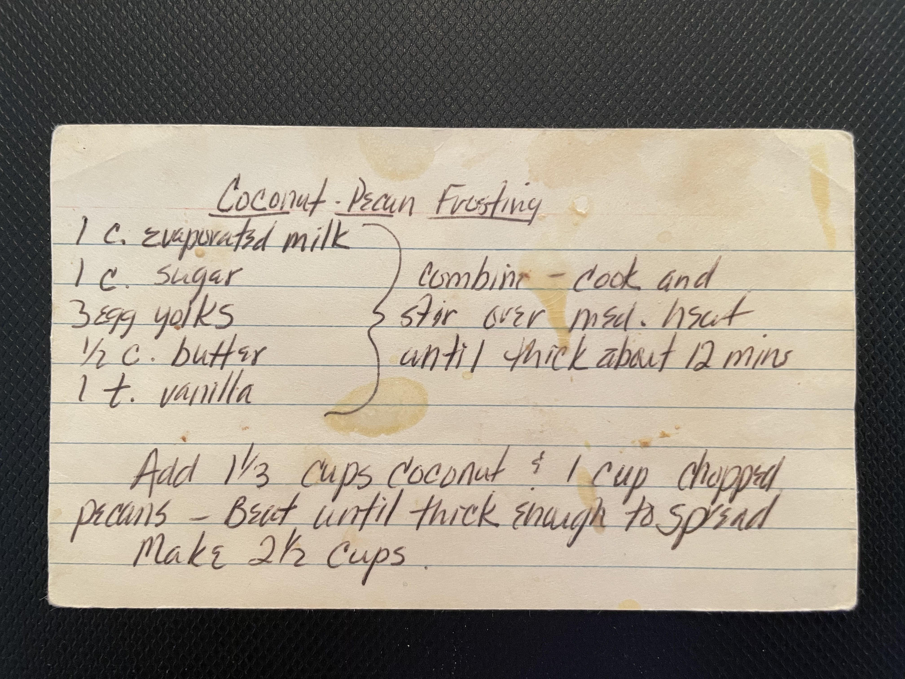

**Ingredients:**
- 3 egg yolks, 1 cup sugar, 1 cup evaporated milk, 1/2 cup butter, 1 teaspoon vanilla, 1 1/3 cups flaked coconut, 1 cup chopped pecans

**Instructions:**
Combine egg yolks, sugar, milk, butter, and vanilla. Cook and stir over medium heat until thickened, 12–15 minutes. Add coconut and pecans. Beat until thick enough to spread. Makes 3 cups.

---

### Cream Cheese Frosting
*Source: IMG_9494*

**Ingredients:**
- 8 oz. cream cheese (room temp), 1 stick butter (room temp), 1/4 can canned milk, 1 t. vanilla, pinch salt, 2 1/2 c. powdered sugar

---

### Decorator's Cement
*Source: IMG_9224*

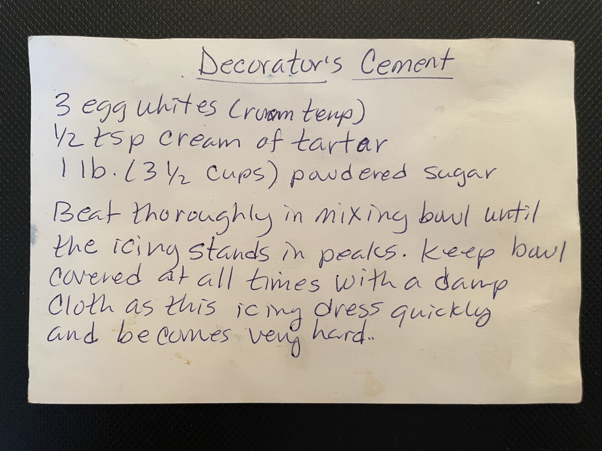

**Ingredients:**
- 3 egg whites (room temp), 1/2 tsp. cream of tartar, 1 lb. (3 1/2 cups) powdered sugar

**Instructions:**
Beat thoroughly until icing stands in peaks. Keep bowl covered with damp cloth as this icing dries quickly and becomes very hard.

---

### Mother's Boiled Coconut Frosting
*Source: IMG_9172*

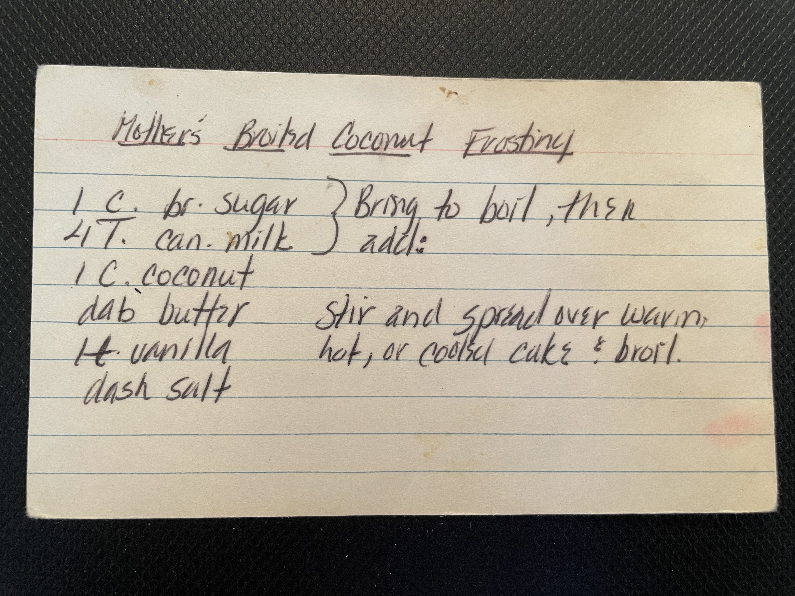

**Ingredients:**
- 1 c. brown sugar, 4 T. canned milk — bring to boil
- Add: 1 c. coconut, dab butter, vanilla **[uncertain]**, dash salt

**Instructions:**
Stir and spread over warm, hot, or cooled cake & broil.

---

## Desserts — Frozen & Fruit

---

### Anita's Raspberry Ice Cream
*Source: IMG_9318 / IMG_9319*

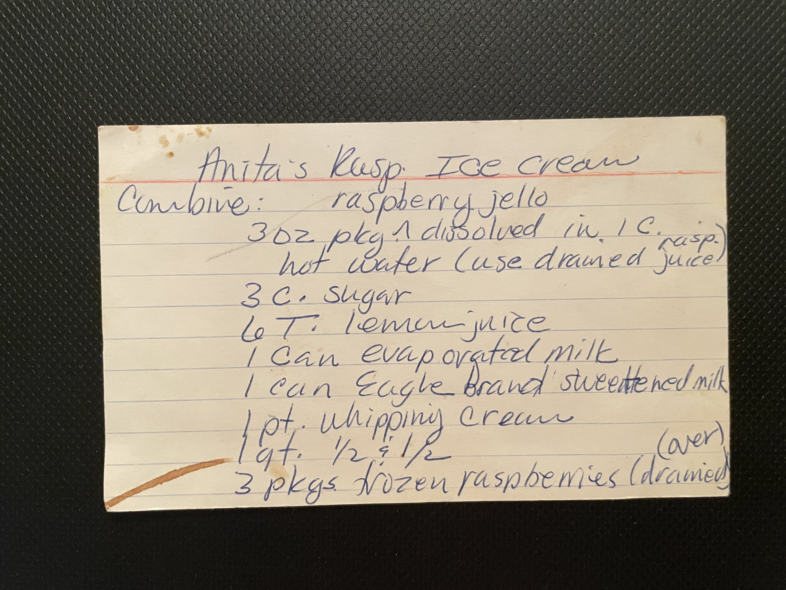

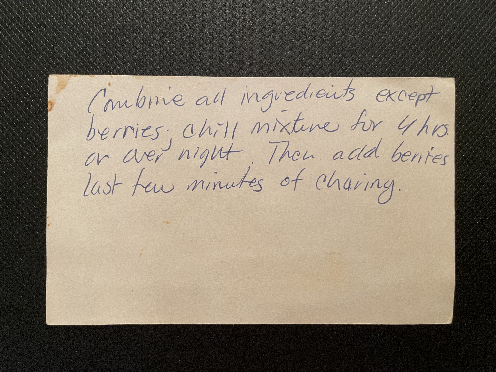

**Ingredients:**
- 1 (3 oz.) pkg. raspberry jello (dissolved in 1 c. hot drained raspberry juice), 3 c. sugar, 6 T. lemon juice, 1 can evaporated milk, 1 can Eagle Brand sweetened condensed milk **[uncertain]**, 1 pt. whipping cream, 1 qt. half & half, 3 pkg. frozen raspberries (drained)

**Instructions:**
Combine all except berries. Chill 4 hrs or overnight. Add berries last few minutes of churning.

---

### Blueberry Cream Pie
*Source: Jayce (IMG_9354)*

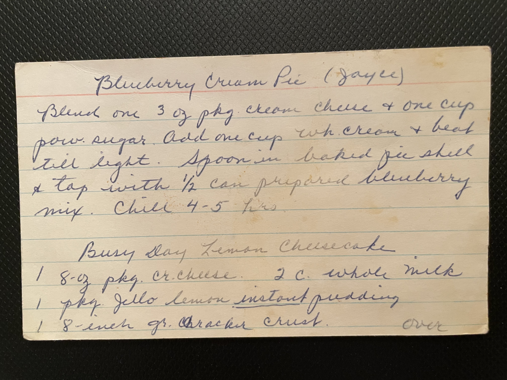

Blend 1 (3 oz.) pkg. cream cheese and 1 cup powdered sugar. Add 1 cup whipping cream, beat till light. Spoon in baked pie shell. Top with 1/2 can prepared blueberry mix. Chill 4–5 hrs.

---

### Blueberry Dessert (Amy P.)
*Source: IMG_9252*

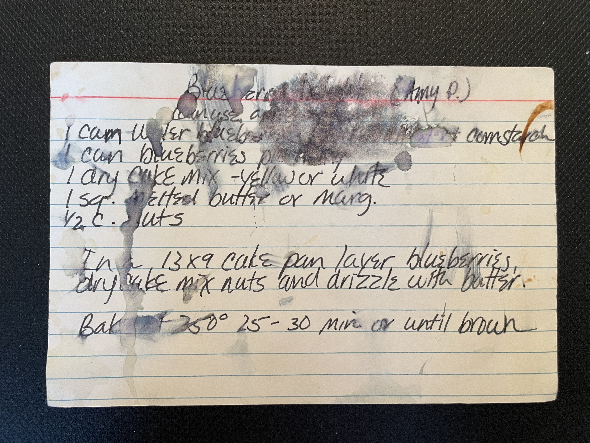

**Ingredients:**
- 1 can blueberries **[uncertain — card damaged]**, 1 dry cake mix (yellow or white), 1 sq. melted butter, 1/2 c. nuts

**Instructions:**
Layer blueberries, dry cake mix, nuts, drizzle with butter in 13x9 pan. Bake at 350° for 25–30 min.

---

### Blueberry Dessert (Mom's)
*Source: IMG_9232 / IMG_9233*

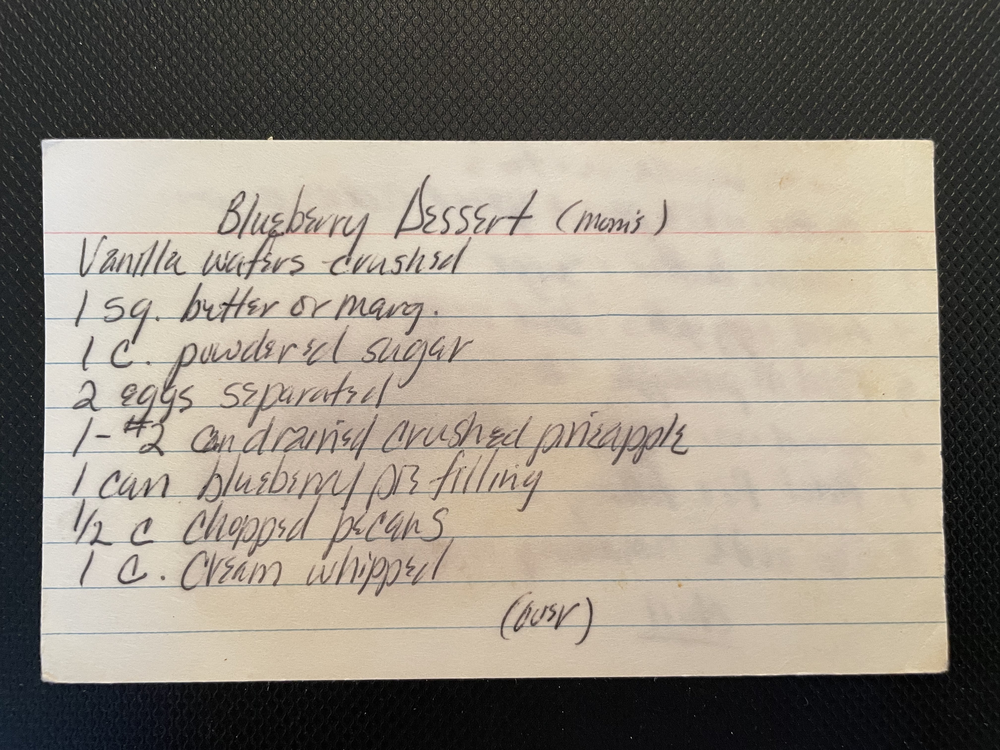

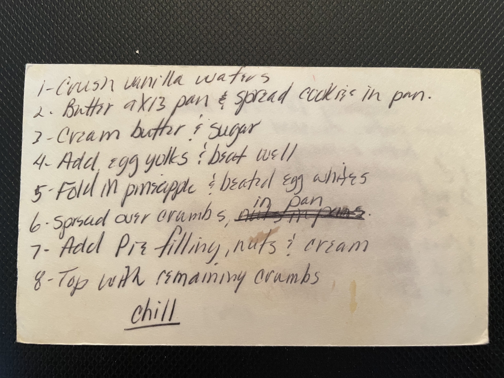

**Ingredients:**
- Vanilla wafers (crushed), 1 sq. butter, 1 c. powdered sugar, 2 eggs (separated), 1 (#2) can drained crushed pineapple, 1 can blueberry pie filling, 1/2 c. chopped pecans, 1 c. cream (whipped)

**Instructions:**
Crush wafers. Butter 9x13 pan, spread cookies. Cream butter & sugar, add egg yolks, beat well. Fold in pineapple & beaten egg whites. Spread over crumbs. Add pie filling, nuts, and cream. Top with remaining crumbs. Chill.

---

### Cheese Cake (Marz)
*Source: IMG_9244*

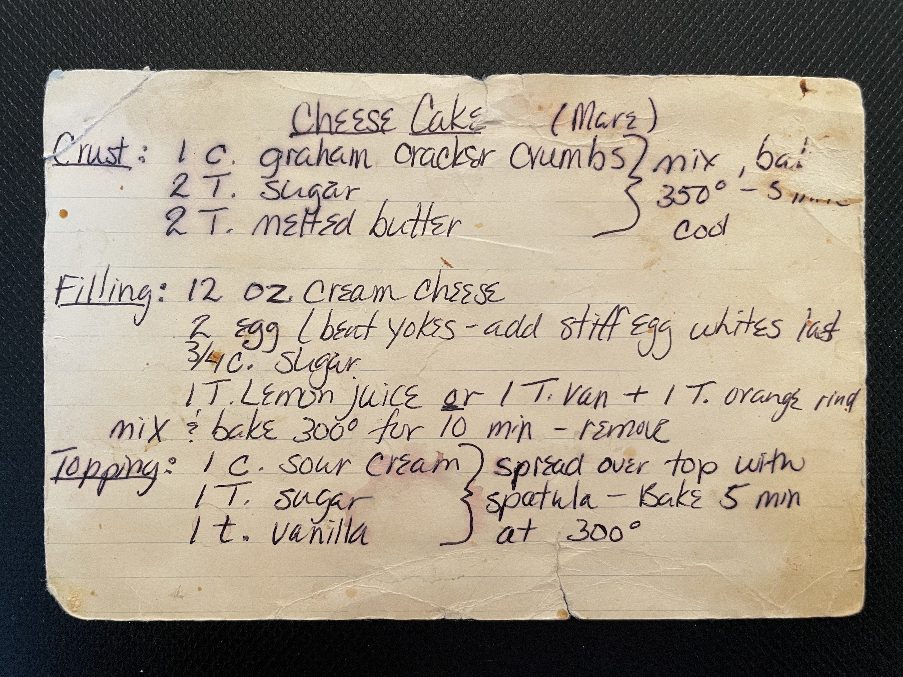

**Crust:** 1 c. graham cracker crumbs, 2 T. sugar, 2 T. melted butter — bake 350° for 5 min, cool.

**Filling:** 12 oz. cream cheese, 2 eggs (beat yolks, add stiff whites last), 3/4 c. sugar, 1 T. lemon juice (or 1 T. vanilla + 1 T. orange rind) — bake 300° for 10 min, remove.

**Topping:** 1 c. sour cream, 1 T. sugar, 1 t. vanilla — spread over top, bake 5 min at 300°.

---

### Chocolate Delight
*Source: IMG_9245*

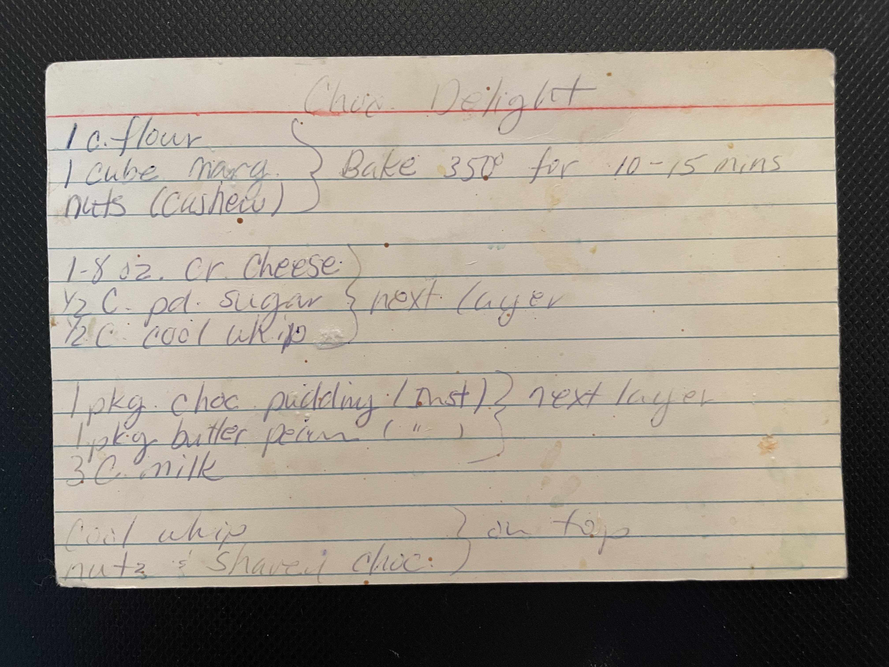

**Layers:**
1. 1 c. flour, 1 cube margarine, nuts (cashews) — bake 350° for 10–15 mins
2. 1 (8 oz.) cream cheese, 1/2 c. powdered sugar, 2 c. Cool Whip
3. 1 pkg. instant chocolate pudding, 1 pkg. instant butter pecan **[uncertain]**, 3 c. milk
4. Cool Whip, nuts & shaved chocolate on top

---

### Chocolate Peppermint Dessert
*Source: IMG_9236 / IMG_9237*

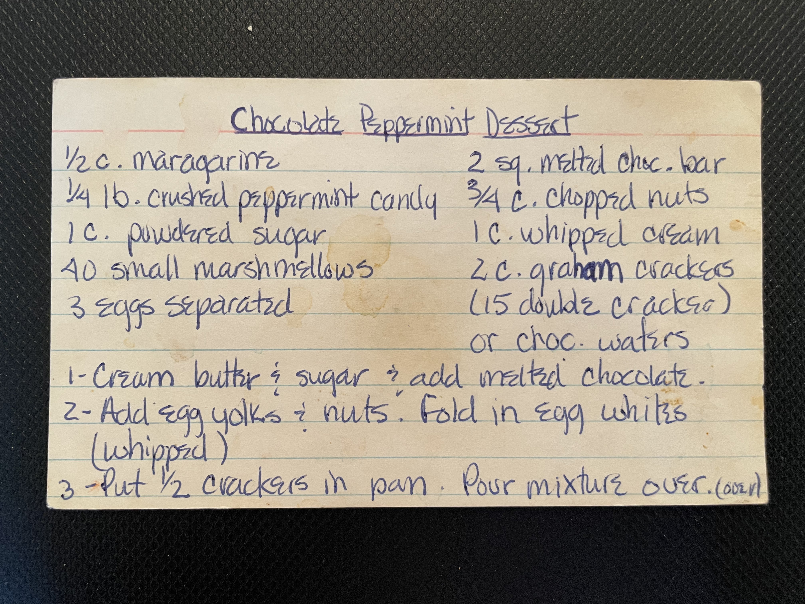

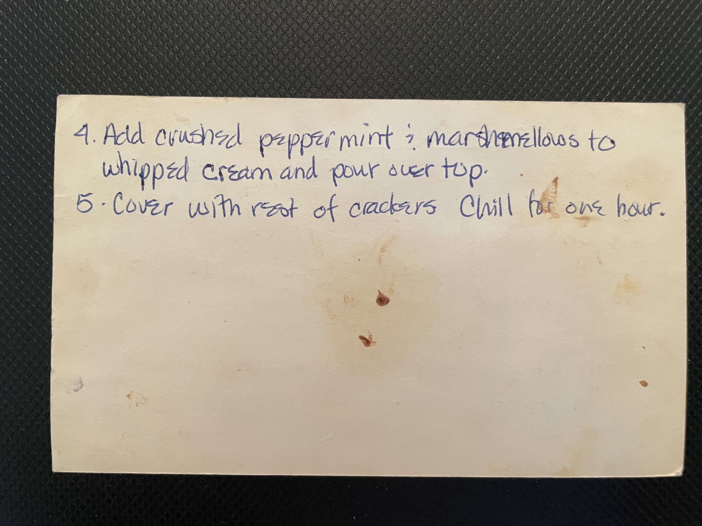

**Ingredients:**
- 1/2 c. margarine, 1/4 lb. crushed peppermint candy, 1 c. powdered sugar, 40 small marshmallows, 3 eggs (separated), 2 sq. melted chocolate, 3/4 c. chopped nuts, 1 c. whipped cream, 2 c. graham crackers (or chocolate wafers)

**Instructions:**
1. Cream butter, sugar, add melted chocolate. 2. Add egg yolks & nuts, fold in whipped egg whites. 3. Put 1/2 crackers in pan, pour mixture over. 4. Add crushed peppermint & marshmallows to whipped cream, pour over top. 5. Cover with rest of crackers. Chill 1 hour.

---

### Classic Creme Brulee
*Source: Mare — CremeBrulee.com (IMG_9511 / IMG_9512)*

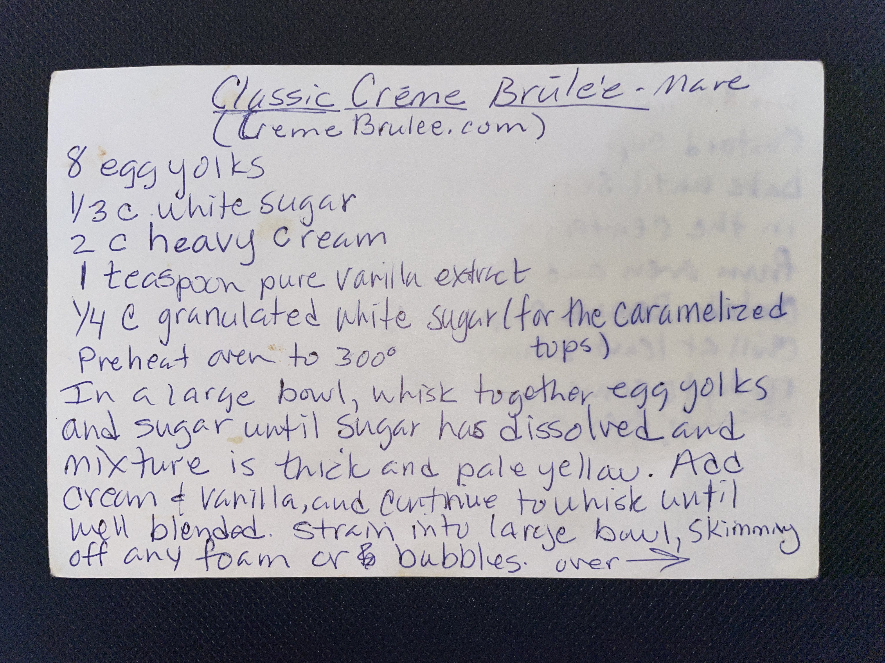

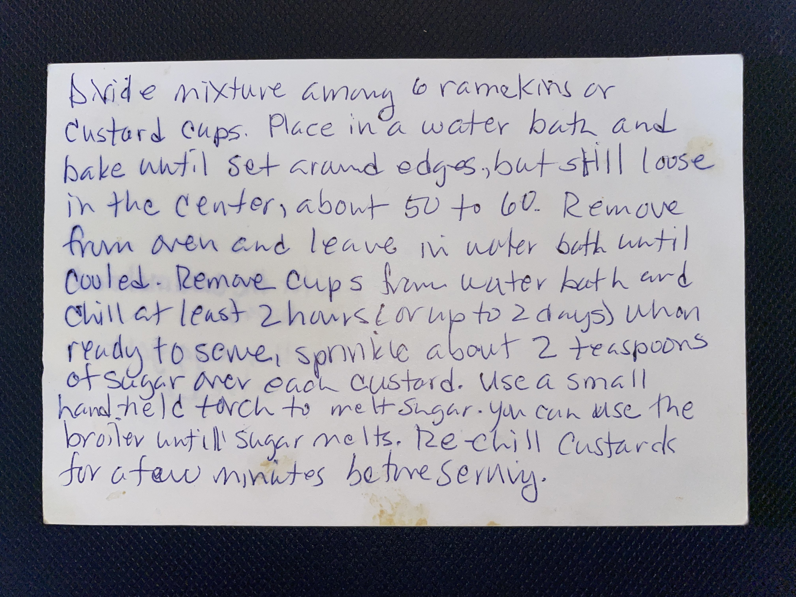

**Ingredients:**
- 8 egg yolks, 1/3 c. white sugar, 2 c. heavy cream, 1 teaspoon vanilla, 1/4 c. granulated sugar (for tops)

**Instructions:**
Preheat 300°. Whisk yolks and sugar until thick and pale yellow. Add cream & vanilla. Strain. Divide among 6 ramekins. Water bath, bake 50–60 minutes. Chill at least 2 hours. Sprinkle sugar and torch before serving.

---

### Cottage Pudding
*Source: Grandma Joyce — Homemaking Class 1944 (IMG_9187) — Serves 8*

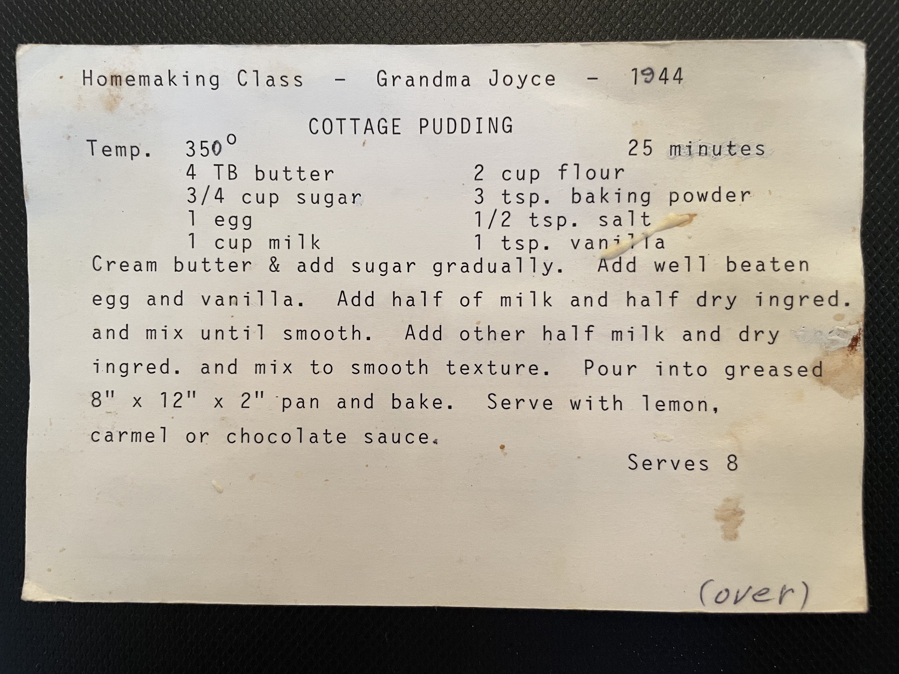

**Ingredients:**
- 4 T. butter, 3/4 cup sugar, 1 egg, 2 cup flour, 3 tsp. baking powder, 1/2 tsp. salt, 1 cup milk, 1 tsp. vanilla

**Instructions:**
Cream butter, add sugar. Add beaten egg and vanilla. Add half milk and half dry ingredients, mix smooth. Repeat. Pour into greased 8"x12"x2" pan. Bake at 350° for 25 minutes. Serve with lemon, caramel, or chocolate sauce.

---

### Delicious Cherry Dessert
*Source: IMG_9234 / IMG_9235 — Serves 12–16*

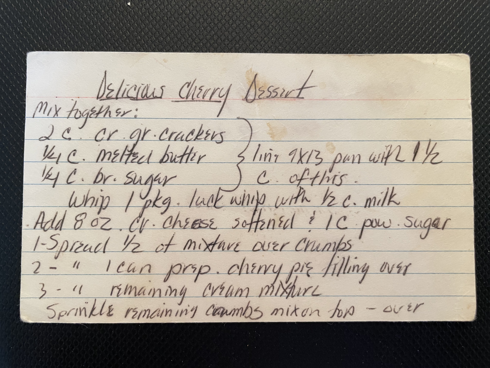

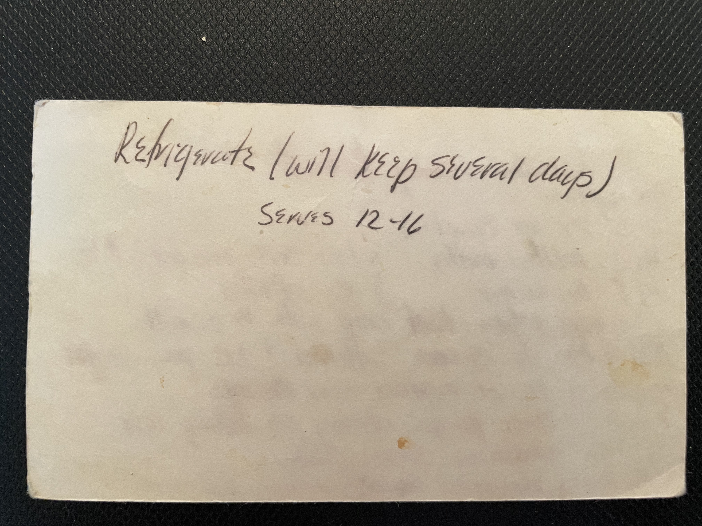

**Crust:** 2 c. crushed graham crackers, 1/4 c. melted butter, 1/4 c. brown sugar — line 9x13 pan with 1 1/2 c. of this.

**Filling:** Whip 1 pkg. Lucky Whip **[uncertain]** with 1/2 c. milk. Add 8 oz. cream cheese (softened) and 1 c. powdered sugar.

**Assembly:** Spread 1/2 cream mixture over crumbs. Spread 1 can cherry pie filling over. Spread remaining cream mixture. Sprinkle remaining crumbs on top. Refrigerate.

---

### Ding Dong Dell Ice Cream Sandwiches
*Source: IMG_9515 / IMG_9516*

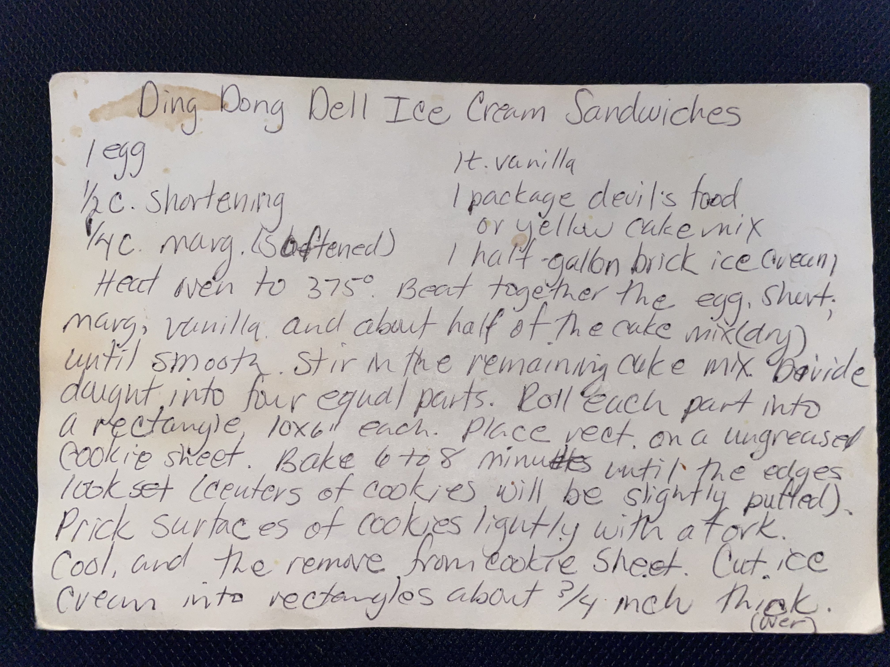

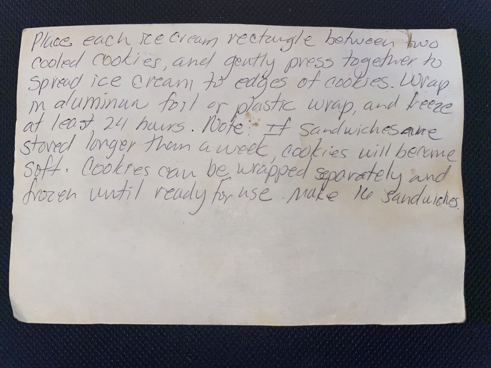

**Ingredients:**
- 1 egg, 1/2 c. shortening, 1/4 c. margarine, 1 t. vanilla, 1 package devil's food or yellow cake mix, 1 half-gallon brick ice cream

**Instructions:**
Beat egg, shortening, margarine, vanilla, and half the cake mix until smooth. Stir in remaining mix. Divide into 4 parts, roll into rectangles (10x4). Bake at 375° for 6–8 minutes. Cool. Cut ice cream into rectangles, sandwich between cookies. Wrap and freeze at least 24 hours. Makes 16.

---

### Frostie Strawberry Squares
*Source: IMG_9314 / IMG_9315*

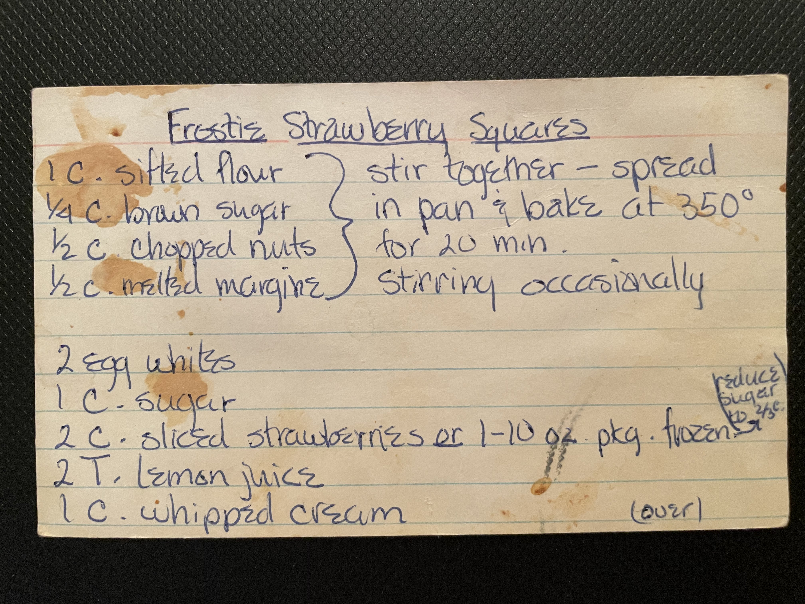

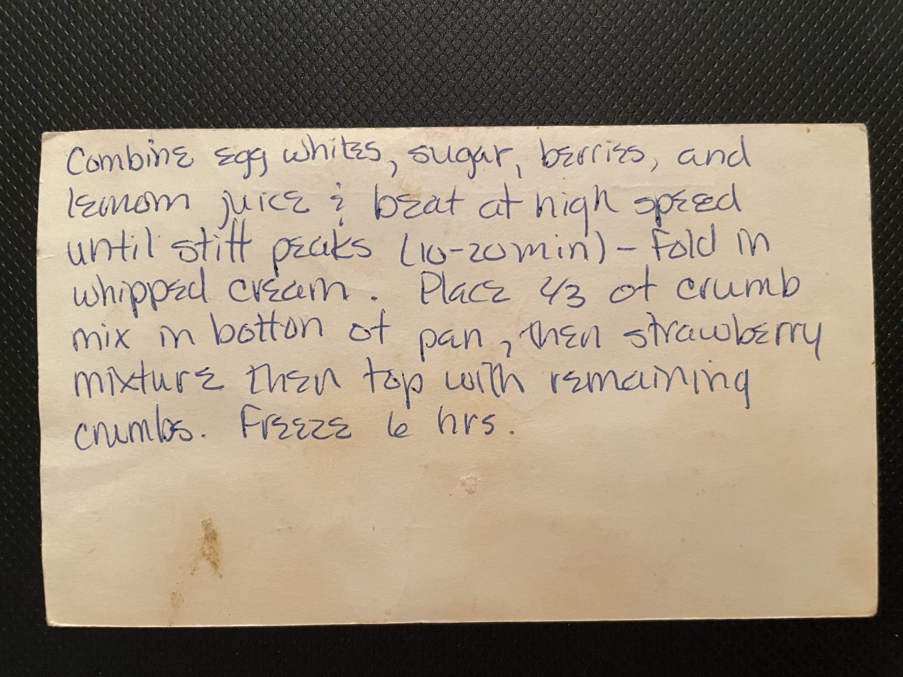

**Crust:** 1 c. sifted flour, 1/4 c. brown sugar, 1/2 c. chopped nuts, 1/2 c. melted margarine — stir, spread in pan, bake 350° for 20 min, stirring.

**Filling:** 2 egg whites, 1 c. sugar (reduce to 3/4 **[uncertain]**), 2 c. sliced strawberries (or 1 10 oz. pkg. frozen), 2 T. lemon juice — beat at high speed until stiff peaks (10–20 min). Fold in 1 c. whipped cream.

**Assembly:** Place 2/3 crumbs on bottom, add strawberry mixture, top with remaining crumbs. Freeze 6 hrs.

---

### Frozen Pineapple Frappe
*Source: Mom (IMG_9518)*

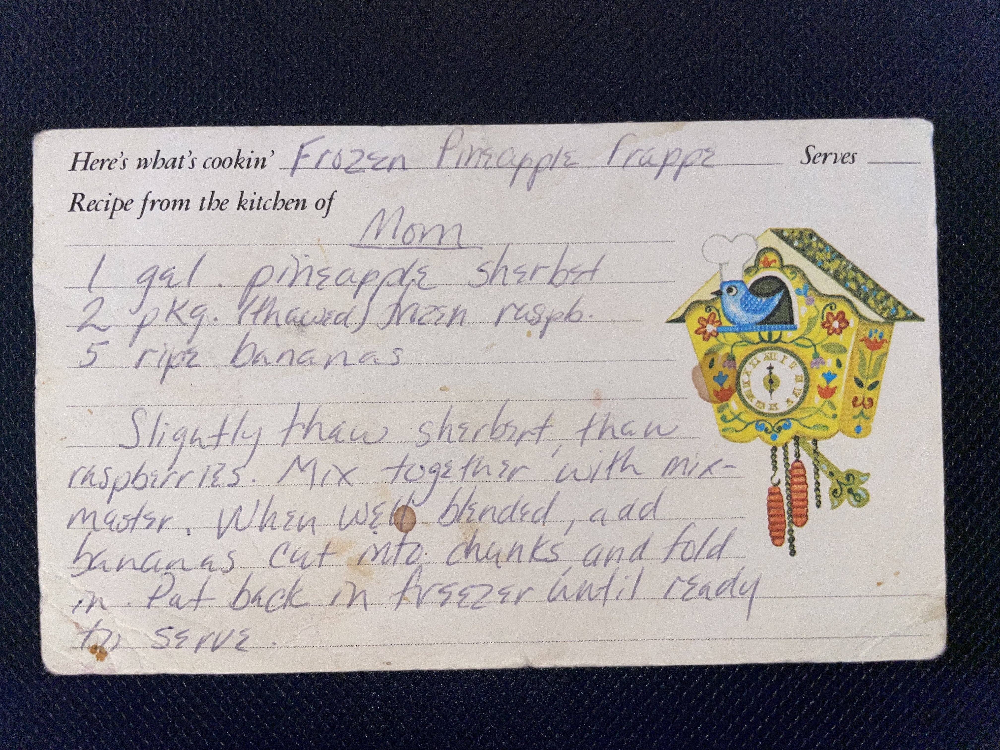

**Ingredients:**
- 1 gal. pineapple sherbet, 2 pkg. thawed frozen raspberries **[uncertain]**, 5 ripe bananas

**Instructions:**
Slightly thaw sherbet, then raspberries. Mix with mixer. Fold in banana chunks. Put back in freezer.

---

### Fruit Ice Cream
*Source: IMG_9309 / IMG_9310*

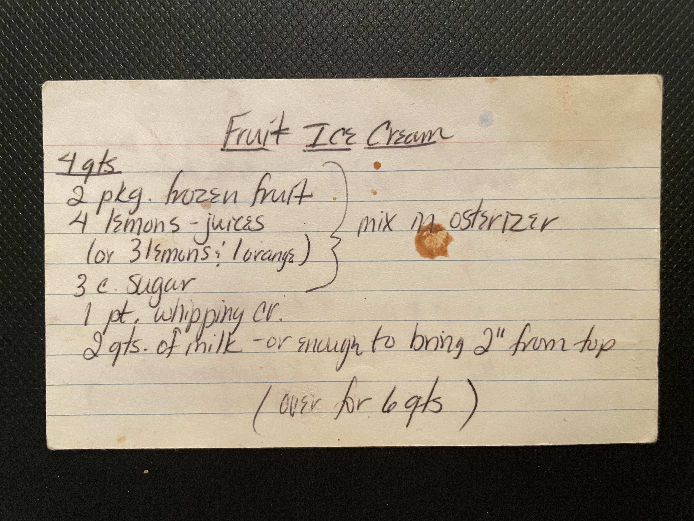

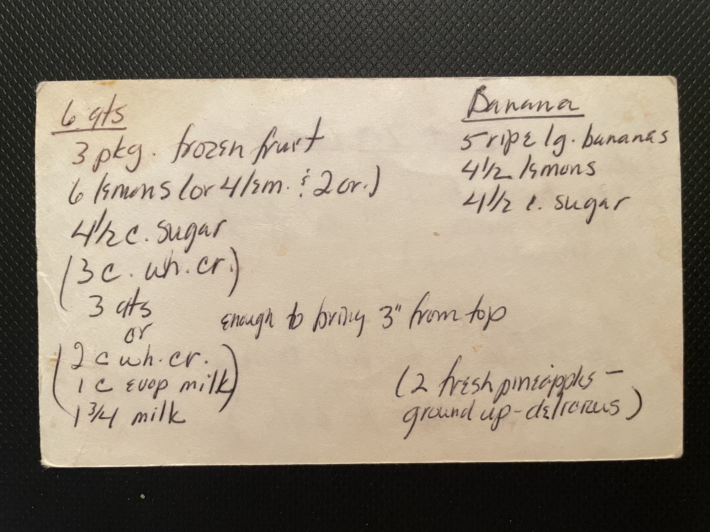

**4 qt. version:** 2 pkg. frozen fruit, juice of 4 lemons (or 3 lemons + 1 orange), 3 c. sugar, 1 pt. whipping cream, 2 qts. milk (enough to bring 2" from top)

**6 qt. version:** 3 pkg. frozen fruit, 6 lemons, 4 1/2 c. sugar, 3 c. whipping cream, 3 qts. milk

**Banana variation:** 5 ripe large bananas, 4 1/2 lemons, 4 1/2 c. sugar

---

### Gable House Cheese Cake
*Source: IMG_9241 / IMG_9242*

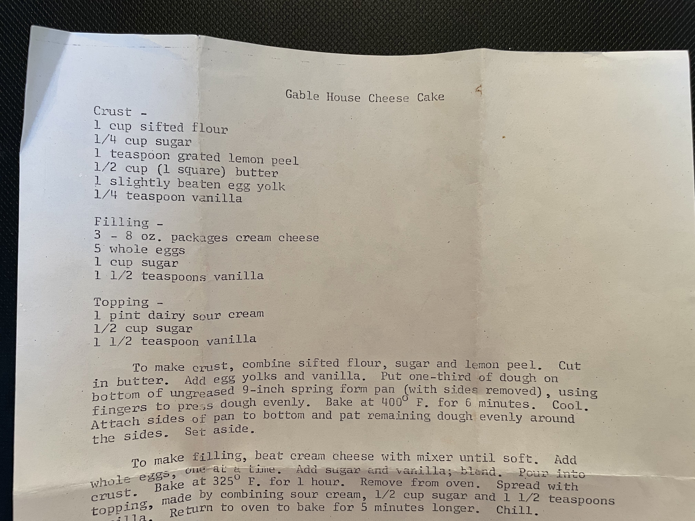

**Crust:** 1 cup sifted flour, 1/4 cup sugar, 1 tsp. grated lemon peel, 1/2 cup butter, 1 egg yolk, 1/4 tsp. vanilla — press into 9" spring form pan, bake 400° for 6 min.

**Filling:** 3 (8 oz.) pkg. cream cheese, 5 whole eggs, 1 cup sugar, 1 1/2 tsp. vanilla — beat cheese soft, add eggs one at a time, add sugar and vanilla. Pour into crust. Bake 325° for 1 hour.

**Topping:** 1 pint sour cream, 1/2 cup sugar, 1 1/2 tsp. vanilla — spread on top, bake 5 min more. Chill.

---

### Homemade Pineapple Ice Cream
*Source: IMG_9316 — 6 quart*

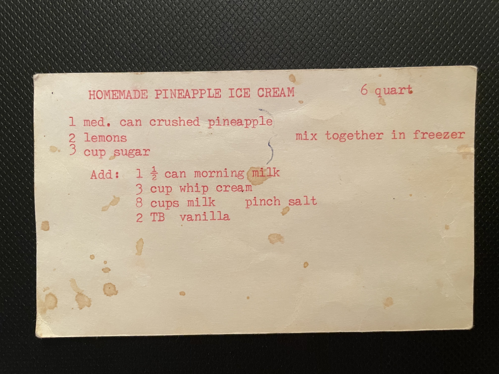

**Ingredients:**
- 1 med. can crushed pineapple, 2 lemons, 3 cups sugar — mix in freezer
- Add: 1 1/2 cans evaporated milk **[uncertain]**, 3 cups whipping cream, 8 cups milk, pinch salt, 2 T. vanilla

---

### Ice Cream Dessert — Mom
*Source: IMG_9230*

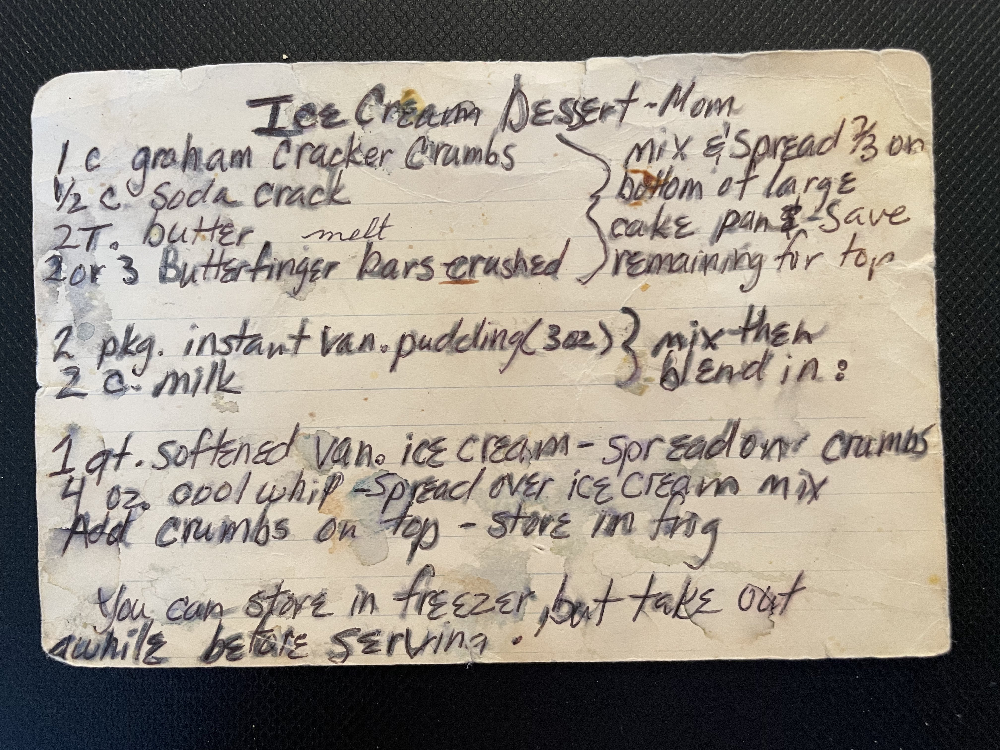

**Crust:** 1 c. graham cracker crumbs, 1/2 c. soda crackers **[uncertain]**, 2 T. melted butter, 2–3 crushed Butterfinger bars — spread 2/3 on bottom, save rest for top.

**Filling:** 2 pkg. instant vanilla pudding (3 oz.), 2 c. milk — mix, then blend in 1 qt. softened vanilla ice cream. Spread on crumbs. Top with 4 oz. Cool Whip. Add remaining crumbs. Store in freezer.

---

### Kathy's Burnt Almond Ice Cream Pie
*Source: IMG_9313*

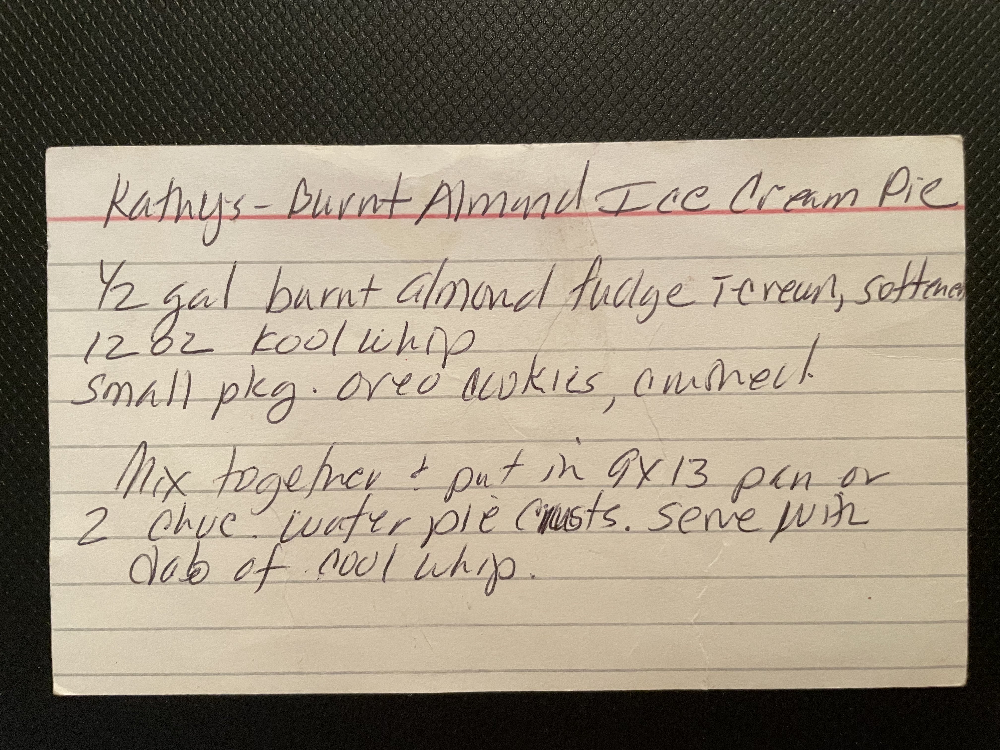

**Ingredients:**
- 1/2 gal. burnt almond fudge ice cream (softened), 12 oz. Cool Whip, small pkg. Oreo cookies (crushed)

**Instructions:**
Mix together and put in 9x13 pan or 2 chocolate wafer pie crusts. Serve with a dab of Cool Whip.

---

### Kathy's Crunchy Ice Cream Freeze
*Source: IMG_9519*

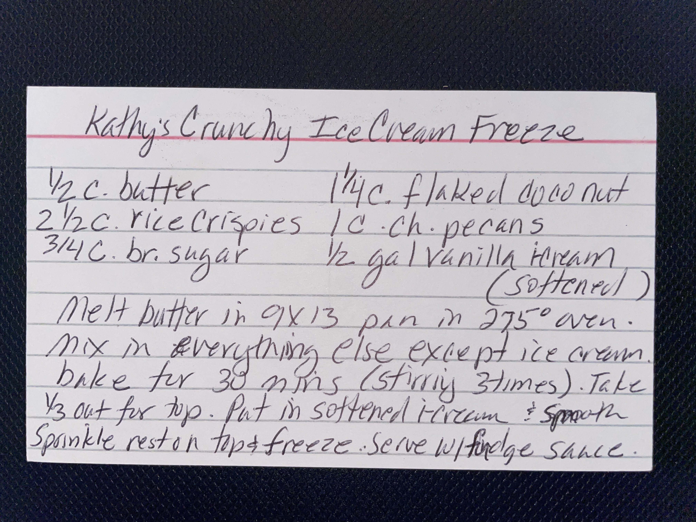

**Ingredients:**
- 1/2 c. butter, 2 1/2 c. Rice Krispies, 3/4 c. brown sugar, 1 1/4 c. flaked coconut, 1 c. chopped pecans, 1/2 gal. vanilla ice cream (softened)

**Instructions:**
Melt butter in 9x13 pan in 275° oven. Mix in everything else except ice cream. Bake 30 mins (stirring 3 times). Take 1/3 out for top. Put in softened ice cream and smooth. Sprinkle rest on top, freeze. Serve with fudge sauce.

---

### Mare's Apple Crisp
*Source: IMG_9249 — Serves 15–20*

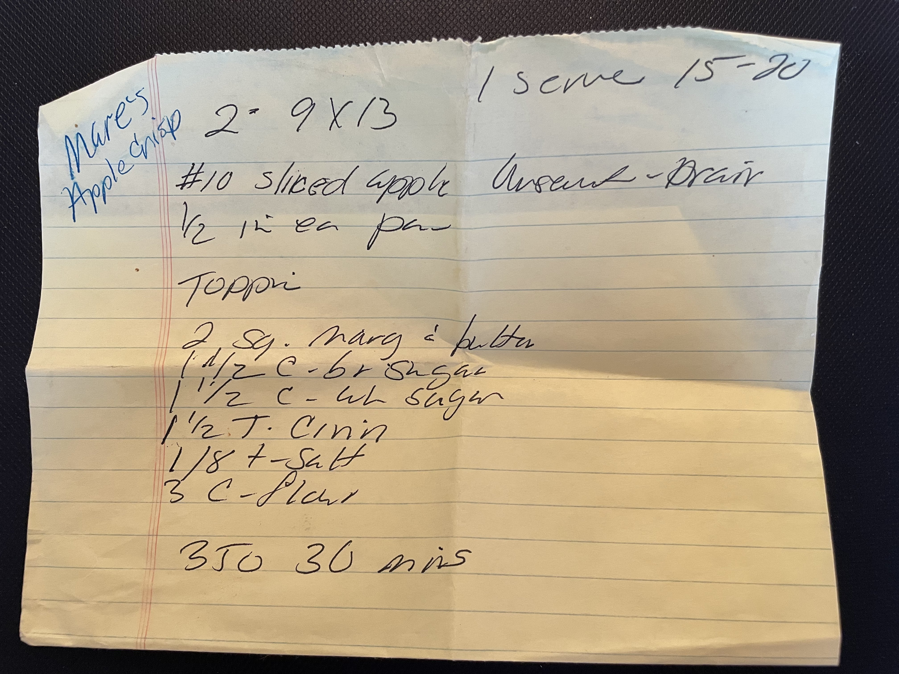

**Filling:** #10 can sliced apples (unsweetened, drained) **[uncertain]** — divide between 2 (9x13) pans.

**Topping:** 2 sq. margarine & butter **[uncertain]**, 1 1/2 c. brown sugar, 1 1/2 c. white sugar, 1 1/2 T. cinnamon, 1/8 t. salt, 3 c. flour

**Instructions:**
Bake at 350° for 30 mins.

---

### Nautica's Cheesecake
*Source: IMG_9228*

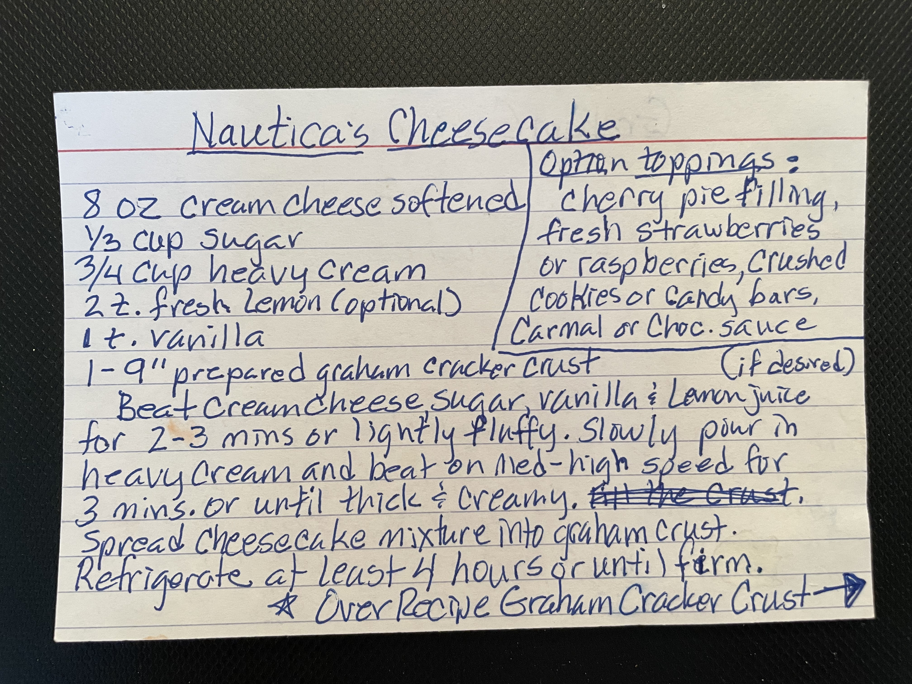

**Ingredients:**
- 8 oz. cream cheese (softened), 1/3 cup sugar, 3/4 cup heavy cream, 2 T. fresh lemon juice (optional), 1 t. vanilla, 1 prepared 9" graham cracker crust

**Instructions:**
Beat cream cheese, sugar, vanilla & lemon juice 2–3 mins. Slowly pour in heavy cream and beat on med-high 3 mins until thick & creamy. Spread into crust. Refrigerate at least 4 hours.

**Optional toppings:** Cherry pie filling, fresh berries, crushed cookies/candy bars, caramel or chocolate sauce.

---

### Next Best Thing to Robert Redford
*Source: IMG_9240*

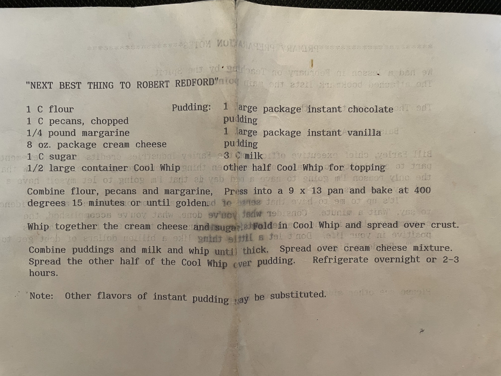

**Layer 1:** 1 c. flour, 1 c. pecans (chopped), 1/4 lb. margarine — press into 9x13 pan, bake 400° for 15 min.

**Layer 2:** 8 oz. cream cheese, 1 c. sugar, 1/2 large container Cool Whip — whip together, spread over crust.

**Layer 3:** 1 large pkg. instant chocolate pudding, 1 large pkg. instant vanilla pudding, 3 c. milk — whip until thick, spread over cream cheese layer.

**Top:** Remaining Cool Whip. Refrigerate overnight or 2–3 hours.

---

### Peach Cobbler
*Source: IMG_9514 (also IMG_9248)*

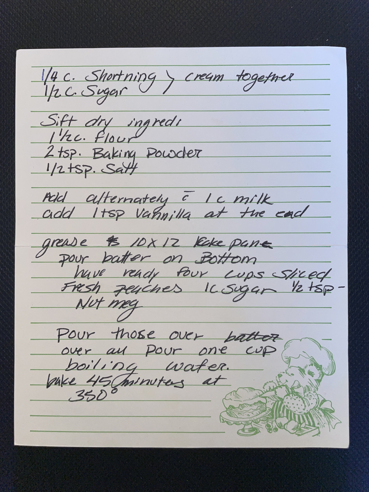

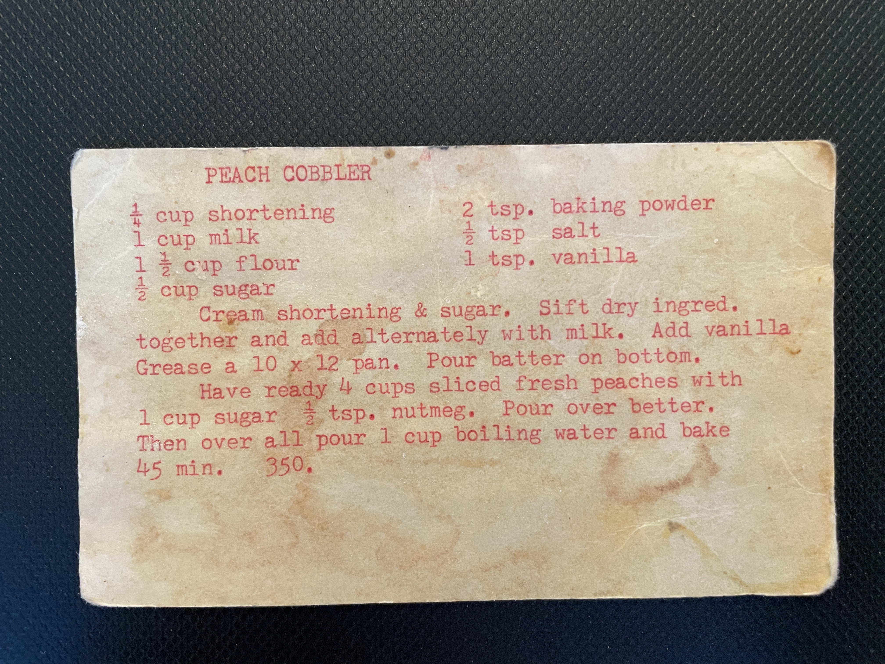

**Ingredients:**
- 1/4 c. shortening, 1/2 c. sugar (cream together), 1 1/2 c. flour, 2 tsp. baking powder, 1/2 tsp. salt, 1 c. milk, 1 tsp. vanilla
- 4 cups sliced fresh peaches, 1 c. sugar, 1/2 tsp. nutmeg, 1 cup boiling water

**Instructions:**
Cream shortening and sugar. Add dry ingredients alternately with milk. Add vanilla. Grease a 10x12 pan. Pour batter on bottom. Pour seasoned peaches over batter. Pour boiling water over all. Bake 45 minutes at 350°.

---

### Peach Ice Cream (Joyce)
*Source: IMG_9307 / IMG_9308*

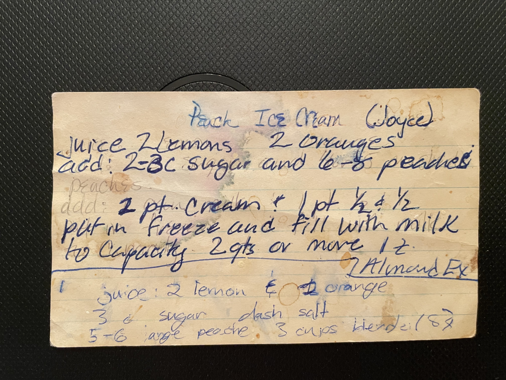

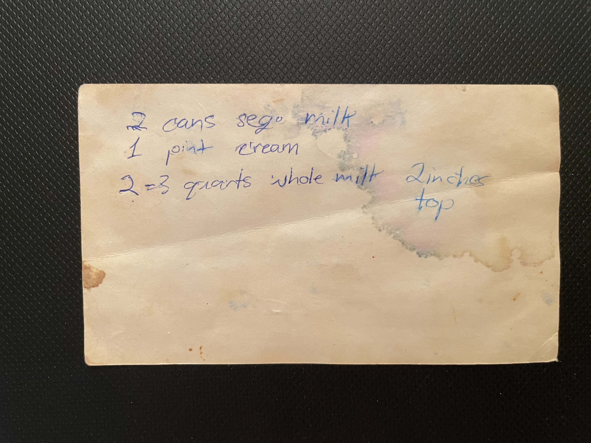

**Ingredients:**
- Juice of 2 lemons + 2 oranges, 2–3 c. sugar, 6–8 peaches (blended), 2 T. almond extract **[uncertain]**
- 2 cans evaporated milk **[uncertain]**, 1 pint cream, 2–3 quarts whole milk (2" from top)

---

### Pineapple Ice Cream (Jane Spilker)
*Source: IMG_9320 — 6 qts.*

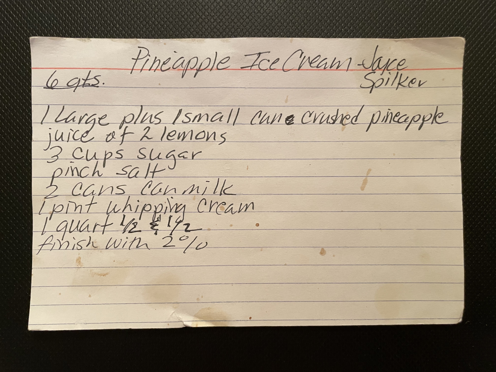

**Ingredients:**
- 1 large + 1 small cans crushed pineapple, juice of 2 lemons, 3 cups sugar, pinch salt, 2 cans evaporated milk, 1 pint whipping cream, 1 quart half & half, finish with 2% milk

---

### Pumpkin Dessert
*Source: IMG_9250 / IMG_9251*

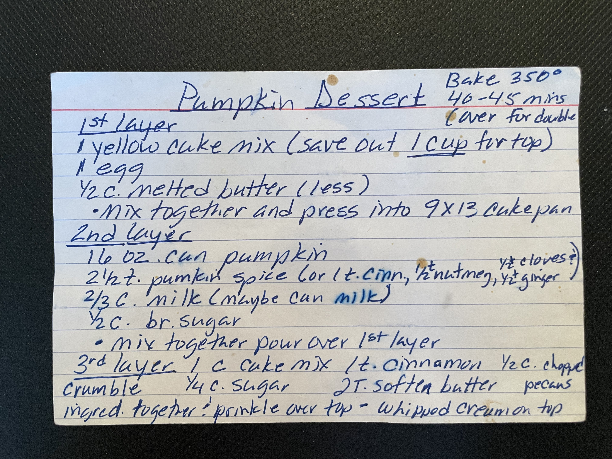

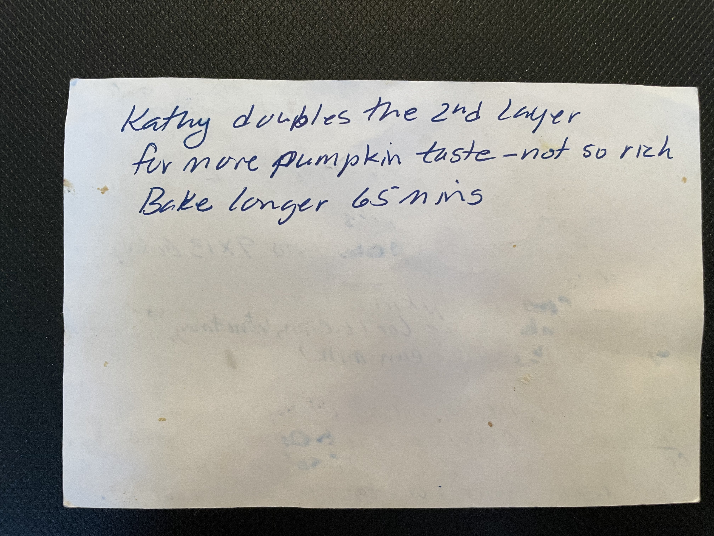

**1st Layer:** 1 yellow cake mix (save 1 cup for top), 1 egg, 1/2 c. melted butter — press into 9x13 pan.

**2nd Layer:** 16 oz. can pumpkin, 2 1/2 t. pumpkin spice, 2/3 c. milk, 1/2 c. brown sugar — pour over 1st layer.

**3rd Layer (crumble):** 1 c. cake mix, 1 t. cinnamon, 1/2 c. chopped pecans, 1/4 c. sugar, 2 T. softened butter — sprinkle over top.

Bake at 350° for 40–45 mins. *(Kathy doubles the 2nd layer for more pumpkin taste — bake longer, 65 mins.)*

---

### Raspberry Dessert (Kathy)
*Source: IMG_9246*

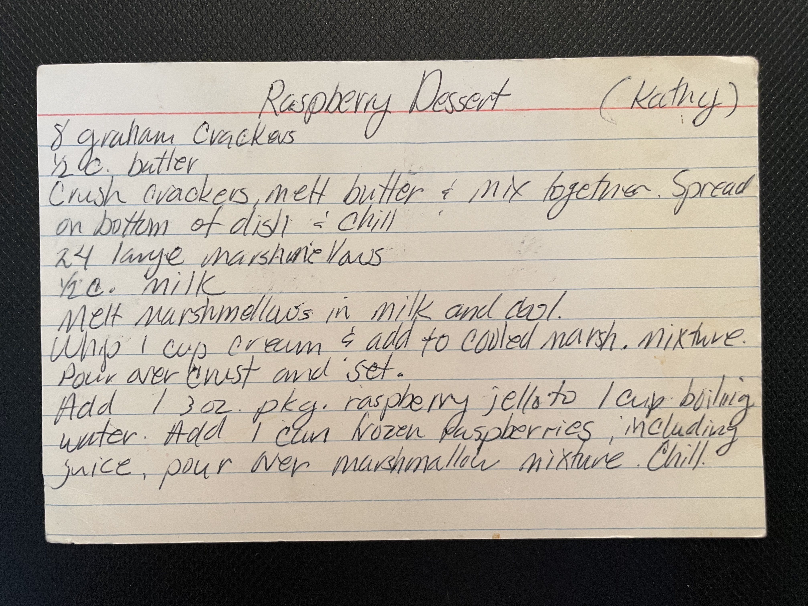

**Crust:** 8 graham crackers (crushed) **[uncertain]**, 1/2 c. butter — mix, spread on bottom, chill.

**Filling:** 24 large marshmallows, 1/2 c. milk — melt and cool. Whip 1 cup cream, add to cooled marshmallow mixture. Pour over crust and set.

**Topping:** 1 (3 oz.) pkg. raspberry jello in 1 cup boiling water. Add 1 can frozen raspberries (including juice). Pour over marshmallow layer. Chill!

---

### Raspberry or Strawberry Ice Cream
*Source: IMG_9317*

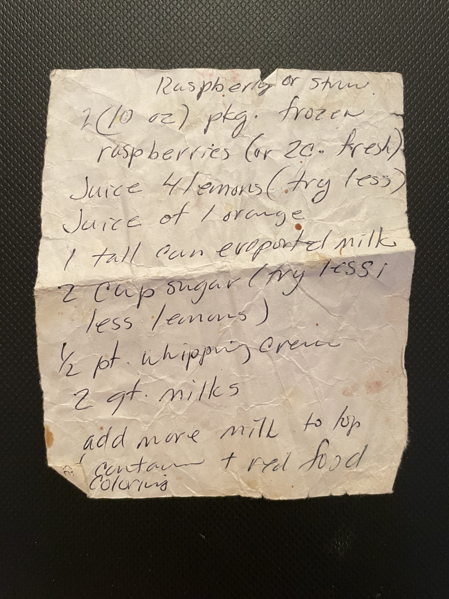

**Ingredients:**
- 1 (10 oz.) pkg. frozen raspberries (or 2 c. fresh), juice of 4 lemons (try less), juice of 1 orange, 1 tall can evaporated milk, 2 cups sugar (try less), 1/2 pt. whipping cream, 2 qts. milk
- Add more milk to top container + red food coloring

---

### Rhubarb Crisp
*Source: IMG_9513*

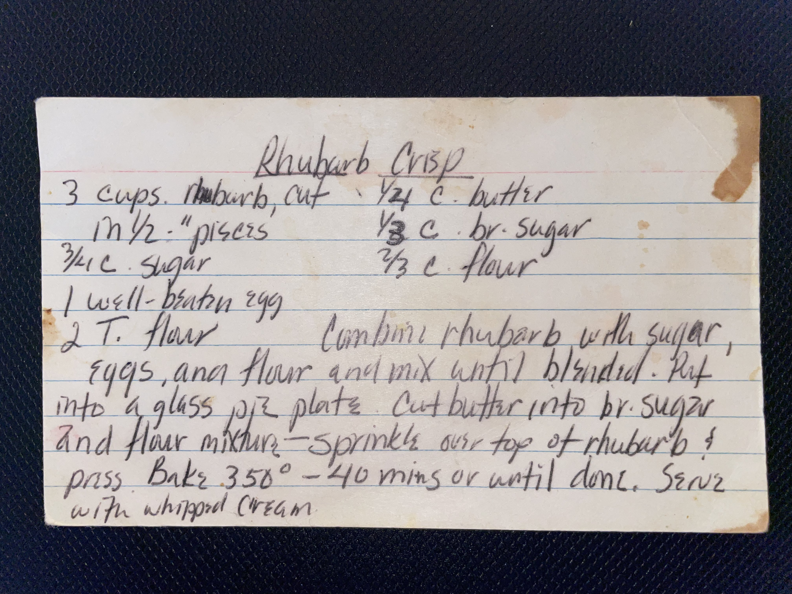

**Filling:** 3 cups rhubarb (1/2" pieces), 3/4 c. sugar, 1 well-beaten egg, 2 T. flour

**Topping:** 1/4 c. butter, 1/3 c. brown sugar, 2/3 c. flour

**Instructions:**
Combine rhubarb with sugar, egg, and flour. Put into glass pie plate. Cut butter into brown sugar and flour, sprinkle over rhubarb. Bake at 350° for 40 mins. Serve with whipped cream.

---

### Rootbeer Ice Cream
*Source: IMG_9311*

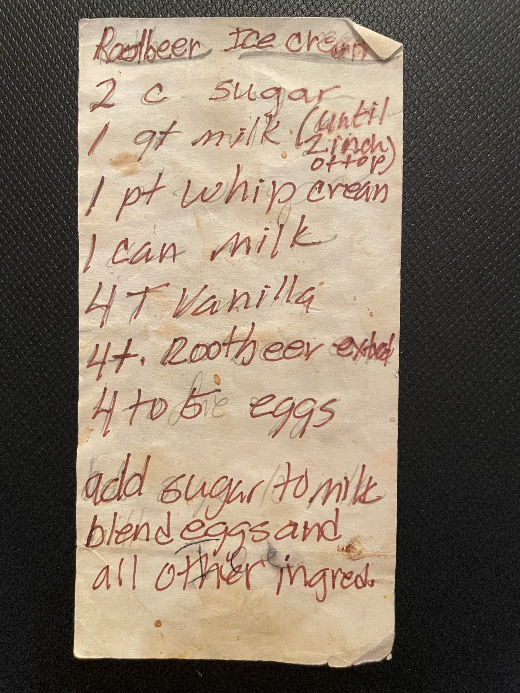

**Ingredients:**
- 2 c. sugar, 1 qt. milk (until 2" from top), 1 pt. whipping cream, 1 can evaporated milk, 4 T. vanilla, 4 t. rootbeer extract **[uncertain]**, 4–5 eggs **[uncertain]**

**Instructions:**
Add sugar to milk. Blend eggs and all other ingredients.

---

### Schaum Torte
*Source: Cecelia Ludwig — "Royal Dining" (IMG_9231)*

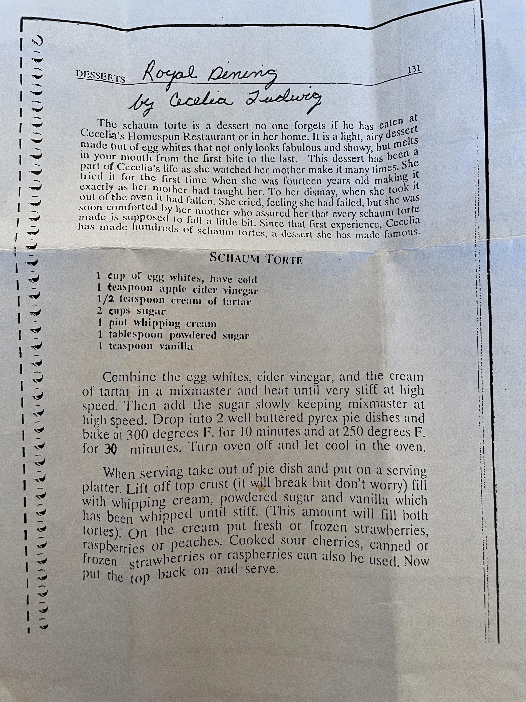

**Ingredients:**
- 1 cup egg whites (cold), 1 tsp. apple cider vinegar, 1/2 tsp. cream of tartar, 2 cups sugar, 1 pint whipping cream, 1 T. powdered sugar, 1 tsp. vanilla

**Instructions:**
Beat egg whites, vinegar, and cream of tartar at high speed until very stiff. Add sugar slowly. Drop into 2 well-buttered Pyrex pie dishes. Bake at 300° for 10 minutes, then 250° for 30 minutes. Turn off oven, let cool inside.

**To serve:** Remove from dish, lift off top crust, fill with whipped cream (sweetened with powdered sugar and vanilla). Top with fresh or frozen berries or peaches. Replace top crust.

---

### Trifle
*Source: IMG_9238 / IMG_9239 — 15–20 servings*

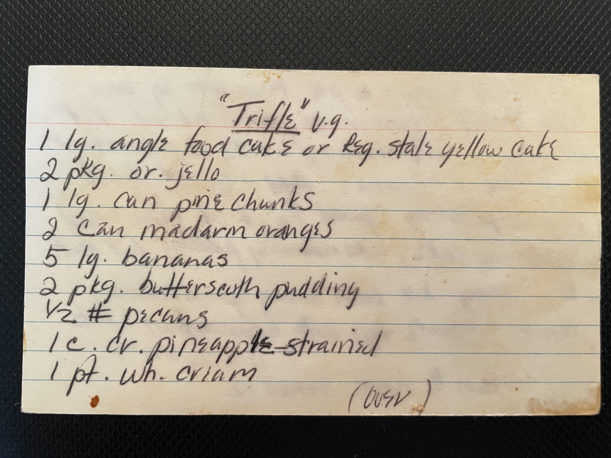

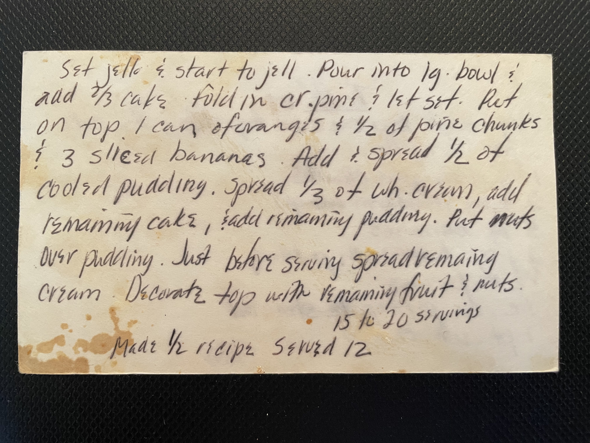

**Ingredients:**
- 1 lg. angel food or stale yellow cake, 2 pkg. orange jello, 1 lg. can pineapple chunks, 2 cans mandarin oranges, 5 lg. bananas, 2 pkg. butterscotch pudding, 1/2 lb. pecans, 1 c. crushed pineapple (strained), 1 pt. whipping cream

**Instructions:**
Set jello and start to jell. Pour into large bowl, add 2/3 cake folded in crushed pineapple, let set. Put on top 1 can oranges, 1/2 pineapple chunks, 3 sliced bananas. Spread 1/2 cooled pudding. Spread 1/3 whipped cream, add remaining cake, remaining pudding. Top with nuts. Just before serving, spread remaining cream. Decorate with remaining fruit & nuts. *(Made 1/2 recipe, served 12.)*

---

### Vanilla Ice Cream
*Source: IMG_9517 (also IMG_9312)*

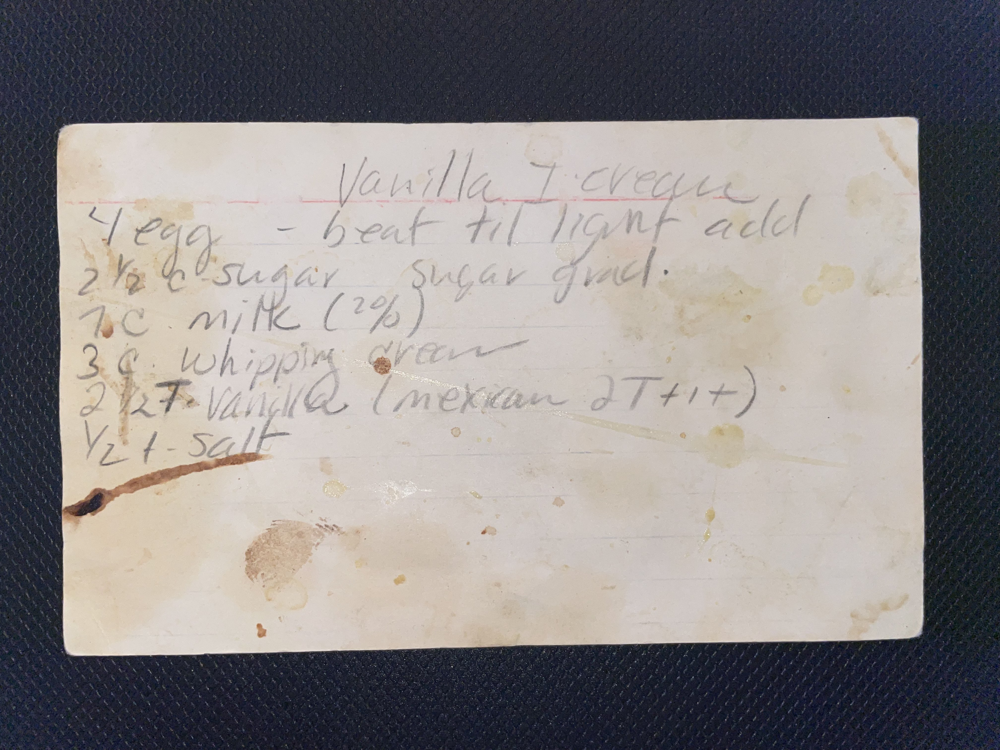

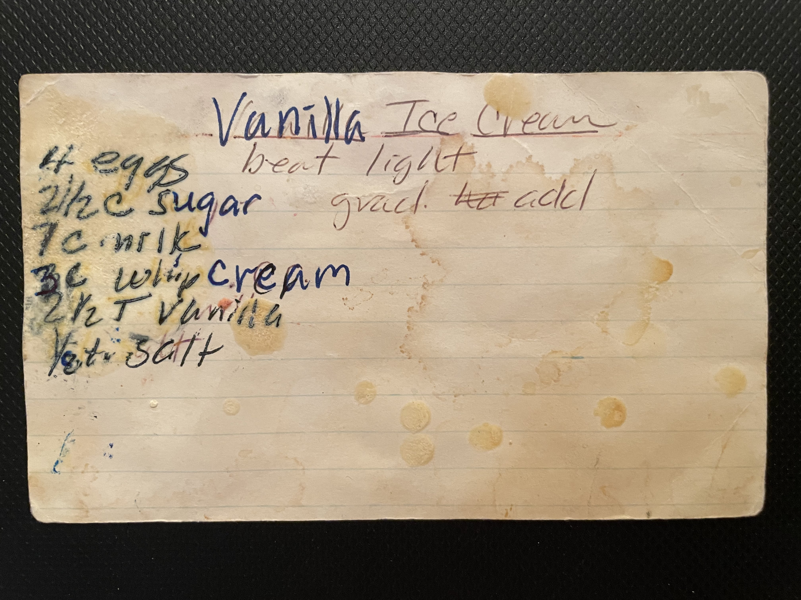

**Ingredients:**
- 4 eggs, 2 1/2 c. sugar, 1 c. milk (2%), 3 c. whipping cream, 2 1/2 T. vanilla (Mexican vanilla: 2 T. + 1 t.), 1/2 t. salt

**Instructions:**
Beat eggs til light. Add sugar gradually. Add milk, whipping cream, vanilla, and salt.

---

## Desserts — Pies

---

### Apple Pie
*Source: IMG_9348 / IMG_9349*

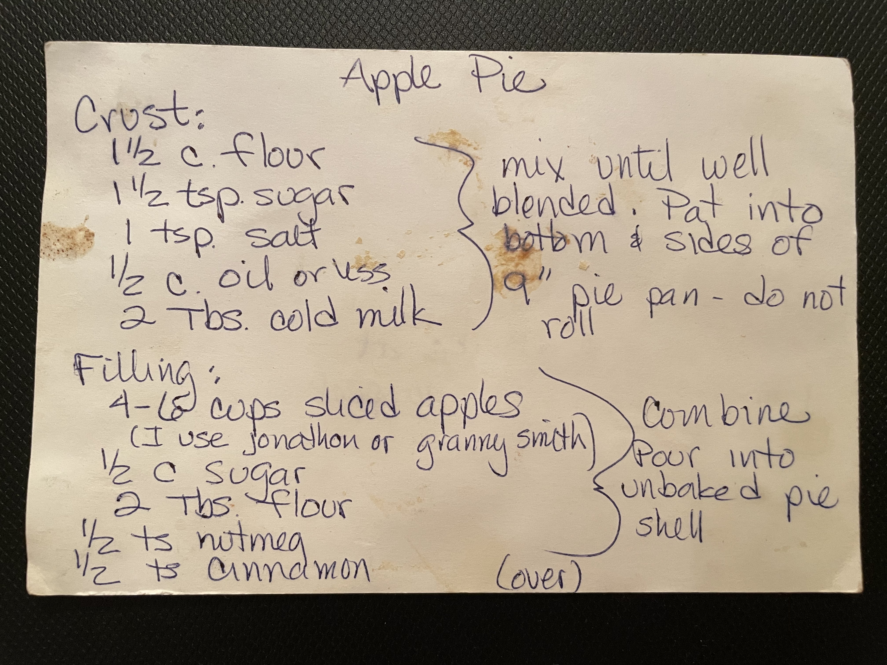

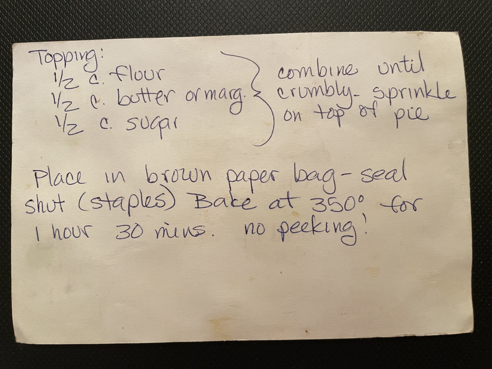

**Crust:** 1 1/2 c. flour, 1 1/2 tsp. sugar, 1 tsp. salt, 1/2 c. oil **[uncertain]**, 2 T. cold milk — mix until blended, pat into 9" pie pan (do not roll).

**Filling:** 4–6 cups sliced apples (Jonathan or Granny Smith), 1/2 c. sugar, 2 T. flour, 1/2 t. nutmeg, 1/2 t. cinnamon — combine and pour into shell.

**Topping:** 1/2 c. flour, 1/2 c. butter, 1/2 c. sugar — combine until crumbly, sprinkle on top.

**Instructions:**
Place in brown paper bag, seal shut (staples). Bake at 350° for 1 hour 30 mins. No peeking!

---

### Basic Recipe for Cream Pie Filling
*Source: Barbara Durfee **[uncertain]** (IMG_9352 / IMG_9353)*

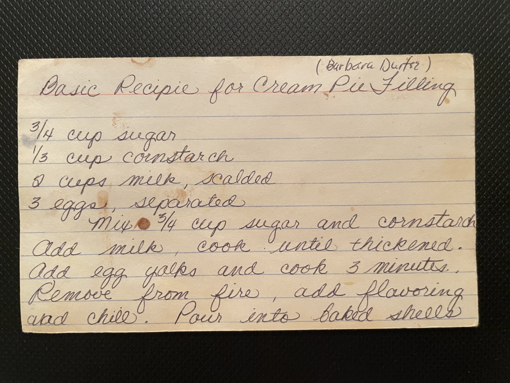

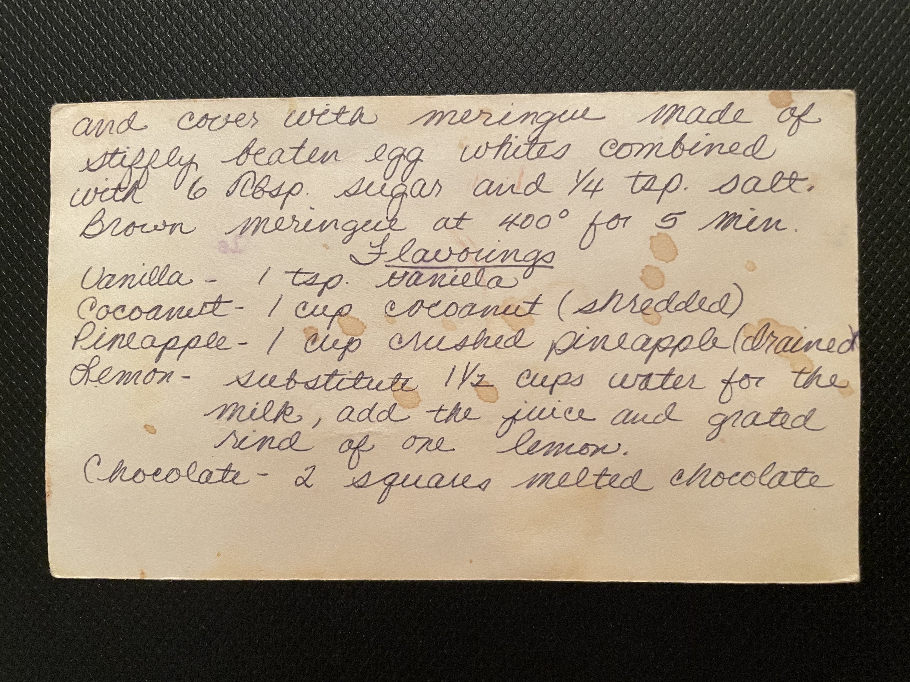

**Ingredients:**
- 3/4 cup sugar, 1/3 cup cornstarch, 2 cups milk (scalded) **[uncertain]**, 3 eggs (separated)

**Instructions:**
Mix sugar and cornstarch. Add milk, cook until thickened. Add egg yolks, cook 5 minutes. Remove, add flavoring, chill. Pour into baked shells. Cover with meringue (stiffly beaten egg whites + 6 T. sugar + 1/4 tsp. salt). Brown at 400° for 5 min.

**Flavor variations:** Vanilla (1 tsp.), Coconut (1 cup shredded), Pineapple (1 cup crushed, drained), Lemon (substitute 1 1/2 cups water for milk + juice and rind of 1 lemon), Chocolate (2 squares melted).

---

### Busy Day Lemon Cheesecake
*Source: IMG_9354 / IMG_9355 — Serves 8*

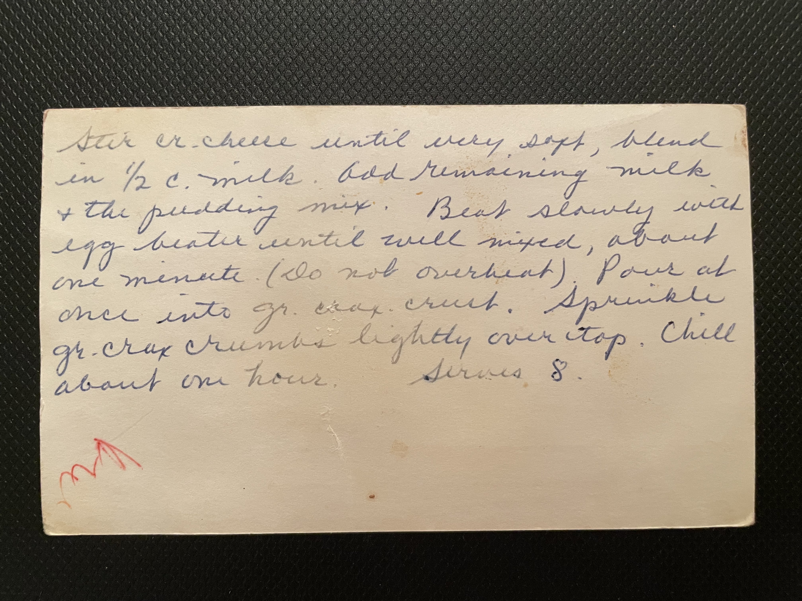

**Ingredients:**
- 1 (8 oz.) pkg. cream cheese, 2 c. whole milk, 1 pkg. Jello lemon instant pudding, 1 (8 inch) graham cracker crust

**Instructions:**
Stir cream cheese until very soft. Blend in 1/2 c. milk. Add remaining milk and pudding mix. Beat slowly with egg beater about one minute (don't overbeat). Pour into crust. Sprinkle graham cracker crumbs on top. Chill about one hour.

---

### French Silk Pie
*Source: IMG_9347 — heavily worn card, many readings **[uncertain]***

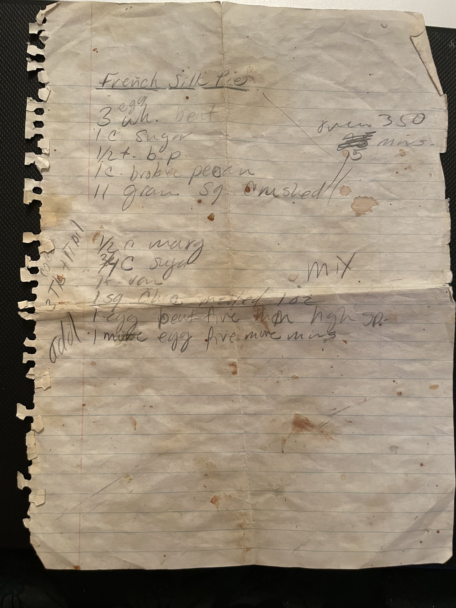

**Crust/base:** 1 c. sugar, 1/2 t. baking powder **[uncertain]**, 1 c. broken pecans, graham cracker crumbs **[uncertain]** — bake at 350°

**Filling:** 1/2 c. margarine **[uncertain]**, 3/4 c. sugar, 1 t. vanilla, 1 sq. chocolate (1 oz.) — add 1 egg, beat 5 min on high, add 1 more egg, beat 5 more min.

---

### German Chocolate Pie
*Source: IMG_9361 — 2 pies*

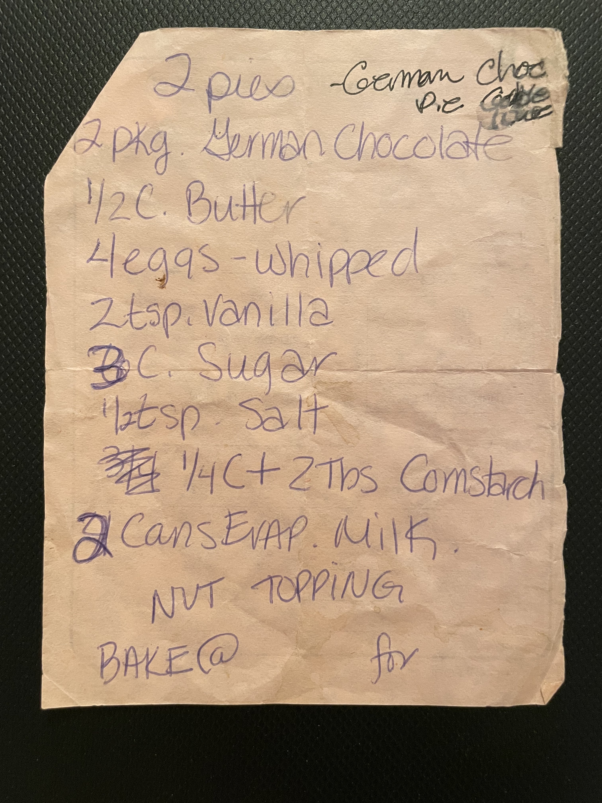

**Ingredients:**
- 2 pkg. German chocolate, 1/2 c. butter, 4 eggs (whipped), 2 tsp. vanilla, 3 c. sugar **[uncertain]**, 1/2 tsp. salt, 3/4 c. + 2 T. cornstarch **[uncertain]**, 2 cans evaporated milk, nut topping

---

### Graham Cracker Crust
*Source: IMG_9229*

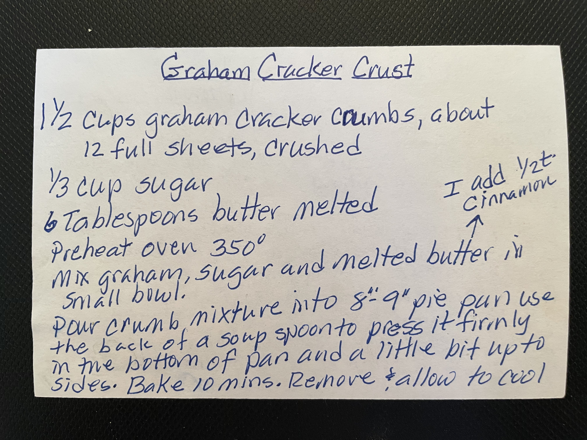

**Ingredients:**
- 1 1/2 cups graham cracker crumbs (~12 full sheets), 1/3 cup sugar, 6 tablespoons melted butter, 1/2 t. cinnamon (optional)

**Instructions:**
Preheat 350°. Mix crumbs, sugar and butter. Press into 8"–9" pie pan. Bake 10 mins, cool.

---

### Key Lime Pie
*Source: Anita (IMG_9350 / IMG_9351)*

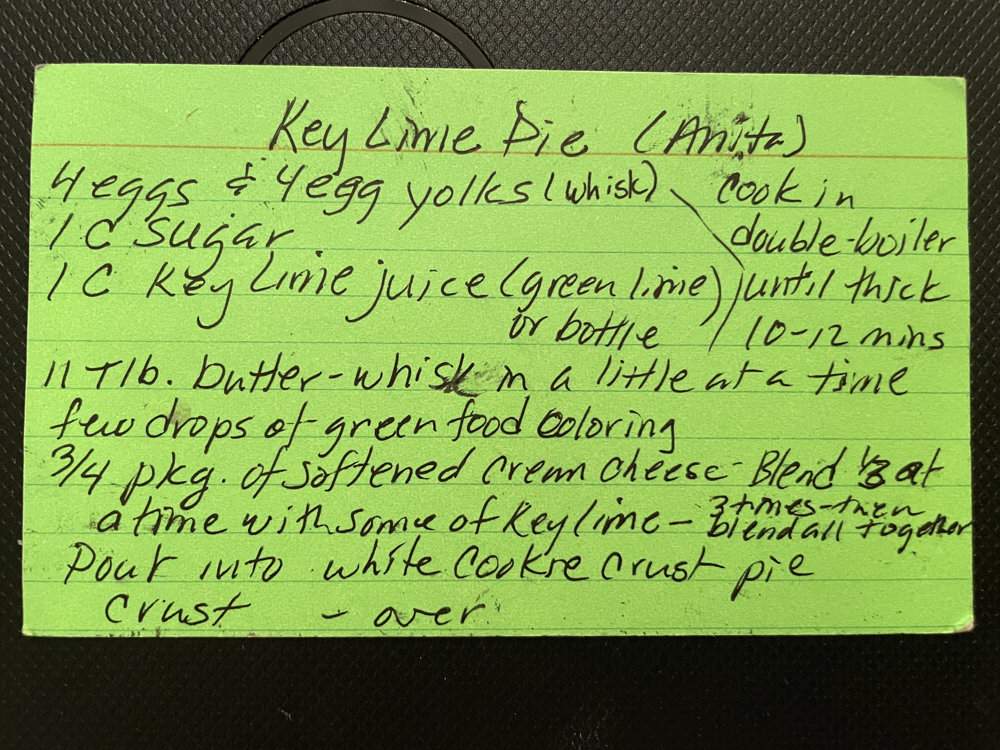

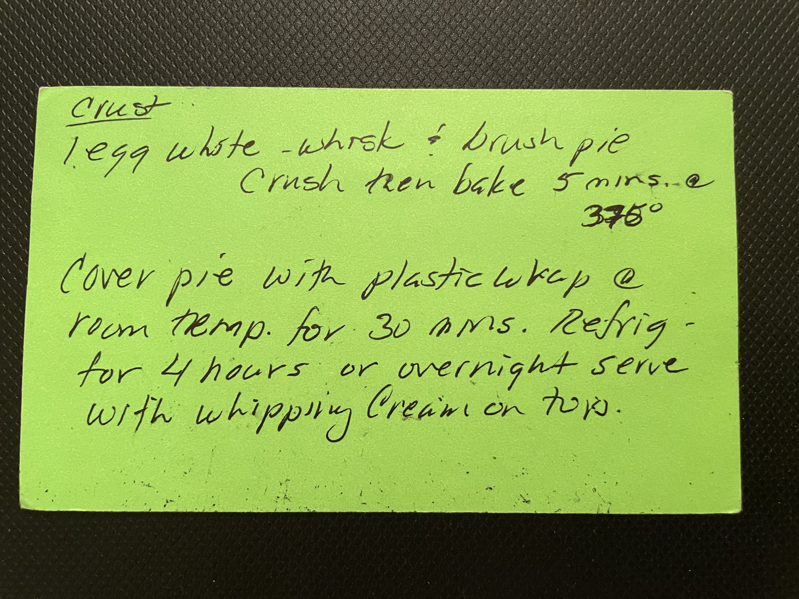

**Filling:** 4 eggs + 4 egg yolks (whisk), 1 c. sugar, 1 c. key lime juice — cook in double boiler until thick, 10–12 mins. Whisk in 11 T. butter (a little at a time). Add a few drops green food coloring. Blend in 3/4 pkg. softened cream cheese. Pour into pie crust.

**Crust:** Brush with egg white, bake 5 mins at 375°.

Cover with plastic wrap at room temp 30 mins. Refrigerate 4 hours or overnight. Serve with whipped cream.

---

### Pecan Pie (Version 1)
*Source: IMG_9358*

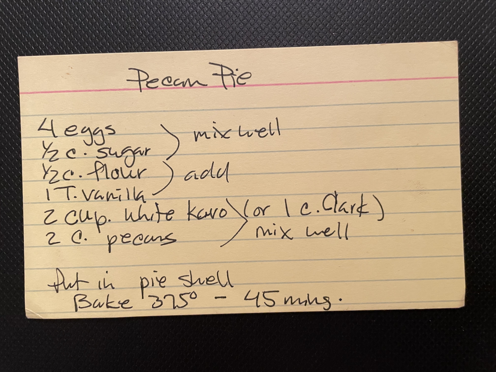

**Ingredients:**
- 4 eggs, 1/2 c. sugar, 1/2 c. flour, 1 T. vanilla, 2 cups white Karo (or 1 c. dark **[uncertain]**), 2 c. pecans

**Instructions:**
Mix well. Put in pie shell. Bake 375° for 45 min.

---

### Pecan Pie (Marrianne Tower)
*Source: IMG_9359*

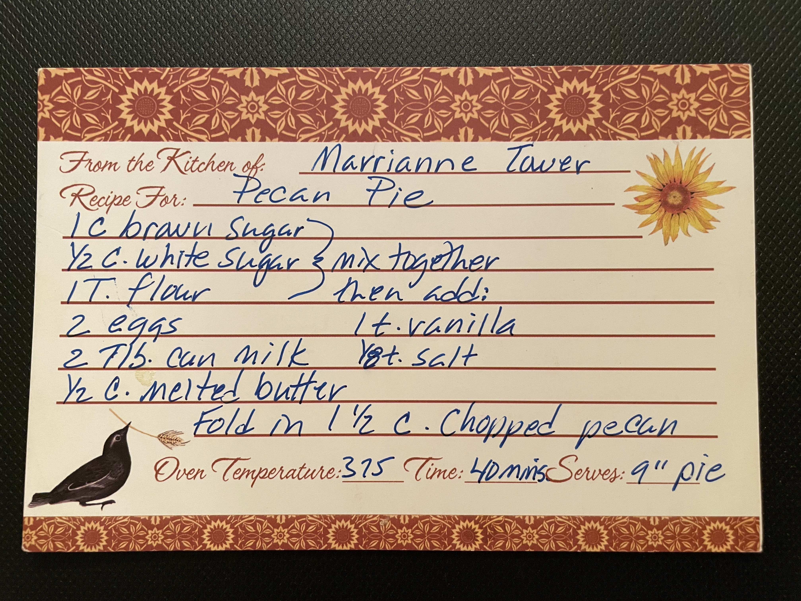

**Ingredients:**
- 1 c. brown sugar, 1/2 c. white sugar, 1 T. flour — mix, then add: 2 eggs, 1 t. vanilla, 2 T. canned milk, 1/8 t. salt **[uncertain]**, 1/2 c. melted butter
- Fold in 1 1/2 c. chopped pecans

**Instructions:**
Bake at 375° for 40 min (9" pie). Use Marie Callender pie crust.

---

### Pie Crust — Cousin Becky
*Source: IMG_9346*

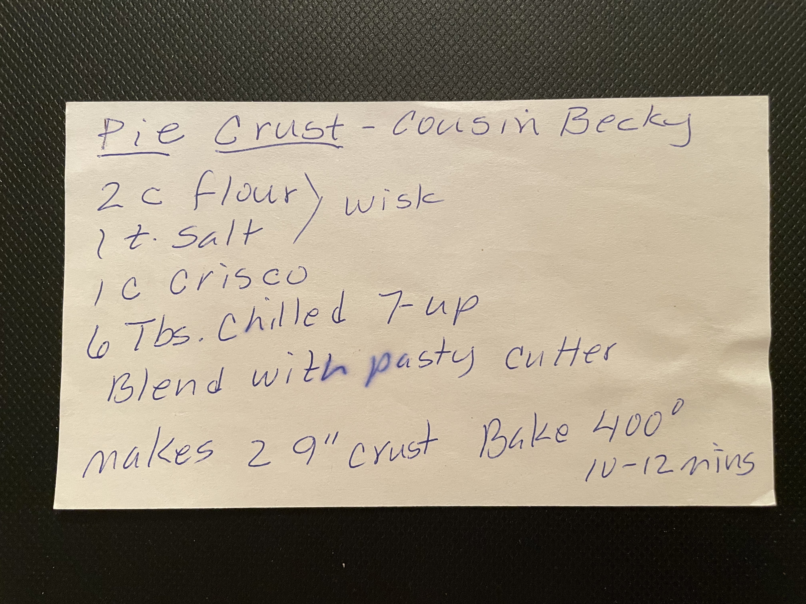

**Ingredients:**
- 2 c. flour, 1 t. salt (whisk together), 1 c. Crisco, 6 T. chilled 7-UP — blend with pastry cutter

Makes 2 (9") crusts. Bake at 400° for 10–12 mins.

---

### Raspberry Pie
*Source: IMG_9360 — Serves 8*

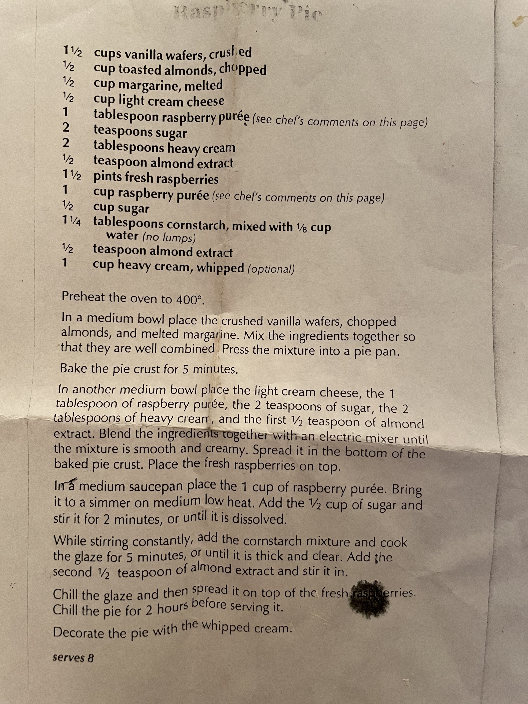

**Crust:** 1 1/2 cups vanilla wafers (crushed), 1/2 cup toasted almonds (chopped), 1/2 cup melted margarine — press into pie pan, bake 400° for 5 min.

**Cream layer:** 1/2 cup light cream cheese, 1 T. raspberry puree, 2 tsp. sugar, 2 T. heavy cream, 1/2 tsp. almond extract — blend smooth, spread in crust. Place 1 1/2 pints fresh raspberries on top.

**Glaze:** 1 cup raspberry puree, 1/2 cup sugar, 1 1/4 T. cornstarch (mixed with 1/8 cup water), 1/2 tsp. almond extract — simmer puree, add sugar, stir 2 min. Add cornstarch mixture, cook 5 min until thick and clear. Add extract. Chill, spread on raspberries. Chill pie 2 hours. Decorate with whipped cream.

---

### Sweet Cherry Pie
*Source: IMG_9362*

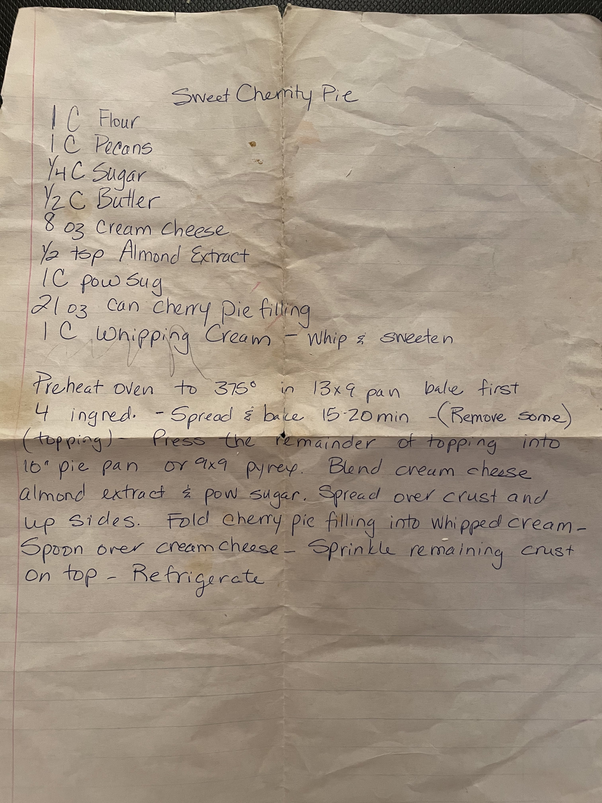

**Crust:** 1 c. flour, 1 c. pecans, 1/4 c. sugar, 1/2 c. butter — spread & bake at 375° for 15–20 min. Remove some for topping. Press remainder into pie pan.

**Filling:** 8 oz. cream cheese, 1/2 tsp. almond extract, 1 c. powdered sugar — spread over crust and up sides.

**Topping:** 21 oz. can cherry pie filling folded into 1 c. sweetened whipped cream — spoon over cream cheese layer. Sprinkle remaining crust on top. Refrigerate.

---

## Drinks

---

### Egg Nog
*Source: IMG_9121*

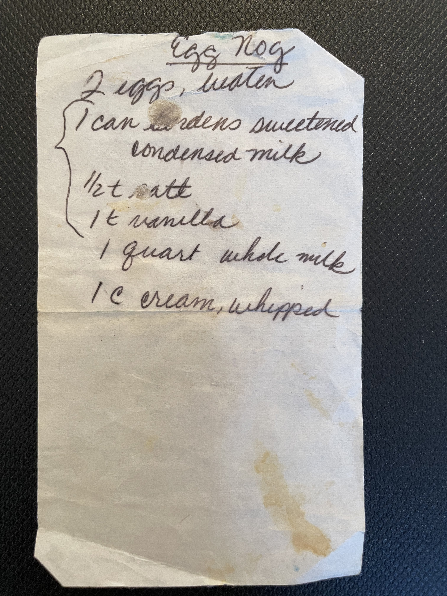

**Ingredients:**
- 2 eggs (beaten), 1 can Borden's sweetened condensed milk, 1/2 t. salt **[uncertain]**, 1 t. vanilla, 1 quart whole milk, 1 c. cream (whipped)

---

### Limelight Banana Crush
*Source: IMG_9123*

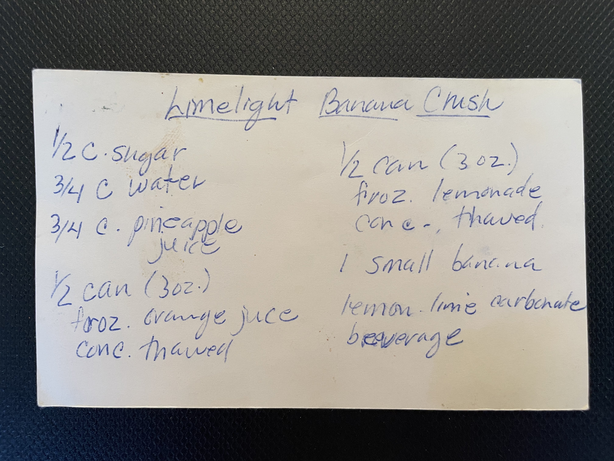

**Ingredients:**
- 1/2 c. sugar, 3/4 c. water, 3/4 c. pineapple juice, 1/2 can (3 oz.) frozen OJ concentrate (thawed), 1/2 can (3 oz.) frozen lemonade concentrate (thawed), 1 small banana, lemon-lime carbonated beverage

---

### Nicole's Smoothie
*Source: IMG_9472 — Makes 2 servings*

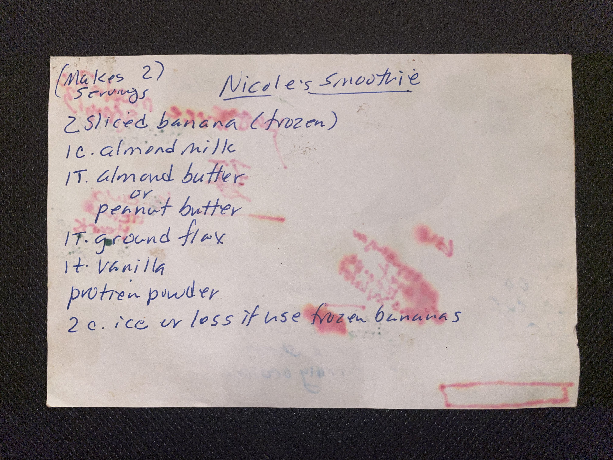

**Ingredients:**
- 2 sliced bananas (frozen), 1 c. almond milk, 1 T. almond butter or peanut butter, 1 T. ground flax, 1 t. vanilla, protein powder, 2 c. ice (or less if using frozen bananas)

---

### Protein Drink (Vanilla)
*Source: IMG_9122*

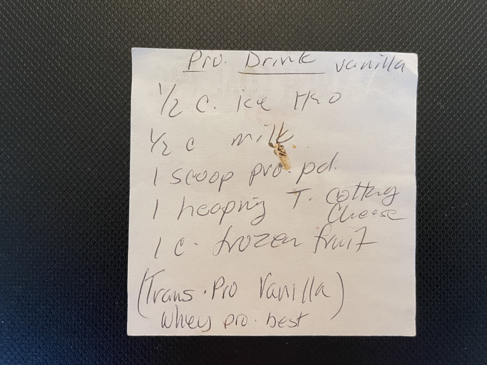

**Ingredients:**
- 1/2 c. ice, 1/2 c. milk, 1 scoop protein powder, 1 heaping T. cottage cheese, 1 c. frozen fruit **[uncertain]**

*Note: Whey protein is best.*

---

### Punch — Joyce
*Source: IMG_9124*

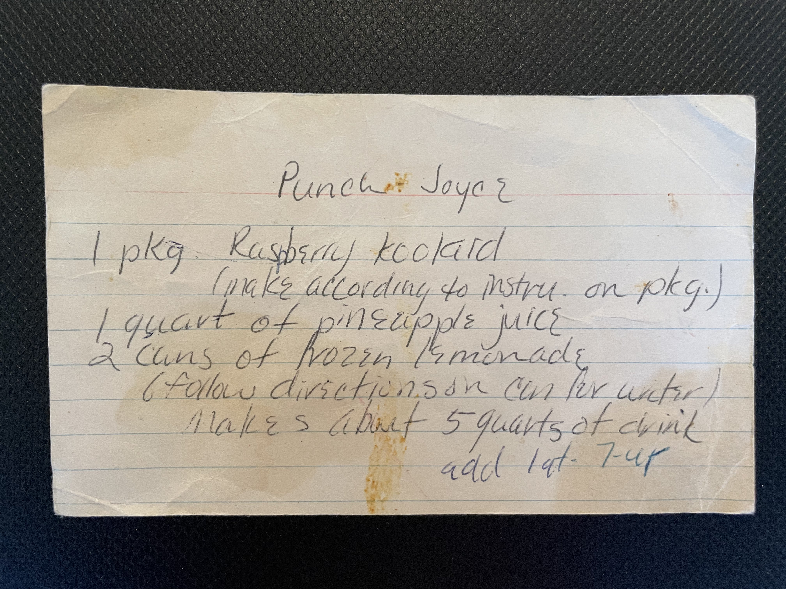

**Ingredients:**
- 1 pkg. raspberry Kool-Aid (make according to instructions), 1 quart pineapple juice, 2 cans frozen lemonade (follow directions for water)
- Makes about 5 quarts. Add 1 qt. 7-UP.

---

### Slush
*Source: Grandma Joyce Spiker — from Janet/Mom (IMG_9555; also IMG_9447)*

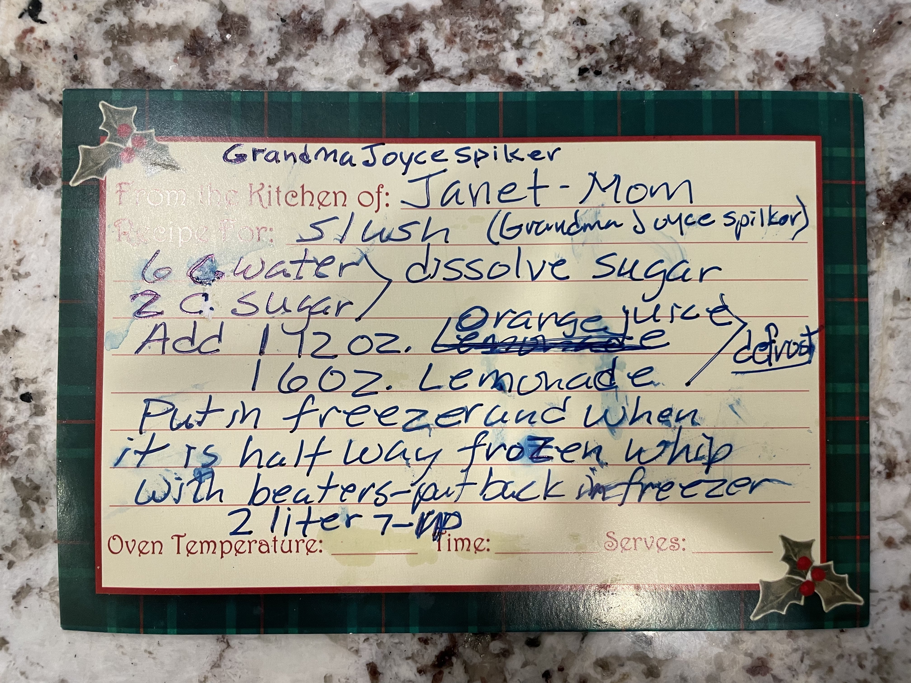

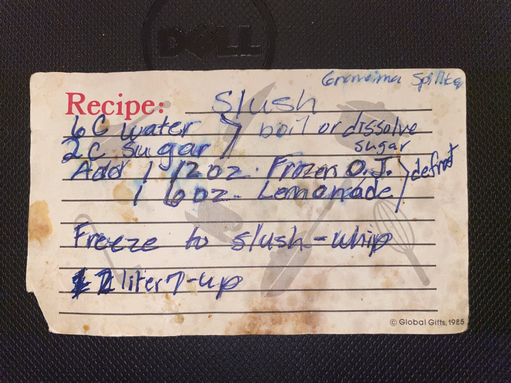

**Ingredients:**
- 6 c. water, 2 c. sugar — dissolve
- 14 oz. orange juice **[uncertain — text crossed out and overwritten]**
- 16 oz. lemonade
- 2 liter 7-UP

**Instructions:**
Dissolve sugar in water. Add orange juice and lemonade. Put in freezer and when halfway frozen, whip with beaters. Put back in freezer. Serve with 7-UP.

---

## Canning & Preserving

---

### Chili Sauce
*Source: IMG_9337 / IMG_9338*

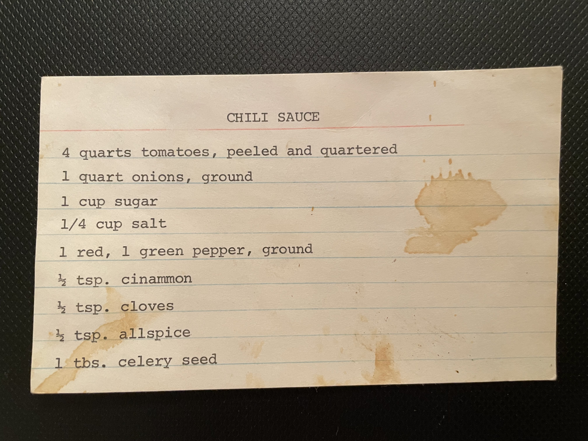

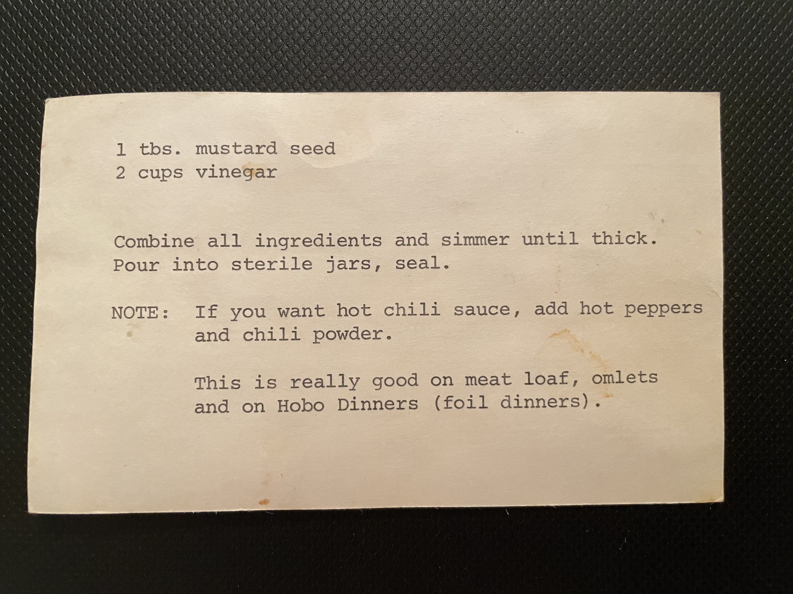

**Ingredients:**
- 4 quarts tomatoes (peeled and quartered), 1 quart onions (ground), 1 cup sugar, 1/4 cup salt, 1 red + 1 green pepper (ground), 1/2 tsp. cinnamon, 1/4 tsp. cloves, 1/4 tsp. allspice, 1 T. celery seed, 1 T. mustard seed, 2 cups vinegar

**Instructions:**
Combine all and simmer until thick. Pour into sterile jars, seal. *NOTE: For hot chili sauce, add hot peppers and chili powder. Really good on meatloaf, omelets, and Hobo Dinners.*

---

### Chili Sauce — Grandma Spilker
*Source: IMG_9339 / IMG_9340*

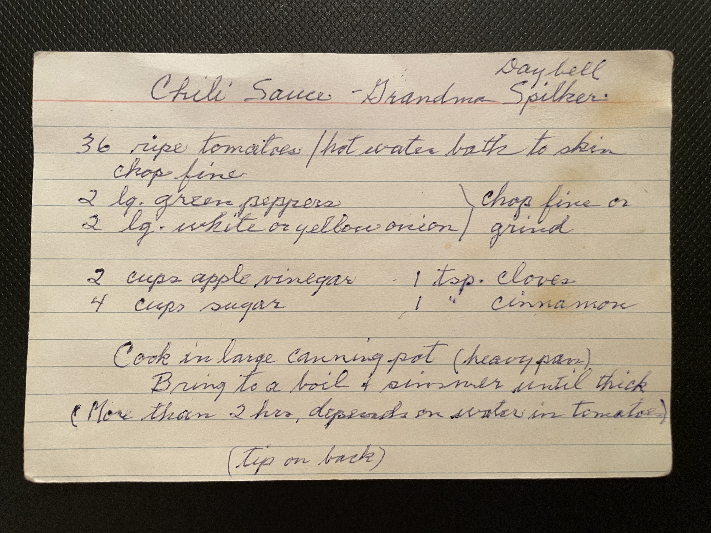

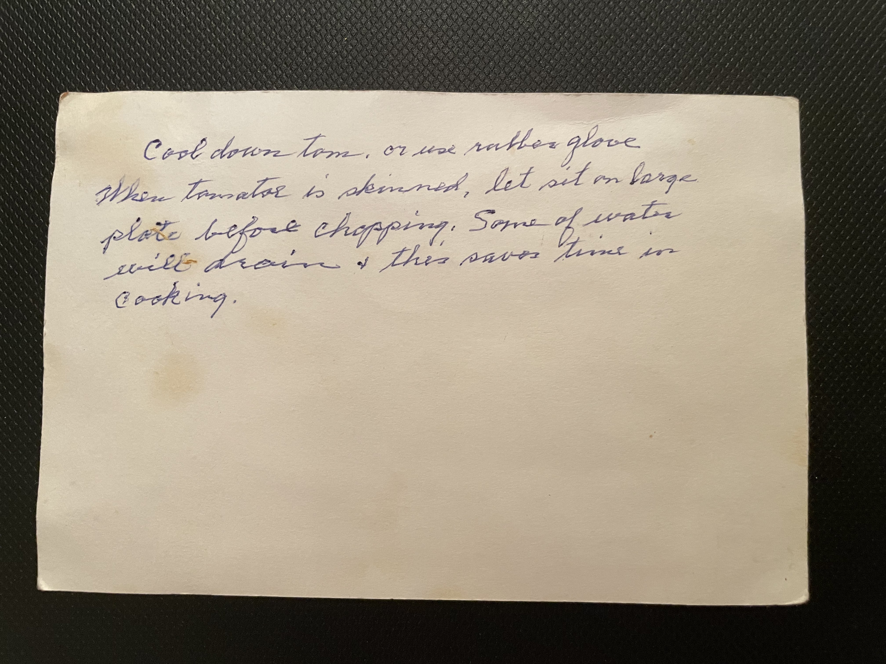

**Ingredients:**
- 36 ripe tomatoes (hot water bath to skin, chop fine), 2 large green peppers, 2 large onions (chop fine or grind), 2 cups apple vinegar, 4 cups sugar, 1 tsp. cloves, 1 tsp. cinnamon

**Instructions:**
Cook in large canning pot. Bring to boil & simmer until thick (more than 2 hrs, depends on water in tomatoes). *Tip: Let skinned tomatoes sit on plate before chopping — water drains off and saves cooking time.*

---

### Chili Sauce (Clark's Grandma)
*Source: IMG_9335*

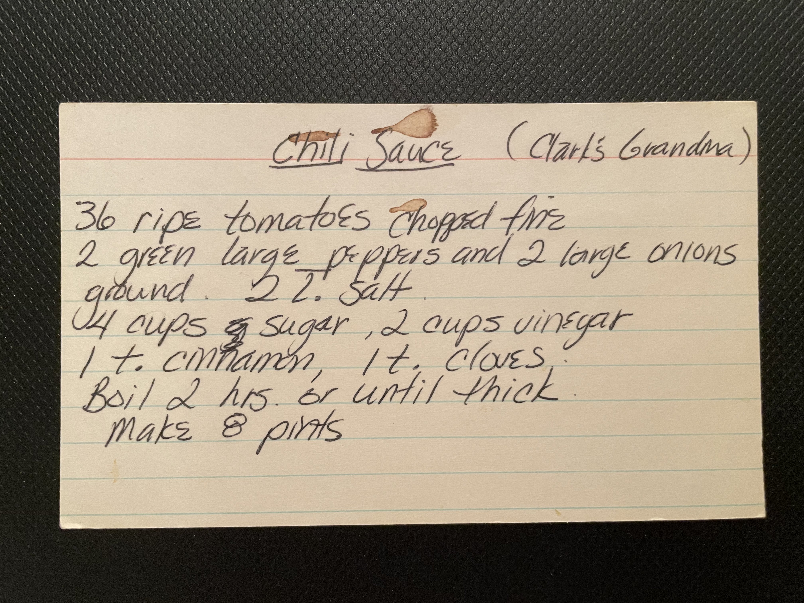

**Ingredients:**
- 36 ripe tomatoes (chopped fine), 2 large green peppers, 2 large onions (ground), 2 t. salt, 4 cups sugar, 2 cups vinegar, 1 t. cinnamon, 1 t. cloves

**Instructions:**
Boil 2 hrs or until thick. Makes 8 pints.

---

### Dill Pickles
*Source: B. Dur **[uncertain]** (IMG_9526)*

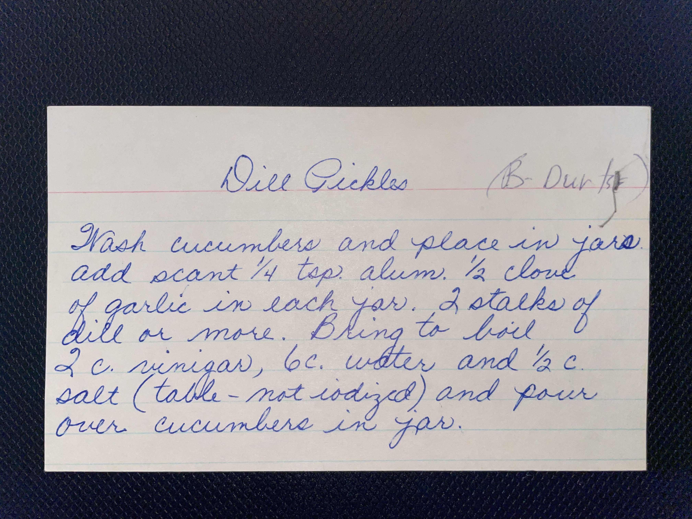

**Ingredients:**
- Cucumbers, scant 1/4 tsp. alum per jar, 1/2 clove garlic per jar, 2 stalks dill or more per jar
- Brine: 2 c. vinegar, 6 c. water, 1/2 c. salt (table, not iodized)

**Instructions:**
Wash cucumbers and place in jars with alum, garlic, and dill. Bring brine to boil and pour over cucumbers.

---

### Dills (Barbara D.)
*Source: IMG_9525*

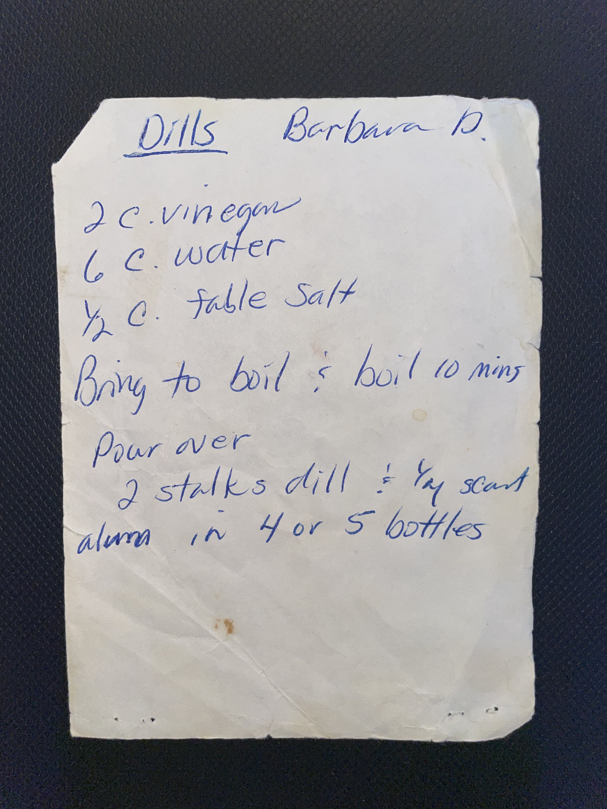

**Ingredients:**
- 2 c. vinegar, 6 c. water, 1/2 c. table salt

**Instructions:**
Bring to boil & boil 10 mins. Pour over 2 stalks dill & 1/4 scant alum **[uncertain]** in 4 or 5 bottles.

---

### Green Tomato Hot Sauce (Marie's)
*Source: IMG_9342*

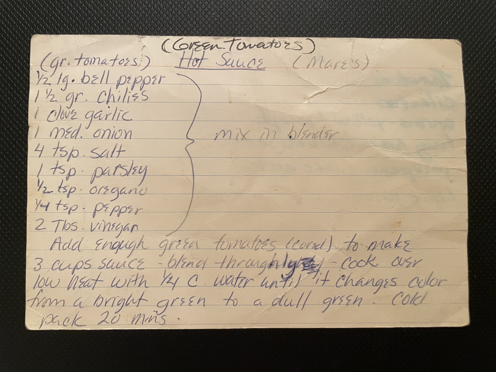

**Ingredients:**
- Green tomatoes, 1/2 large bell pepper, 1 1/2 green chilies, 1 clove garlic, 1 med. onion, 4 tsp. salt, 1 tsp. parsley, 1/2 tsp. oregano, 1/4 tsp. pepper, 2 T. vinegar

**Instructions:**
Mix in blender. Add enough green tomatoes (cored) to make 3 cups sauce. Cook over low heat with 1/4 c. water until color changes from bright to dull green. Cold pack 20 mins.

---

### Janet's Salsa for Canning
*Source: IMG_9341*

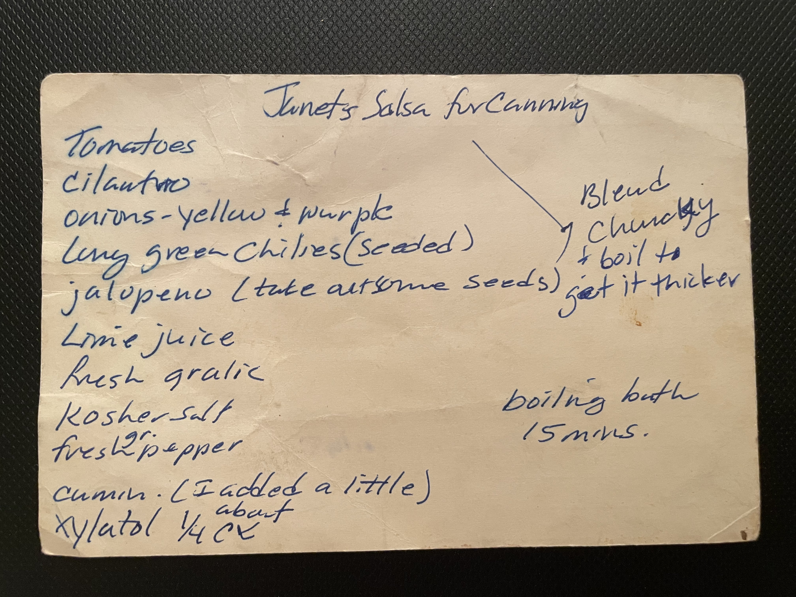

**Ingredients:**
- Tomatoes, cilantro, onions (yellow & purple), long green chilies (seeded), jalapeno (take out some seeds), lime juice, fresh garlic, kosher salt, fresh pepper, cumin

**Instructions:**
Blend chunky & boil to get it thicker. Boiling bath 15 mins.

---

### Mare's Salsa
*Source: IMG_9336*

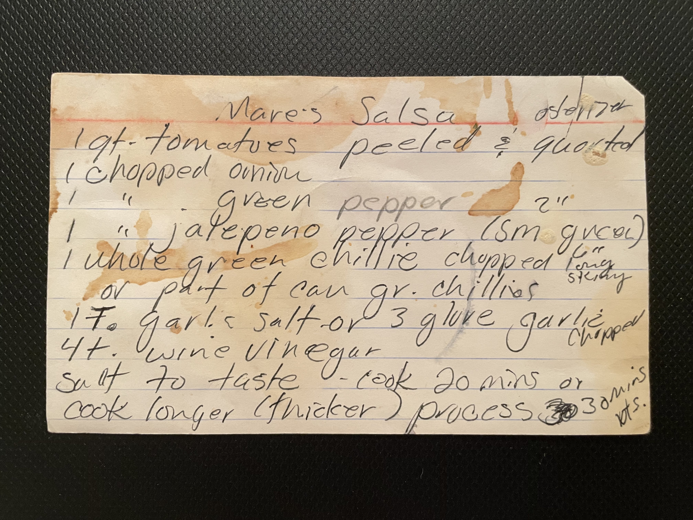

**Ingredients:**
- 1 qt. tomatoes (peeled & quartered), 1 chopped onion, 1 green pepper, 1 jalapeno pepper, 1 whole green chile (chopped), 1 T. garlic salt (or 3 cloves garlic chopped), 4 t. wine vinegar, salt to taste

**Instructions:**
Cook 20 mins or longer for thicker. Process 30 mins **[uncertain]**.

---

### Mustard Pickles (Flora Clinger) 1975
*Source: IMG_9343 / IMG_9344*

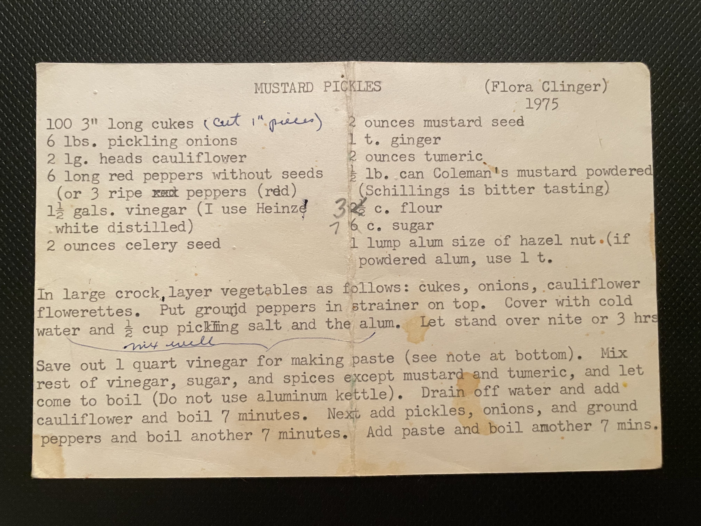

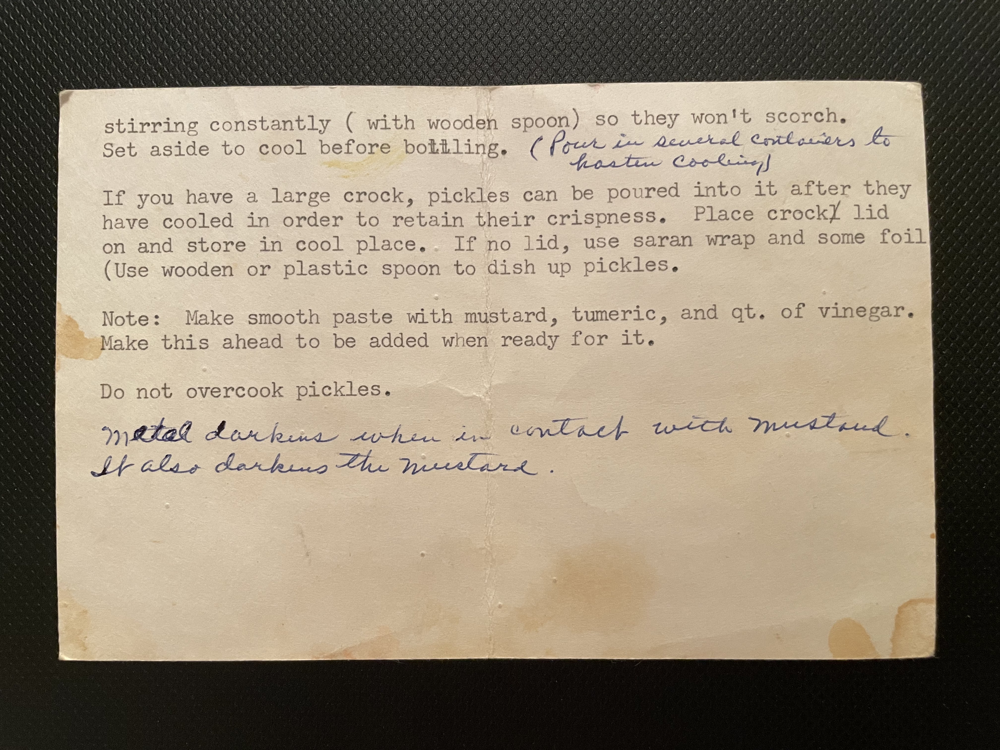

**Ingredients:**
- 100 (3" long) cucumbers (cut 1" pieces), 6 lbs. pickling onions, 2 large heads cauliflower, 6 long red peppers (seedless), 1 1/2 gals. vinegar (Heinz white distilled), 2 oz. celery seed, 2 oz. mustard seed, 1 t. ginger, 2 oz. turmeric, 1/2 lb. Coleman's mustard powder, 3 1/2 c. flour **[uncertain]**, 7 c. sugar **[uncertain]**, 1 lump alum (or 1 t. powdered)

**Instructions:**
Layer vegetables in crock. Cover with cold water, 1/2 cup pickling salt, and alum. Let stand overnight. Save out 1 qt. vinegar for paste. Mix rest with sugar and spices (except mustard & turmeric). Bring to boil. Add cauliflower, boil 7 min. Add pickles, onions, peppers, boil 7 min. Make paste with mustard, turmeric, and reserved vinegar. Add paste, boil 7 min, stirring constantly. Cool before bottling.

---

### Peach Jam
*Source: IMG_9324*

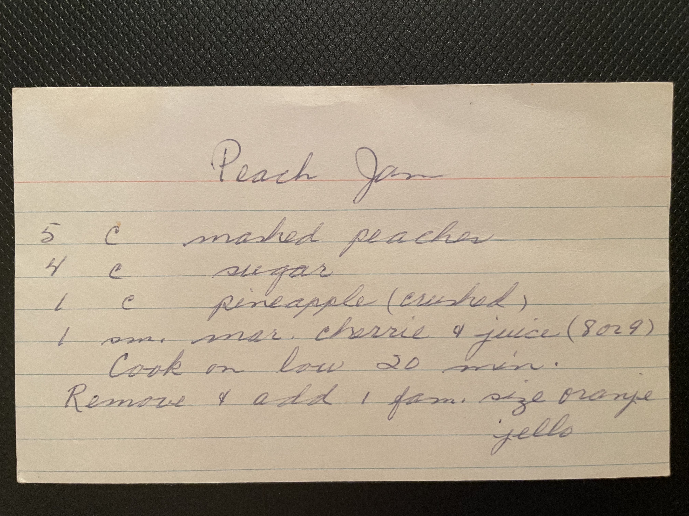

**Ingredients:**
- 5 c. mashed peaches, 4 c. sugar, 1 c. crushed pineapple, 1 sm. (8 oz.) jar maraschino cherries & juice **[uncertain]**

**Instructions:**
Cook on low 20 min. Remove & add 1 family size orange jello.

---

### Pear Butter
*Source: Merrie Miss Course B, Lesson 31 (IMG_9322 / IMG_9323)*

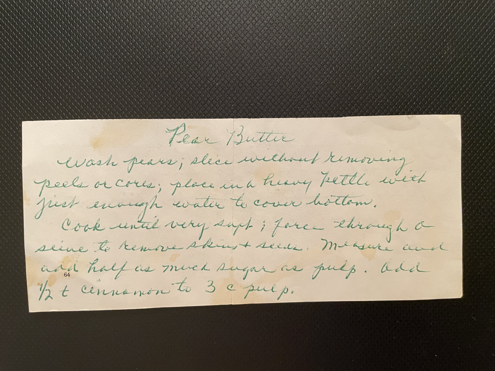

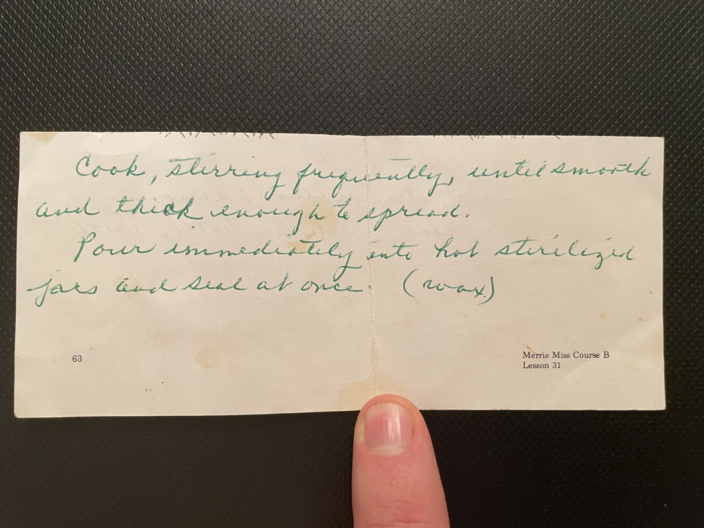

**Instructions:**
Wash pears; slice without removing peels or cores. Place in heavy kettle with just enough water to cover bottom. Cook until very soft. Force through sieve. Measure; add half as much sugar as pulp. Add 1/2 t. cinnamon to 3 c. pulp. Cook, stirring frequently, until thick enough to spread. Pour into hot sterilized jars and seal at once (wax).

---

### Sweet Pickles
*Source: IMG_9523 / IMG_9524*

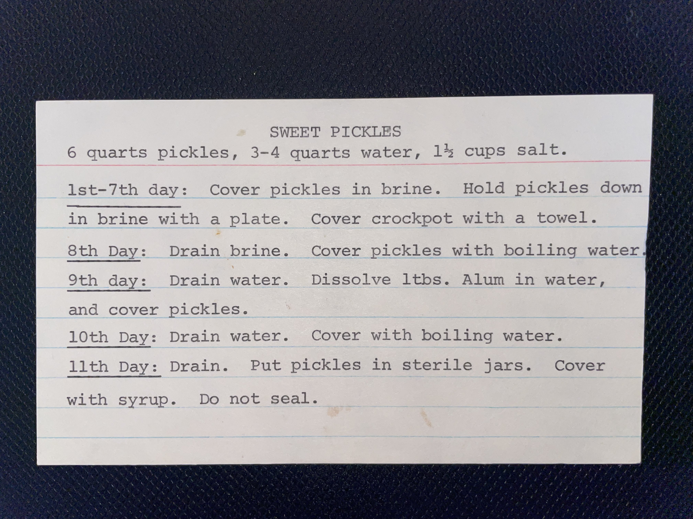

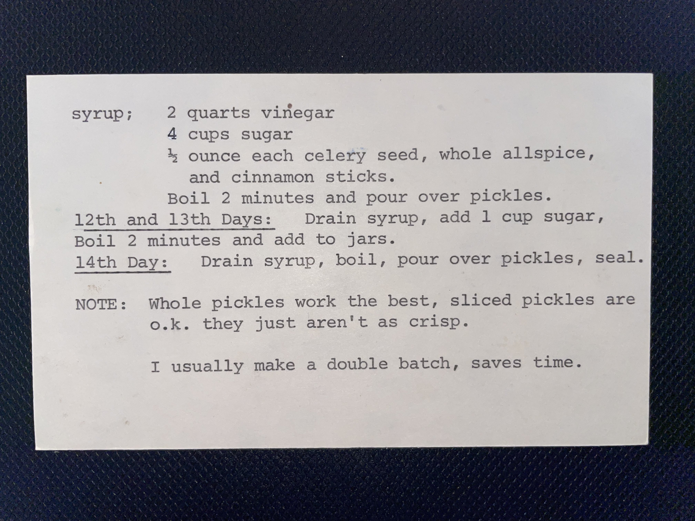

**Days 1–7:** Cover 6 qts. pickles in brine (3–4 qts. water, 1 1/2 cups salt). Hold down with plate. Cover with towel.

**Day 8:** Drain brine. Cover with boiling water.

**Day 9:** Drain. Dissolve 1 T. alum in water, cover pickles.

**Day 10:** Drain. Cover with boiling water.

**Day 11:** Drain. Put in sterile jars. Cover with syrup (2 qts. vinegar, 4 cups sugar, 1/2 oz. each celery seed, allspice, cinnamon sticks). Boil 2 min and pour over. Do not seal.

**Days 12–13:** Drain syrup, add 1 cup sugar. Boil 2 min and add to jars.

**Day 14:** Drain syrup, boil, pour over pickles, seal.

*NOTE: Whole pickles work best; sliced pickles aren't as crisp.*

---

## Miscellaneous

---

### Deer Jerky
*Source: IMG_9475*

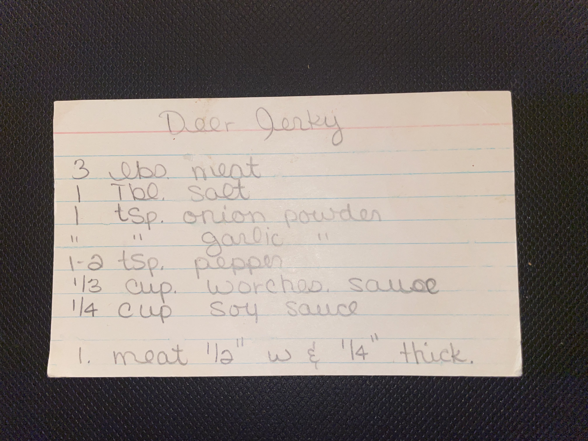

**Ingredients:**
- 3 lbs. meat, 1 T. salt, 1 tsp. onion powder, 1 tsp. garlic powder, 1–2 tsp. pepper, 1/3 cup Worcestershire sauce, 1/4 cup soy sauce

**Instructions:**
Cut meat 1/2" wide & 1/4" thick.

---

### Fresh Shrimp (Boiled)
*Source: IMG_9290*

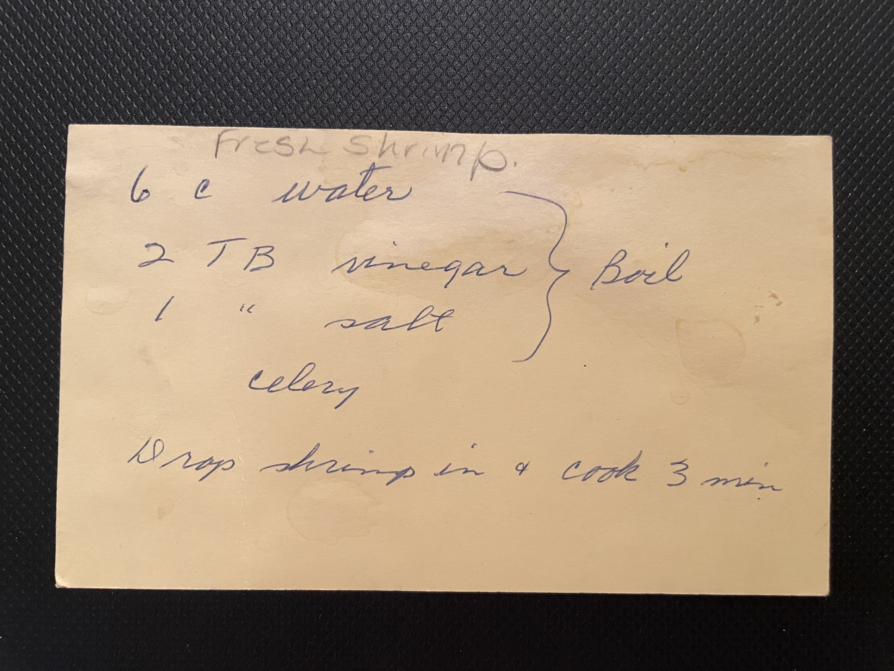

**Ingredients:**
- 6 c. water, 2 T. vinegar, 1 T. salt, celery — boil

**Instructions:**
Drop shrimp in & cook 3 min.

---

### Meat Batter
*Source: IMG_9408 **[uncertain — title could be "Monte Batter"]***

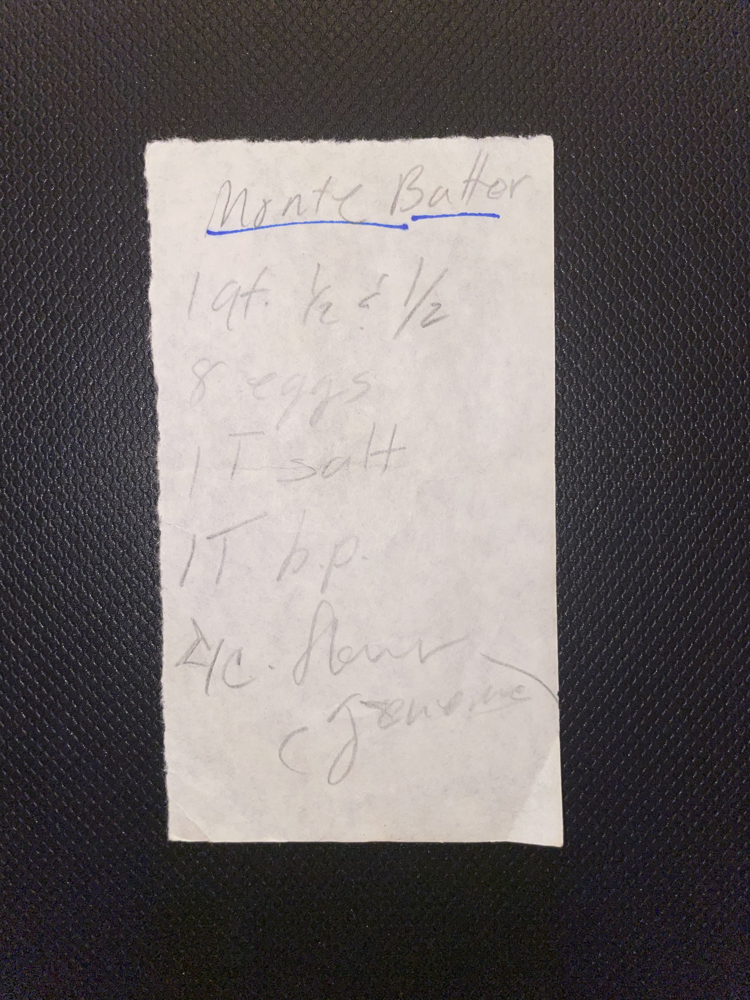

**Ingredients:**
- 1 qt. half & half, 8 eggs, 1 T. salt, 1 T. baking powder **[uncertain]**, 2 c. flour

---

### Play Dough
*Source: IMG_9541*

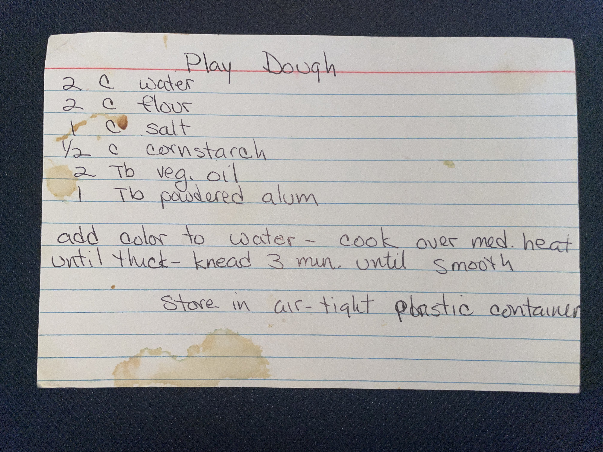

**Ingredients:**
- 2 c. water, 2 c. flour, 1 c. salt, 1/2 c. cornstarch, 2 T. vegetable oil, 1 T. powdered alum

**Instructions:**
Add color to water. Cook over medium heat until thick. Knead 3 min until smooth. Store in airtight plastic container.

---

### Zac's Corn Cake
*Source: IMG_9279*

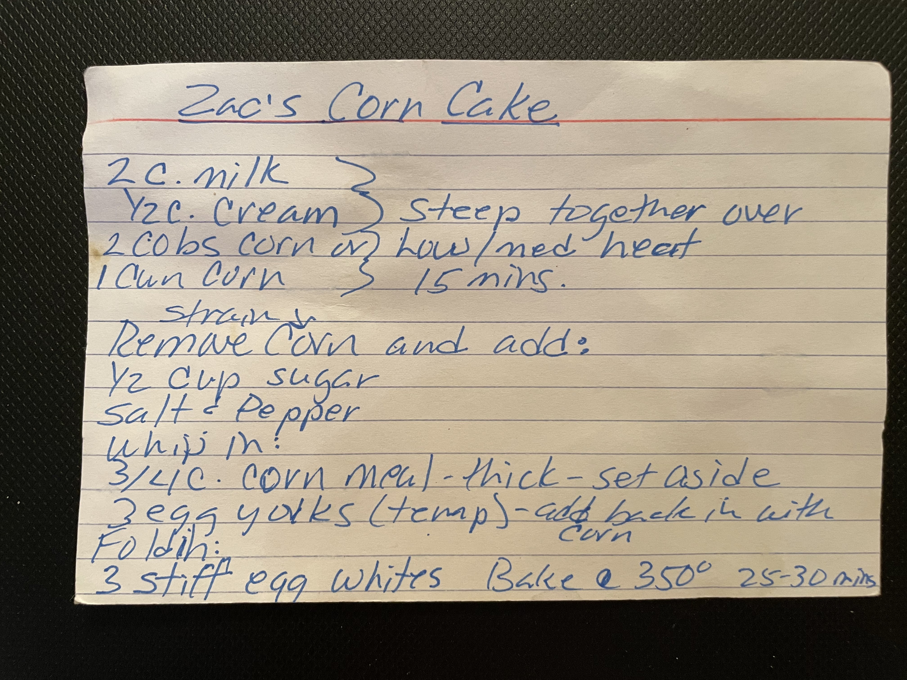

**Ingredients:**
- 2 c. milk, 1/2 c. cream, 2 cobs corn **[uncertain]**, 1 can corn — steep together over low/med. heat 15 mins. Strain. Remove corn and add 1/2 cup sugar, salt & pepper.
- Whip in 3/4 c. corn meal (thick), set aside.
- 2 egg yolks (temper) — add back in with corn.
- Fold in 3 stiff egg whites.

**Instructions:**
Bake at 350° for 25–30 mins.

---

---

*Total recipes in this collection: **319***

*This cookbook was digitized on April 6, 2026, from two boxes of family recipe cards and cookbook pages. The original cards span from the 1940s through the 2000s and represent recipes from multiple generations of the Spilker, Poulton, Daybell, and related families.*